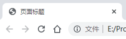

# HTML5标签及属性

- HTML即超文本标记语言(HyperText Markup Language)
- HTML不是一种编程语言，而是一种**标记语言** 

# HTML 代码规范

- **文档声明**位于HTML文档第一行，可以使用小写：

  ```html
  <!DOCTYPE html>
  <!doctype html>
  ```

- **小写 **：推荐**元素名**（即标签名）、**属性名**、**文件名**(一些Web服务器对大小写敏感)

- **引号**：属性值可以不使用**双引号**；属性值包含空格时一定要使用引号

- **注释** ：

  - 使用 `<-- 注释内容 -->` 添加注释；
  - 比较长的注释可以在 `<--` 和 `-->` 中分行写；
  - 长注释第一个字符缩进两个空格，更易于阅读

- **关闭元素**：HTML5推荐关闭所有元素，可以使用`<元素名 \>` 关闭

- **空格**和**等号**：等号前后可以使用空格，但推荐少使用

- **空行**：逻辑功能块添加空行，易于阅读

  - 所有连续的空格、空行、换行都会被算作一个空格

- **缩进**：使用**两个空格**，**不建议使用 TAB** 

- **样式表(CSS文件)**：载入外部CSS文件 `<link rel="stylesheet" href="styles.css">` 

- **JavaScript载入**：载入外部脚本文件 `<script src="myscript.js">`

- **扩展名**：`.htm` 和 `.html` 都可以

# 1.HTML结构

```html
<!DOCTYPE html>
<html lang="zh">
<head>
    <meta charset="UTF-8">
    <meta http-equiv="X-UA-Compatible" content="IE=edge">
    <meta name="viewport" content="width=device-width, initial-scale=1.0">
    <title>页面标题</title>
</head>
<body>
    <h1>第一个标题</h1>
 
    <p>第一个段落。</p>
</body>
</html>
```

| 标签名               | 定义       | 说明                                         |
| -------------------- | ---------- | -------------------------------------------- |
| `<html>` `</html>`   | 根标签     | 页面中最大的标签（最基础的标签）             |
| `<head>` `</head>`   | 头部标签   | 在 head 标签中我们必须要设置 title 标签      |
| `<meta>`             | 元数据标签 | 来描述HTML文档的描述，关键词，作者，字符集等 |
| `<title>` `</title>` | 标题标签   | 页面自己的网页标题                           |
| `<body>` `</body>`   | 主体标签   | 包含文档的所有内容                           |

## 1.1.声明 `<!DOCTYPE html>`

第一行为**HTML5**的文档声明，不区分大小写，以下方式均可：

```
<!DOCTYPE html>
<!DOCTYPE HTML>
<!doctype html>
<!Doctype Html>
```

## 1.2.HTML页面`<html>` `</html>`

- `lang` 语言：定义网页的主要语言，书写在 `<html>` 标签内

- 语言的设置是为了方便浏览器**搜索推荐**以及触发浏览器**翻译**功能，并不是说设置了某类主语言后网页中就不能存在其他类型的语言了

- 常用语言种类：

  > `en-GB`英文（英国）
  >
  > `en-US`英文（美国）
  >
  > `zh-CN`中文（简体，中国大陆）
  >
  > `zh-SG`中文（简体，新加坡）
  >
  > `zh-HK`中文（繁体，香港）
  >
  > `zh-MO`中文（繁体，澳门）
  >
  > `zh-TW`中文（繁体，台湾）

### 1.2.1.头部`<head>` `</head>`

| 标签                   | 描述                       |
| ---------------------- | -------------------------- |
| `<head>` `</head>`     | 文档的信息                 |
| `<title>` `</title>`   | 文档的标题                 |
| `<base>`               | 页面链接标签的默认链接地址 |
| `<link>`               | 文档和外部资源之间的关系   |
| `<meta>`               | 元数据                     |
| `<script>` `</script>` | 脚本文件                   |
| `<style>`              | 样式文件                   |

#### 1.2.1.1.元数据`<meta>`

- **文档编码**：使用 `<meta>` 标签的 `charset` 属性
  - 使用 `<meta charset="UTF-8">` 可以输出中文
  - 有些浏览器(如 360 浏览器)会设置 GBK 为默认编码，则你需要设置为 `<meta charset="gbk">` 
  - 常用字符集：`GB2312`，`BIG5`，`GBK`，`UTF-8` 
- IE**浏览器**：确定绘制当前页面时应该采用的 IE 版本：`<meta http-equiv="X-UA-Compatible" content="IE=edge">` 

#### 1.2.1.2.页面标题`<title>` `</title>`

- 每个`.html` 文件一定要有 `<title>` 元素

- 在浏览器每个标签页上显示

- 也可以显示图片：

  ```
  <head>
  <link rel="shortcut icon" href="图片url">
  <title>这是一个带图片的标签</title>
  </head>
  ```

  

#### 1.2.1.3.标签样式`<style>` `</style>`


### 1.3.主体`<body>` `</body>`


# 2.标签

## 标签说明

- **双标签**：成对出现的标签，分别为**开始标签**和**结束标签** 
- **单标签**：只有开始标签，没有结束标签；或称为空元素；为规范写法，可以封闭自身，下面以 `<br>` 为例：

  - `<br>` `<br/>` `<br />` (带空格)区别：`<br>` 是 HTML 写法；`<br/>` 是 XHTML 为兼容 HTML 的写法；`<br />`等同于`<br>...<br/>` 
- **大小写**：标签使用**小写**，任何标签都不要使用大写；可以使用`<标签名 />` 作为结束（`/`前有空格），但在HTML5中不推荐使用
- **标签关系**：包含关系，并列关系
- **元素内容**：开始标签与结束标签之间的内容

- **属性**：一般在开始标签中

  - **引号**：一般使用双引号；但属性值中包含双引号时，可以使用的单引号

  - **多个属性**：`<标签名 属性名1="属性值1" 属性名2="属性值2"` ，不同的属性用**空格**隔开

  - **属性最小化**：当属性名与属性值相同时，可只写属性名

  - 几种属性：
  
    | 属性名 | 描述                                                         |
    | ------ | ------------------------------------------------------------ |
    | class  | 为html元素定义一个或多个类名（classname）(类名从样式文件引入)；多个类名在同一个引号内，用逗号隔开？ |
    | id     | 定义元素的唯一id                                             |
    | style  | 规定元素的行内样式（inline style）                           |
    | title  | 描述了元素的额外信息 (作为工具条使用)                        |

## 区块

> block-level 块级
> inline 内联

- HTML 可以通过 `<div>` 和 `<span>`将元素组合起来
- 大多数 HTML 元素被定义为 **块级元素** 或 **内联元素** 
- 块级元素在浏览器显示时，通常会以新行来开始（和结束），浏览器会在其前后显示**折行**
- 内联元素在显示时通常 **不会以新行开始**
- `<div>` 元素是 **块级** 元素
  - 它可用于组合 **其他 HTML 元素** 的容器，与 CSS 一同使用
  - `<div>` 元素的另一个常见的用途是文档布局，而 `<table>` 元素显示表格化的数据
-  `<span>` 元素是 **内联** 元素，可用作 **文本** 的容器，与 CSS 一同使用

## HTML5变化

### HTML5新增


### HTML5移除

以下的元素在HTML5中已经被删除:

`<acronym>` `<applet>` `<basefont>` `<big>` `<center>` `<dir>` `<font>` `<frame>` `<frameset>` `<noframes>` `<strike>` 


## 路径

- 相对路径

相对路径：以引用文件所在位置为参考基础，而建立出目录路径。

| 路径       | 符合  | 说明                               |
| ---------- | ----- | ---------------------------------- |
| 同一级路径 | `./`  | ``          |
| 下一级路径 | `/`   | ``    |
| 上一级路径 | `../` | `` |

- 绝对路径

绝对路径：指目录下的绝对位置，直接到达目的位置，通常是从盘符开始的路径。如：`D:\web\img\logo.png` 

- 网络地址

`https://github.com/`

> 相对路径为 `/`（正斜杆），绝对路径为 `\`（反斜杆）
> 绝对路径为 `/`（正斜杠）指的是在 Windows 环境中，而 Linux 系统依旧是反斜杠
>
> 建议使用相对路径和网络地址


## 标签索引

### 基础

|                                                  |                    |
| ------------------------------------------------ | ------------------ |
| [](https://www.runoob.com/tags/tag-doctype.html) | 定义文档类型。     |
| [](https://www.runoob.com/tags/tag-html.html)    | 定义一个 HTML 文档 |
| [](https://www.runoob.com/tags/tag-title.html)   | 为文档定义一个标题 |
| [](https://www.runoob.com/tags/tag-body.html)    | 定义文档的主体     |
| [ to ](https://www.runoob.com/tags/tag-hn.html)  | 定义 HTML 标题     |
| [](https://www.runoob.com/tags/tag-p.html)       | 定义一个段落       |
| [](https://www.runoob.com/tags/tag-br.html)      | 定义简单的折行。   |
| [](https://www.runoob.com/tags/tag-hr.html)      | 定义水平线。       |
| [](https://www.runoob.com/tags/tag-comment.html) | 定义一个注释       |

### 格式

|                                                          |                                                              |
| -------------------------------------------------------- | ------------------------------------------------------------ |
| [](https://www.runoob.com/tags/tag-acronym.html)         | HTML5不再支持。 定义只取首字母的缩写。                       |
| [](https://www.runoob.com/tags/tag-abbr.html)            | 定义一个缩写。                                               |
| [](https://www.runoob.com/tags/tag-address.html)         | 定义文档作者或拥有者的联系信息。                             |
| [](https://www.runoob.com/tags/tag-b.html)               | 定义粗体文本。                                               |
| [](https://www.runoob.com/tags/tag-bdi.html)**New**      | 允许您设置一段文本，使其脱离其父元素的文本方向设置。         |
| [](https://www.runoob.com/tags/tag-bdo.html)             | 定义文本的方向。                                             |
| [](https://www.runoob.com/tags/tag-big.html)             | HTML5不再支持。 定义大号文本。                               |
| [](https://www.runoob.com/tags/tag-blockquote.html)      | 定义块引用。                                                 |
| [](https://www.runoob.com/tags/tag-center.html)          | HTML5不再支持。 HTML 4.01 已废弃。定义居中文本。             |
| [](https://www.runoob.com/tags/tag-cite.html)            | 定义引用(citation)。                                         |
| [](https://www.runoob.com/tags/tag-code.html)            | 定义计算机代码文本。                                         |
| [](https://www.runoob.com/tags/tag-del.html)             | 定义被删除文本。                                             |
| [](https://www.runoob.com/tags/tag-dfn.html)             | 定义定义项目。                                               |
| [](https://www.runoob.com/tags/tag-em.html)              | 定义强调文本。                                               |
| [](https://www.runoob.com/tags/tag-font.html)            | HTML5不再支持。 HTML 4.01 已废弃。 定义文本的字体、尺寸和颜色 |
| [](https://www.runoob.com/tags/tag-i.html)               | 定义斜体文本。                                               |
| [](https://www.runoob.com/tags/tag-ins.html)             | 定义被插入文本。                                             |
| [](https://www.runoob.com/tags/tag-kbd.html)             | 定义键盘文本。                                               |
| [](https://www.runoob.com/tags/tag-mark.html)**New**     | 定义带有记号的文本。                                         |
| [](https://www.runoob.com/tags/tag-meter.html)**New**    | 定义度量衡。仅用于已知最大和最小值的度量。                   |
| [](https://www.runoob.com/tags/tag-pre.html)             | 定义预格式文本                                               |
| [](https://www.runoob.com/tags/tag-progress.html)**New** | 定义运行中的任务进度（进程）。                               |
| [](https://www.runoob.com/tags/tag-q.html)               | 定义短的引用。                                               |
| [](https://www.runoob.com/tags/tag-rp.html)**New**       | 定义不支持 ruby 元素的浏览器所显示的内容。                   |
| [](https://www.runoob.com/tags/tag-rt.html)**New**       | 定义字符（中文注音或字符）的解释或发音。                     |
| [](https://www.runoob.com/tags/tag-ruby.html)**New**     | 定义 ruby 注释（中文注音或字符）。                           |
| [](https://www.runoob.com/tags/tag-s.html)               | 定义加删除线的文本。                                         |
| [](https://www.runoob.com/tags/tag-samp.html)            | 定义计算机代码样本。                                         |
| [](https://www.runoob.com/tags/tag-small.html)           | 定义小号文本。                                               |
| [](https://www.runoob.com/tags/tag-strike.html)          | HTML5不再支持。 HTML 4.01 已废弃。 定义加删除线的文本。      |
| [](https://www.runoob.com/tags/tag-strong.html)          | 定义语气更为强烈的强调文本。                                 |
| [](https://www.runoob.com/tags/tag-sub.html)             | 定义下标文本。                                               |
| [](https://www.runoob.com/tags/tag-sup.html)             | 定义上标文本。                                               |
| [](https://www.runoob.com/tags/tag-time.html)**New**     | 定义一个日期/时间                                            |
| [](https://www.runoob.com/tags/tag-tt.html)              | HTML5不再支持。 定义打字机文本。                             |
| [](https://www.runoob.com/tags/tag-u.html)               | 定义下划线文本。                                             |
| [](https://www.runoob.com/tags/tag-var.html)             | 定义文本的变量部分。                                         |
| [](https://www.runoob.com/tags/tag-wbr.html)**New**      | 规定在文本中的何处适合添加换行符。                           |

### 表单

|                                                          |                                    |
| -------------------------------------------------------- | ---------------------------------- |
| [](https://www.runoob.com/tags/tag-form.html)            | 定义一个 HTML 表单，用于用户输入。 |
| [](https://www.runoob.com/tags/tag-input.html)           | 定义一个输入控件                   |
| [](https://www.runoob.com/tags/tag-textarea.html)        | 定义多行的文本输入控件。           |
| [](https://www.runoob.com/tags/tag-button.html)          | 定义按钮。                         |
| [](https://www.runoob.com/tags/tag-select.html)          | 定义选择列表（下拉列表）。         |
| [](https://www.runoob.com/tags/tag-optgroup.html)        | 定义选择列表中相关选项的组合。     |
| [](https://www.runoob.com/tags/tag-option.html)          | 定义选择列表中的选项。             |
| [](https://www.runoob.com/tags/tag-label.html)           | 定义 input 元素的标注。            |
| [](https://www.runoob.com/tags/tag-fieldset.html)        | 定义围绕表单中元素的边框。         |
| [](https://www.runoob.com/tags/tag-legend.html)          | 定义 fieldset 元素的标题。         |
| [](https://www.runoob.com/tags/tag-datalist.html)**New** | 规定了 input 元素可能的选项列表。  |
| [](https://www.runoob.com/tags/tag-keygen.html)**New**   | 规定用于表单的密钥对生成器字段。   |
| [](https://www.runoob.com/tags/tag-output.html)**New**   | 定义一个计算的结果                 |

### 框架

|                                                            |                                                              |
| ---------------------------------------------------------- | ------------------------------------------------------------ |
| [](https://www.runoob.com/tags/tag-frame.html)             | HTML5不再支持。 定义框架集的窗口或框架。                     |
| [](https://www.runoob.com/tags/tag-frameset.html)          | HTML5不再支持。定义框架集。                                  |
| [](https://www.runoob.com/tags/tag-noframes.html)          | HTML5不再支持。 定义针对不支持框架的用户的替代内容。         |
| [](https://www.runoob.com/tags/tag-iframe.html)            | 定义内联框架。                                               |
| **图像**                                                   |                                                              |

|                                                            |                                                              |
| ---------------------------------------------------------- | ------------------------------------------------------------ |
| [](https://www.runoob.com/tags/tag-img.html)               | 定义图像。                                                   |
| [](https://www.runoob.com/tags/tag-map.html)               | 定义图像映射。                                               |
| [](https://www.runoob.com/tags/tag-area.html)              | 定义图像地图内部的区域。                                     |
| [](https://www.runoob.com/tags/tag-canvas.html)**New**     | 通过脚本（通常是 JavaScript）来绘制图形（比如图表和其他图像）。 |
| [](https://www.runoob.com/tags/tag-figcaption.html)**New** | 定义一个 caption for a <figure> element                      |
| [](https://www.runoob.com/tags/tag-figure.html)**New**     | figure 标签用于对元素进行组合。                              |

### 视频、音频

|                                                        |                                                     |
| ------------------------------------------------------ | --------------------------------------------------- |
| [](https://www.runoob.com/tags/tag-audio.html)**New**  | 定义声音，比如音乐或其他音频流。                    |
| [](https://www.runoob.com/tags/tag-source.html)**New** | 定义media元素 (<video> 和 <audio>)的媒体资源。media |
| [](https://www.runoob.com/tags/tag-track.html)**New**  | 为媒体(<video> 和 <audio>)元素定义外部文本轨道。    |
| [](https://www.runoob.com/tags/tag-video.html)**New**  | 定义一个音频或者视频                                |

### 链接

|                                                     |                            |
| --------------------------------------------------- | -------------------------- |
| [](https://www.runoob.com/tags/tag-a.html)          | 定义一个链接               |
| [](https://www.runoob.com/tags/tag-link.html)       | 定义文档与外部资源的关系。 |
| [](https://www.runoob.com/tags/tag-main.html)       | 定义文档的主体部分。       |
| [](https://www.runoob.com/tags/tag-nav.html)**New** | 定义导航链接               |

### 列表

|                                                         |                                                        |
| ------------------------------------------------------- | ------------------------------------------------------ |
| [](https://www.runoob.com/tags/tag-ul.html)             | 定义一个无序列表                                       |
| [](https://www.runoob.com/tags/tag-ol.html)             | 定义一个有序列表                                       |
| [](https://www.runoob.com/tags/tag-li.html)             | 定义一个列表项                                         |
| [](https://www.runoob.com/tags/tag-dir.html)            | HTML5不再支持。 HTML 4.01 已废弃。 定义目录列表。      |
| [](https://www.runoob.com/tags/tag-dl.html)             | 定义一个定义列表                                       |
| [](https://www.runoob.com/tags/tag-dt.html)             | 定义一个定义定义列表中的项目。                         |
| [](https://www.runoob.com/tags/tag-dd.html)             | 定义定义列表中项目的描述。                             |
| [](https://www.runoob.com/tags/tag-menu.html)           | 定义菜单列表。                                         |
| [](https://www.runoob.com/tags/tag-command.html)**New** | 定义用户可能调用的命令（比如单选按钮、复选框或按钮）。 |

### 表格

|                                                 |                                  |
| ----------------------------------------------- | -------------------------------- |
| [](https://www.runoob.com/tags/tag-table.html)  | 定义一个表格                     |
| ](https://www.runoob.com/tags/tag-caption.html) | 定义表格标题。                   |
| ](https://www.runoob.com/tags/tag-th.html)      | 定义表格中的表头单元格。         |
|                                                 | 定义表格中的行。                 |
| ](https://www.runoob.com/tags/tag-td.html)      | 定义表格中的单元。               |
|                                                 | 定义表格中的表头内容。           |
|                                                 | 定义表格中的主体内容。           |
|                                                 | 定义表格中的表注内容（脚注）。   |
|                                                 | 定义表格中一个或多个列的属性值。 |
|                                                 | 定义表格中供格式化的列组。       |

### 样式、节

|                                                         |                                                         |
| ------------------------------------------------------- | ------------------------------------------------------- |
| [](https://www.runoob.com/tags/tag-style.html)          | 定义文档的样式信息。                                    |
| [](https://www.runoob.com/tags/tag-div.html)            | 定义文档中的节。                                        |
| [](https://www.runoob.com/tags/tag-span.html)           | 定义文档中的节。                                        |
| [](https://www.runoob.com/tags/tag-header.html)**New**  | 定义一个文档头部部分                                    |
| [](https://www.runoob.com/tags/tag-footer.html)**New**  | 定义一个文档底部                                        |
| [](https://www.runoob.com/tags/tag-section.html)**New** | 定义了文档的某个区域                                    |
| [](https://www.runoob.com/tags/tag-article.html)**New** | 定义一个文章内容                                        |
| [](https://www.runoob.com/tags/tag-aside.html)**New**   | 定义其所处内容之外的内容。                              |
| [](https://www.runoob.com/tags/tag-details.html)**New** | 定义了用户可见的或者隐藏的需求的补充细节。              |
| [](https://www.runoob.com/tags/tag-dialog.html)**New**  | 定义一个对话框或者窗口                                  |
| [](https://www.runoob.com/tags/tag-summary.html)**New** | 定义一个可见的标题。 当用户点击标题时会显示出详细信息。 |

### 元信息

|                                                   |                                                              |
| ------------------------------------------------- | ------------------------------------------------------------ |
| [](https://www.runoob.com/tags/tag-head.html)     | 定义关于文档的信息                                           |
| [](https://www.runoob.com/tags/tag-meta.html)     | 定义关于 HTML 文档的元信息。                                 |
| [](https://www.runoob.com/tags/tag-base.html)     | 定义页面中所有链接的默认地址或默认目标。                     |
| [](https://www.runoob.com/tags/tag-basefont.html) | HTML5不再支持。 HTML 4.01 已废弃。 定义页面中文本的默认字体、颜色或尺寸。 |

### 程序

|                                                            |                                                              |
| ---------------------------------------------------------- | ------------------------------------------------------------ |
| [](https://www.runoob.com/tags/tag-script.html)            | 定义客户端脚本。                                             |
| [](https://www.runoob.com/tags/tag-noscript.html)          | 定义针对不支持客户端脚本的用户的替代内容。                   |
| [](https://www.runoob.com/tags/tag-applet.html)            | HTML5不再支持。 HTML 4.01 已废弃。 定义嵌入的 applet。       |
| [](https://www.runoob.com/tags/tag-embed.html)**New**      | 定义了一个容器，用来嵌入外部应用或者互动程序（插件）。       |
| [](https://www.runoob.com/tags/tag-object.html)            | 定义嵌入的对象。                                             |
| [](https://www.runoob.com/tags/tag-param.html)             | 定义对象的参数。                                             |


# 3.全局属性

| [accesskey](https://www.runoob.com/tags/att-global-accesskey.html) | 设置访问元素的键盘快捷键。                                 |
| ------------------------------------------------------------ | ---------------------------------------------------------- |
| [class](https://www.runoob.com/tags/att-global-class.html)   | 规定元素的类名（classname）                                |
| [contenteditable](https://www.runoob.com/tags/att-global-contenteditable.html)**New** | 规定是否可编辑元素的内容。                                 |
| [contextmenu](https://www.runoob.com/tags/att-global-contextmenu.html)**New** | 指定一个元素的上下文菜单。当用户右击该元素，出现上下文菜单 |
| [data-*](https://www.runoob.com/tags/att-global-data.html)**New** | 用于存储页面的自定义数据                                   |
| [dir](https://www.runoob.com/tags/att-global-dir.html)       | 设置元素中内容的文本方向。                                 |
| [draggable](https://www.runoob.com/tags/att-global-draggable.html)**New** | 指定某个元素是否可以拖动                                   |
| [dropzone](https://www.runoob.com/tags/att-global-dropzone.html)**New** | 指定是否将数据复制，移动，或链接，或删除                   |
| [hidden](https://www.runoob.com/tags/att-global-hidden.html)**New** | hidden 属性规定对元素进行隐藏。                            |
| [id](https://www.runoob.com/tags/att-global-id.html)         | 规定元素的唯一 id                                          |
| [lang](https://www.runoob.com/tags/att-global-lang.html)     | 设置元素中内容的语言代码。                                 |
| [spellcheck](https://www.runoob.com/tags/att-global-spellcheck.html)**New** | 检测元素是否拼写错误                                       |
| [style](https://www.runoob.com/tags/att-global-style.html)   | 规定元素的行内样式（inline style）                         |
| [tabindex](https://www.runoob.com/tags/att-global-tabindex.html) | 设置元素的 Tab 键控制次序。                                |
| [title](https://www.runoob.com/tags/att-global-title.html)   | 规定元素的额外信息（可在工具提示中显示）                   |
| [translate](https://www.runoob.com/tags/att-global-translate.html)**New** | 指定是否一个元素的值在页面载入时是否需要翻译               |