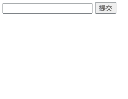

# 常用标签

# 1.标题`<h1>` 到`<h6>`

> header 1

- **粗体**
- **字号**：1到6号标题与1到6号字体逆序对应
- 独占一行

```html
<h1>一级标题</h1>
<font size="6">6号字体文本</font>
<h2>二级标题</h2>
<font size="5">这是5号字体文本</font>
<h3>三级标题</h3>
<font size="4">这是4号字体文本</font>
<h4>四级标题</h4>
<font size="3">这是3号字体文本</font>
<h5>五级标题</h5>
<font size="2">这是2号字体文本</font>
<h6>六级标题</h6>
<font size="1">这是1号字体文本</font>
```

> `<font>` 在HTML5中已移除


# 2.水平线 `<hr>`

> horizontal rule

- `<hr>` 标签创建水平线，可用于分隔内容
- **实际开发**中并不常用 hr 作为分割线，而是使用 CSS 盒子模型中的边框来实现分割线效果，或是利用一个空盒子设置长宽高及背景颜色来实现分割线效果。

# 3.段落`<p>` `</p>`

> paragraph

语法：

```
<p>我是一个段落标签</p>
```

- **段间距**：不同的段落之间的间隙

- 独占一行

- 根据浏览器窗口大小自动换行；中文自动换行，英文有空格才会换行

- 同一个段落、不同行的元素内容之间，会有空格

  > VSCode代码自动换行快：`查看` -- `自动换行` 


# 4.换行`<br>`

> break

- `<br>` 标签：不产生新段的前提下，强制换行；

# 5.文本格式化

- 文本格式化标签：

| 标签         | 标签                   | 描述   |
| ------------ | ---------------------- | ------ |
| `<b>` `</b>` | `<strong>` `</strong>` | 加粗   |
| `<i>` `</i>` | `<em>` `</em>`         | 倾斜   |
| `<u>` `</u>` | `<ins>` `</ins>`       | 下划线 |
| `<s>` `</s>` | `<del>` `</del>`       | 删除线 |
|              | `<sub>` `<\sub>`       | 上标   |
|              | `<sup>` `<\sup>`       | 下标   |
|              | `<small>` `</samll>`   | 小号字 |

注意：`<em>` 标签不只是单纯的用于倾斜文本，其核心的意义在于对元素进行**强调！**所以在后期的开发中可以把一些**特殊性、强调性**的元素放在 em 标签中，然后再对 em 这个盒子进行样式设置，这比把其放入其他盒子（如：span）中要更合理，同理 `<strong>` 标签页适合放一些**重点强调**的元素。

- 计算机输出标签

  | 标签     | 描述           |
  | -------- | -------------- |
  | `<code>` | 计算机代码     |
  | `<kbd>`  | 键盘码         |
  | `<samp>` | 计算机代码样本 |
  | `<var>`  | 变量           |
  | `<pre>`  | 预格式文本     |


- 引文、引用、标签定义

  | 标签           | 描述                          |
  | -------------- | ----------------------------- |
  | `<abbr>`       | 缩写（abbreviation）          |
  | `<address>`    | 地址                          |
  | `<bdo>`        | 文字方向                      |
  | `<blockquote>` | 长的引用（block quotation）   |
  | `<q>`          | 短的引用（原文）（quotation） |
  | `<cite>`       | 引用                          |
  | `<dfn>`        | 定义项目                      |

  

# 6.图像

> image，map，area

语法：

```


<map name="planetmap">
  <area shape="rect" coords="0,0,82,126" href="sun.htm" alt="Sun">
  <area shape="circle" coords="90,58,3" href="mercur.htm" alt="Mercury">
  <area shape="circle" coords="124,58,8" href="venus.htm" alt="Venus">
</map>
```

- `` 标签：定义 HTML 页面中的图像；有两个必需的属性：`src` 和 `alt` 
- `<map>` 标签：用于客户端图像映射；**图像映射**指的是带有可点击区域的图像
- `<area>` 标签：定义图像映射内部的区域
- `<area>` 元素永远嵌套在 `<map>` 元素内部
- ` ` 标签中的 `usemap` 属性与 `<map>` 元素中的`id` 或 `name` 属性相关联，以创建图像与映射之间的关系。

## 6.1 ``

| 属性（``） | 属性值                                                       | 说明                                                         |
| --------------- | ------------------------------------------------------------ | ------------------------------------------------------------ |
| `src`           | 图片路径                                                     | 源属性，必须要有（source）                                   |
| `alt`           | 文本                                                         | 替换文本，当浏览器无法载入图片时显示（建议写上）(alter)      |
| `title`         | 文本                                                         | 提示文本，当鼠标悬停在图片上时显示                           |
| `width`         | 数值（像素）                                                 | 设置图像宽度（建议通过CSS设置）                              |
| `height`        | 数值（像素）                                                 | 设置图像高度（建议通过CSS设置）                              |
| `border`        | 数值（像素）                                                 | 设置图像边框粗细（建议通过CSS设置）                          |
| `loading`       | `eager`：立即加载<br />`lazy`：延迟加载                      | **默认**立即加载图像<br />**延迟加载**：只有鼠标到该图片所在位置才会显示 |
| `ismap`         | `ismap`                                                      | 将图像定义为服务器端图像映射<br />点击图片，**点击坐标**会以 URL 查询字符串的形式发送到服务器 |
| `usemap`        | `#mapname`：一个 hash 字符 ("#") 加上要使用的 `<map>` 元素的 `name` 或 `id` 的属性值 | 将图像定义为客户端图像映射<br />点击图片，跳转到指定链接<br /> |

- `width` 和 `height` 只设置一个时，另一个会自动按比例适配；两个都设置时，图片可能会被拉伸

- 设置宽高时，可以使用**百分数**作为值，此时图片大小会以当前父元素的大小为基础进行比例缩放，这样做的好处在于当父元素改变大小时，图片也会随比例同等缩放

- `ismap`：只有当` ` 元素 **属于** 带有有效 `href` 属性的 **`<a>` 元素**的后代时，才允许使用 `ismap` 属性。：

  ```
  <a href="form_action.php">
  
  </a>
  ```

- `usemap`：

  - 只有当 `` 元素**不属于 `<a>` 或 `<button>` 元素**的后代时，才允许使用 `usemap` 属性；
  - usemap 属性与 `map` 元素的 `name` 或 `id` 属性相关联，以建立 `` 与 `<map>` 之间的关系

  ```
  
  
  <map name="planetmap">
    <area shape="rect" coords="0,0,82,126" alt="Sun" href="sun.htm">
    <area shape="circle" coords="90,58,3" alt="Mercury" href="mercur.htm">
    <area shape="circle" coords="124,58,8" alt="Venus" href="venus.htm">
  </map>
  ```

## 6.2.`<map>` `</map>`

| 属性（`<map>`） | 属性值  | 描述                   |
| --------------- | ------- | ---------------------- |
| `name`          | mapname | 必需属性，自定义字符串 |

## 6.3.`<area>`

| 属性（`<area>`） | 属性值                                                       | 描述                                                         |
| ---------------- | ------------------------------------------------------------ | ------------------------------------------------------------ |
| `href`           | URL                                                          | 区域的目标 URL (hypertext reference)                         |
| `target`         | `_blank` 新窗口中打开<br />`_parent` 在父框架集中打开<br />`_self` （**默认**）在相同的框架中打开<br />`_top` 在整个窗口中打开<br />`framename` 在指定的框架中打开 | 在何处打开目标 URL                                           |
| `type`           | `MIME_type`                                                  | 标 URL 的 MIME 类型<br />MIME = Multipurpose Internet Mail Extensions |
| `shape`          | `default` 全部区域<br />`rect` 矩形区域<br />`circle` 圆形<br />`poly` 多边形 | 区域的形状                                                   |
| `alt`            | 文本                                                         | 替代文本。若使用 href 属性，则该属性必需                     |
| `coords`         | 坐标                                                         | 区域的坐标                                                   |

- `coords`：单位像素

  - 若 `shape="rect"`，则`coords="x1,y1,x2,y2"`，其中**左上角**顶点坐标为(x1,y1)，**右下角**顶点坐标为(x2,y2)
  - 若 `shape="circle"`，则`coords="x,y,r"`，其中**圆心**坐标为(X1,y1)，**半径**为r
  - 若 `shape="poly"`，则`coords="x1,y1,x2,y2,..."`，其中**各顶点坐标**依次为(x1,y1)、(x2,y2)、......

- `type`：常用属性值：`image/jpg`，`image/png`，`image/gif`，`audio/mp3`，`audio/flac`，`audio/wav`，`audio/mpeg`，`video/mp4`，`video/WebM`，<a name="type">type属性</a>

  

## 其它图像标签

| 标签           | 描述                                                         |
| -------------- | ------------------------------------------------------------ |
| `<canvas>`     | 通过脚本（通常是 JavaScript）来绘制图形（比如图表和其他图像） |
| `<figcaption>` | 定义一个 caption for a <figure> element                      |
| `<figure>`     | figure 标签用于对元素进行组合                                |


# 7.音频、视频 (HTML5 新增)

## 7.1音频 `<audio>` `</audio>`

**HTML5新增**，语法：

```
<audio src="文件地址" controls="controls"></audio>
```

```
<audio controls autoplay>
  <source src="horse.ogg" type="audio/ogg">
  <source src="horse.mp3" type="audio/mpeg">
您的浏览器不支持 audio 元素。
</audio>
```

| 标签                 | 描述                                                         |
| -------------------- | ------------------------------------------------------------ |
| `<audio>` `</audio>` | 定义声音内容                                                 |
| `<source>`           | 规定媒体资源, 可以是多个，在 `<video>` 与 `<audio>` 标签中使用 |


| 属性（`<audio>`） | 属性值                                                       | 说明                                                         |
| ----------------- | ------------------------------------------------------------ | ------------------------------------------------------------ |
| `src`             | url                                                          | 音频路径                                                     |
| `controls`        | `controls`                                                   | 显示播放/暂停、音量组件（**播放界面**）                      |
| `autoplay`        | `autoplay`                                                   | 自动播放                                                     |
| `loop`            | `loop`                                                       | 循环播放                                                     |
| `muted`           | `muted`                                                      | 静音                                                         |
| preload           | `auto` 载入整个音频<br />`metadata` 只载入元数据<br />`none` 不载入音频 | 是否在页面加载后载入音频<br />若设置了 `autoplay` 属性，则忽略该属性 |


| 属性（`<source>`） | 属性值    | 说明                                                         |
| ------------------ | --------- | ------------------------------------------------------------ |
| `src`              | URL       | 媒体文件的 URL                                               |
| `type`             | MIME_type | 媒体资源的 MIME 类型，[见6](#type)                           |
| `srcset`           | URL       | `<source>` 应用于 `<picture>` 标签时需要使用到。指定在不同情况下使用的图像 URL。 |
| `sizes`            |           | 不同页面布局设置不同**图片**大小                             |


- 注意浏览器或HTML是否支持需要播放的文件格式
- 有些浏览器不支持自动播放，但可以配合JavaScript实现自动播放
- 可以在 `<audio>` 和 `</audio>` 之间放置文本内容，不支持 `<audio>` 标签的浏览器会显示这些文本信息
- `<audio>` 元素允许使用多个 `<source>` 元素；不同的 `<source> ` 元素链接不同的音频文件，浏览器将使用第一个支持的音频文件

## 7.2.视频`<video>` `</video>`

**HTML5新增**，语法：

```
<video src="文件地址" controls="controls"></video>
```

```
<video controls width="320" height="240">
	<source src="movie.mp4" type="video/mp4">
	<source src="movie.ogg" type="video/ogg">
    <track default
           kind="captions"
           srclang="en"
           src="/video/php/friday.vtt" />
    抱歉，您的浏览器不支持嵌入视频！
</video>
```

| 标签                 | 描述                                                         |
| -------------------- | ------------------------------------------------------------ |
| `<video>` `</video>` | 定义声音内容                                                 |
| `<source>`           | 规定媒体资源, 可以是多个，在 `<video>` 与 `<audio>` 标签中使用 |
| `<track>`            | 在媒体播放器文本轨迹（**字幕**）                             |


| 属性（`<video>`） | 属性值                                           | 说明                                              |
| ----------------- | ------------------------------------------------ | ------------------------------------------------- |
| `src`             | url                                              | 音频路径                                          |
| `controls`        | controls                                         | 显示播放/暂停、音量组件                           |
| `autoplay`        | autoplay                                         | 自动播放（chrome浏览器需要配合muted才能自动播放） |
| `loop`            | loop                                             | 循环播放                                          |
| `width`           | 数值                                             | 播放器宽度                                        |
| `height`          | 数值                                             | 播放器高度                                        |
| `preload`         | auto（预先加载视频）<br />none（不预先加载视频） | 有`autoplay`时忽略                                |
| `poster`          | Imgurl                                           | 用户点击播放按钮前显示的图像                      |
| `muted`           | muted                                            | 默认静音播放                                      |

| 属性（`<track>`） | 属性值                                                       | 描述                                                         |
| ----------------- | ------------------------------------------------------------ | ------------------------------------------------------------ |
| `src`             | URLx                                                         | 轨道文件的 URL必需的（规定轨道文件的 URL）                   |
| `kind`            | `captions` 在播放器中显示的简短说明<br />`chapters` 定义章节，用于导航媒介资源<br />`descriptions`<br />`metadata`<br />`subtitles` 字幕 | 文本轨道的文本类型                                           |
| `label`           | 文本                                                         | 文本轨道的标题                                               |
| `srclang`         | language_code                                                | 文本轨道的标签和标题<br />（若`kind="subtitles"`，此属性必需） |
| `default`         | `default`                                                    | 有多个 `<track>` 标签时，带`default` 属性的为默认文本轨道    |


- `<source>` 属性见7
- 可以在 `<video>` 和 `</video>` 之间放置文本内容，不支持 `<video>` 标签的浏览器会显示这些文本信息

## 7.3.音频、视频 DOM

HTML5 DOM 为 `<audio>` 和 `<video>` 元素提供了方法、属性和事件。

这些方法、属性和事件允许您使用 JavaScript 来操作 `<audio>` 和 `<video>` 元素。

详见https://www.runoob.com/tags/ref-av-dom.html

示例：

```
<div style="text-align:center"> 
  <button onclick="playPause()">播放/暂停</button> 
  <button onclick="makeBig()">放大</button>
  <button onclick="makeSmall()">缩小</button>
  <button onclick="makeNormal()">普通</button>
  <br> 
  <video id="video1" width="420">
    <source src="mov_bbb.mp4" type="video/mp4">
    <source src="mov_bbb.ogg" type="video/ogg">
    您的浏览器不支持 HTML5 video 标签。
  </video>
</div> 

<script> 
var myVideo=document.getElementById("video1"); 

function playPause()
{ 
	if (myVideo.paused) 
	  myVideo.play(); 
	else 
	  myVideo.pause(); 
} 

function makeBig()
{ 
	myVideo.width=560; 
} 

function makeSmall()
{ 
	myVideo.width=320; 
} 

function makeNormal()
{ 
	myVideo.width=420; 
} 
</script>
```


# 8.超链接 `<a>`

> anchor

语法：

```
<a href="跳转目标" target="目标窗口的弹出方式">文本、图像或其他内容</a>
```

| 属性     | 属性值                                                       | 作用                                  |
| -------- | ------------------------------------------------------------ | ------------------------------------- |
| `href`   | url                                                          | 用于指定链接目标的 url 地址，必须属性 |
| `target` | `_self` **默认**，在当前页面打开<br />`_blank` 在新窗口中打开 | 用于指定链接页面的打开方式            |

- 元素内容为文本时默认为蓝色

- **空链接**：`<a href="javascript:void(0)" target="目标窗口的弹出方式">文本、图像或其他内容</a>`，当用户点击链接时，void(0) 计算为 0，但 Javascript 上没有任何效果

- **下载链接**：如果 href 里面地址是一个文件或者压缩包（前提：路径包含文件类型后缀名，如：`.exe`、`.zip` 等），便会下载这个文件

- **锚点链接：**点击链接，可以快速定位到**当前页面中的某个位置**
  - 在链接文本的 href 属性中，设置属性值的 `#名字` 的形式，如：`<a href="#two">第2集</a>` 
  - 找到目标位置标签（此处以 h3 标签为例），里面添加一个 `id属性="刚才的名字"`，如：`<h3 id="two">第2集介绍</h3>`
  - `<a href="#"></a>` 默认定位到页面顶部

## 其它链接标签

| 标签     | 描述                       |
| -------- | -------------------------- |
| `<link>` | 定义文档与外部资源的关系   |
| `<main>` | 定义文档的主体部分         |
| `<nav>`  | 定义导航链接（navigation） |


# 9.表格`<table>` `</table>`

> table，caption，table row，table header cell，table data cell

| 标签名                     | 描述                                   |
| -------------------------- | -------------------------------------- |
| `<table>` `</table>`       | 定义**表格**                           |
| `<caption>` `</caption>`   | 表格**标题**（默认**居中**）           |
| `<tr>` `</tr>`             | 定义表格中的**行**                     |
| `<th>` `</th>`             | 表格**表头**（默认**加粗居中**）       |
| `<td>` `</td>`             | 定义表格的**单元格**（默认**左对齐**） |
| `<colgroup>` `</colgroup>` | 表格中需要格式化的列组                 |
| `<col>`                    | 表格列组的属性                         |
| `<thead>` `</thead>`       | 表格**页眉**                           |
| `<tbody>` `</tbody>`       | 表格**主体**                           |
| `<tfoot>` `</tfoot>`       | 表格**页尾**                           |

| 属性名（`<table>`） | 属性值 | 描述                                     |
| ------------------- | ------ | ---------------------------------------- |
| `border`            | 数值   | 边框宽度，若不定义边框属性，将不显示边框 |
| `width`             | 数值   | 表格宽度                                 |
| `height`            | 数值   | 表格高度                                 |
| `cellpadding`       | 数值   | 单元格内容与其边框之间的空白             |
| `cellspacing`       | 数值   | 单元格之间的距离                         |

| 属性名（`<th>`, `<td>`） | 属性值 | 描述                                                         |
| ------------------------ | ------ | ------------------------------------------------------------ |
| `colsapn`                | 数值   | **跨列**（合并同一行的单元格）数值为**合并**的数量           |
| `rowsapn`                | 数值   | **跨行**（合并同一列的单元格）数值为**合并**的数量<br />注意示例 |

| 属性名（`<col>`） | 属性值 | 描述               |
| ----------------- | ------ | ------------------ |
| `<span>`          | 数值   | 列组应该横跨的列数 |


- 标签 `<th>` `</th>` 和 `<td>` `</td>` 必须嵌套在标签 `<tr>` `</tr>` 内
- 标签 `<caption>` `</caption>` 和 `<tr>` `</tr>` 必须嵌套在标签 `<table>` `</table>` 内
- 数据**单元格**可以包含文本、图片、列表、段落、表单、水平线、表格等任何元素
- 常不用属性设置样式，而是在CSS中设置
- 添加 `<thead>`， `<tbody>`，`<tfoot>` 便于后续CSS设置

实例

```html
<!DOCTYPE html>
<html lang="en">
<head>
    <meta charset="UTF-8">
    <meta http-equiv="X-UA-Compatible" content="IE=edge">
    <meta name="viewport" content="width=device-width, initial-scale=1.0">
    <title>页面标题</title>
</head>
<body>
    <table border="1">
        <colgroup>
            <col span="2" style="background-color:red">
            <col style="background-color:yellow">
        </colgroup>
        <caption>表格示例</caption>
        <thead>
            <tr>
                <th>表头1</th>
                <th>表头2</th>
            </tr>
        </thead>
        <tbody>
            <tr>
                <td rowspan="2">跨行</td>
                <td>
                    (2,2)文本
                    <p>一个段落</p>
                    <p>另一个段落</p>
                </td>
                <td>
                    <table border="1">
                        <caption>表格</caption>
                        <tr>
                            <td>1</td>
                            <td>2</td>
                        </tr>
                        <tr>
                            <td>3</td>
                            <td>4</td>
                        </tr>
                    </table>
                </td>
            </tr>
            <tr>
                <td>
                    列表
                    <ul>
                        <li>1</li>
                        <li>2</li>
                    </ul>
                </td>
                <td>单元格4</td>
            </tr>
        </tbody>
        <tfoot>
            <td colspan="3">跨列</td>
        </tfoot>
    </table>
</body>
</html>
```


# 10.列表

> ordered list，unordered list，definition list

根据使用情景不同，列表可以分为三大类：**无序列表**、**有序列表** 和 **自定义列表**。

| 标签名         | 定义       | 说明                                                         |
| -------------- | ---------- | ------------------------------------------------------------ |
| `<ul>` `</ul>` | 无序列表   | 里面**只包含 `<li>`**，没有顺序，使用较多，`<li>` 里面可以包含任何标签 |
| `<ol>` `</ol>` | 有序列表   | 里面**只包含 `<li>`**，有顺序，使用相对较少，`<li>` 里面可以包含任何标签 |
| `<dl>` `</dl>` | 自定义列表 | 里面**只能包含 `<dt>` 和 `<dd>`**，`<dt>` 和 `<dd>` 里面可以放任何标签，`<dd>` 一般作为对 `<dt>` 的细分描述 |

## 10.1.有序列表 `<ul>` `</ul>`

> unordered list 无序列表
> list item 列表项目

```
<ul>
    <li>列表项1</li>
    <li>列表项2</li>
    <li>列表项3</li>
    ...
</ul>
```

| 属性      | 属性值                                                      | 描述                                                         |
| --------- | ----------------------------------------------------------- | ------------------------------------------------------------ |
| `type`    | `disc` 实心圆<br />`square` 实心正方形<br />`circle` 空心圆 | 列表项目符号的类型（**建议**使用样式代替）                   |
| `compact` | `compact`                                                   | 呈现的效果比正常情况更小（HTML5不支持，**建议**使用样式代替） |

- HTML5中，`<ul>` 标签不支持 `type` 和 `compact` 属性
- 无序列表的各个列表项之间没有顺序级别之分，是并列的
- `<ul>` `</ul>` 中只能嵌套 `<li>` `</li>`，直接在 `<ul>` `</ul>` 标签中输入**其他标签或文字**的做法是不被允许的，列表中的任何内容都应该放在 `li` 中
- `<li>` `</li>` 之间相当于一个容器，可以**容纳所有的元素**
- 无序列表会带有自己的**样式属性**（比如圆点），但在实际开发中，我们会使用 CSS 来设置
  - 去除 `<li>` 前符号： `style="list-style: none;"` 

## 10.2.有序列表 `<ol>` `</ol>`

> ordered list 有序列表

```
<ol>
    <li>列表项1</li>
    <li>列表项2</li>
    <li>列表项3</li>
    ...
</ol>
```

| 属性       | 属性名                                                       | 描述                                                         |
| ---------- | ------------------------------------------------------------ | ------------------------------------------------------------ |
| `type`     | `a` 小写英文字母<br />`A` 大写英文字母<br />`i` 小写罗马数字<br />`I` 大写罗马数字<br />`1` 数字<br /> | 表示列表顺序的字符类型（**建议**使用样式代替）               |
| `reversed` | `reversed`                                                   | 倒序                                                         |
| `start`    | 数值                                                         | 列表编号的起始值                                             |
| `compact`  | `compact`                                                    | 呈现的效果比正常情况更小（HTML5不支持，**建议**使用样式代替） |


- `<ol>` `</ol>` 中只能嵌套 `<li>` `</li>`，直接在 `<ol>` `</ol>` 标签中输入其他标签或者文字的做法是不被允许的
- `<li>` 与 `</li>` 之间相当于一个容器，可以容纳所有的元素
- 有序列表会带有自己**样式属性**（比如**序号**），但在实际使用时，我们会使用 CSS 来设置
  - 去除 `<li>` 前编号： `style="list-style: none;"` 

## 10.3.自定义列表 `<dl>` `</dl>`

> definition list 自定义列表
> definition term 自定义组
> definition description 自定义描述

```
<dl>
    <dt>名词1</dt>
    <dd>名词1解释1</dd>
    <dd>名词1解释2</dd>
</dl>
```

| 标签           | 描述         |
| -------------- | ------------ |
| `<dl>` `</dl>` | 列表         |
| `<dt>` `</dt>` | 列表项目     |
| `<dd>` `</dd>` | 列表项的描述 |


- `<dl>` `</dl>` 里面只包含 `<dt>`、`<dd>`
- `<dt>` 和 `<dd>` 个数没有限制，经常是一个 `<dt>` 对应多个 `<dd>`

示例：

```
<dl>
  <dt>Coffee</dt>
  <dd>Black hot drink</dd>
  
  <dt>Milk</dt>
  <dd>White cold drink</dd>
</dl>
```


## 其它列表标签

| 标签        | 描述                                                 |
| ----------- | ---------------------------------------------------- |
| `<dir>`     | 定义目录列表（HTML5不再支持）                        |
| `<menu>`    | 定义菜单列表                                         |
| `<command>` | 定义用户可能调用的命令（比如单选按钮、复选框或按钮） |


# 11.表单

- 表单用于收集用户的输入信息
- 一个完整的表单通常由 **表单域**、**表单控件**（也称为表单元素）和 **提示信息** 3 个部分构成
- **表单元素**是允许用户在表单中输入内容，比如：**文本域**（textarea）、**下拉列表**（select）、**单选框**（radio-buttons）、**复选框**（checkbox） 等等

## 11.1.表单 `<form>` `</form>`

```
<form action="url地址" method="提交方式" name="表单域名称">
    <!-- 各种表单元素控件 -->
</form>
```

| 标签               | 描述     |
| ------------------ | -------- |
| `<form>` `</form>` | 创建表单 |

| 属性                                      | 属性名                                     | 描述                                                         |
| ----------------------------------------- | ------------------------------------------ | ------------------------------------------------------------ |
| `action`                                  | URL（必需）                                | 指定接收并处理表单数据的服务器程序的 url 地址                |
| `method`                                  | `get`<br />`post`                          | 表单数据的提交方式                                           |
| `name`                                    | 文本                                       | 指定表单的名称，以区分同一个页面中的多个表单域               |
| `target`                                  |                                            | 打开 action URL的方式                                        |
|                                           | `_blank`                                   | 新窗口中打开                                                 |
|                                           | `_self`                                    | 同一框架中打开                                               |
|                                           | `_parent`                                  | 父框架中打开                                                 |
|                                           | `_top`                                     | 整个窗口中打开                                               |
|                                           | `framename`                                | 指定的 (带`name`属性的) `iframe` 中打开                      |
| `character_set`                           | `UTF-8`<br />`ISO-8859-1`                  | 表单提交时使用的字符编码                                     |
| `enctype`                                 |                                            | 将数据回发到服务器时浏览器使用的编码类型                     |
|                                           | `application/x-www-form-urlencoded` (默认) | 窗体数据被编码为名称/值对；<br />空格转换为 "+" 符号，特殊字符转换为 ASCII HEX 值 |
|                                           | `multipart/form-data`                      | 窗体数据被编码为一条消息，每个控件对应消息中的一个部分<br />（不对字符编码）（有上传控件时，必需） |
|                                           | `text/plain`                               | 窗体数据以纯文本形式进行编码，不含任何控件或格式字符<br />（空格转换为 "+" 符号，但不编码特殊字符） |
| <a name="autocomplete">`autocomplete`</a> | `on` 开 (默认)<br />`off` 关               | **HTML5新增**<br />是否启用表单的**自动填充**：<br />基于之前键入过的值，应该显示出在字段中填写的选项 |
| <a name="novalidat">`novalidate`</a>      | `novalidate`                               | **HTML5新增**<br />提交表单时不对表单数据（输入）进行验证    |

- **表单提交的时候**，**数据没有发送给服务器的三种情况**：

  - 表单项没有 name 属性值
  - 单选、复选（下拉列表中的 option 标签）都需要添加 value 属性，以便发送给服务器

  - 表单项不在提交的 form 标签中

- GET 请求的特点是：

  - 浏览器地址栏中的地址是：**`action 属性` + `?` + `请求参数`** 
  - 表单数据以名称/值对的形式附加到 URL 中（构成请求参数），格式：`name=value&name=value` 

  - 不安全（在 URL 中是可见的，且浏览器会记录 URL）
  - 它有数据长度的限制（3000字节）

- POST 请求的特点是：

  - 浏览器地址栏中**只有 action 属性值** 
  - 表单数据附加到 HTTP 请求的 body 内（数据不显示在 URL 中）
  - 理论上没有数据长度的限制
  - 通过 POST 提交的表单不能加入书签

- `<form>` 元素包含一个或多个如下的表单控件（表单元素）：

  | 标签                                    | 描述                                                         |
  | --------------------------------------- | ------------------------------------------------------------ |
  | `<form>`                                | 定义了供用户输入的表单                                       |
  | [`<input>`](#input)                     | 定义输入域                                                   |
  | [`<button>` `</button>`](#button)       | 定义一个点击按钮                                             |
  | [`<textarea>` `</textarea>`](#textarea) | 定义文本域 (一个多行的输入控件)                              |
  | [`<label>` `</label>`](#label)          | 定义了 标签 的标注 (标记)，一般为输入标题 <br />(鼠标点击 `<label>` 标签内容时，触发相应标签)<br />`<label>` 标签的 `for` 属性应当与相关元素的 `id` 属性相同 |
  | [`<fieldset>` `<fieldset>`](#fieldset)  | 定义了一组相关的表单元素，并使用外框包含起来                 |
  | [`<legend>`](#legend)                   | 定义了 [`<fieldset>`](#fieldset) 元素的标题                  |
  | [`<select>` `</select>`](#select)       | 定义了**下拉选项列表**                                       |
  | [`<optgroup>` `</optgroup>`](#optgroup) | 定义 **选项组**                                              |
  | [`<option>` `</option>`](#option)       | 定义 `<select>` 或 `<datalist>` 中的 **选项**                |
  | [`<datalist>`](#datalist)               | **HTML5新增**，定义一个 点击按钮                             |
  | [`<keygen>`](#keygen)                   | **HTML5新增**，定义了表单的密钥对生成器字段                  |
  | [`<output>`](#output)                   | **HTML5新增**，定义一个计算结果                              |

## 11.2.输入域 <a name="input">`<input>`</a>

```
<form action="demo_form.php">
  First name: <input type="text" name="fname"><br>
  Last name: <input type="text" name="lname"><br>
  <input type="submit" value="提交">
</form>
```

### 11.2.1.`type` 属性

`<input>` 标签 `<type>` 属性的属性值：

| 属性值           | 描述                                                         |
| ---------------- | ------------------------------------------------------------ |
| `text` （默认）  | 输入单行文本，用户可在其中输入文本，默认宽度为 20 个字符     |
| `password`       | 密码框，该字段中的字符被掩码                                 |
| `hidden`         | 隐藏的输入字段，在页面中对于用户不可见                       |
| `radio`          | 单选框，同一组单选，必须拥有相同的 `name` 属性<br />（`value` 属性必需，提交的表单可以判断具体选择了哪个选项） |
| `checkbox`       | 多选框，同一组多选，必须拥有相同的 `name` 属性<br />（`value` 属性必需，提交的表单可以判断具体选择了哪个选项） |
| `file`           | 提交文件的按钮，定义输入字段和 “选择文件” 按钮               |
| `image`          | 图像形式的 **提交按钮** 中                                   |
| `submit`         | **提交** 按钮，把表单数据发送到服务器                        |
| `reset`          | **重置** 按钮，重置所有的表单值为默认值                      |
| `button`         | 普通按钮，默认无功能，配合 JS 添加功能                       |
| `email`          | **HTML5新增**，用于 e-mail 地址的字段                        |
| `url`            | **HTML5新增**，用于输入 URL 的字段                           |
| `data`           | **HTML5新增**，`date` 控件（包括年、月、日，不包括时间）     |
| `datatime`       | **HTML5新增**，`date` 和 `time` 控件<br />（包括年、月、日、时、分、秒、几分之一秒，基于 UTC 时区，键盘输入） |
| `datatime-local` | **HTML5新增**，`date` 和 `time` 控件<br />（包括年、月、日、时、分、秒、几分之一秒，不带时区） |
| `time`           | **HTML5新增**，用于输入时间的控件（不带时区）                |
| `month`          | **HTML5新增**，month 和 year 控件（不带时区）                |
| `week`           | **HTML5新增**，week 和 year 控件                             |
| `number`         | **HTML5新增**，输入数字 (选择整数)                           |
| `range`          | **HTML5新增**，输入数字 (滑动 选择整数，不在意精度时使用) (默认0~100) |
| `tel`            | **HTML5新增**，电话号码                                      |
| `search`         | **HTML5新增**，输入搜索字符串                                |
| `color`          | **HTML5新增**，拾色器                                        |

- `<input>` 元素是空的，它只包含标签**属性** 
- 使用CSS来定义 `<input>` 元素的**对齐方式** 
- `type` 属性规定 `<input>` 控件类型
- `type="hidden"` 
  - 定义隐藏输入字，隐藏域在页面中对于 **用户** 是 **不可见** 的。
  - 隐藏字段常常存储默认值在表单中插入隐藏域的目的在于收集或发送信息，以利于被处理表单的程序所使用。浏览者单击发送按钮发送表单的时候，隐藏域的信息也被一起发送到服务器。
  - 提交一些表格的时候，有些变量是预先定了其值的，而且不想客户再改变其值，所以用 hidden 隐藏，但提交表单的时候还是会把其值上交上去
  - 有些时候我们要给用户一信息，让他在提交表单时提交上来以确定用户身份，如 sessionkey，等等。当然这些东西也能用 cookie 实现，但使用隐藏域就简单的多了。而且不会有浏览器不支持，也避免了用户禁用 cookie 后的烦恼。
  - javascript 不支持全局变量，但有时我们必须用全局变量，我们就可以把值先存在隐藏域里，它的值就不会丢失了
- `type="submit"` ：有些时候一个 `form` 里有**多个提交按钮**，怎样使程序能够分清楚到底用户是按那一个按钮提交上来的呢？我们就可以写一个 **隐藏域** ，然后在每一个按钮处加上 `onclick="document.form.command.value="xx""` 然后我们接到数据后先检查 command 的值就会知道用户是按的那个按钮提交上来的

### 11.2.2.其它属性：

| 属性`<input>`                              | 属性值                                                 | 描述                                                         |
| ------------------------------------------ | ------------------------------------------------------ | ------------------------------------------------------------ |
| `name`                                     | 文本                                                   | `input` 元素的**名称**                                       |
| `value`                                    | 文本                                                   | `input` 元素的**值**，只有设置了 `name` 属性的表单元素才能在提交表单时传递它们的值 `value` |
| `required`                                 | `required`                                             | **HTML5新增**，规定 **必需填写** 的 `<input>` 标签           |
| `placeholder`                              | 文本                                                   | **HTML5新增**，**提示信息**                                  |
| `checked`                                  | `checked`                                              | 规定 **默认选定** 的 `<input>` 元素<br />(只针对 `type="checkbox"` 或者 `type="radio"`) |
| `maxlength`                                | 数值                                                   | `<input>` 元素中允许的**最大字符数** (超过的字符无法输入)    |
| `list`                                     | `datalist_id`                                          | **HTML5新增**，规定绑定到 `<input>` 元素的 <a href="#datalist">`<datalist>`</a> 的 `id`<br />该属性引用 <a href="#datalist">`<datalist>`</a> 元素，其中包含 `<input>` 元素的预定义选项 |
| `src`                                      | URL                                                    | 图像形式的提交按钮中，图像的 **URL** <br />(只针对 `type="image"`) |
| `alt`                                      | 文本                                                   | 图像形式的提交按钮中，图像的**替代文本** <br />(只针对 `type="image"`) |
| `height`                                   | 数值 (像素)                                            | **HTML5新增**，图像形式的提交按钮中，图像的 **高度** <br />(只针对 `type="image"`) |
| `width`                                    | 数值 (像素)                                            | **HTML5新增**，图像形式的提交按钮中，图像的 **宽度**<br /> (只针对 `type="image"`) |
| `multiple`                                 | `multiple`                                             | **HTML5新增**，允许用户在 `<input>` 元素输入 **多个文件**<br />(只针对 `type=""` 或者 `type="file"`) |
| `disabled`                                 | `disabled`                                             | 规定应该**禁用**的 `<input>` 元素                            |
| `readonly`                                 | `readonly`                                             | 规定输入字段是 **只读** 的 (不能修改)                        |
| `form`                                     | `form_id`                                              | **HTML5新增**，规定 `<input>` 元素所属的一个或多个 `form` 表单<br />不同的 `form_id` 用空格 ` ` 隔开 |
| `size`                                     | 数值                                                   | 规定**以字符数计**的 `<input>` 元素的**可见宽度**            |
| `max`                                      | 数值                                                   | **HTML5新增**，`<input>` 元素的 **最大值**                   |
| `min`                                      | 数值                                                   | **HTML5新增**，`<input>` 元素的 **最小值**                   |
| `step`                                     | 数值                                                   | **HTML5新增**，`<input>` 元素的 **数字间隔**                 |
| `accept`                                   | `audio/*`<br />`video/*`<br />`image/*`<br />MIME_type | 提交的文件的类型，多个属性值使用逗号 `,` 隔开<br />(只针对`type="file"`) |
| `autofocus`                                | `autofocus`                                            | **HTML5新增**，页面加载时 `<input>` 元素应该自动获得 **焦点**<br />即自动定位到该 `<input>` 元素 |
| <a href="#autocomplete">`autocomplete`</a> | `on`<br />`off`                                        | **HTML5新增**，                                              |
| `pattern`                                  | 正则表达式                                             | 用于验证 `<input>` 元素的值是否符合正则表达式，不符合时显示信息<br />`title="不符合的信息"` <br />适用于下面的 `input` 类型：``text`、`search`、`url`、`tel`、`email` 和 `password` |

- `name` `value` ：只有设置了 `name` 属性的 `form` 表单元素才能在提交表单时传递它的值 `value` 

  - `name` 属性的主要作用是区分不同的表单
  - 对于 "button"、"reset"、"submit" 类型 - `value` 属性定义**按钮上的文本** 
  - 对于 "text"、"password"、"hidden"、"number"、"range" 等类型 - `value` 属性定义**输入字段的默认值** (不是提示信息，修改时需要把默认值删除)
  - 对于 "radio"、"checkbox"、"image" 类型 - `value` 属性定义与 `input` 元素相关的需要 **提交的值**，当提交表单时该值会发送到表单的 `action` URL (根据该值判断具体的选项)
  - `value` 属性对于 `<input type="radio">` 和 `<input type="checkbox">` 是必需的
  - `value` 属性不适用于 `<input type="file">` 

- `required` ：适用于下面的 `input` 类型：`text`、`search`、`url`、`tel`、`email`、`password`、`number`、`checkbox`、`radio` 和 `file` 

- `placeholder` ：适用于下面的 `input` 类型：`text`、`search`、`url`、`tel`、`email` 和 `password`，修改提示信息的文本样式：

  ```
  input::placeholder {
  	color:pink;
  }
  ```

- `list` ：与 <a href="#datalist">`<datalist>`</a> `<option>` 标签构成 `<input>` 标签的下拉选项

- `src` `alt` `width` `height` ：这四个个属性只针对 `type="image"`，形成 **图像形式的提交按钮**，[菜鸟教程](https://www.runoob.com/try/try.php?filename=tryhtml_input_src) ，示例：

  ```
  <form action="demo_form.php">
    First name: <input type="text" name="fname"><br>
    <input type="image" src="https://www.runoob.com/try/demo_source/submit.gif" alt="Submit" width="48" height="48">
  </form>
  ```

- `multiple` ：允许用户在 `<input>` 元素输入 **多个文件**，Windows按住 Ctrl 键选择多个文件。该属性只针对 `type=""` 或者 `type="file"` 

- `disabled` ：规定应该 **禁用** 的 `<input>` 元素

  - 禁用的 `<input>` 元素无法使用、点击、提交
  - `disabled` 属性进行设置，使用户在满足某些条件时（比如选中复选框，等等）才能使用 `<input>` 元素。然后，可使用 JavaScript 来删除 disabled 值，使该`<input>` 元素变为可用的状态
  - `disabled` 属性不适用于 `<input type="hidden"` 

  

- `readonly` ：规定输入字段是只读的

  - 只读字段是不能修改的。不过，用户仍然可以使用 tab 键切换到该字段，还可以选中或拷贝其文本
  - `readonly` 属性可以防止用户对值进行修改，直到满足某些条件为止（比如选中了一个复选框）然后，可使用 JavaScript 消除 `readonly` 值，将输入字段切换到可编辑状态

- `form` ：规定 `<input>` 元素所属的一个或多个表单

  ```
  <form action="demo-form.php" id="form1">
  First name: <input type="text" name="fname"><br>
  <input type="submit" value="提交">
  </form>
  
  <p> "Last name" 字段没有在 form 表单之内，但它也是 form 表单的一部分。</p>
  
  Last name: <input type="text" name="lname" form="form1">
  ```

- `size` ：规定以字符数计的 `<input>` 元素的可见宽度

  - `size` 属性适用于下面的 `input` 类型：``text`、`search`、`tel`、`url`、`email` 和 `password` 

  ```
  <form action="demo_form.php">
    Email: <input type="text" name="email" size="35"><br>
    PIN: <input type="text" name="pin" maxlength="4" size="4"><br>
    <input type="submit" value="提交">
  </form>
  ```

  

- `max` `min` ：规定 `<input>` 元素的 **最大值**、 **最大值**，适用于以下 `input` 类型：`number`、`range`、`date`、`datetime`、`datetime-local`、`month`、`time` 和 `week` ，这些类型可以使用 `value` 设定 **默认值** 

- `step` ：规定 `<input>` 元素的 **数字间隔** ，适用于下面的 `input` 类型：``number`、`range`、`date`、`datetime`、`datetime-local`、`month`、`time` 和 `week` 

  ```
  <form action="demo-form.php">
  	输入 1980-01-01 之前的日期:
      <input type="date" name="bday" max="1979-12-31"><br>
  
      输入 2000-01-01 之后的日期:
      <input type="date" name="bday" min="2000-01-02"><br>
  
      数量 (在1和5之间):
      <input type="number" name="quantity" min="1" max="5"><br>
  
      <input type="submit">
  </form>
  ```

  

- `pattern` ：用于验证该 `<input>` 元素输入的值是否符合**正则表达式**，不符合时显示信息。适用于下面的 `input` 类型：`text`、`search`、`url`、`tel`、`email` 和 `password` 。配合 `title` 属性显示信息：

  ```
  <form action="demo-form.php">
    Country code: <input type="text" name="country_code" pattern="[A-Za-z]{3}" title="Three letter country code">
    <input type="submit">
  </form>
  
  <p><strong>注意:</strong>  Internet Explorer 9及更早 IE 版本，或 Safari 不支持 input 标签的 pattern 属性。</p>
  ```

  

## 11.3.按钮 `<button>` `</button>`

<a name="button">`<button>` `</button>`</a> 标签定义一个按钮

```
<button type="submit">标签内容</button>
<button type="reset">标签内容</button>
<button type="button">标签内容</button>
```

- 在 `<button>` 元素内部，您可以放置内容，比如文本或图像。这是该元素与使用 `<input>` 元素创建的按钮之间的不同之处。如：

  ```
  <button type="button" onclick="alert('你好，世界!')">
  	
  </button>
  ```

| 属性 (`<button>`) | 属性值                                                       | 描述                                                         |
| ----------------- | ------------------------------------------------------------ | ------------------------------------------------------------ |
| `type`            | `submit` 提交<br />`reset` 重置<br />`button` 普通           | 规定按钮的类型                                               |
| `name`            | 文本                                                         | 按钮的**名称**                                               |
| `value`           | 文本                                                         | 按钮的**初始值** (可由脚本进行修改)                          |
| `disable`         | `disable`                                                    | 禁用该按钮                                                   |
| `formtarget`      | `_blank` 新窗口<br/>`_self` 同一框架<br/>`_parent` 父框架<br/>`_top` 在整个宽口打开<br/>`framename` 指定框架打开 | **HTML5新增**，<br />在何处打开 `action` 属性 URL<br />覆盖 `form` 元素的 `target` 属性<br />与 `type="submit"` 配合使用 |
| `autofocus`       | `autofocus`                                                  | **HTML5新增**，<br />加载时按钮自动获得焦点                  |
| `form`            | `form_id`                                                    | **HTML5新增**，<br />规定按钮属于一个或多个表单              |
| `formaction`      | URL                                                          | **HTML5新增**，<br />覆盖 `form` 元素的 `action` 属性<br />与 `type="submit"` 配合使用 |
| `formenctype`     |                                                              | **HTML5新增**，<br />覆盖 `form` 元素的 `enctype` 属性<br />与 `type="submit"` 配合使用。 |
| `formmethod`      | `get`<br />`post`                                            | **HTML5新增**，<br />覆盖 `form` 元素的 `method` 属性<br />该属性与 `type="submit"` 配合使用。 |
| `formnovalidate`  | `formnovalidate`                                             | **HTML5新增**，<br />覆盖 `form` 元素的 `formnovalidate` 属性<br />该属性与 `type="submit"` 配合使用。 |

- `name`：规定按钮名称
  - 不同的 `button` 元素可以共享相同的名称。这就允许您标记带有相同名称的若干按钮，以便在表单中使用时能够提交不同的值 ？
- `value`：与 `<input type="submit">` 中的 `value` 不同
  -  `<input type="submit" value="按钮上面的文本">` 中 `value`  指按钮上的文本
  -  `<button>按钮上面的文本</button>` ，
  -  如果 `button` 按钮作为表单数据提交，只有表单的 `value` 值会被提交 ( IE 将提交 `<button>` 与 `<button/>` 之间的文本)

## 11.4.标注 `<label>` `</label>`

-  <a name="label">`<label>` `</label>`</a> 标签 定义 标签的 **标注** 
-  点击 `<label>` `</label>` 中间的文本，就会触发相应的 控件
-  `<label>` 标签的 `for` 属性应当与相关元素的 `id` 属性相同。
-  

```
<form action="demo_form.php">
	<!-- label标签 使用方法1 -->
    <label for="male">Male</label>
    <input type="radio" name="sex" value="male" id="male"><br>
    
    <!-- label标签 使用方法2 -->
    <label>
    	Female
    	<input type="radio" name="sex" value="female"><br><br>
    </label>

    <input type="submit" value="提交">
</form>
```

 

| 属性 (`<label>`) | 属性值       | 描述                                 |
| ---------------- | ------------ | ------------------------------------ |
| `for`            | `element_id` | 规定 `label` 与哪个表单元素绑定      |
| `form`           | `form_id`    | 规定`label` 字段所属的一个或多个表单 |


## 11.5.文本域 `<textarea>` `</textarea>`

<a name="textarea">`<textarea>` `</textarea>`</a> 标签定义一个 **多行文本输入** 控件

```
<textarea rows="10" cols="30">
我是一个文本框。
</textarea>
```

- 文本区域中可容纳无限数量的文本，其中的文本的默认字体是 **等宽字体** (通常是 Courier)
- 可通过 `cols` 和 `rows` 属性来规定 `textarea` 的尺寸大小，不过更好的办法是使用 CSS 的 `height` 和 `width` 属性。

| 属性 (`<textarea>`) | 属性值             | 描述                                                         |
| ------------------- | ------------------ | ------------------------------------------------------------ |
| `name`              | 文本               | 文本区域的 **名称**                                          |
| `cols`              | 数值               | 文本区域内 **可见宽度** <br />单位：字符数 (汉字2字符，数字英文1字符) |
| `rows`              | 数值               | 文本区域内 可见 **行数**                                     |
| `disabled`          | `disabled`         | 文本区域 **禁用**                                            |
| `readonly`          | `readonly`         | 文本区域 **只读**                                            |
| `placeholder`       | `placeholder`      | **HTML5新增**，<br />文本区域 **提示信息**                   |
| `required`          | `required`         | **HTML5新增**，<br />文本区域 **必填**                       |
| `maxlength`         | 数值               | **HTML5新增**，<br />文本区域允许的 **最大字符数**           |
| `warp`              | `soft`<br />`hard` | **HTML5新增**，<br />提交表单时，文本区域中的文本怎样 **换行** |
| `from`              | `from_id`          | **HTML5新增**，<br />文本区域所属的一个或多个表单            |
| `autofocus`         | `autofocus`        | **HTML5新增**，<br />文本区域自动获得焦点                    |

- `warp`：
  - `soft`：**默认**，在到达元素最大宽度的时候，换行显示，但不会自动插入换行符，也就是提交表单时 **没有换行符** 
  - `hard`：在文本到达元素最大宽度的时候，浏览器自动插入换行符(CR+LF) 。在也就是提交表单也 **提交换行符**。当使用 `warp="hard"` 时，需要指定 `cols` 属性。

## 11.6.表单内元素分组 `<fieldset>` `<fieldset>`

- <a name="fieldset">`<fieldset>` `<fieldset>`</a>  标签可以将表单内的相关元素 **分组**，并绘制 **边框** 
- 使用 <a name="legend">`<legend>`</a> 标签为 `<fieldset>` 元素定义 **标题** 

| 属性 (`<fieldset>`) | 属性值     | 描述                                |
| ------------------- | ---------- | ----------------------------------- |
| `name`              | 文本       | `fieldset` 的名称                   |
| `disabled`          | `disabled` | 该组中的相关表单元素应该被 **禁用** |
| `form`              | `form_id`  | `fieldset` 所属的一个或多个表单     |

示例：

```
<form>
 <fieldset disabled>
  <legend>Personalia:</legend>
  Name: <input type="text"><br>
  Email: <input type="text"><br>
  Date of birth: <input type="text">
 </fieldset>
</form>
```


## 11.7.下拉选项列表 `<select>` `</select>`

- <a name="select">`<select>` `</select>`</a> 标签创建**下拉列表**；

| 属性 (`<select>`) | 属性值      | 描述                                                   |
| ----------------- | ----------- | ------------------------------------------------------ |
| `name`            | 文本        | 下拉列表的名称                                         |
| `size`            | 数值        | 下拉列表中 **可见选项的数目** (默认为1)                |
| `required`        | `required`  | **HTML5新增**，<br />**必须选择** 一个下拉列表中的选项 |
| `multiple`        | `multiple`  | 选择多个选项                                           |
| `diasbled`        | `diasbled`  | 禁用下拉列表                                           |
| `form`            | `form_id`   | **HTML5新增**                                          |
| `autofocus`       | `autofocus` | **HTML5新增**                                          |


- <a name="optgroup">`<optgroup>` `</optgroup>`</a> 标签用于把相关的选项组合在一起；

| 属性 (`<optgroup>`) | 属性值     | 描述                               |
| ------------------- | ---------- | ---------------------------------- |
| `label`             | 文本       | 为选项组规定 **描述** (可见不可选) |
| `diasbled`          | `diasbled` | 禁用该选项组                       |


- <a name="option">`<option>` `</option>`</a> 标签定义了 `<select>` 列表中的**可用选项**；
- `<option>` 标签中的 **内容** 作为 `<select>` 或者`<datalist>` 一个元素使用

| 属性 (`<option>`) | 属性值     | 描述                                                         |
| ----------------- | ---------- | ------------------------------------------------------------ |
| `value`           | 文本       | 送往服务器的 **选项值**                                      |
| `label`           | 文本       | 使用 选项的标注<br />`label` 属性值会取代 `<option>` 的标签内容显示在下拉列表中<br />通常用于规定选项的的更短版本 |
| `disabled`        | `disabled` | **禁用** 该选项                                              |
| `selected`        | `selected` | 页面加载时预先 **选定** 该选项                               |

示例：

```
<select>
  <optgroup label="Swedish Cars">
    <option label="Volvo">Volvo (Latin for "I roll")</option>
	<option label="Saab" selected>Saab (Swedish Aeroplane AB)</option>
  </optgroup>
  <optgroup label="German Cars">
    <option value="mercedes">Mercedes</option>
    <option value="audi">Audi</option>
  </optgroup>
</select>
```


## 11.8.下拉选项列表 `<datalist>` `</datalist>`

- <a name="datalist">`<datalist>` `</datalist>`</a> 标签规定了 `<input>` 元素可能的 **选项列表** 
- 使用 `<input>` 元素的 `list` 属性值与 `<datalist>` 元素的 `id` 属性值相同

[菜鸟教程](https://www.runoob.com/try/try.php?filename=tryhtml5_datalist) 示例：

```
<form action="demo-form.php" method="get">
    <input list="browsers" name="browser">
    <datalist id="browsers">
        <option value="Internet Explorer">
        <option value="Firefox">
        <option value="Chrome">
        <option value="Opera">
        <option value="Safari">
    </datalist>
    <input type="submit">
</form>
```



## 11.9.计算结果 `<output>`

- <a name="output">`<output>`</a> 标签作为 计算结果 输出显示 (比如执行脚本的输出)

  | 属性 (`<output>`) | 属性值       | 描述                                                         |
  | ----------------- | ------------ | ------------------------------------------------------------ |
  | `name`            | 文本         | 对象的唯一名称 (表单提交时使用)                              |
  | `for`             | `element_id` | 计算中使用的元素与计算结果之间的关系<br />规定一个或多个元素的 `id` 列表，以空格分隔 |
  | `form`            | `form_id`    | `output` 标签所属的一个或多个表单                            |

示例：

```
<form oninput="x.value=parseInt(a.value)+parseInt(b.value)">0
<input type="range" id="a" value="50">100
+<input type="number" id="b" value="50">
=<output name="x" for="a b"></output>
</form>
```


# 12.布局 `<div>` `<span>`

> division 分隔
>
> span 范围

- `<div>` `</div>` 为 **块级** 元素
- `<div>` `</div>`  和 `<span>` `</span>`是没有语义的，它们就是两种**盒子**，用来对网页进行布局和装其他内容。

示例：

```
<div id="container" style="width:500px">
	
	<div id="header" style="background-color:#FFA500;">
		<h1 style="margin-bottom:0;">主要的网页标题</h1>
	</div>

	<div id="menu" style="background-color:#FFD700;height:200px;width:100px;float:left;">
		<b>菜单</b><br>
		HTML<br>
		CSS<br>
		JavaScript
	</div>

	<div id="content" style="background-color:#EEEEEE;height:100px;width:200px;float:left;">
		内容在这里
	</div>

	<div id="footer" style="background-color:#FFA500;clear:both;text-align:center;">
		版权 © runoob.com
	</div>
	
</div>
```


- **不建议使用** `<stable>` `<\stable>` 布局

# 13.语义标签

- **无语义** 标签： `<div>` `<span>`
- **语义** 标签： `<form>`，`<table>`， `` 清楚的定义了它的内容
- HTML5 **新增** 语义标签：
  - `<header>`
  - `<nav>`
  - `<section>`
  - `<article>`
  - `<aside>`
  - `<figcaption>`
  - `<figure>`
  - `<footer>`


# 14.框架 `<iframe>` `</iframe>`

>  inline frame

<a name="iframe">`<iframe>` `</iframe>`</a> 定义一个 **内联** 的框架

```
<iframe src="URL"></iframe>
```

| 属性 (`<iframe>`) | 属性名 | 描述                        |
| ----------------- | ------ | --------------------------- |
| `src`             | URL    | 在框架内显示改 URL 的网页   |
| `height`          | 像素   | 框架高度 (属性值可用百分比) |
| `width`           | 像素   | 框架宽度 (属性值可用百分比) |

- 使用 CSS 为 `<iframe>`（包括滚动条）定义样式

- 使用 CSS 隐藏 `<iframe>` 滚动条

  ```
  <div style="width: 400px; overflow: hidden">
      <iframe height="480" src="https://www.runoob.com" width="415">您的浏览器不支持		</iframe>
  </div>
  ```

  ```
  <!-- 此方法目前暂不推荐使用 -->
  <head>
    <style>
      iframe::-webkit-scrollbar { 
        display: none;
      }
    </style>
  </head>
  ```

  

# 15.其它标签

## 注释 `<--...-->`

语法：

```
<!-- 注释语句 -->
```

- 可以多行注释

## 字符实体

在HTML页面中，一些符号不能或不易用HTML语言中使用

更多字符见：

https://www.runoob.com/html/html-entities.html

https://www.runoob.com/tags/html-symbols.html

（**实体编号** 与 **实体名称** (带英文分号 `;`) 均可使用）


| 符号 | 描述   | 实体名称   |
| ---- | ------ | ---------- |
| ` `  | 空格符 | `&nbsp;`   |
| `<`  | 小于号 | `&lt;`     |
| `>`  | 大于号 | `%gt;`     |
| `&`  | 和     | `&amp;`    |
| `±`  | 正负号 | `&plusmn;` |
| `×`  | 乘号   | `&times;`  |
| `÷`  | 除号   | `&divide;` |
| `²`  | 上标   | `&sup2;`   |

#  16.HTML 全局属性

https://www.runoob.com/tags/ref-standardattributes.html

