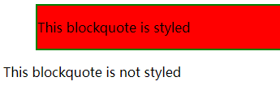

# CSS构建

# 1.层叠与继承

- **冲突**：多个规则应用于同一个元素，因此一些规则不会生效
- **优先级**：浏览器根据优先级决定，当多个规则有不同选择器对应相同的元素时，需要使用哪个规则
  - 一个元素选择器不是很具体，会选择页面上该类型的所有元素，所以它的优先级就会低一些
  - 一个类选择器稍微具体点，它会选择该页面中有特定 `class` 属性值的元素，所以它的优先级就要高一点

## 1.1.继承

- 一些设置在父元素上的 css 属性是可以被子元素继承的，有些则不能

  - 一些属性是不能继承的，例如在一个元素上设置 [`width`](https://developer.mozilla.org/zh-CN/docs/Web/CSS/width) 50% ，所有的后代**不会**是父元素的宽度的 50% 

- **控制继承**：CSS 为控制继承提供了五个特殊的 通用属性值，**每个 css 属性都接收这些属性值**：

  | 属性值         | 描述                                                         |
  | -------------- | ------------------------------------------------------------ |
  | `inherit`      | 设置该属性，会使子元素属性和父元素相同                       |
  | `initial`      | 设置，元素属性值和浏览器默认样式相同<br />浏览器默认样式中未设置且该属性是自然继承的，那么会设置为 `inherit` |
  | `revert`       | 选定元素的属性值 **重置** 为浏览器的默认样式                 |
  | `revert-layer` | 选定元素的属性值 **重置** 为在上一个[层叠层](https://developer.mozilla.org/zh-CN/docs/Web/CSS/@layer)中建立的值 |
  | `unset`        | 将元素属性重置为自然值：<br />如果属性是自然继承那么就是 `inherit`，否则和 `initial` 一样 |

  示例：

  ```
  a {
      color: inherit;
  }
  ```

- **重设所有属性值**：CSS 的 shorthand 属性 (简写属性) `all` 可以用于同时将这些继承值中的一个应用于（几乎）所有属性 **？** 它的值可以是其中任意一个 (`inherit`, `initial`, `unset`, or `revert`)。这是一种撤销对样式所做更改的简便方法，以便回到之前已知的起点：

  ```
  <html lang="en">
  <head>
      <meta charset="UTF-8">
      <meta http-equiv="X-UA-Compatible" content="IE=edge">
      <meta name="viewport" content="width=device-width, initial-scale=1.0">
      <title>Document</title>
      <style>
          blockquote {
              background-color: red;
              border: 2px solid green;
          }
          
          .fix-this {
              all: unset;
          }
      </style>
  </head>
  <body>
      <blockquote>
          <p>This blockquote is styled</p>
      </blockquote>
  
      <blockquote class="fix-this">
          <p>This blockquote is not styled</p>
      </blockquote>
  </body>
  </html>
  ```

  

## 1.2.层叠

- 当应用两条同级别的规则到一个元素的时候，写在 **后面的** 就是实际使用的规则。理解为后面的规则覆盖前面的规则
- 不会覆盖所有规则，只会覆盖相同的属性
- **计算优先级**：不同类型的选择器有不同的分数值，把这些分数相加就得到特定选择器的权重，然后就可以进行匹配
  - **千位**： 如果声明在标签的 [`style`](https://developer.mozilla.org/zh-CN/docs/Web/HTML/Global_attributes#attr-style) 的属性（内联样式）则该位得一分。这样的声明没有选择器，所以它得分总是 1000
  - **百位**： 选择器中包含 **ID 选择器** 则该位得一分
  - **十位**： 选择器中包含 **类选择器**、**伪类选择器**、**属性选择器** 则该位得一分
  - **个位**：选择器中包含 **元素选择器**、**伪元素选择器** 则该位得一分
  -  通用选择器 (`*`)，组合符 (`+`, `>`, `~`, ` `)，和否定伪类 (`:not`) 不会影响优先级
  - 在进行计算时 **不允许进位**，例如，20 个类选择器仅仅意味着 20 个十位，而不能视为 两个百位
- **`!important` 声明**：在一条规则后面时 (`border: none ！important;`) ，即使计算优先级低这个属性也使用这个值。但 **不建议使用** 
- 相互冲突的声明将按以下顺序适用，后一种声明将覆盖前一种声明：
  1. 用户代理样式表中的 声明 (例如，浏览器的默认样式，在没有设置其他样式时使用)
  2. 用户样式表中的 常规声明 (由用户设置的自定义样式)
  3. 作者样式表中的 常规声明 (这些是 web 开发人员设置的样式)
  4. 作者样式表中的 `!important` 声明
  5. 用户样式表中的 `!important` 声明

# 2.选择器

> selector

选择器分为 `简单选择器` 和 `组合选择器` 两个大类

- **简单选择器**：由 `单个` 选择器组成的
  - 简单选择器常用的有：`元素选择器`、`类选择器`、`id 选择器`、`通配符选择器`
- **组合选择器**：由各种简单选择符的组合而成。在 CSS3 中包含了四种组合方式:
  - **后代选择器** (Descendant combinator)：以空格 ` ` 分隔；后代包括子代、孙代 ...等 (包含子代)
  - **子元素选择器** (Child combinator)：以大于 `>` 号分隔；只选择一级子元素
  - **相邻兄弟选择器** (Adjacent sibling combinator)：以加号 `+` 分隔；选择紧接在另一元素后的元素，且具有相同的父代
  - **通用兄弟选择器** (General sibling combinator)：以波浪号 `~` 分隔；选择在另一元素后的所有相应元素，且具有相同的父代 (包含后继)
  - **多元素选择**：选择多种类型的元素并为它们添加一组相同的样式，不同的选择器用 **逗号** 分开：

CSS 选择器一览：https://www.runoob.com/cssref/css-selectors.html

| 选择器         | 示例                |
| :------------- | :------------------ |
| ID 选择器      | `#unique { }`       |
| 类选择器       | `.box { }`          |
| 元素选择器     | `h1 { }`            |
| 通配选择器     | `* { }`             |
| 标签属性选择器 | `a[title] { }`      |
| 伪类选择器     | `p:first-child { }` |
| 伪元素选择器   | `p::first-line { }` |
| 后代选择器     | `article p`         |
| 子代选择器     | `article > p`       |
| 相邻兄弟选择器 | `h1 + p`            |
| 通用兄弟选择器 | `h1 ~ p`            |


## 2.1.ID 选择器 `#id_name`

> ID selector

| 选择器 | 示例             | 示例说明                                      |
| ------ | ---------------- | --------------------------------------------- |
| `#id`  | `#firstname { }` | 选择所有 id="firstname" 的标签 (**id**选择器) |

- 所有标签均可添加 `id` 属性，且只能添加一个
- 在一个页面中，`id` 属性值唯一，不能有相同的 `id` 属性值
- 一个 `id` 选择器只能选择一个标签

```
#para1 {
    text-align:center;
    color:red;
}
```


## 2.2. 类选择器 `.class` 

> Class selector

| 选择器   | 示例         | 示例说明                                     |
| -------- | ------------ | -------------------------------------------- |
| `.class` | `.intro { }` | 选择所有 class="intro" 的标签 (**类**选择器) |

- 注意：类选择器中，类名前面有英文句号 `.` 
- 使用类选择器，需要在标签中添加 `class="类名"` 确定类名，所有标签均可以添加 `class` 属性
- **类名**：由英文字母、数字、下划线组成，不能用数字和下滑线开头
- 一个标签可以有 **多个类名** ，不同的类名使用空格 ` ` 隔开
- **不同标签** 可以使用同一个类名，类选择器会同时选中所有满足条件的标签

示例：

```
<head>
    <meta charset="UTF-8">
    <meta http-equiv="X-UA-Compatible" content="IE=edge">
    <meta name="viewport" content="width=device-width, initial-scale=1.0">
    <title>Document</title>
    <style>
        .one {
            color: red;
        }
    </style>
</head>
<body>
    <p class="one two">文本</p>
</body>
```


## 2.3.元素选择器

> Type selector

标签选择器，指用 HTML 标签名称作为选择器，按标签名称分类，为页面中某一类标签指定统一的 CSS 样式

| 选择器            | 示例         | 示例说明                                 |
| ----------------- | ------------ | ---------------------------------------- |
| `element`         | `p { }`      | 选择 所有 `<p>`标签 (**元素**选择器)     |
| `element,element` | `div, p { }` | 选择 所有 `<div>` 标签 **和** `<p>` 标签 |

```
p {
	color: red;
}
```


## 2.4.通配符选择器 `*`

> Universal selector

| 选择器 | 示例    | 示例说明                             |
| ------ | ------- | ------------------------------------ |
| `*`    | `* { }` | 选择 **所有标签** (**通配符**选择器) |


## 2.5.属性选择器 `[]`

> Attribute selector

**属性选择器**：通过已经存在的属性名或属性值匹配元素

| 选择器                  | 示例说明                                                     | 示例            |
| ----------------------- | ------------------------------------------------------------ | --------------- |
| `[attribute]`           | 选择所有 **带有 `attribute` 属性** 的元素             | [target]        |
| `[attribute=value]`     | 选择所有 **带用 `attribute=value`** 的元素 | [target=-blank] |
| `[attribute~=value]`    | 选择所有 **带有 `attribute` 属性**，属性值是一个以空格作为分隔的**值列表**，其中至少 **有一个值为 `value`** 的元素<br />注意与 `[attribute*=value]` 的区别 | [title~=flower] |
| `[attribute|=language]` | 选择所有 **带有 `attribute` 属性，属性值等于 `value` 或者以 `value-` 为开头** 的元素 | [lang\|=en]     |
| `[attribute^=value]`   | 选择所有 **带有 `attribute` 属性，属性值以 `value` 为开头** 的元素 | a[src^="https"]       |
| `[attribute$=value]`   | 选择所有 **带有 `attribute` 属性，属性值以 `value` 为结尾** 的元素 | a[src$=".pdf"]        |
| `[attribute*=value]`   | 选择所有 **带有 `attribute` 属性，属性值至少包含一个 `value` 字符串** 的元素 | a[src*="runoob"]      |

- `[attribute~=value]` 有一个值为 `value`：`value` 必需为独立单词，如 `title="hello world"` 可以使用 `[title~="world"]`，但**不能使用** `[title~="worl"]` 
- `[attribute|=language]` ：属性值以 `value-` 为开头，必需带有连字符 `-` ，如 `[lang|=zh]` 选择器 可以匹配`lang=zh` `lang=zh-CN` `lang=zh-TW` 属性，但不能匹配 `lang=zhhhh` (无连字符)
- `[attribute^=value]`：属性值以 `value` 为开头，如 `[lang^=zh]` 选择器 可以匹配 `lang=zh` `lang=zh-CN` `lang=zh-TW` 属性，也可以匹配 `lang=zhhhh` 
- `[attribute$=value]`：属性值以 `value` 为结尾，如`[src$=".pdf"]` 可以匹配 `src=abc.pdf` 
- `[attribute*=value]` ：属性值至少包含一个 `value` 字符串，如 `[title*="flower"]` 可以匹配 `title="flower"`，也可以匹配 `title="abcflowerdef"` 
- 属性选择器的右方括号前添加一个用空格隔开的字母 `i`（或 `I`），可以在匹配属性值时忽略大小写（支持 ASCII 字符范围之内的字母），如 `[title*="hello" i]`
- 

## 2.6.伪类选择器 `:`

> pseudo-class

- **伪类**：是添加到选择器的 **关键字**，指定要选择的元素的特殊状态
- 可以在一个选择器中 同时一起写 **多个伪类**
- **伪类** 选择元素基于的是当前元素处于的状态，或者说元素当前所具有的特性，而不是元素的id、class、属性等静态的标志。由于状态是动态变化的，所以一个元素达到一个特定状态时，它可能得到一个伪类的样式；当状态改变时，它又会失去这个样式。

chrome消除 div 滚动条的宽度，通过箭头键直接控制滚动：

### 2.6.1.后代伪类

**子代伪类**：

| 选择器                                                       | 示例                | 示例说明                                             |
| ------------------------------------------------------------ | ------------------- | ---------------------------------------------------- |
| `:first-child`                                               | p:first-child       | 选择每个 `<p>` 标签是 **其父级的 第一个 子标签**     |
| `:nth-child(n)`                                              | p:nth-child(2)      | 选择每个 `<p>` 标签是 **其父级的第二个 子标签**      |
| `:last-child`                                                | p:last-child        | 选择每个 `<p>` 标签是 **其父级的 倒数第一个 子标签** |
| `:nth-last-child(n)`                                         | p:nth-last-child(2) | 选择每个 `<p>` 标签是 **其父级的 倒数第二个 子标签** |
| `:only-child`                                                | p:only-child        | 选择每个 `<p>` 标签是 **其父级的 唯一一个 子标签**   |
| [`:empty`](https://developer.mozilla.org/zh-CN/docs/Web/CSS/:empty) |                     | 选择每个 **没有任何子级** 的标签（包括文本节点）     |


**后代伪类**：

| 选择器                 | 示例                  | 示例说明                                             |
| ---------------------- | --------------------- | ---------------------------------------------------- |
| `:first-of-type`       | p:first-of-type       | 选择每个 `<p>` 标签是 **其父级的 第一个`<p>` 标签**  |
| `:nth-of-type(n)`      | p:nth-of-type(2)      | 选择每个 `<p>` 标签是 **其父级的 第二个 `<p>` 标签** |
| `:last-of-type`        | p:last-of-type        | 选择每个 `<p>` 标签是 **其父级的 倒数第一个  标签**  |
| `:nth-last-of-type(n)` | p:nth-last-of-type(2) | 选择每个 `<p>` 标签是 **其父级的 倒数第二个 标签**   |
| `:only-of-type`        | p:only-of-type        | 选择每个 `<p>` 标签是 **其父级的 唯一一个 标签**     |


### 2.6.2.anchor 伪类：

| 选择器     | 说明                                    | 示例            |
| ---------- | --------------------------------------- | --------------- |
| `:link`    | 选择 用户 **未访问的** 链接             | `a:link { }`    |
| `:visited` | 选择 用户 **访问过的** 链接             | `a:visited { }` |
| `:hover`   | 选择 用户 **光标悬停，没有激活** 的元素 | `a:hover { }`   |
| `:active`  | 选择 被用户 **激活 (点击)时** 的元素    | `a:active { }`  |

- 为保证样式生效，链接伪类按以下 **先后顺序** 书写：`:link` — `:visited` — `:hover` — `:active`

- `:visited`：出于隐私原因，浏览器严格限制此伪类应用的样式，以及使用它们的方式：

  - 允许使用的 **CSS 属性** 为[`color`](https://developer.mozilla.org/zh-CN/docs/Web/CSS/color), [`background-color`](https://developer.mozilla.org/zh-CN/docs/Web/CSS/background-color), [`border-color`](https://developer.mozilla.org/zh-CN/docs/Web/CSS/border-color), [`border-bottom-color`](https://developer.mozilla.org/zh-CN/docs/Web/CSS/border-bottom-color), [`border-left-color`](https://developer.mozilla.org/zh-CN/docs/Web/CSS/border-left-color), [`border-right-color`](https://developer.mozilla.org/zh-CN/docs/Web/CSS/border-right-color), [`border-top-color`](https://developer.mozilla.org/zh-CN/docs/Web/CSS/border-top-color), [`column-rule-color`](https://developer.mozilla.org/zh-CN/docs/Web/CSS/column-rule-color), 和[`outline-color`](https://developer.mozilla.org/zh-CN/docs/Web/CSS/outline-color)。
  - 允许使用的 **SVG 属性** 为 `fill` 和 `stroke`。
  - 允许使用的样式的 **αlpha 分量 (透明度)** 将被 **忽略**。 设置在`:visited`中的样式将使用元素的非`:visited` 访问状态的 αlpha 分量， 如果该分量为 0，这个样式将被完全忽略 ？
  - 虽然这些样式可以改变用户最终的颜色外观，但 [`window.getComputedStyle`](https://developer.mozilla.org/zh-CN/docs/Web/API/Window/getComputedStyle) 方法将存在，并且始终返回非访问颜色的值 ？
  
  ```
  <head>
      <meta charset="UTF-8">
      <title>Document</title>
      <style>
          a {
              /* 指定某些属性的默认值，允许他们使用：visited 状态进行样式设置 */
              background-color: white;
              border: 1px solid white; 
          }
  
          a:visited {
              background-color: yellow;
              border-color: hotpink;
              color: hotpink;
          }
      </style>
  </head>
  <body>
      <a href="#test-visited-link">你是否访问过此链接？</a>
      <a href="">你已经访问过此链接。</a>
  </body>
  ```
  
- `:hover` 伪类：

  - `:hover` 伪类：可以在任何 **伪元素** 上使用
  - 在触摸屏上 `:hover` 有问题，基本不可用。所以不要让任何内容只能通过悬停才能展示出来
  - 不同的浏览器上`:hover` 伪类表现不同：可能从不会触发；可能在触摸某元素后触发了一小会儿；可能总是触发，即使用户不在触摸了，直到用户触摸别的元素
  - `:focus` 伪类选择器常伴随在 `:hover` 伪类选择器左右

- `:active` 伪类：一般被用在 `<a>` 和 `<button>` 元素中，还有一些 **包含激活元素** 的元素，以及可以通过他们关联的 `<label>` 标签被激活的表格元素

### 2.6.3.其它伪类

| 选择器                                                       | 说明                                                         |
| ------------------------------------------------------------ | ------------------------------------------------------------ |
| [`:focus`](https://developer.mozilla.org/zh-CN/docs/Web/CSS/:focus) | 选择 **获得焦点** 的元素                                     |
| [`:focus-within`](https://developer.mozilla.org/zh-CN/docs/Web/CSS/:focus-within) | 元素 **自身** 或者它的某个 **后代** 获得焦点 时，该元素加载样式 |
| [`:checked`](https://developer.mozilla.org/zh-CN/docs/Web/CSS/:checked) | 匹配任意 **被勾选/选中** 项，然后加载样式                    |
| [`:enabled`](https://developer.mozilla.org/zh-CN/docs/Web/CSS/:enabled) | 选择 每一个 **已启用的** 输入标签                            |
| [`:disabled`](https://developer.mozilla.org/zh-CN/docs/Web/CSS/:disabled) | 选择 每一个 **禁用的** 输入标签                              |
| [`:not(selector)`](https://developer.mozilla.org/zh-CN/docs/Web/CSS/:not) | 选择 不符合选择器 `selector` 的元素 (防止特定的元素被选中)   |
| [`:required`](https://developer.mozilla.org/zh-CN/docs/Web/CSS/:required) | 任意 **设置了 `required` 属性** 的 `<input>`，`<select>`， `<textarea>` 元素 |
| [`:optional`](https://developer.mozilla.org/zh-CN/docs/Web/CSS/:optional) | 任意 **没有 `required` 属性** 的 `<input>`，`<select>`， `<textarea>` 元素 |
| [`:in-range`](https://developer.mozilla.org/zh-CN/docs/Web/CSS/:in-range) | 一个 `<input>` 元素，其当前值处于属性`min` 和 `max` 限定的范围之内时，该元素加载样式 |
| [`:out-of-range`](https://developer.mozilla.org/zh-CN/docs/Web/CSS/:out-of-range) | 一个 `<input>` 元素，其当前值处于属性`min` 和 `max` 限定的范围之内时，该元素加载样式 |
| [`:first`](https://developer.mozilla.org/zh-CN/docs/Web/CSS/:first) | 打印文档的时候，第一页的样式                                 |
| [`:left`](https://developer.mozilla.org/zh-CN/docs/Web/CSS/:left) | 对打印文档的左侧页设置 CSS 样式<br />需要和[@规则](https://developer.mozilla.org/zh-CN/docs/Web/CSS/At-rule) [`@page`](https://developer.mozilla.org/zh-CN/docs/Web/CSS/@page) 配套使用 |
| [`:right`](https://developer.mozilla.org/zh-CN/docs/Web/CSS/:right) | 对打印文档的右侧页设置 CSS 样式<br />需要和[@规则](https://developer.mozilla.org/zh-CN/docs/Web/CSS/At-rule) [`@page`](https://developer.mozilla.org/zh-CN/docs/Web/CSS/@page) 配套使用 |
|                                                              |                                                              |
| [`:root`](https://developer.mozilla.org/zh-CN/docs/Web/CSS/:root) | 选择文档的 **根标签**<br />对于 HTML，`:root` 表示 `<html>` 元素，除了优先级更高之外，与 **`html` 选择器** 相同 |
| [`:target`](https://developer.mozilla.org/zh-CN/docs/Web/CSS/:target) | `<a href="#id_name">...</a>` 标签时，带有 `id="id_name"` 属性的标签加载 CSS 样式<br />`#` 锚名称是在一个文件中链接到某个元素的URL |
| [`:valid`](https://developer.mozilla.org/zh-CN/docs/Web/CSS/:valid) | 内容 [验证](https://developer.mozilla.org/en-US/HTML/HTML5/Constraint_validation) 正确的 `<input>` 或其它 `<form>` 元素 |
| [`:invalid`](https://developer.mozilla.org/zh-CN/docs/Web/CSS/:invalid) | 内容 未通过验证 的 `<input>` 或其它 `<form>` 元素            |
| [`:read-only`](https://developer.mozilla.org/zh-CN/docs/Web/CSS/:read-only) | **不可被用户编辑** 的标签                                    |
| [`:read-write`](https://developer.mozilla.org/zh-CN/docs/Web/CSS/:read-write) | **可以被用户编辑** 的标签                                    |
| [`:lang()`](https://developer.mozilla.org/zh-CN/docs/Web/CSS/:lang) | 所有 `lang` 属性为 `it` 的元素                               |
|                                                              |                                                              |
| [`:default`](https://developer.mozilla.org/zh-CN/docs/Web/CSS/:default) | 一组相关元素中的 默认表单元素                                |
| [`:defined`](https://developer.mozilla.org/zh-CN/docs/Web/CSS/:defined) | 选择 任何 已定义 的元素                                      |
| [`:indeterminate`](https://developer.mozilla.org/zh-CN/docs/Web/CSS/:indeterminate) | 选择 **状态不确定** 的表单元素                               |
| [`:host`](https://developer.mozilla.org/zh-CN/docs/Web/CSS/:host) |                                                              |
| [`:host()`](https://developer.mozilla.org/zh-CN/docs/Web/CSS/:host_function) |                                                              |
| [`:scope`](https://developer.mozilla.org/zh-CN/docs/Web/CSS/:scope) |                                                              |

- `:checked`：适用于：单选 `<input type="radio">`，多选 `<input type="checkbox">`，下拉选项 `<select>` 元素中的 `<option>` 元素

  

- `:default`：可以在 `<button>`，`<input type="checkbox">`，`<input type="radio">` 以及 `<option>` 上使用

- `:not(selector)`：否定伪类，匹配不符合内部选择器描述的元素

```
p:not(:last-child) {
            color: brown;
        }
```

- `:left` `:right`：这里的“左” 或 “右” 不是固定的，取决与文档的写作方向。如果第一页主要文字方向是从左到右的，那么`:right` 表示右页，反之它就是 `:left` 左页。


## 2.7.伪元素选择器 `::`

> pseudo-elements

- CSS3 伪元素开头为 **双冒号** `::` ，CSS2 采用单冒号
- 伪元素是一个附加至选择器末的 **关键词**，允许对被选择元素的 **特定部分** 修改样式，*相当于为选定元素创建一个伪元素*。
- 一个选择器中 **只能使用一个伪元素**。伪元素必须紧跟在语句中的简单选择器/基础选择器之后
- **伪元素** 是对元素中的特定内容进行操作，它所操作的层次比伪类更深了一层，也因此它的动态性比伪类要低得多。实际上，设计伪元素的目的就是去选取诸如元素内容第一个字（母）、第一行，选取某些内容前面或后面这种普通的选择器无法完成的工作。*它控制的内容实际上和元素是相同的，但是它本身只是基于元素的抽象，并不存在于文档中，所以叫伪元素*。

| 选择器                                                       | 说明                                                         |
| ------------------------------------------------------------ | ------------------------------------------------------------ |
| [`::before`](https://developer.mozilla.org/zh-CN/docs/Web/CSS/::before) | 选定元素的 **元素内容的 前面** 插入内容<br />配合 `content` 属性使用 |
| [`::after`](https://developer.mozilla.org/zh-CN/docs/Web/CSS/::after) | 选定元素的 **元素内容的 后面** 插入内容<br />配合 `content` 属性使用 |
| [`::first-letter`](https://developer.mozilla.org/zh-CN/docs/Web/CSS/::first-letter) | 选定块级元素的 元素内容的 **第一个字母**<br />(且该文字所处的行之前没有其他内容) |
| [`::first-line`](https://developer.mozilla.org/zh-CN/docs/Web/CSS/::first-line) | 选定块级元素的 元素内容的 **第一行**<br />                   |
| [`::selection`](https://developer.mozilla.org/zh-CN/docs/Web/CSS/::selection) | 匹配标签中 **被用户选中 (高亮)** 的部分                      |
| `::grammar-error`                                            | 匹配文档中包含了浏览器标记的语法错误的那部分。               |
| `::spelling-error`                                           | 匹配文档中包含了浏览器标记的拼写错误的那部分。               |

- `::before` `::after`：创建一个伪元素，该元素会成为选定元素的第一/最后一个子元素，伪元素的内容也会显示

  - 使用 `content` 属性来指定要 **插入的内容**
  - 默认是行内元素

  ```css
  q::before {
    content: "«";
    color: blue;
  }
  
  q::after {
    content: "»";
    color: red;
  }
  ```

- `::first-letter` `::first-line`：只在[`display`](https://developer.mozilla.org/zh-CN/docs/Web/CSS/display)属性值为 `block`, `inline-block`, `table-cell`, `list-item` 或者 `table-caption`的元素上才起作用。其他情况下，`::first-letter` 毫无意义。

  - `::first-letter` 可运用的 CSS 属性：
    - 所有的字体属性 : [`font`](https://developer.mozilla.org/zh-CN/docs/Web/CSS/font), [`font-style`](https://developer.mozilla.org/zh-CN/docs/Web/CSS/font-style), [`font-feature-settings`](https://developer.mozilla.org/zh-CN/docs/Web/CSS/font-feature-settings), [`font-kerning`](https://developer.mozilla.org/zh-CN/docs/Web/CSS/font-kerning), [`font-language-override`](https://developer.mozilla.org/zh-CN/docs/Web/CSS/font-language-override), [`font-stretch`](https://developer.mozilla.org/zh-CN/docs/Web/CSS/font-stretch), [`font-synthesis`](https://developer.mozilla.org/zh-CN/docs/Web/CSS/font-synthesis), [`font-variant`](https://developer.mozilla.org/zh-CN/docs/Web/CSS/font-variant), [`font-variant-alternates`](https://developer.mozilla.org/zh-CN/docs/Web/CSS/font-variant-alternates), [`font-variant-caps`](https://developer.mozilla.org/zh-CN/docs/Web/CSS/font-variant-caps), [`font-variant-east-asian` (en-US)](https://developer.mozilla.org/en-US/docs/Web/CSS/font-variant-east-asian), [`font-variant-ligatures`](https://developer.mozilla.org/zh-CN/docs/Web/CSS/font-variant-ligatures), [`font-variant-numeric`](https://developer.mozilla.org/zh-CN/docs/Web/CSS/font-variant-numeric), [`font-variant-position`](https://developer.mozilla.org/zh-CN/docs/Web/CSS/font-variant-position), [`font-weight`](https://developer.mozilla.org/zh-CN/docs/Web/CSS/font-weight), [`font-size`](https://developer.mozilla.org/zh-CN/docs/Web/CSS/font-size), [`font-size-adjust`](https://developer.mozilla.org/zh-CN/docs/Web/CSS/font-size-adjust), [`line-height`](https://developer.mozilla.org/zh-CN/docs/Web/CSS/line-height) 以及 [`font-family`](https://developer.mozilla.org/zh-CN/docs/Web/CSS/font-family).
    - 所有的背景属性 : [`background-color`](https://developer.mozilla.org/zh-CN/docs/Web/CSS/background-color), [`background-image`](https://developer.mozilla.org/zh-CN/docs/Web/CSS/background-image), [`background-clip`](https://developer.mozilla.org/zh-CN/docs/Web/CSS/background-clip), [`background-origin`](https://developer.mozilla.org/zh-CN/docs/Web/CSS/background-origin), [`background-position`](https://developer.mozilla.org/zh-CN/docs/Web/CSS/background-position), [`background-repeat`](https://developer.mozilla.org/zh-CN/docs/Web/CSS/background-repeat), [`background-size`](https://developer.mozilla.org/zh-CN/docs/Web/CSS/background-size), [`background-attachment`](https://developer.mozilla.org/zh-CN/docs/Web/CSS/background-attachment)以及 [`background-blend-mode`](https://developer.mozilla.org/zh-CN/docs/Web/CSS/background-blend-mode).
    - 所有的外边距属性: [`margin`](https://developer.mozilla.org/zh-CN/docs/Web/CSS/margin), [`margin-top`](https://developer.mozilla.org/zh-CN/docs/Web/CSS/margin-top), [`margin-right`](https://developer.mozilla.org/zh-CN/docs/Web/CSS/margin-right), [`margin-bottom`](https://developer.mozilla.org/zh-CN/docs/Web/CSS/margin-bottom), [`margin-left`](https://developer.mozilla.org/zh-CN/docs/Web/CSS/margin-left).
    - 所有的内边距属性: [`padding`](https://developer.mozilla.org/zh-CN/docs/Web/CSS/padding), [`padding-top`](https://developer.mozilla.org/zh-CN/docs/Web/CSS/padding-top), [`padding-right`](https://developer.mozilla.org/zh-CN/docs/Web/CSS/padding-right), [`padding-bottom`](https://developer.mozilla.org/zh-CN/docs/Web/CSS/padding-bottom), [`padding-left`](https://developer.mozilla.org/zh-CN/docs/Web/CSS/padding-left).
    - 所有的边框属性：比如一些简短的边框属性 [`border`](https://developer.mozilla.org/zh-CN/docs/Web/CSS/border), [`border-style`](https://developer.mozilla.org/zh-CN/docs/Web/CSS/border-style), [`border-color`](https://developer.mozilla.org/zh-CN/docs/Web/CSS/border-color), [`border-width`](https://developer.mozilla.org/zh-CN/docs/Web/CSS/border-width), [`border-radius`](https://developer.mozilla.org/zh-CN/docs/Web/CSS/border-radius), [`border-image`](https://developer.mozilla.org/zh-CN/docs/Web/CSS/border-image), 还剩下许多冗长的边框属性等等。
    - [`color`](https://developer.mozilla.org/zh-CN/docs/Web/CSS/color) 属性。
    - [`text-decoration`](https://developer.mozilla.org/zh-CN/docs/Web/CSS/text-decoration), [`text-shadow`](https://developer.mozilla.org/zh-CN/docs/Web/CSS/text-shadow), [`text-transform`](https://developer.mozilla.org/zh-CN/docs/Web/CSS/text-transform), [`letter-spacing`](https://developer.mozilla.org/zh-CN/docs/Web/CSS/letter-spacing), [`word-spacing`](https://developer.mozilla.org/zh-CN/docs/Web/CSS/word-spacing) (使用恰当的话), [`line-height`](https://developer.mozilla.org/zh-CN/docs/Web/CSS/line-height), [`text-decoration-color`](https://developer.mozilla.org/zh-CN/docs/Web/CSS/text-decoration-color), [`text-decoration-line`](https://developer.mozilla.org/zh-CN/docs/Web/CSS/text-decoration-line), [`text-decoration-style`](https://developer.mozilla.org/zh-CN/docs/Web/CSS/text-decoration-style), [`box-shadow`](https://developer.mozilla.org/zh-CN/docs/Web/CSS/box-shadow), [`float`](https://developer.mozilla.org/zh-CN/docs/Web/CSS/float), [`vertical-align`](https://developer.mozilla.org/zh-CN/docs/Web/CSS/vertical-align) `注意此刻必须没有浮动`) 等属性。
  - `::first-line` 可运用的 CSS 属性：
    - 所有和字体有关的属性：[`font`](https://developer.mozilla.org/zh-CN/docs/Web/CSS/font), [`font-kerning`](https://developer.mozilla.org/zh-CN/docs/Web/CSS/font-kerning), [`font-style`](https://developer.mozilla.org/zh-CN/docs/Web/CSS/font-style), [`font-variant`](https://developer.mozilla.org/zh-CN/docs/Web/CSS/font-variant), [`font-variant-numeric`](https://developer.mozilla.org/zh-CN/docs/Web/CSS/font-variant-numeric), [`font-variant-position`](https://developer.mozilla.org/zh-CN/docs/Web/CSS/font-variant-position), [`font-variant-east-asian` (en-US)](https://developer.mozilla.org/en-US/docs/Web/CSS/font-variant-east-asian), [`font-variant-caps`](https://developer.mozilla.org/zh-CN/docs/Web/CSS/font-variant-caps), [`font-variant-alternates`](https://developer.mozilla.org/zh-CN/docs/Web/CSS/font-variant-alternates), [`font-variant-ligatures`](https://developer.mozilla.org/zh-CN/docs/Web/CSS/font-variant-ligatures), [`font-synthesis`](https://developer.mozilla.org/zh-CN/docs/Web/CSS/font-synthesis), [`font-feature-settings`](https://developer.mozilla.org/zh-CN/docs/Web/CSS/font-feature-settings), [`font-language-override`](https://developer.mozilla.org/zh-CN/docs/Web/CSS/font-language-override), [`font-weight`](https://developer.mozilla.org/zh-CN/docs/Web/CSS/font-weight), [`font-size`](https://developer.mozilla.org/zh-CN/docs/Web/CSS/font-size), [`font-size-adjust`](https://developer.mozilla.org/zh-CN/docs/Web/CSS/font-size-adjust), [`font-stretch`](https://developer.mozilla.org/zh-CN/docs/Web/CSS/font-stretch), and [`font-family`](https://developer.mozilla.org/zh-CN/docs/Web/CSS/font-family)
    -  [`color`](https://developer.mozilla.org/zh-CN/docs/Web/CSS/color)
    - 所有和背景有关的属性： [`background-color`](https://developer.mozilla.org/zh-CN/docs/Web/CSS/background-color), [`background-clip`](https://developer.mozilla.org/zh-CN/docs/Web/CSS/background-clip), [`background-image`](https://developer.mozilla.org/zh-CN/docs/Web/CSS/background-image), [`background-origin`](https://developer.mozilla.org/zh-CN/docs/Web/CSS/background-origin), [`background-position`](https://developer.mozilla.org/zh-CN/docs/Web/CSS/background-position), [`background-repeat`](https://developer.mozilla.org/zh-CN/docs/Web/CSS/background-repeat), [`background-size`](https://developer.mozilla.org/zh-CN/docs/Web/CSS/background-size), [`background-attachment`](https://developer.mozilla.org/zh-CN/docs/Web/CSS/background-attachment), and [`background-blend-mode`](https://developer.mozilla.org/zh-CN/docs/Web/CSS/background-blend-mode)
    -  [`word-spacing`](https://developer.mozilla.org/zh-CN/docs/Web/CSS/word-spacing), [`letter-spacing`](https://developer.mozilla.org/zh-CN/docs/Web/CSS/letter-spacing), [`text-decoration`](https://developer.mozilla.org/zh-CN/docs/Web/CSS/text-decoration), [`text-transform`](https://developer.mozilla.org/zh-CN/docs/Web/CSS/text-transform), and [`line-height`](https://developer.mozilla.org/zh-CN/docs/Web/CSS/line-height)
    -  [`text-shadow`](https://developer.mozilla.org/zh-CN/docs/Web/CSS/text-shadow), [`text-decoration`](https://developer.mozilla.org/zh-CN/docs/Web/CSS/text-decoration), [`text-decoration-color`](https://developer.mozilla.org/zh-CN/docs/Web/CSS/text-decoration-color), [`text-decoration-line`](https://developer.mozilla.org/zh-CN/docs/Web/CSS/text-decoration-line), [`text-decoration-style`](https://developer.mozilla.org/zh-CN/docs/Web/CSS/text-decoration-style), and [`vertical-align`](https://developer.mozilla.org/zh-CN/docs/Web/CSS/vertical-align).

- `::selection`：只有一小部分 CSS 属性可以用于`::selection` 选择器：
  - [`color`](https://developer.mozilla.org/zh-CN/docs/Web/CSS/color)
  - [`background-color`](https://developer.mozilla.org/zh-CN/docs/Web/CSS/background-color)
  - [`cursor`](https://developer.mozilla.org/zh-CN/docs/Web/CSS/cursor)
  - [`caret-color`](https://developer.mozilla.org/zh-CN/docs/Web/CSS/caret-color)
  - [`outline`](https://developer.mozilla.org/zh-CN/docs/Web/CSS/outline) and its longhands
  - [`text-decoration`](https://developer.mozilla.org/zh-CN/docs/Web/CSS/text-decoration) and its associated properties
  - [`text-emphasis-color` (en-US)](https://developer.mozilla.org/en-US/docs/Web/CSS/text-emphasis-color)
  - [`text-shadow`](https://developer.mozilla.org/zh-CN/docs/Web/CSS/text-shadow)

## 2.8.后代选择器 ` `

> Descendant combinator

| 选择器            | 说明                                                         | 示例        |
| ----------------- | ------------------------------------------------------------ | ----------- |
| `element element` | 选择 `<element1>` 标签**内** 的所有 `<element2>` 标签 (**后代**选择器) | `div p { }` |


## 2.9.子代选择器 `>`

> Child combinator

| 选择器              | 说明                                                         | 示例        |
| ------------------- | ------------------------------------------------------------ | ----------- |
| `element1>element2` | 选择所有 **父级是** `<element1>` 标签的 **`<element2>` 标签** (**子代**选择器) | `div>p { }` |


## 2.10.相邻兄弟选择器 `+`

> Adjacent sibling combinator

| 选择器              | 说明                                                         | 示例        |
| ------------------- | ------------------------------------------------------------ | ----------- |
| `element1+element2` | 选择所有 **紧跟在** `<element1>` 标签之后的**第一个 `<element2>` 标签** (**相邻兄弟**选择器) | `div+p { }` |


## 2.11.通用兄弟选择器 `~`

> General sibling combinator

| 选择器              | 说明                                                         | 示例       |
| ------------------- | ------------------------------------------------------------ | ---------- |
| `element1~element2` | 选择 `<element1>` 标签 **之后的每一个** `<element2>`标签 (**通用兄弟**选择器) | `p~ul { }` |


# 盒模型


# 背景与边框


# 不同方向的文本


# 溢出的内容


# CSS 的值和单位


# 在CSS中调整大小


# 图像、媒体和表单元素


# 格式化表格


# 字体属性


# 属性

属性：https://www.runoob.com/cssref/css-reference.html

https://developer.mozilla.org/zh-CN/docs/Web/CSS/CSS_Backgrounds_and_Borders

简写属性：https://developer.mozilla.org/zh-CN/docs/Web/CSS/Shorthand_properties