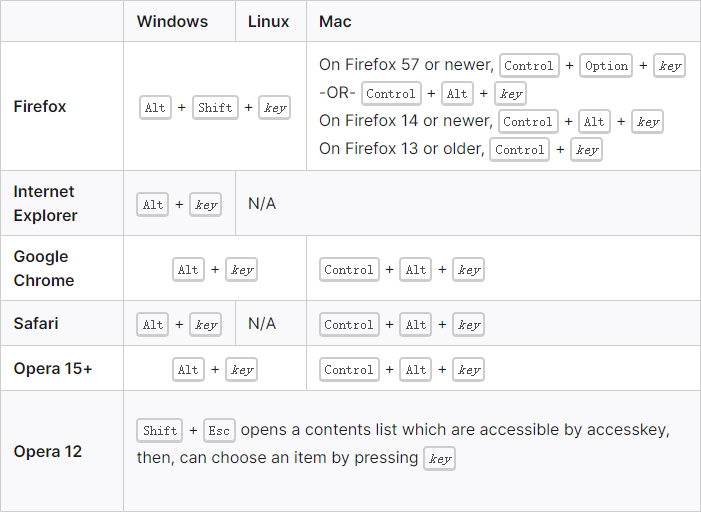

https://developer.mozilla.org/zh-CN/docs/Web/HTML/Global_attributes

https://www.runoob.com/tags/ref-standardattributes.html

- **全局属性**：是所有 HTML 元素共有的属性; 它们可以用于所有元素，即使属性可能对某些元素不起作用；


| 属性                                  | 描述                                                         |
| :------------------------------------ | :----------------------------------------------------------- |
| [`lang`](#lang)                       | 设置 元素中内容的 **语言代码**                               |
| [`id`](#id)                           | 规定 元素的 **唯一 id**                                      |
| [`class`](#class)                     | 规定 元素的 **类名** (*classname*)                           |
| [`dir`](#dir)                         | 设置 元素中内容的 **文本方向**                               |
| [`title`](#title)                     | 规定 元素的 **额外信息**（可在工具提示中显示）               |
| [`style`](#style)                     | 规定 元素的 **行内样式** (inline style)                      |
| [`tabindex`](#tabindex)               | 设置 元素的 **Tab 键控制次序**                               |
| [`accesskey`](#accesskey)             | 设置 访问元素的 **键盘快捷键**                               |
|                                       |                                                              |
| [`contenteditable`](#contenteditable) | 规定 元素内容 是否可 **编辑**                                |
| [`draggable`](#draggable)             | 指定 元素 是否可 **拖动**                                    |
| [`contextmenu`](#contextmenu)         | 指定一个元素的 **上下文菜单**；<br />当用户 **右击** 该元素，出现上下文菜单 |
| [`data-*`](#data-*)                   | 用于存储页面的 **自定义数据**                                |
| [`dropzone`](#dropzone)               | 指定是否将数据复制，移动，或链接，或删除                     |
| [`hidden`](#hidden)                   | hidden 属性规定对元素进行 **隐藏**                           |
| [`spellcheck`](#spellcheck)           | 检测元素 是否 **拼写错误**                                   |
| [`translate`](#translate)             | 指定是否一个元素的值在页面载入时是否需要 **翻译**            |


# `lang`

- `lang` 属性：参与了 **元素语言** 的定义；这个语言是不可编辑元素写入的语言，或者可编辑元素应该写入的语言；
- 属性值：见 [语言代码](./1.HTML基础)；

- CSS 伪类选择器 `:lang`；


# `id`

- `id` 属性：定义一个 **全文档唯一的** **标识符** (ID)；
- 一个元素只能拥有一个 ID 值；
- **属性值**：
  - 必须以字母 A-Z 或 a-z 开头；
  - 其后的字符：字母(A-Z、a-z)、数字(0-9)、连字符("-")、下划线("_")、点号(".")；
  - 对大小写敏感；
  - 不得包含空白字符 (包括空格和制表符等)；

- CSS id选择器 `#id_name`；


# `class`

- `class` 属性：定义元素的 **类名**；
- 一个元素可以拥有多个类名，不同类名用空格 ` ` 隔开
- **属性值**：命名规则，同 [`id`](#id) 属性；
- CSS 类选择器 `.classname`；


# `dir`

- `dir` 属性：枚举属性，规定元素内容的 **文本方向**；

- 属性值：

  | 属性值 (`dir`) | 描述                                                        |
  | :------------- | :---------------------------------------------------------- |
  | `ltr`          | (**默认**) 从左向右的文本方向                               |
  | `rtl`          | 从右向左的文本方向                                          |
  | `auto`         | 让浏览器根据内容来判断文本方向 (仅在文本方向未知时推荐使用) |


# `title`

- `title` 属性：规定关于元素的 **提示信息**；这些信息通常会在鼠标移到元素上时显示；
- 省略该属性：意味着这个元素的最近祖先的标题仍然是相关的；并且可以用作元素的提示信息；
- 属性值为空字符串：它与最近祖先的标题是不相关的，并且不应用于这个元素的提示信息；
- **属性值**：*text*；


# `style`

- `style` 属性：规定元素的 **行内样式** (inline style)；
- `style` 属性 将覆盖任何全局的样式设定；
- **属性值**：按 CSS 属性数学方式，如 `style="border:1px solid black;"`；


# `tabindex`

https://developer.mozilla.org/zh-CN/docs/Web/HTML/Global_attributes/tabindex

- `tabindex` 属性：指示其元素 **是否可以聚焦**，以及它是否/在何处 参与 **顺序键盘导航**；通常使用 "tab" 键进行导航，聚焦到下一个值的元素；
- **属性值**：*number*； `1` 表示第一；
  - `tabindex=负值` (通常是 tabindex=“-1”)：表示元素是可聚焦的，但是不能通过键盘导航来访问到该元素；用 JS 做页面小组件内部键盘导航的时候非常有用；
  - `tabindex="0"` ：表示元素是可聚焦的，并且可以通过键盘导航来聚焦到该元素，它的相对顺序是当前处于的 DOM 结构来决定的；
  - `tabindex=正值`，表示元素是可聚焦的，并且可以通过键盘导航来访问到该元素；它的相对顺序 **按照 `tabindex` 的数值递增而滞后获焦**;
  - 如果多个元素拥有相同的 `tabindex` 属性值，那么它们的相对顺序按照他们在当前 DOM 中的先后顺序决定；
  - 根据键盘序列导航的顺序，值为 `0` 、非法值、或者没有 **tabindex** 值的元素应该放置在 `tabindex `值为正值的元素后面；
  - `tabindex `的最大值不应超过 `32767`；如果没有指定，它的默认值为 0；


# `accesskey`

https://developer.mozilla.org/zh-CN/docs/Web/HTML/Global_attributes/accesskey

- `accesskey `属性：规定激活 (使获得焦点) 元素的 **快捷键**；

- **属性值**：必须包含一个可打印字符；

- 激活 `accesskey` 的操作取决于浏览器及其操作系统；

  

- 一般建议不要在大多数通用的网站和 web 应用程序中使用`accesskey` 属性；


# `contenteditable`

https://developer.mozilla.org/zh-CN/docs/Web/HTML/Global_attributes#attr-contenteditable)

- `contenteditable` 属性：**枚举属性** (显式指定值为 `true `或者 `false`)，规定元素是否可被用户编辑；

- **可继承**；

- 属性值：

  | 属性值 (`contenteditable`)      | 描述          |
  | :------------------------------ | :------------ |
  | `true` 、空字符串 ` `、无属性值 | 元素 可编辑   |
  | `false`                         | 元素 不可编辑 |


```css
<div contenteditable="true">
	<span contenteditable="false">姓名：</span>name<br/>
</div>
```

- `<span contenteditable="false">姓名：</span>` 内部的 `姓名：` 无法单独删除；但当 `name` 删除后，`<br/>` 可删除，`<span contenteditable="false">姓名：</span>` 作为一个整体是 `div` 的子元素，可以一起删除；


# `draggable`

https://developer.mozilla.org/zh-CN/docs/Web/HTML/Global_attributes/draggable

- `draggable` 属性：**枚举属性**，规定元素是否允许使用 [拖放操作 API (en-US)](https://developer.mozilla.org/en-US/docs/Web/API/HTML_Drag_and_Drop_API) 拖动；

- chrome、safari支持、firefox不支持；

- 已选中的文本、`<a>`、`` 元素 默认可以拖拽；

- 属性值：

  | 属性值 (`draggable`) | 描述                 |
  | :------------------- | :------------------- |
  | `true`               | 元素 可拖动          |
  | `false`              | 元素 不可拖动        |
  | `auto`               | 使用浏览器的默认特性 |

- 被拖拽元素 **拖拽生命周期** (**对应事件**)：拖拽开始 (`ondragstart`)、拖拽进行中 (`ondrag`)、拖拽结束 (`ondragend`)；

- **拖拽完成后，默认回到原处**；使用以下命令可以让被拖拽元素 **在拖拽完成后固定**：

  ```html
  <script>
      var oDragDiv = document.getElementsByClassName('a')[0];
      var beginX = 0;
      var beginY = 0;
  
      oDragDiv.ondragstart = function (e) {     // 拖拽 开始时(按下鼠标并开始移动时) 发生事件
          beginX = e.clientX;
          beginY = e.clientY;
      }
  
      oDragDiv.ondragend = function (e) {       // 拖拽 结束时(松开鼠标时) 发生事件
          var x = e.clientX - beginX;
          var y = e.clientY - beginY;
          oDragDiv.style.left = oDragDiv.offsetLeft + x + "px";
          oDragDiv.style.top = oDragDiv.offsetTop + y + "px";
      }
  </script>
  ```

- 目标区域事件：`ondragover`，`ondrop`，`ondragenter`，`ondragleave`；


# `contextmenu`

- `contextmenu` 属性：规定了元素的上下文菜单当用户右击元素时将显示上下文菜单；

- 仅火狐浏览器支持；**属性已经过时，将从所有浏览器中删除**；

- **属性值**：

  | 属性值 (`contextmenu`) | 描述                                   |
  | :--------------------- | :------------------------------------- |
  | *menu_id*              | 要打开的 `<menu>` 元素的 `id` 属性值。 |

  ```html
  <menu type="context" id="share">
      <menu label="share">
          <menuitem label="Twitter" onclick="shareViaTwitter()"></menuitem>
      	<menuitem label="Facebook" onclick="shareViaFacebook()"></menuitem>
  	</menu>
  </menu>
  ```

  


# `data-*`

- `data-*` 属性：用于存储私有页面后应用的 自定义数据；
- **属性值** 自定义命名规则：
  - 该名称不能以`xml`开头，无论这些字母是大写还是小写；
  - 该名称不能包含任何分号 (`U+003A`)；
  - 该名称不能包含 A 至 Z 的大写字母；

- 自定义属性前缀 `data-` 会被客户端忽略；


# `dropzone`

- `dropzone` 属性：**枚举属性**，规定当被拖动的数据在拖放到元素上时，是否被复制、移动或链接；
- 无浏览器支持；
- **属性值**：可以具有以下值：
  - `copy`，表示 `drop` 将创建被拖动元素的副本；
  - `move`，表示拖动的元素将移动到此新位置；
  - `link`，将创建一个指向拖动数据的链接；


# `hidden`

- `hidden` 属性：**布尔属性**，规定对元素进行 **隐藏**；
- 可以对 `hidden` 属性进行设置，使用户在满足某些条件时才能看到某个元素（比如选中复选框，等等）。然后，可使用 JavaScript 来删除 `hidden` 属性，使该元素变得可见。
  - 属性值：`true`、`flase`；


# `spellcheck`

- `spellcheck` 属性：**枚举属性**，规定是否对元素内容进行 **拼写检查**；
- 可对以下文本进行拼写检查：
  - 类型为 *text* 的 `input` 元素中的值 (非密码)；
  - `<textarea>` 元素中的值；
  - 可编辑元素中的值；
- **可继承**；
- 属性值：

| 属性值 (`spellcheck`) | 描述           |
| :-------------------- | :------------- |
| `true`                | 进行拼写检查   |
| `false`               | 不进行拼写检查 |

- 各个浏览器的默认设置和元素依赖：https://developer.mozilla.org/zh-CN/docs/Web/HTML/Global_attributes/spellcheck


# `translate`

- `translate` 属性：规定元素内容是否要 **翻译**；

- 无浏览器支持；

- **属性值**：

  | 属性值 (`translate`) | 描述   |
  | :------------------- | :----- |
  | `yes`                | 翻译   |
  | `no`                 | 不翻译 |


------

# 其它全局属性

| 属性                                                         | 描述                                                         |
| ------------------------------------------------------------ | ------------------------------------------------------------ |
| [`autocapitalize`](https://developer.mozilla.org/en-US/docs/Web/HTML/Global_attributes/autocapitalize) | 控制文本输入 是否以及如何 在用户输入/编辑文本时自动大写      |
| [`part`](https://developer.mozilla.org/zh-CN/docs/Web/HTML/Global_attributes/part) | 通过 `part` 的名称，可以使用 CSS 伪元素 `::part` 来选择阴影树中 指定元素 并设置其样式<br />包含一个以元素中 part 属性名称组成的列表，该列表以空格分隔 |
| [`slot`](https://developer.mozilla.org/zh-CN/docs/Web/HTML/Global_attributes/slot) | 将一个 [shadow DOM](https://developer.mozilla.org/en-US/docs/Web/Web_Components/Using_shadow_DOM) shadow 树中的槽分配给一个元素<br />带有 `slot` 属性的元素分配给由 [`<slot>`](https://developer.mozilla.org/zh-CN/docs/Web/HTML/Element/slot) 创建的槽，它的 [`name`](https://developer.mozilla.org/zh-CN/docs/Web/HTML/Element/slot#attr-name) 属性的值匹配 `slot` 属性的值 |
| [`exportparts`](https://developer.mozilla.org/en-US/docs/Web/HTML/Global_attributes/exportparts) | 通过导出它们的 `part` 属性名称，来选择嵌套 [阴影树](https://developer.mozilla.org/en-US/docs/Glossary/Shadow_tree) 中存在的元素并为其设置样式 |
| [`inputmode`](https://developer.mozilla.org/zh-CN/docs/Web/HTML/Global_attributes/inputmode) | 提示 用户在编辑 元素或其内容时 可能输入 的数据类型           |
| [`is`](https://developer.mozilla.org/zh-CN/docs/Web/HTML/Global_attributes/is) | 指定 标准 HTML 元素像定义的内置元素一样工作                  |
| [`nonce`](https://developer.mozilla.org/en-US/docs/Web/HTML/Global_attributes/nonce) | 定义 加密随机数（“使用一次的数字”）的内容属性                |
| [`spellcheck`](https://developer.mozilla.org/zh-CN/docs/Web/HTML/Global_attributes/spellcheck) | 定义 是否可以检查元素的拼写错误                              |
| [`autofocus`](https://developer.mozilla.org/en-US/docs/Web/HTML/Global_attributes/autofocus) | 指示一个元素应该专注于页面加载，或者它所在的元素何时显示     |
| [`enterkeyhint`](https://developer.mozilla.org/en-US/docs/Web/HTML/Global_attributes/enterkeyhint) | 定义 为虚拟键盘上的回车键呈现的操作标签（或图标）            |


除了基本的 HTML 全局属性之外，还存在以下全局属性：

- [**`xml:lang`**](https://developer.mozilla.org/zh-CN/docs/Web/HTML/Global_attributes#attr-xml:lang) 和 [**`xml:base`**](https://developer.mozilla.org/zh-CN/docs/Web/HTML/Global_attributes#attr-xml:base) ——两者都是从 XHTML 规范继承，但为了兼容性而被保留的。
- 多重 [`aria-*`](https://developer.mozilla.org/zh-CN/docs/Web/Accessibility/ARIA) 属性，用于改善无障碍；
- [事件](https://developer.mozilla.org/en-US/docs/Web/Events/Event_handlers) 属性：**`onabort`**, **`onautocomplete`**, **`onautocompleteerror`**, **`onblur`**, **`oncancel`**, **`oncanplay`**, **`oncanplaythrough`**, **`onchange`**, **`onclick`**, **`onclose`**, **`oncontextmenu`**, **`oncuechange`**, **`ondblclick`**, **`ondrag`**, **`ondragend`**, **`ondragenter`**, **`ondragexit`**, **`ondragleave`**, **`ondragover`**, **`ondragstart`**, **`ondrop`**, **`ondurationchange`**, **`onemptied`**, **`onended`**, **`onerror`**, **`onfocus`**, **`oninput`**, **`oninvalid`**, **`onkeydown`**, **`onkeypress`**, **`onkeyup`**, **`onload`**, **`onloadeddata`**, **`onloadedmetadata`**, **`onloadstart`**, **`onmousedown`**, **`onmouseenter`**, **`onmouseleave`**, **`onmousemove`**, **`onmouseout`**, **`onmouseover`**, **`onmouseup`**, **`onmousewheel`**, **`onpause`**, **`onplay`**, **`onplaying`**, **`onprogress`**, **`onratechange`**, **`onreset`**, **`onresize`**, **`onscroll`**, **`onseeked`**, **`onseeking`**, **`onselect`**, **`onshow`**, **`onsort`**, **`onstalled`**, **`onsubmit`**, **`onsuspend`**, **`ontimeupdate`**, **`ontoggle`**, **`onvolumechange`**, **`onwaiting`**；