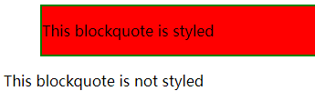

# CSS 参考

https://developer.mozilla.org/zh-CN/docs/Web/CSS/Reference


# CSS 语法

https://developer.mozilla.org/zh-CN/docs/Web/CSS/Syntax

- CSS 指层叠样式表 (**C**ascading **S**tyle **S**heets)

- 外部样式表通常存储在 `.CSS` 文件中

- 多个样式定义可 **层叠** 为一个

- **注释**：以 `/*` 开始, 以 `*/` 结束，如：`/*这是个注释*/` 

- CSS 声明 示例

  ```html
  <head>
  	<meta charset="utf-8"> 
  	<title>菜鸟教程(runoob.com)</title> 
  	<style type="text/css">
  	p {
          color: red;
          text-align: center;
      } 
  </style>
  </head>
  ```

- **选择器** (Selector)： `p` 与英文大括号 `{` 之间有空格

- **声明** (Declaration)： 用来指定添加样式元素的 **属性** 

  - `属性: 属性值;` 声明，以分号 `;` 结束 (最后一个声明可以不加分号 `;`)
  - **属性** (Properties)：改变 HTML 元素样式的途径
  - **属性值** (Properties value)：从指定属性的众多外观中选择一个值
  - 若一各属性具有多个属性值，不同的属性值之间用空格 ` ` 隔开

- **简写属性**：在一行中设置多个属性值，从而节省时间并使代码更整洁。如 [`font`](https://developer.mozilla.org/zh-CN/docs/Web/CSS/font), [`background`](https://developer.mozilla.org/zh-CN/docs/Web/CSS/background), [`padding`](https://developer.mozilla.org/zh-CN/docs/Web/CSS/padding), [`border`](https://developer.mozilla.org/zh-CN/docs/Web/CSS/border), and [`margin`](https://developer.mozilla.org/zh-CN/docs/Web/CSS/margin) ，如：

  ```
  padding: 10px 15px 15px 5px
  /* 等价于 */
  padding-top: 10px;
  padding-right: 15px;
  padding-bottom: 15px;
  padding-left: 5px;
  ```

- 同一个选择器的所有声明组成的声明集以大括号 `{}` 括起来

- 可以每行只描述一个属性，增加可读性

- **小写**：推荐样式选择器、属性名、属性值全部使用小写

- **空格**：

  - **属性值前面**，**冒号后面**，保留一个空格
  - **选择器（标签）和前花括号中间**，保留一个空格

- **分号**：每个规则集里要用分号 `;` 将各个声明分隔开


# CSS引入方式

按照 CSS 样式书写的位置（或者引入的方式），CSS 样式表可以分为三大类：

- 行内样式表（行内式）
- 内部样式表（嵌入式）
- 外部样式表（外链式）

## 行内样式表

行内样式表（内联样式表）是在元素标签内部的 `style` 属性中设定 CSS 样式，适合于修改简单样式

```
<div style="color: red; font-size: 12px;">
    文本
</div>
```

- `style` 是标签的属性
- 在双引号中间，写法要符合 CSS 规范
- 由于书写繁琐，并且没有体现出结构与样式相分离的思想，所以 **不推荐大量使用**，只有对当前元素添加简单样式的时候，可以考虑使用

## 内部样式表

内部样式表（嵌入样式表）是写到 HTML 文件 `<head>` 标签内部，是将所有的 CSS 代码抽取出来，单独放到一个 `<style>` 标签中

```
<head>
	<meta charset="utf-8"> 
	<title>菜鸟教程(runoob.com)</title> 
	<style type="text/css">
	p {
		/*这是注释*/
        color: red;
        text-align: center;
    } 
</style>
</head>
```

- `<style>` 标签理论上可以放在 HTML 文档的任何地方，但一般放到文档的 `<head>` 标签中
- 目前的浏览器已经支持 **省略** `type` **属性** 

## 外部样式表

实际开发都是外部样式表，适合于样式比较多的情况，核心是：样式单独写到 CSS 文件中，之后把 CSS 文件引入到 HTML 页面中

使用引入外部样式表分为两步：

- 新建一个后缀名为：`.css` 的样式文件，把所有的 CSS 代码都放入此文件中

- 在 HTML 页面中，使用 `<link>` 标签引入这个文件

  ```
  <link rel="stylesheet" type="text/css" href="css文件路径">
  ```

| 属性   | 作用                                                         |
| ------ | ------------------------------------------------------------ |
| `rel`  | 定义当前文档与被链接文档之间的关系，在这里**需要指定为 "stylesheet"**，表示被链接的文档是一个样式表文件 |
| `type` | 定被链接文档的 MIME 类型，该属性最常见的 MIME 类型是 "text/css"，该类型描述样式表，目前的浏览器 **已经支持省略 "type" 属性** |
| `href` | 定义所链接外部样式表文件的 URL，可以是相对路径，也可以是绝对路径 |


# 可替换元素

https://developer.mozilla.org/zh-CN/docs/Web/CSS/Replaced_element


# 选择器

https://developer.mozilla.org/en-US/docs/Learn/CSS/Building_blocks/Selectors

## 多元素选择器

选择多种类型的元素并为它们添加一组相同的样式，不同的选择器用 **逗号** 分开：

```
p, li, h1 {
  color: red;
}
```

## 不同类型的选择器

| 选择器名称           | 选择的内容                                                   | 示例                                                         |
| :------------------- | :----------------------------------------------------------- | :----------------------------------------------------------- |
| 元素选择器           | 所有指定 (该) 类型的 HTML 元素                               | `p` 选择 `<p>`                                               |
| id 选择器            | 具有特定 id 的元素<br />单一 HTML 页面中，每个 id 只对应一个元素，一个元素只对应一个 id | `#my-id` 选择 `<p id="my-id">` 或 `<a id="my-id">`           |
| 类选择器             | 具有特定类的元素<br />单一页面中，一个类可以有多个实例       | `.my-class` 选择 `<p class="my-class">` 和 `<a class="my-class">` |
| 属性选择器           | 拥有特定属性的元素                                           | `img[src]` 选择 `` 而不是 ``     |
| 伪 (Pseudo) 类选择器 | 特定状态下的特定元素（比如鼠标指针悬停）                     | `a:hover` 仅在鼠标指针悬停在链接上时选择 `<a>`。             |

选择器的种类远不止于此，更多信息请参阅 [选择器](https://developer.mozilla.org/en-US/docs/Learn/CSS/Building_blocks/Selectors) 


# 属性

## 层叠与继承

- **冲突**：多个规则应用于同一个元素，因此一些规则不会生效
- **优先级**：浏览器根据优先级决定，当多个规则有不同选择器对应相同的元素时，需要使用哪个规则
  - 一个元素选择器不是很具体，会选择页面上该类型的所有元素，所以它的优先级就会低一些
  - 一个类选择器稍微具体点，它会选择该页面中有特定 `class` 属性值的元素，所以它的优先级就要高一点


## 继承

- 一些设置在父元素上的 css 属性是可以被子元素继承的，有些则不能

  - 一些属性是不能继承的，例如在一个元素上设置 [`width`](https://developer.mozilla.org/zh-CN/docs/Web/CSS/width) 50% ，所有的后代**不会**是父元素的宽度的 50% 

- **控制继承**：CSS 为控制继承提供了五个特殊的 通用属性值，**每个 css 属性都接收这些属性值**：

  | 属性值         | 描述                                                         |
  | -------------- | ------------------------------------------------------------ |
  | `inherit`      | 设置该属性，会使子元素属性和父元素相同                       |
  | `initial`      | 设置，元素属性值和浏览器默认样式相同<br />浏览器默认样式中未设置且该属性是自然继承的，那么会设置为 `inherit` |
  | `revert`       | 选定元素的属性值 **重置** 为浏览器的默认样式                 |
  | `revert-layer` | 选定元素的属性值 **重置** 为在上一个[层叠层](https://developer.mozilla.org/zh-CN/docs/Web/CSS/@layer)中建立的值 |
  | `unset`        | 将元素属性重置为自然值：<br />如果属性是自然继承那么就是 `inherit`，否则和 `initial` 一样 |

  示例：

  ```
  a {
      color: inherit;
  }
  ```

- **重设所有属性值**：CSS 的 shorthand 属性 (简写属性) `all` 可以用于同时将这些继承值中的一个应用于（几乎）所有属性 **？** 它的值可以是其中任意一个 (`inherit`, `initial`, `unset`, or `revert`)。这是一种撤销对样式所做更改的简便方法，以便回到之前已知的起点：

  ```
  <html lang="en">
  <head>
      <meta charset="UTF-8">
      <meta http-equiv="X-UA-Compatible" content="IE=edge">
      <meta name="viewport" content="width=device-width, initial-scale=1.0">
      <title>Document</title>
      <style>
          blockquote {
              background-color: red;
              border: 2px solid green;
          }
          
          .fix-this {
              all: unset;
          }
      </style>
  </head>
  <body>
      <blockquote>
          <p>This blockquote is styled</p>
      </blockquote>
  
      <blockquote class="fix-this">
          <p>This blockquote is not styled</p>
      </blockquote>
  </body>
  </html>
  ```

  

  

## 层叠

- 当应用两条同级别的规则到一个元素的时候，写在 **后面的** 就是实际使用的规则。理解为后面的规则覆盖前面的规则
- 不会覆盖所有规则，只会覆盖相同的属性


## 优先级

- **计算优先级**：不同类型的选择器有不同的分数值，把这些分数相加就得到特定选择器的权重，然后就可以进行匹配
  - **千位**： 如果声明在标签的 [`style`](https://developer.mozilla.org/zh-CN/docs/Web/HTML/Global_attributes#attr-style) 的属性（内联样式）则该位得一分。这样的声明没有选择器，所以它得分总是 1000
  - **百位**： 选择器中包含 **ID 选择器** 则该位得一分
  - **十位**： 选择器中包含 **类选择器**、**伪类选择器**、**属性选择器** 则该位得一分
  - **个位**：选择器中包含 **元素选择器**、**伪元素选择器** 则该位得一分
  - 通用选择器 (`*`)，组合符 (`+`, `>`, `~`, ` `)，和否定伪类 (`:not`) 不会影响优先级
  - 在进行计算时 **不允许进位**，例如，20 个类选择器仅仅意味着 20 个十位，而不能视为 两个百位
- **`!important` 声明**：在一条规则后面时 (`border: none ！important;`) ，即使计算优先级低这个属性也使用这个值。但 **不建议使用** 
- **继承** 的CSS 优先级最低，即使有 `!important`；多个继承的样式之间，所继承的父级更近的生效（父级覆盖了父级的父级）
- 相互冲突的声明将按以下顺序适用，后一种声明将覆盖前一种声明：
  1. 用户代理样式表中的 声明 (例如，浏览器的默认样式，在没有设置其他样式时使用)
  2. 用户样式表中的 常规声明 (由用户设置的自定义样式)
  3. 作者样式表中的 常规声明 (这些是 web 开发人员设置的样式)
  4. 作者样式表中的 `!important` 声明
  5. 用户样式表中的 `!important` 声明


## 简写属性

：https://developer.mozilla.org/zh-CN/docs/Web/CSS/Shorthand_properties

CSS 提供了一个通用的简写属性 [`all`](https://developer.mozilla.org/zh-CN/docs/Web/CSS/all)，它可以应用于文档里所有的属性。它的目的是改变属性的继承模型：


## 私有属性

- 一些浏览器需要通过 私有属性 实现 CSS 属性的效果
- 根据不同的浏览器，需要在相应属性名前添加特定字符：
  - chrome：`-webkit`；
  - edge：`-webkit`；
  - firefox：`-moz-`；
  - safari：`-webkit`；


# @规则

https://developer.mozilla.org/zh-CN/docs/Web/CSS/At-rule

- 解释器 (Descriptor)：一个 **CSS 解释器** 定义一条 `@ 规则` 的属性。一条 @ 规则可以有一条或多条解释器。**每一条解释器拥有**：
  - 一个名称
  - 一个值，用于定义其名称的属性
  - 一个可选的 "!important" 标识，默认不带有。


# 基本数据类型

https://developer.mozilla.org/zh-CN/docs/Web/CSS/CSS_Types


- 数值 *number* *integer*

- 长度 *length*

- 百分比 *percentage*

- 字符串 *string*
- 用户自定义字符串标识符 *custom-ident*
- 角度 *angle*
- 时间 *time*
- 位置 *position*
- 频率 *frequency*
- 链接 *url*
- 颜色 *color*
- 图片 *image*
  - *gradient*
- 图形 *basic-shape*
- *shape-outside*
- *blend-mode*
- 网格 *flex*
- 分辨率 *resolution*
- *easing-function*
- *transform-function*


## 数值、长度、百分比

| 数值类型       | 描述                                                         |
| :------------- | :----------------------------------------------------------- |
| *`integer`*    | *`integer`* 是一个 **整数**，比如 1024 或 -55                |
| *`number`*     | *`number`* 表示一个 **小数**；它可能有小数点后面的部分，也可能没有，例如 0.255、128 或 -1.2 |
| *`dimension`*  | *`dimension`* 是一个 *`number`*，它有一个附加的单位，例如 45deg、5s 或 10px<br />*`dimension`* 是一个伞形类别，包括 `<length>`、`<angle>`、`<time>` 和 `<resolution>` 类型 |
| *`percentage`* | *`percentage`* 表示一些其他值的一部分，例如 50%。百分比值总是相对于另一个量，例如，一个元素的长度相对于其父元素的长度 |

- 都不用 **引号** `" "`括起来


### 数值 *`integer`* *`number`*

- 有些值接受数字，**不添加任何单位**
- 在 CSS 中使用数字作为值时，它不应该用 **引号** `" "`括起来


### 长度 *`length`*

- 长度有一个数字和单位组成
- 数字与单位之间不能出现空格；如果长度值为 0，则可以 **省略单位** 
- 对于一些 CSS 属性，长度可以是负数
- 有两种类型的长度单位：**相对** 和 **绝对**


#### 相对长度单位

相对长度单位相对于其他一些东西，比如父元素的字体大小，或者视图端口的大小。使用相对单位的好处是，经过一些仔细的规划，您可以使文本或其他元素的大小与页面上的其他内容相对应。下表列出了 web 开发中一些最有用的单位。

| 单位   | 相对于                                                       |
| :----- | :----------------------------------------------------------- |
| `em`   | 在 `font-size` 中使用是 相对于 父元素的字体大小，<br />在其他属性中使用是 相对于 自身的字体大小，如 width |
| `ex`   | 字符 “x” 的高度                                              |
| `ch`   | 数字 “0” 的宽度                                              |
| `rem`  | 根元素的字体大小<br />rem 是根 em（root em）的缩写，<br />rem作用于 非根元素 时，相对于 根元素字体大小<br />rem作用于 根元素 字体大小时，相对于 其初始字体大小。 |
| `lh`   | 元素的 `line-height`                                         |
| `vw`   | viewpoint width，**视窗 宽度**，1vw = 视窗宽度的1%           |
| `vh`   | viewpoint height，**视窗 高度**，1vh = 视窗高度的1%          |
| `vmin` | vw 和 vh 中较小的那个                                        |
| `vmax` | vw 和 vh 中较大的那个                                        |


#### 绝对长度单位

以下都是 **绝对** 长度单位：它们与其他任何东西都没有关系，通常被认为总是相同的大小。

| 单位 | 名称         | 等价换算            |
| :--- | :----------- | :------------------ |
| `cm` | 厘米         | 1cm = 96px / 2.54   |
| `mm` | 毫米         | 1mm = 1/10th of 1cm |
| `Q`  | 四分之一毫米 | 1Q = 1/40th of 1cm  |
| `in` | 英寸         | 1in = 2.54cm = 96px |
| `pc` | 十二点活字   | 1pc = 1/6th of 1in  |
| `pt` | 点           | 1pt = 1/72th of 1in |
| `px` | 像素         | 1px = 1/96th of 1in |

这些值中的大多数在用于打印时比用于屏幕输出时更有用。例如，我们通常不会在屏幕上使用 cm。惟一一个您经常使用的值，估计就是 px(像素)


### 百分比 *`percentage`*

- 在许多情况下，百分比与长度的处理方法是一样的
- 百分比总是相对于其他值设置的
- 如果将元素的字体大小设置为百分比，那么它将是元素父元素字体大小的百分比。
- 如果使用百分比作为宽度值，那么它将是父值宽度的百分比。


## 颜色 *color*

- 颜色关键词 `red`
- 十六进制 RGB 值 `#ff0000`
- RGB 和 RGBA 值 `rgb(255,0,0)`；A 控制不透明度，取 `0` (完全透明) 到 `1` (完全不透明)
- HSL 和 HSLA 值：`hsl()` 函数接受 **色调**、**饱和度** 和 **亮度值** 作为参数

颜色十六进制值，RGB值可参考：https://www.runoob.com/cssref/css-colors.html

颜色名称参考：https://www.runoob.com/cssref/css-colorsfull.html


## 位置 *`position`*

- *`position`* 数据类型表示一组 **2D 坐标** (从左上开始)，用于定位一个元素，如背景图像属性 (通过 `background-position`)

- 它可以使用 **关键字** 将元素与 2D 框的特定边界对齐，以及表示框的顶部和左侧边缘偏移量的长度
  - 水平：`left`，`center`，`right` 
  - 垂直：`top`，`center`，`bottom` 

- 一个典型的位置值由两个值组成：
  - 第一个值 水平 地设置位置
  - 第二个值 垂直 地设置位置
  - 如果只指定一个轴的值，另一个轴将默认为 `center` 


## 关键字和字符串

- 关键字不许要加引号，字符串需要加引号；如 颜色关键字。
- `initial` 关键字 用于设置 CSS 属性为它的 **默认** 值；可用于任何 HTML 元素上的任何 CSS 属性。
- `inherit` 关键字 指定一个属性应从父元素 **继承** 它的值；可用于任何 HTML 元素上的任何 CSS 属性。


## 图片 *`image`*

*`image`* 数据类型用于图像为有效值的任何地方。它可以是一个通过 `url()`函数指向的实际图像文件，也可以是一个渐变。示例

```
.image {
  background-image: url(star.png);
}
```


# 函数

| 函数                                                         | 描述                                                         |
| :----------------------------------------------------------- | :----------------------------------------------------------- |
| [max()](https://www.runoob.com/cssref/func-max.html)         | 从一个逗号分隔的表达式列表中选择最大的值作为属性的值         |
| [min()](https://www.runoob.com/cssref/func-min.html)         | 从一个逗号分隔的表达式列表中选择最小的值作为属性的值         |
| [minmax()](https://www.runoob.com/cssref/func-minmax.html)   | 定义了一个长宽范围的闭区间                                   |
|                                                              |                                                              |
| [attr()](https://www.runoob.com/cssref/func-attr.html)       | 返回选择元素的属性值                                         |
| [calc()](https://www.runoob.com/cssref/func-calc.html)       | 允许计算 CSS 的属性值，比如动态计算长度值                    |
| [counter()](https://www.runoob.com/cssref/func-counter.html) | 设置计数器                                                   |
| [var()](https://www.runoob.com/cssref/func-var.html)         | 用于插入自定义的属性值                                       |
| [repeat()](https://www.runoob.com/cssref/func-repeat.html)   | 表示轨道列表的重复片段                                       |
|                                                              |                                                              |
| [rgb()](https://www.runoob.com/cssref/func-rgb-css.html)     | 使用红(R)、绿(G)、蓝(B)三个颜色的叠加来生成各式各样的颜色    |
| [rgba()](https://www.runoob.com/cssref/func-rgba.html)       | 使用红(R)、绿(G)、蓝(B)、透明度(A)的叠加来生成各式各样的颜色 |
| [hsl()](https://www.runoob.com/cssref/func-hsl.html)         | 使用色相、饱和度、亮度来定义颜色                             |
| [hsla()](https://www.runoob.com/cssref/func-hsla.html)       | 使用色相、饱和度、亮度、透明度来定义颜色                     |
|                                                              |                                                              |
| [cubic-bezier()](https://www.runoob.com/cssref/func-cubic-bezier.html) | 定义了一个 贝塞尔曲线(Cubic Bezier)                          |
| [conic-gradient()](https://www.runoob.com/cssref/func-conic-gradient.html) | 定义了一个 圆锥渐变                                          |
| [repeating-conic-gradient()](https://www.runoob.com/cssref/func-repeating-conic-gradient.html) | 定义了一个 重复的 圆锥渐变                                   |
|                                                              |                                                              |
| 用于 `background-image` 的属性值                             |                                                              |
| [linear-gradient()](https://www.runoob.com/cssref/func-linear-gradient.html) | 创建 线性渐变 的图像                                         |
| [radial-gradient()](https://www.runoob.com/cssref/func-radial-gradient.html) | 创建 径向渐变 的图像                                         |
| [repeating-linear-gradient()](https://www.runoob.com/cssref/func-repeating-linear-gradient.html) | 创建 重复的 线性渐变 的图像                                  |
| [repeating-radial-gradient()](https://www.runoob.com/cssref/func-repeating-radial-gradient.html) | 创建 重复的 径向渐变 的图像                                  |


# 其它

## 字体和文本


## 盒子

CSS 布局主要就是基于盒模型的，每个占据页面空间的块都有这样的属性：

- `padding`：即内边距，围绕着内容（比如段落）的空间
- `border`：即边框，紧接着内边距的线
- `margin`：即外边距，围绕元素外部的空间
- `width` ：元素的宽度
- `background-color` ：元素内容和内边距底下的颜色
- `color` ：元素内容（通常是文本）的颜色
- `text-shadow` ：为元素内的文本设置阴影
- `display` ：设置元素的显示模式（暂略）

## 更改页面颜色

```
html {
  background-color: #00539F;
}
```

## 文档格式设置

```
body {
  width: 600px;
  margin: 0 auto;
  background-color: #FF9500;
  padding: 0 20px 20px 20px;
  border: 5px solid black;
}
```

## 定位页面主标题并添加样式

```
h1 {
  margin: 0;
  padding: 20px 0;
  color: #00539F;
  text-shadow: 3px 3px 1px black;
}
```

## 图像居中

```
img {
  display: block;
  margin: 0 auto;
}
```


