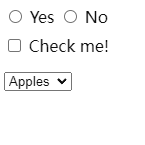

# 选择器


# 基础选择器

## ID 选择器 `#id_name`

> ID selector

| 选择器 | 示例             | 示例说明                                      |
| ------ | ---------------- | --------------------------------------------- |
| `#id`  | `#firstname { }` | 选择所有 id="firstname" 的标签 (**id**选择器) |

- 所有标签均可添加 `id` 属性，且只能添加一个
- 在一个页面中，`id` 属性值唯一，不能有相同的 `id` 属性值
- 一个 `id` 选择器只能选择一个标签

```
#para1 {
    text-align:center;
    color:red;
}
```


## 类选择器 `.class`

> Class selector

| 选择器   | 示例         | 示例说明                                     |
| -------- | ------------ | -------------------------------------------- |
| `.class` | `.intro { }` | 选择所有 class="intro" 的标签 (**类**选择器) |

- 注意：类选择器中，类名前面有英文句号 `.` 
- 使用类选择器，需要在标签中添加 `class="类名"` 确定类名，所有标签均可以添加 `class` 属性
- **类名**：由英文字母、数字、下划线组成，不能用数字和下滑线开头
- 一个标签可以有 **多个类名** ，不同的类名使用 **空格 ` `** 隔开
- **不同标签** 可以使用同一个类名，类选择器会同时选中所有满足条件的标签

示例：

```
<head>
    <meta charset="UTF-8">
    <meta http-equiv="X-UA-Compatible" content="IE=edge">
    <meta name="viewport" content="width=device-width, initial-scale=1.0">
    <title>Document</title>
    <style>
        .one {
            color: red;
        }
    </style>
</head>
<body>
    <p class="one two">文本</p>
</body>
```


## 元素选择器

> Type selector

标签选择器，指用 HTML 标签名称作为选择器，按标签名称分类，为页面中某一类标签指定统一的 CSS 样式

| 选择器            | 示例         | 示例说明                                 |
| ----------------- | ------------ | ---------------------------------------- |
| `element`         | `p { }`      | 选择 所有 `<p>`标签 (**元素**选择器)     |
| `element,element` | `div, p { }` | 选择 所有 `<div>` 标签 **和** `<p>` 标签 |

```
p {
	color: red;
}
```


## 通配符选择器 `*`

> Universal selector

| 选择器 | 示例    | 示例说明                             |
| ------ | ------- | ------------------------------------ |
| `*`    | `* { }` | 选择 **所有标签** (**通配符**选择器) |


## 属性选择器 `[]`

> Attribute selector

**属性选择器**：通过已经存在的属性名或属性值匹配元素

| 选择器                  | 示例说明                                                     | 示例             |
| ----------------------- | ------------------------------------------------------------ | ---------------- |
| `[attribute]`           | 选择所有 **带有 `attribute` 属性** 的元素                    | [target]         |
| `[attribute=value]`     | 选择所有 **带用 `attribute=value`** 的元素                   | [target=-blank]  |
| `[attribute^=value]`    | 选择所有 **带有 `attribute` 属性**，属性值 **以 `value` 为开头** 的元素 | a[src^="https"]  |
| `[attribute$=value]`    | 选择所有 **带有 `attribute` 属性**，属性值 **以 `value` 为结尾** 的元素 | a[src$=".pdf"]   |
| `[attribute*=value]`    | 选择所有 **带有 `attribute` 属性**，属性值 **至少包含一个 `value` 字符串** 的元素 | a[src*="runoob"] |
| `[attribute~=value]`    | 选择所有 **带有 `attribute` 属性**，属性值是一个以空格作为分隔的**值列表**，其中至少 **有一个值为 `value`** 的元素<br />注意与 `[attribute*=value]` 的区别 | [title~=flower]  |
| `[attribute|=language]` | 选择所有 **带有 `attribute` 属性**，属性值 **等于 `value`** 或者 **以 `value-` 为开头** 的元素 | [lang\|=en]      |


- `[attribute^=value]`：属性值以 `value` 为开头；如
  -  `[lang^=zh]` 选择器 可以匹配 `lang=zh` `lang=zh-CN` `lang=zh-TW` 属性，也可以匹配 `lang=zhhhh` 
- `[attribute$=value]`：属性值以 `value` 为结尾；如
  - `[src$=".pdf"]` 可以匹配 `src=abc.pdf` 
- `[attribute*=value]` ：属性值至少包含一个 `value` 字符串；如
  -  `[title*="flower"]` 可以匹配 `title="flower"`，也可以匹配 `title="abcflowerdef"` 
- `[attribute~=value]` 有一个属性值为 `value`：**`value` 必需为独立单词**；如
  -  `title="hello world"` 属性可以使用 `[title~="world"]` 选择器，但**不能使用** `[title~="worl"]` 
- `[attribute|=language]` ：属性值以 `value-` 为开头，必需带有连字符 `-` ；如 
  - `[lang|=zh]` 选择器 可以匹配`lang=zh` `lang=zh-CN` `lang=zh-TW` 属性，但不能匹配 `lang=zhhhh` (无连字符) 属性
- 属性选择器的右方括号前添加一个用空格隔开的字母 `i`（或 `I`），可以在匹配属性值时忽略大小写（支持 ASCII 字符范围之内的字母），如 `[title*="hello" i]`


# 复合选择器

## 并列选择器 `,`


## 后代选择器 ` `

> Descendant combinator

| 选择器            | 说明                                                         | 示例        |
| ----------------- | ------------------------------------------------------------ | ----------- |
| `element element` | 选择 `<element1>` 标签**内** 的所有 `<element2>` 标签 (**后代**选择器) | `div p { }` |


## 子代选择器 `>`

> Child combinator

| 选择器              | 说明                                                         | 示例        |
| ------------------- | ------------------------------------------------------------ | ----------- |
| `element1>element2` | 选择所有 **父级是** `<element1>` 标签的 **`<element2>` 标签** (**子代**选择器) | `div>p { }` |


## 相邻兄弟选择器 `+`

> Adjacent sibling combinator

| 选择器              | 说明                                                         | 示例        |
| ------------------- | ------------------------------------------------------------ | ----------- |
| `element1+element2` | 选择所有 **紧跟在** `<element1>` 标签之后的**第一个 `<element2>` 标签** (**相邻兄弟**选择器) | `div+p { }` |


## 通用兄弟选择器 `~`

> General sibling combinator

| 选择器              | 说明                                                         | 示例       |
| ------------------- | ------------------------------------------------------------ | ---------- |
| `element1~element2` | 选择 `<element1>` 标签 **之后的每一个** `<element2>`标签 (**通用兄弟**选择器) | `p~ul { }` |


# 伪元素选择器 `::`

> pseudo-elements

- CSS3 伪元素开头为 **双冒号** `::` ，CSS2 采用单冒号
- 伪元素是一个附加至选择器末的 **关键词**，允许对被选择元素的 **特定部分** 修改样式，*相当于为选定元素创建一个伪元素*。
- 一个选择器中 **只能使用一个伪元素**。伪元素必须紧跟在语句中的简单选择器/基础选择器之后
- **伪元素** 是对元素中的特定内容进行操作，它所操作的层次比伪类更深了一层，也因此它的动态性比伪类要低得多。实际上，设计伪元素的目的就是去选取诸如元素内容第一个字（母）、第一行，选取某些内容前面或后面这种普通的选择器无法完成的工作。它 *控制的内容实际上* 和 *元素* 是 相同的，但是它本身只是基于元素的抽象，并不存在于文档中，所以叫伪元素。

| 选择器                                                       | 说明                                                         |
| ------------------------------------------------------------ | ------------------------------------------------------------ |
| [`::before`](https://developer.mozilla.org/zh-CN/docs/Web/CSS/::before) | 选定元素的 **元素内容的 前面** 插入内容<br />配合 `content` 属性使用 |
| [`::after`](https://developer.mozilla.org/zh-CN/docs/Web/CSS/::after) | 选定元素的 **元素内容的 后面** 插入内容<br />配合 `content` 属性使用 |
| [`::first-letter`](https://developer.mozilla.org/zh-CN/docs/Web/CSS/::first-letter) | 选定块级元素的 元素内容的 **第一个字母**<br />(且该文字所处的行之前没有其他内容) |
| [`::first-line`](https://developer.mozilla.org/zh-CN/docs/Web/CSS/::first-line) | 选定块级元素的 元素内容的 **第一行**<br />                   |
| [`::selection`](https://developer.mozilla.org/zh-CN/docs/Web/CSS/::selection) | 匹配标签中 **被用户选中 (高亮)** 的部分                      |
| `::grammar-error`                                            | 匹配文档中包含了浏览器标记的语法错误的那部分。               |
| `::spelling-error`                                           | 匹配文档中包含了浏览器标记的拼写错误的那部分。               |

- `::before` `::after`：创建一个伪元素，该元素会成为选定元素的第一/最后一个子元素，伪元素的内容也会显示

  - 使用 **`content` 属性** 来指定要 **插入的内容**，注意 字符串需要加引号；
  - 默认插入的是 **行内元素**，设置 `display: inline-block` 变为行内块元素：

  ```css
  q::before {
    content: "«";
    color: blue;
  }
  
  q::after {
    content: "»";
    color: red;
  }
  ```

- `::first-letter` `::first-line`：只在 [`display`](https://developer.mozilla.org/zh-CN/docs/Web/CSS/display) 属性值为 `block`, `inline-block`, `table-cell`, `list-item` 或者 `table-caption`的元素上才起作用。其他情况下，`::first-letter` 毫无意义。

  - `::first-letter` 可运用的 CSS 属性：
    - 所有的 **字体** 属性 : [`font`](https://developer.mozilla.org/zh-CN/docs/Web/CSS/font), [`font-style`](https://developer.mozilla.org/zh-CN/docs/Web/CSS/font-style), [`font-feature-settings`](https://developer.mozilla.org/zh-CN/docs/Web/CSS/font-feature-settings), [`font-kerning`](https://developer.mozilla.org/zh-CN/docs/Web/CSS/font-kerning), [`font-language-override`](https://developer.mozilla.org/zh-CN/docs/Web/CSS/font-language-override), [`font-stretch`](https://developer.mozilla.org/zh-CN/docs/Web/CSS/font-stretch), [`font-synthesis`](https://developer.mozilla.org/zh-CN/docs/Web/CSS/font-synthesis), [`font-variant`](https://developer.mozilla.org/zh-CN/docs/Web/CSS/font-variant), [`font-variant-alternates`](https://developer.mozilla.org/zh-CN/docs/Web/CSS/font-variant-alternates), [`font-variant-caps`](https://developer.mozilla.org/zh-CN/docs/Web/CSS/font-variant-caps), [`font-variant-east-asian` (en-US)](https://developer.mozilla.org/en-US/docs/Web/CSS/font-variant-east-asian), [`font-variant-ligatures`](https://developer.mozilla.org/zh-CN/docs/Web/CSS/font-variant-ligatures), [`font-variant-numeric`](https://developer.mozilla.org/zh-CN/docs/Web/CSS/font-variant-numeric), [`font-variant-position`](https://developer.mozilla.org/zh-CN/docs/Web/CSS/font-variant-position), [`font-weight`](https://developer.mozilla.org/zh-CN/docs/Web/CSS/font-weight), [`font-size`](https://developer.mozilla.org/zh-CN/docs/Web/CSS/font-size), [`font-size-adjust`](https://developer.mozilla.org/zh-CN/docs/Web/CSS/font-size-adjust), [`line-height`](https://developer.mozilla.org/zh-CN/docs/Web/CSS/line-height),  [`font-family`](https://developer.mozilla.org/zh-CN/docs/Web/CSS/font-family).
    - 所有的 **背景** 属性 : [`background-color`](https://developer.mozilla.org/zh-CN/docs/Web/CSS/background-color), [`background-image`](https://developer.mozilla.org/zh-CN/docs/Web/CSS/background-image), [`background-clip`](https://developer.mozilla.org/zh-CN/docs/Web/CSS/background-clip), [`background-origin`](https://developer.mozilla.org/zh-CN/docs/Web/CSS/background-origin), [`background-position`](https://developer.mozilla.org/zh-CN/docs/Web/CSS/background-position), [`background-repeat`](https://developer.mozilla.org/zh-CN/docs/Web/CSS/background-repeat), [`background-size`](https://developer.mozilla.org/zh-CN/docs/Web/CSS/background-size), [`background-attachment`](https://developer.mozilla.org/zh-CN/docs/Web/CSS/background-attachment)以及 [`background-blend-mode`](https://developer.mozilla.org/zh-CN/docs/Web/CSS/background-blend-mode).
    - 所有的 **外边距** 属性: [`margin`](https://developer.mozilla.org/zh-CN/docs/Web/CSS/margin), [`margin-top`](https://developer.mozilla.org/zh-CN/docs/Web/CSS/margin-top), [`margin-right`](https://developer.mozilla.org/zh-CN/docs/Web/CSS/margin-right), [`margin-bottom`](https://developer.mozilla.org/zh-CN/docs/Web/CSS/margin-bottom), [`margin-left`](https://developer.mozilla.org/zh-CN/docs/Web/CSS/margin-left).
    - 所有的 **内边距** 属性: [`padding`](https://developer.mozilla.org/zh-CN/docs/Web/CSS/padding), [`padding-top`](https://developer.mozilla.org/zh-CN/docs/Web/CSS/padding-top), [`padding-right`](https://developer.mozilla.org/zh-CN/docs/Web/CSS/padding-right), [`padding-bottom`](https://developer.mozilla.org/zh-CN/docs/Web/CSS/padding-bottom), [`padding-left`](https://developer.mozilla.org/zh-CN/docs/Web/CSS/padding-left).
    - 所有的 **边框** 属性：比如一些简短的边框属性 [`border`](https://developer.mozilla.org/zh-CN/docs/Web/CSS/border), [`border-style`](https://developer.mozilla.org/zh-CN/docs/Web/CSS/border-style), [`border-color`](https://developer.mozilla.org/zh-CN/docs/Web/CSS/border-color), [`border-width`](https://developer.mozilla.org/zh-CN/docs/Web/CSS/border-width), [`border-radius`](https://developer.mozilla.org/zh-CN/docs/Web/CSS/border-radius), [`border-image`](https://developer.mozilla.org/zh-CN/docs/Web/CSS/border-image), 还剩下许多冗长的边框属性等等。
    - **颜色** [`color`](https://developer.mozilla.org/zh-CN/docs/Web/CSS/color) 属性。
    - [`text-decoration`](https://developer.mozilla.org/zh-CN/docs/Web/CSS/text-decoration), [`text-shadow`](https://developer.mozilla.org/zh-CN/docs/Web/CSS/text-shadow), [`text-transform`](https://developer.mozilla.org/zh-CN/docs/Web/CSS/text-transform), [`letter-spacing`](https://developer.mozilla.org/zh-CN/docs/Web/CSS/letter-spacing), [`word-spacing`](https://developer.mozilla.org/zh-CN/docs/Web/CSS/word-spacing) (使用恰当的话), [`line-height`](https://developer.mozilla.org/zh-CN/docs/Web/CSS/line-height), [`text-decoration-color`](https://developer.mozilla.org/zh-CN/docs/Web/CSS/text-decoration-color), [`text-decoration-line`](https://developer.mozilla.org/zh-CN/docs/Web/CSS/text-decoration-line), [`text-decoration-style`](https://developer.mozilla.org/zh-CN/docs/Web/CSS/text-decoration-style), [`box-shadow`](https://developer.mozilla.org/zh-CN/docs/Web/CSS/box-shadow), [`float`](https://developer.mozilla.org/zh-CN/docs/Web/CSS/float), [`vertical-align`](https://developer.mozilla.org/zh-CN/docs/Web/CSS/vertical-align) `注意此刻必须没有浮动`) 等属性。
  - `::first-line` 可运用的 CSS 属性：
    - 所有和 字体有关 的属性：[`font`](https://developer.mozilla.org/zh-CN/docs/Web/CSS/font), [`font-kerning`](https://developer.mozilla.org/zh-CN/docs/Web/CSS/font-kerning), [`font-style`](https://developer.mozilla.org/zh-CN/docs/Web/CSS/font-style), [`font-variant`](https://developer.mozilla.org/zh-CN/docs/Web/CSS/font-variant), [`font-variant-numeric`](https://developer.mozilla.org/zh-CN/docs/Web/CSS/font-variant-numeric), [`font-variant-position`](https://developer.mozilla.org/zh-CN/docs/Web/CSS/font-variant-position), [`font-variant-east-asian` (en-US)](https://developer.mozilla.org/en-US/docs/Web/CSS/font-variant-east-asian), [`font-variant-caps`](https://developer.mozilla.org/zh-CN/docs/Web/CSS/font-variant-caps), [`font-variant-alternates`](https://developer.mozilla.org/zh-CN/docs/Web/CSS/font-variant-alternates), [`font-variant-ligatures`](https://developer.mozilla.org/zh-CN/docs/Web/CSS/font-variant-ligatures), [`font-synthesis`](https://developer.mozilla.org/zh-CN/docs/Web/CSS/font-synthesis), [`font-feature-settings`](https://developer.mozilla.org/zh-CN/docs/Web/CSS/font-feature-settings), [`font-language-override`](https://developer.mozilla.org/zh-CN/docs/Web/CSS/font-language-override), [`font-weight`](https://developer.mozilla.org/zh-CN/docs/Web/CSS/font-weight), [`font-size`](https://developer.mozilla.org/zh-CN/docs/Web/CSS/font-size), [`font-size-adjust`](https://developer.mozilla.org/zh-CN/docs/Web/CSS/font-size-adjust), [`font-stretch`](https://developer.mozilla.org/zh-CN/docs/Web/CSS/font-stretch),  [`font-family`](https://developer.mozilla.org/zh-CN/docs/Web/CSS/font-family)
    - [`color`](https://developer.mozilla.org/zh-CN/docs/Web/CSS/color)
    - 所有和 背景有关 的属性： [`background-color`](https://developer.mozilla.org/zh-CN/docs/Web/CSS/background-color), [`background-clip`](https://developer.mozilla.org/zh-CN/docs/Web/CSS/background-clip), [`background-image`](https://developer.mozilla.org/zh-CN/docs/Web/CSS/background-image), [`background-origin`](https://developer.mozilla.org/zh-CN/docs/Web/CSS/background-origin), [`background-position`](https://developer.mozilla.org/zh-CN/docs/Web/CSS/background-position), [`background-repeat`](https://developer.mozilla.org/zh-CN/docs/Web/CSS/background-repeat), [`background-size`](https://developer.mozilla.org/zh-CN/docs/Web/CSS/background-size), [`background-attachment`](https://developer.mozilla.org/zh-CN/docs/Web/CSS/background-attachment), and [`background-blend-mode`](https://developer.mozilla.org/zh-CN/docs/Web/CSS/background-blend-mode)
    - [`word-spacing`](https://developer.mozilla.org/zh-CN/docs/Web/CSS/word-spacing), [`letter-spacing`](https://developer.mozilla.org/zh-CN/docs/Web/CSS/letter-spacing), [`text-decoration`](https://developer.mozilla.org/zh-CN/docs/Web/CSS/text-decoration), [`text-transform`](https://developer.mozilla.org/zh-CN/docs/Web/CSS/text-transform), and [`line-height`](https://developer.mozilla.org/zh-CN/docs/Web/CSS/line-height)
    - [`text-shadow`](https://developer.mozilla.org/zh-CN/docs/Web/CSS/text-shadow), [`text-decoration`](https://developer.mozilla.org/zh-CN/docs/Web/CSS/text-decoration), [`text-decoration-color`](https://developer.mozilla.org/zh-CN/docs/Web/CSS/text-decoration-color), [`text-decoration-line`](https://developer.mozilla.org/zh-CN/docs/Web/CSS/text-decoration-line), [`text-decoration-style`](https://developer.mozilla.org/zh-CN/docs/Web/CSS/text-decoration-style), and [`vertical-align`](https://developer.mozilla.org/zh-CN/docs/Web/CSS/vertical-align).

- `::selection`：只有一小部分 CSS 属性可以用于`::selection` 选择器：

  - [`color`](https://developer.mozilla.org/zh-CN/docs/Web/CSS/color)
  - [`background-color`](https://developer.mozilla.org/zh-CN/docs/Web/CSS/background-color)
  - [`cursor`](https://developer.mozilla.org/zh-CN/docs/Web/CSS/cursor)
  - [`caret-color`](https://developer.mozilla.org/zh-CN/docs/Web/CSS/caret-color)
  - [`outline`](https://developer.mozilla.org/zh-CN/docs/Web/CSS/outline) and its longhands
  - [`text-decoration`](https://developer.mozilla.org/zh-CN/docs/Web/CSS/text-decoration) and its associated properties
  - [`text-emphasis-color` (en-US)](https://developer.mozilla.org/en-US/docs/Web/CSS/text-emphasis-color)
  - [`text-shadow`](https://developer.mozilla.org/zh-CN/docs/Web/CSS/text-shadow)


# 伪类选择器 `:`

- 可以在一个选择器中 同时一起写 **多个伪类**；
- **伪类** 选择元素基于的是当前元素处于的 **状态**，或者说元素当前所具有的特性，而不是元素的id、class、属性等静态的标志。由于状态是动态变化的，所以一个元素达到一个特定状态时，它可能得到一个伪类的样式；当状态改变时，它又会失去这个样式。

## 结构性伪类选择器

- 结构性伪类选择器：根据 **元素位置** 选择元素

- **根元素选择器 `:root`**：对于 HTML，`:root` 表示选择 `<html>` 元素，除了优先级更高之外，与 **`html` 元素选择器** 相同

  | 选择器                                                       | 描述                        |
  | ------------------------------------------------------------ | --------------------------- |
  | [`:root`](https://developer.mozilla.org/zh-CN/docs/Web/CSS/:root) | 选择文档的 **根标签**<br /> |

- **子元素选择器**：选择 **包含在其它元素中** 的指定元素

  - 子代：

  | 选择器               | 描述                                                   | 示例                |
  | -------------------- | ------------------------------------------------------ | ------------------- |
  | `:first-child`       | 选择每个 指定元素，且是 **其父级的 第一个 子标签**     | p:first-child       |
  | `:nth-child(n)`      | 选择每个 指定元素，且是 **其父级的 第n个 子标签**      | p:nth-child(2)      |
  | `:last-child`        | 选择每个 指定元素，且是 **其父级的 倒数第一个 子标签** | p:last-child        |
  | `:nth-last-child(n)` | 选择每个 指定元素，且是 **其父级的 倒数第n个 子标签**  | p:nth-last-child(2) |
  | `:only-child`        | 选择每个 指定元素，且是 **其父级的 唯一一个 子标签**   | p:only-child        |
  | `:empty`             | 选择每个 指定元素，且 **其没有子元素**                 |                     |

- 后代：

  | 选择器                 | 描述                                                | 示例                  |
  | ---------------------- | --------------------------------------------------- | --------------------- |
  | `:first-of-type`       | 选择每个 `<p>` 标签是 **其父级的 第一个`<p>` 标签** | p:first-of-type       |
  | `:nth-of-type(n)`      | 选择每个 `<p>` 标签是 **其父级的 第n个 `<p>` 标签** | p:nth-of-type(2)      |
  | `:last-of-type`        | 选择每个 `<p>` 标签是 **其父级的 倒数第一个  标签** | p:last-of-type        |
  | `:nth-last-of-type(n)` | 选择每个 `<p>` 标签是 **其父级的 倒数第n个 标签**   | p:nth-last-of-type(2) |
  | `:only-of-type`        | 选择每个 `<p>` 标签是 **其父级的 唯一一个 标签**    | p:only-of-type        |

- `:nth-child(n)` 类属性中 `n` 可以填 **公式**，常见公式：

  | 功能        | 公式 (n从0开始) |
  | ----------- | --------------- |
  | 偶数        | `event` `2n`    |
  | 奇数        | `odd` `2n+1`    |
  | 前 `5` 个   | `-n+5`          |
  | 最后 `5` 个 | `n+5`           |

  - `2n+m` 表示从第 `m` 个开始，以 `2n` 为间距选择 的指定元素；`m` 自定义，`n` 依次取 `0`、`1`、`2`、...，数字 `2` 可以换成其它自定义数字


## UI 伪类选择器

UI 伪类选择器：根据 元素状态 选择元素

| 选择器                                                       | 说明                                                         |      |
| ------------------------------------------------------------ | ------------------------------------------------------------ | ---- |
| [`:enabled`](https://developer.mozilla.org/zh-CN/docs/Web/CSS/:enabled) | 选择 每一个 **已启用的** 输入标签                            |      |
| [`:disabled`](https://developer.mozilla.org/zh-CN/docs/Web/CSS/:disabled) | 选择 每一个 **禁用的** 输入标签                              |      |
| [`:checked`](https://developer.mozilla.org/zh-CN/docs/Web/CSS/:checked) | 匹配任意 **被勾选/选中** 项，然后加载样式                    |      |
| [`:default`](https://developer.mozilla.org/zh-CN/docs/Web/CSS/:default) | 一组相关元素中的 默认表单元素                                |      |
| [`:valid`](https://developer.mozilla.org/zh-CN/docs/Web/CSS/:valid) | 内容 [验证](https://developer.mozilla.org/en-US/HTML/HTML5/Constraint_validation) 正确的 `<input>` 或其它 `<form>` 元素 |      |
| [`:invalid`](https://developer.mozilla.org/zh-CN/docs/Web/CSS/:invalid) | 内容 未通过验证 的 `<input>` 或其它 `<form>` 元素            |      |
| [`:in-range`](https://developer.mozilla.org/zh-CN/docs/Web/CSS/:in-range) | 一个 `<input>` 元素，其当前值处于属性`min` 和 `max` 限定的范围之内时，该元素加载样式 |      |
| [`:out-of-range`](https://developer.mozilla.org/zh-CN/docs/Web/CSS/:out-of-range) | 一个 `<input>` 元素，其当前值处于属性`min` 和 `max` 限定的范围之内时，该元素加载样式 |      |
| [`:required`](https://developer.mozilla.org/zh-CN/docs/Web/CSS/:required) | 任意 **设置了 `required` 属性** 的 `<input>`，`<select>`， `<textarea>` 元素 |      |
| [`:optional`](https://developer.mozilla.org/zh-CN/docs/Web/CSS/:optional) | 任意 **没有 `required` 属性** 的 `<input>`，`<select>`， `<textarea>` 元素 |      |

- `:enabled` `:disabled`：元素带有 `disable="disable"` 属性时，被禁用

  - 启用：如果一个元素能够被 **激活**（如 **选择**、**点击** 或 **接受文本输入**），或者能够 **获取焦点**，则该元素是启用的；
  - 禁用：如果一个元素不能被激活，或获取焦点，则该元素是启用的。

- `:checked`：适用于 **单选** `<input type="radio">`，**多选** `<input type="checkbox">`，下拉选项 `<select>` 元素中的 `<option>` 元素。元素可通过 `checked="checked"` 预先选定。

  

- `default` 适用于 **按钮** `button`、**单选** `<input type="radio">`、**多选** `<input type="checkbox">`、**选项** `<option>` 元素；“提交” 按钮是表单的默认按钮，可被选中

- `:valid` `:invalid`：选中 符合或不符合 验证要求的 元素。


## 动态伪类选择器

| 选择器          | 说明                                                         |
| --------------- | ------------------------------------------------------------ |
| `:link`         | 选择 用户 **未访问的** 超级链接                              |
| `:visited`      | 选择 用户 **访问过的** 超级链接                              |
| `:hover`        | 选择 用户 **光标悬停，没有激活** 的元素                      |
| `:active`       | 选择 被用户 **激活 (点击)时** 的元素                         |
| `:focus`        | 选择 **获得焦点** 的元素                                     |
| `:focus-within` | 元素 **自身** 或者它的某个 **后代** 获得焦点 时，该元素加载样式 |


## 其它伪类选择器

| 选择器                                                       | 说明                                                         |
| ------------------------------------------------------------ | ------------------------------------------------------------ |
| [`:not(selector)`](https://developer.mozilla.org/zh-CN/docs/Web/CSS/:not) | 选择 不符合选择器 `selector` 的元素 (**防止特定的元素被选中**) |
| [`:in-range`](https://developer.mozilla.org/zh-CN/docs/Web/CSS/:in-range) | 一个 `<input>` 元素，其当前值处于属性`min` 和 `max` 限定的范围之内时，该元素加载样式 |
| [`:out-of-range`](https://developer.mozilla.org/zh-CN/docs/Web/CSS/:out-of-range) | 一个 `<input>` 元素，其当前值处于属性`min` 和 `max` 限定的范围之内时，该元素加载样式 |
| [`:first`](https://developer.mozilla.org/zh-CN/docs/Web/CSS/:first) | 打印文档的时候，第一页的样式                                 |
| [`:left`](https://developer.mozilla.org/zh-CN/docs/Web/CSS/:left) | 对打印文档的左侧页设置 CSS 样式<br />需要和[@规则](https://developer.mozilla.org/zh-CN/docs/Web/CSS/At-rule) [`@page`](https://developer.mozilla.org/zh-CN/docs/Web/CSS/@page) 配套使用 |
| [`:right`](https://developer.mozilla.org/zh-CN/docs/Web/CSS/:right) | 对打印文档的右侧页设置 CSS 样式<br />需要和[@规则](https://developer.mozilla.org/zh-CN/docs/Web/CSS/At-rule) [`@page`](https://developer.mozilla.org/zh-CN/docs/Web/CSS/@page) 配套使用 |
|                                                              |                                                              |
| [`:target`](https://developer.mozilla.org/zh-CN/docs/Web/CSS/:target) | `<a href="#id_name">...</a>` 元素，带有 `id="id_name"` 属性的元素加载 CSS 样式<br />`#` 锚名称是在一个文件中链接到某个元素的URL |
| [`:read-only`](https://developer.mozilla.org/zh-CN/docs/Web/CSS/:read-only) | **不可被用户编辑** 的标签                                    |
| [`:read-write`](https://developer.mozilla.org/zh-CN/docs/Web/CSS/:read-write) | **可以被用户编辑** 的标签                                    |
| [`:lang()`](https://developer.mozilla.org/zh-CN/docs/Web/CSS/:lang) | 所有 带有 `lang` 属性值为 `it` 的元素                        |
|                                                              |                                                              |
| [`:defined`](https://developer.mozilla.org/zh-CN/docs/Web/CSS/:defined) | 选择 任何 已定义 的元素                                      |
| [`:indeterminate`](https://developer.mozilla.org/zh-CN/docs/Web/CSS/:indeterminate) | 选择 **状态不确定** 的表单元素                               |
| [`:host`](https://developer.mozilla.org/zh-CN/docs/Web/CSS/:host) |                                                              |
| [`:host()`](https://developer.mozilla.org/zh-CN/docs/Web/CSS/:host_function) |                                                              |
| [`:scope`](https://developer.mozilla.org/zh-CN/docs/Web/CSS/:scope) |                                                              |


