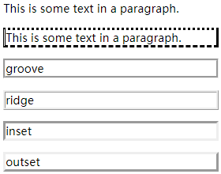
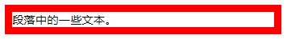
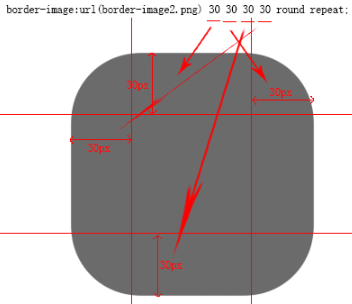
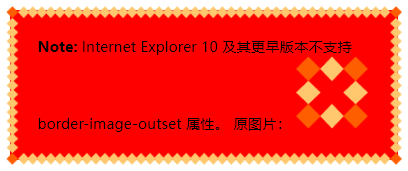
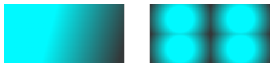
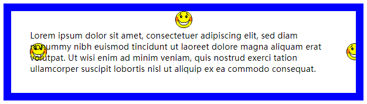
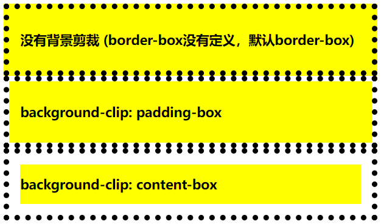
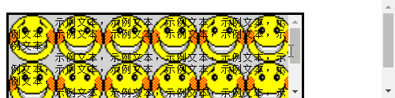
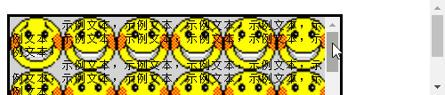
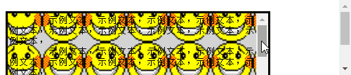

https://developer.mozilla.org/zh-CN/docs/Web/CSS/CSS_Backgrounds_and_Borders

# 边框 `border`

| 属性                              | 描述                                                         |
| :-------------------------------- | :----------------------------------------------------------- |
| [`border`](#border)               | 复合属性。设置 对象的 边框特性                               |
| `border-color`                    | 设置 对象的 边框颜色                                         |
| `border-style`                    | 设置 对象的 边框样式                                         |
| `border-width`                    | 设置 对象的 边框宽度                                         |
|                                   |                                                              |
| [`border-top`](#border-top)       | 复合属性。设置对象 顶部边框 特性                             |
| `border-top-color`                | 设置 对象的 顶部边框 颜色                                    |
| `border-top-style`                | 设置 对象的 顶部边框 样式                                    |
| `border-top-width`                | 设置 对象的 顶部边框 宽度                                    |
|                                   |                                                              |
| [`border-bottom`](#border-bottom) | 复合属性。设置 对象的 底部边框 特性                          |
| `border-bottom-color`             | 设置 对象的 底部边框 颜色                                    |
| `border-bottom-style`             | 设置 对象的 底部边框 样式                                    |
| `border-bottom-width`             | 设置 对象的 底部边框 宽度                                    |
|                                   |                                                              |
| [`border-left`](#border-left)     | 复合属性。设置 对象的 左边边框 特性                          |
| `border-left-color`               | 设置 对象的 左边边框 颜色                                    |
| `border-left-style`               | 设置 对象的 左边边框 样式                                    |
| `border-left-width`               | 设置 对象的 左边边框 宽度                                    |
|                                   |                                                              |
| [`border-right`](#border-right)   | 复合属性。设置对象的 右边边框 特性                           |
| `border-right-color`              | 设置 对象的 右边边框 颜色                                    |
| `border-right-style`              | 设置 对象的 右边边框 样式                                    |
| `border-right-width`              | 设置 对象的 右边边框 宽度                                    |
|                                   |                                                              |
| [`border-radius`](#border-radius) | 设置 对象的 圆角边框                                         |
| `border-top-right-radius`         | 设置 对象的 左上角 圆角边框                                  |
| `border-top-right-radius`         | 设置 对象的 右上角 圆角边框                                  |
| `border-bottom-right-radius`      | 设置 对象的 右下角 圆角边框                                  |
| `border-bottom-left-radius`       | 设置 对象的 左下角 圆角边框                                  |
|                                   |                                                              |
| [`border-image`](#border-image)   | 设置或检索对象的边框样式使用图像来填充                       |
| `border-image-outset`             | 规定边框图像超过边框的量                                     |
| `border-image-repeat`             | 规定图像边框是否应该被重复 (repeated)、拉伸 (stretched)、铺满 (rounded) |
| `border-image-slice`              | 规定图像边框的向内偏移                                       |
| `border-image-source`             | 规定要使用的图像，代替 border-style 属性中设置的边框样式     |
| `border-image-width`              | 规定图像边框的宽度                                           |
|                                   |                                                              |
| [`box-shadow`](#box-shadow)       | 向方框添加一个或多个阴影                                     |
| `box-decoration-break`            | 规定行内元素被折行                                           |


## `border`

- <a name="border">`border`</a> 属性设置 边框特性，其是 `border-width`，`border-style`，`border-color` 属性的简写属性

  - `border` 属性的属性值，可以设置一个或多个，多个属性值之间用 **空格 ` ` 隔开**，且 **不分先后顺序**
  - `border` 属性可**添加** `inherit` 属性值 **继承** 父元素的 `border` 属性值

  可以 **单独使用** `border-width`，`border-style`，`border-color` 属性：

  - `border-width`、`border-style`、`border-color` 属性可拥有 1-4 个属性值，分别表示边框四个边的属性值，**四个边的顺序依次** 是：
    - 1个属性值：`上下左右`，四边相同的属性值
    - 2个属性值：`上下 左右` 
    - 3个属性值：`上 左右 下` 

  - 4个属性值：`上 右 下 左` 

- <a name="border-color">`border-color`</a> 设置边框样式：

  | 属性值 (`border-color`) | 说明                             |
  | :---------------------- | :------------------------------- |
  | *color*                 | 指定边框颜色                     |
  | `transparent`           | (**默认**) 指定边框颜色 **透明** |
  | `inherit`               | 指定边框颜色，应该从父元素 继承  |

- <a name="border-style">`border-style`</a> 设置边框样式：

  | 属性值 (`border-style`)       | 描述                                                         |
  | :---------------------------- | :----------------------------------------------------------- |
  | `none`                        | (**默认**) 定义 **无边框**                                   |
  | `hidden`                      | 与 "none" 相同，应用于表格边框时除外<br />对于表格边框，`hidden` 用于解决 边框冲突 |
  | `dotted`                      | 定义 **点状** 边框                                           |
  | `dashed`                      | 定义 **虚线** 边框                                           |
  | `solid`                       | 定义 **实线** 边框                                           |
  | `double`                      | 定义 **双线** 边框，双线的宽度 等于 `border-width` 的值      |
  | <a name="groove">`groove`</a> | 定义 3D 凹槽边框，其效果取决于 border-color 的值             |
  | <a name="ridge">`ridge`</a>   | 定义 3D 垄状边框，其效果取决于 border-color 的值             |
  | <a name="inset">`inset`</a>   | 定义 3D inset 边框，其效果取决于 border-color 的值           |
  | <a name="outset">`outset`</a> | 定义 3D outset 边框，其效果取决于 border-color 的值          |
  | `inherit`                     | 规定边框样式，应该从父元素继承                               |

  

- <a name="border-width">`border-width`</a> 设置边框粗细：

  | 属性值 (`border-width`) | 描述                            |
  | :---------------------- | :------------------------------ |
  | `thin`                  | 定义 **细** 的边框              |
  | `medium`                | (**默认**) 定义 **中等** 的边框 |
  | `thick`                 | 定义 **粗** 的边框              |
  | *length*                | **自定义宽度**                  |
  | *%*                     |                                 |
  | `inherit`               | 规定应该从父元素继承边框宽度    |




## `border-top` 类

- <a name="border-top">`border-top`</a> 设置 **上边框** 特性，其是 `border-top-width`，`border-top-style`，`border-top-color` 的简写属性
- <a name="border-bottom">`border-bottom`</a> 设置 **下边框** 特性，其是 `border-bottom-width`，`border-bottom-style`，`border-bottom-color` 的简写属性
- <a name="border-left">`border-left`</a> 设置 **左边框** 特性，其是 `border-left-width`，`border-left-style`，`border-left-color` 的简写属性
- <a name="border-right">`border-right`</a> 设置 **右边框** 特性，其是 `border-right-width`，`border-top-style`，`border-right-color` 的简写属性


**以下以 `border-top` 为例**：

- `border-top` 属性可拥有一个或多个属性值，多个属性值之间用 **空格 ` ` 隔开**，且 **不分先后顺序**；

- `border-top` 属性可 **添加** `inherit` 属性值 **继承** 父元素的 `border-top` 属性值

可以 **单独使用** `border-top-width`，`border-top-style`，`border-top-color` 属性：

- `border-top-color` 属性设置 上边框 **颜色**；属性值同 [`border-color`](#border-color)，但只能拥有一个属性值
- `border-top-style` 属性设置 上边框 **样式**；属性值同 [`border-style`](#border-style)，但只能拥有一个属性值
- `border-top-width` 属性设置 上边框 **粗细**；属性值同 [`border-width`](#border-width)，但只能拥有一个属性值


## 圆角 `border-radius`

- <a name="border">`border-radius`</a> 属性设置 **边框圆角**，其是 `border-top-left-radius`，`border-top-right-radius`，`border-bottom-right-radius`，`border-bottom-left-radius` 属性的简写属性

- `border-radius` 属性可拥有一个或多个属性值，用空格 ` ` 隔开，分别表示边框四个角的属性值，**四个角的顺序依次** 是：

  - 1个属性值：四角拥有相同属性值
  - 2个属性值：`左上右下 左下右上` 
  - 3个属性值：`左上 右上左下 右下` 
  - 4个属性值：`左上 右上 右下 左下` 

  | 属性值   | 描述                                              |
  | :------- | :------------------------------------------------ |
  | *length* | 指定水平半径和垂直半径                            |
  | *%*      | 使用 *%* 计算 水平半径和垂直半径 (父元素length*%) |

  语法：`border-radius: 1-4个属性值 / 1-4个属性值;` 

  - 斜杠 `/` 前后的属性值分别按上述情况确定 4 个角的属性值

  ```
  border-radius: 50px 60px 70px / 30px 50px;
  /* 等价于： */
  border-top-left-radius:     50px 30px;
  border-top-right-radius:    60px 50px;
  border-bottom-right-radius: 70px 30px;
  border-bottom-left-radius:  60px 50px;
  ```

-  `border-top-left-radius`，`border-top-right-radius`，`border-bottom-right-radius`，`border-bottom-left-radius` 属性

   - 提供**2个参数**，2个参数以 **空格** ` ` 分隔，每个参数允许设置1个参数值
   - 第1个参数表示 水平半径，第2个参数表示 垂直半径 (椭圆)
   - 若第2个参数省略，则默认等于第1个参数 (圆)
   - 如果任一长度为零，角落里是方的，不圆润
   - 水平半径的百分比是指边界框的宽度，垂直半径的百分比是指边界框的高度


## 图像边框 `border-image`

- <a name="border-image">`border-image`</a> 属性：**使用图像 创建边框**，其是 [`border-image-source`](#border-image-source)，[`border-image-slice`](#border-image-slice)，[`border-image-width`](#border-image-width)，[`border-image-outset`](#border-image-outset)，[`border-image-repeat`](#border-image-repeat) 属性的简写属性，注意 **顺序**。

  - `border-image` 属性设定时， `border`类似，可能发生冲突

  - `border-image` **默认** 值 `border-image: none 100% 1 0 stretch;`

- <a name="border-image-source">`border-image-source`</a> 属性 指定要使用的图像，而不是由`border-style` 属性设置边框样式

  | 属性值 (`border-image-source`) | 描述                                       |
  | :----------------------------- | :----------------------------------------- |
  | `none`                         | (**默认**) 没有图像 (此时边框样式会被使用) |
  | *image*                        | 边框使用图像的路径 (使用 *url( )*函数 )    |

- <a name="border-image-slice">`border-image-slice`</a> 属性：**切割图片**，通过将 图像4个边界 向内偏移，得到4条切割线，将图片切割9个部分

  | 值 (`border-image-slice`) | 描述                                                         |
  | :------------------------ | :----------------------------------------------------------- |
  | *number*                  | 数字表示图像的像素（位图图像）或向量的坐标（如果图像是矢量图像） |
  | *%*                       | **默认**：`100%`<br />百分比图像的大小是相对的：水平偏移图像的宽度，垂直偏移图像的高度 |
  | `fill`                    | 保留图像的中间部分                                           |

  - `border-image-slice` 属性可拥有1至4个属性值，分别表示上、右、下、左边缘线 向内移动的距离，然后形成切割线；将图片切割成9个部分，图像中间部分将被丢弃（完全透明的处理），除非填写关键字；顺序依次如下：
    - 1个属性值：4条边相同属性值
    - 2个属性值：`上下 右左`。
    - 3个属性值：`上 右左 下`。
    - 4个属性值：`上 右 下 左`。

  

  - 根据图示，切割完 `border` 的背景切片后，并且也已经设置了 `border` 的宽度 `width` `height`（重要）。将相应的切片填充到 `border` 的相应位置。

    需要注意的是：不论 `border` 的宽度设置的多大，后面切割的参数都是根据` border-image` 引入图片的尺寸设置的  参数, 或者说是根据引入图片大小设置的切割参数。

    切割后的四周的八个切片，**四个角** 根据 `border` 设置的大小全尺寸 **自动缩放** 显示到 `border` 对应的四个角。

    除四个角外的其他 **中间切片**（上中，右中间，下中，左中间），可以使用 **`border-image-repeat` 属性** 使其 **拉伸** 或 **重复** 后显示到对应的 `border` 位置

- <a name="border-image-width">`border-image-width`</a> 属性：指定 图像边框的 **边框宽度**，与 `border-width` 类似

  - 其可拥有4个属性值，属性值之间用空格 ` ` 隔开，**负值无效**；
  - 这4个属性值分别代表上，右，下，左 向内距离，用于把 `border` 图像区域分为九个部分
  - 可以省略至3、2、1个属性值

  | 属性值 (`border-image-width`) | 描述                                                         |
  | :---------------------------- | :----------------------------------------------------------- |
  | *number*                      | (**默认**：`1`) 表示相应的 `border-width` 的 **倍数**。      |
  | *%*                           | 边界图像区域的大小：横向偏移的宽度的面积，垂直偏移的高度的面积 |
  | `auto`                        | 如果指定了，宽度是相应的 `image slice` 的 内在宽度 或 高度   |

  

- <a name="border-image-outset">`border-image-outset`</a> 属性：指定图像边框 以边框外界限为基础，**向外偏移**的距离

  - 其可拥有4个属性值，属性值之间用空格 ` ` 隔开，**负值无效**；
  - 这4个属性值分别上、右、下、左部分
  - 可以省略至3、2、1个属性值

  | 值       | 描述                                                     |
  | :------- | :------------------------------------------------------- |
  | *length* | (**默认**：`0`) 设置边框图像与边框（border-image）的距离 |
  | *number* | 代表相应的 `border-width` 的倍数                         |

  示例：

  ```html
  <style>
  #myDIV {
  	background-color:red;
      border: 15px solid transparent;
      padding: 15px;   
      border-image: url(border.png);
      border-image-slice: 30;
      border-image-repeat: round;
      border-image-outset:5px 5px 5px 5px;
  }
  </style>
  
  <body>
      <div id="myDIV">
  		<b>Note:</b> Internet Explorer 10 及其更早版本不支持 border-image-outset 属性。
  		原图片：
  		
    	</div>
  </body>
  ```




- <a name="border-image-repeat">`border-image-repeat`</a> 属性：规定如何 延展 和 铺排 边框图像的 边缘 和 中间 部分

  - 可拥有2个属性值；如果省略第二个值，则采取与第一个值相同的值

  | 属性值 (`border-image-repeat`) | 描述                                                         |
  | :----------------------------- | :----------------------------------------------------------- |
  | `stretch`                      | (**默认**) **拉伸** 图像来填充区域                           |
  | `repeat`                       | **平铺** (repeated)图像来填充区域；两端可能会被截取          |
  | `round`                        | 类似 repeat 值；如果无法完整平铺所有图像，则对图像进行 **缩放** 以适应区域。 |
  | `space`                        | 类似 repeat 值；如果无法完整平铺所有图像，平铺时会在需要平铺的图像两端添加扩展空间 |
  | `initial`                      | 将此属性设置为 默认 值                                       |
  | `inherit`                      | 从父元素中 继承 该属性                                       |


## 表格边框 `border-collapse`

- <a name="border-collapse">`border-collapse`</a> 属性是用来决定表格的边框是分开的还是合并的
  - 在分隔模式下，相邻的单元格都拥有独立的边框
  - 在合并模式下，相邻单元格共享边框

| 属性值 (`border-collapse`) | 描述                                                         |
| -------------------------- | ------------------------------------------------------------ |
| `collapse`                 | 相邻的单元格共用同一条边框<br />采用 collapsed-border 表格渲染模型 |
| `separate`                 | (**默认**) 每个单元格拥有独立的边框<br />采用 separated-border 表格渲染模型 |


# 背景 `background`

- 背景属性 不包括 外边距 `margin`；

| 属性                                      | 描述                                                         |
| :---------------------------------------- | :----------------------------------------------------------- |
| `background`                              | 复合属性                                                     |
| [`background-color`](#bg-color)           | 设置对象的 **背景颜色**                                      |
| [`background-image`](#bg-image)           | 设置对象的 **背景图像**                                      |
| [`background-size`](#bg-size)             | 设置对象的 背景图像 **尺寸大小**<br />必须先指定 `background-image` 属性 |
| [`background-repeat`](#bg-repeat)         | 设置对象的 背景图像 **铺排填充方式**<br />必须先指定 `background-image` 属性 |
| [`background-position`](#bg-position)     | 设置对象的 背景图像 **位置**<br />必须先指定 `background-image` 属性 |
| [`background-origin`](#bg-origin)         | 设置对象的 背景图像 计算位置时 的参考原点(位置)              |
| [`background-clip`](#bg-clip)             | 指定对象的 背景图像 **绘制区域**                             |
| [`background-attachment`](#bg-attachment) | 设置对象内容滚动时，背景图像 **滚动** 还是 **固定** <br />必须先指定 `background-image` 属性 |

## `background`

-  由下面 8 个属性合成的简写属性，注意 **顺序**，各值之间用 **空格** 隔开

   ```
   background:bg-color bg-image position/bg-size bg-repeat bg-origin bg-clip bg-attachment initial|inherit;
   ```

   - `background-color` **只能在冒号 `:` 之后指定**；
   - 不同的属性值用 **空格** ` ` 隔开；
   - `background-size` 值只能包含在 `background-position` 背景位置之后，用 `/` 字符分隔

## `background-color`

<a name="bg-color">`background-color`</a> 设置对象的 **背景颜色**，总是 **显示在背景图像下方**；

| 属性值 (`background-color`) | 描述                             |
| :-------------------------- | :------------------------------- |
| *color*                     | 指定背景颜色                     |
| `transparent`               | (**默认**) 指定背景颜色 **透明** |
| `inherit`                   | 从父元素继承                     |


## `background-image`

<a name="bg-image">`background-image`</a> 设置对象的 **背景图像**；

| 属性值 (`background-image`)    | 说明                                                         |
| :----------------------------- | :----------------------------------------------------------- |
| *url('URL')*                   | 图像的URL                                                    |
| `none`                         | (**默认**) 无图像背景                                        |
| *linear-gradient( )*           | 创建 **线性渐变**  "图像" (从上到下)<br />`linear-gradient(red, green, blue)` |
| *radial-gradient( )*           | 创建 **径向渐变**  "图像" (center to edges)<br />`radial-gradient(red, green, blue)` |
| *repeating-linear-gradient( )* | 创建 重复的 线性渐变 "图像"                                  |
| *repeating-radial-gradient( )* | 创建 重复的 径向渐变 "图像"                                  |
| `inherit`                      | 从父元素继承                                                 |

- 可以指定多个值，需要用逗号 `,` 隔开

示例：

```css
.a {
  background-image: linear-gradient(105deg, rgba(0,249,255,1) 39%, rgba(51,56,57,1) 96%);
}

.b {
  background-image: radial-gradient(circle, rgba(0,249,255,1) 39%, rgba(51,56,57,1) 96%);
  background-size: 100px 50px;
}
```

```html
<div class="wrapper">
  <div class="box a"></div>
  <div class="box b"></div>
</div>
```




## `background-size`

<a name="bg-size">`background-size`</a> 设置对象的 背景图像 **尺寸大小**；

| 属性值 (`background-size`) | 描述                                                         |
| :------------------------- | :----------------------------------------------------------- |
| `auto`                     | (**默认**) 图片 原始大小                                     |
| *length*                   | 设置背景图片高度和宽度<br />第一个值设置宽度，第二个值设置的高度<br />如果只给出一个值，第二个是设置为 **auto**(自动) |
| *percentage*               | 将计算相对于背景定位区域的百分比<br />第一个值设置宽度，第二个值设置的高度<br />如果只给出一个值，第二个是设置为 auto(自动) |
| `cover`                    | 此时会保持图像的纵横比<br />浏览器将使图像 **足够大**，使它 **完全覆盖** 了盒子区<br />在这种情况下，有些图像可能会 跳出盒子外 |
| `contain`                  | 此时会保持图像的纵横比<br />浏览器将使图像的大小 **适合** 盒子区<br />可能在图像的任何一边或顶部和底部 出现间隙 |


## `background-repeat`

<a name="bg-repeat">`background-repeat`</a> 设置对象的 背景图像 **铺排填充方式**

| 属性值 (`background-repeat`) | 描述                                                         |
| ---------------------------- | ------------------------------------------------------------ |
| `repeat`                     | (**默认**) 背景图像将向 垂直和水平 方向重复<br />等于 `background-repeat: repeat-x repeat-y` |
| `repeat-x`                   | 只有 水平位置 会重复背景图像，图像可能会被截断               |
| `repeat-y`                   | 只有 垂直位置 会重复背景图像，图像可能会被截断               |
| `space`                      | 水平、垂直平铺图像，图像不会被截断，但图像之间会自动设置统一间距 |
| `round`                      | 水平、垂直平铺图像，图像不会被截断，但会调整图像大小         |
| `no-repeat`                  | 不会重复                                                     |
| `inherit`                    | 从父元素继承                                                 |


## `background-position`

- <a name="bg-position">`background-position`</a> 设置对象的 背景图像 **位置** 

- `background-position` 是 [`background-position-x`](https://developer.mozilla.org/zh-CN/docs/Web/CSS/background-position-x) 和 [`background-position-y`](https://developer.mozilla.org/zh-CN/docs/Web/CSS/background-position-y) 的简写，它们分别设置不同的坐标轴的值

| 属性值 (`background-position`) | 描述                                                         |
| :----------------------------- | :----------------------------------------------------------- |
| *position*                     | 如果仅指定一个关键字，其他值将会是"center"                   |
| *x% y%*                        | (**默认**) 0％ 0％<br />第一个值是水平位置，第二个值是垂直<br />左上角是0％ 0％,右下角是100％ 100％<br />如果仅指定了一个值，其他值将是50％ |
| *x-pos y-pos*                  | 第一个值是水平位置，第二个值是垂直<br />左上角是0。单位可以是像素 (0px0px)或任何其他 CSS单位<br />如果仅指定了一个值，其他值将是50％<br />你可以混合使用 ％ 和 *positions* |
| `inherit`                      | 指定background-position属性设置应该从父元素继承              |


## `background-origin`

<a name="bg-origin">`background-origin`</a> 设置元素的 **背景颜色** 和 **背景图像** 应用的 **位置**；

| 属性值 (`background-origin`) | 描述                                    |
| :--------------------------- | :-------------------------------------- |
| `padding-box`                | (**默认**) 背景的位置 相对于 **填充框** |
| `border-box`                 | 背景的位置 相对于 **边界框**            |
| `content-box`                | 背景的位置 相对于 **内容框**            |

示例：

```
div {
	border:15px solid blue;
	padding:35px;
	background-image:url('smiley.gif'),url('smiley.gif'),url('smiley.gif');
	background-origin:border-box,padding-box,content-box;
	background-repeat:no-repeat;
	background-position:right,top,left;
}
```




## `background-clip`

<a name="bg-clip">`background-clip`</a> 属性：指定 背景 在元素盒子中的 **绘制区域**；通过应用裁剪盒子，决定背景的哪一部分是可见的；裁剪盒子之外的部分一律被丢弃，不会显示

| 属性值 (`background-clip`) | 说明                                               |
| :------------------------- | :------------------------------------------------- |
| border-box                 | (**默认**) 背景绘制在 边框方框内（剪切成边框方框） |
| padding-box                | 背景绘制在 衬距方框内（剪切成衬距方框）            |
| content-box                | 背景绘制在 内容方框内（剪切成内容方框）            |

示例：

```
#example1 {
    border: 10px dotted black;
    padding:20px;
    background: yellow;
}
#example2 {
    border: 10px dotted black;
    padding:20px;
    background: yellow;
    background-clip: padding-box;
}
#example3 {
    border: 10px dotted black;
    padding:20px;
    background: yellow;
    background-clip: content-box;
}
```




## `background-attachment`

<a name="bg-attachment">`background-attachment`</a> 设置对象内容滚动时，背景图像 **滚动** 还是 **固定** 

| 属性值 (`background-attachment`) | 描述                                                         |
| :------------------------------- | :----------------------------------------------------------- |
| `scroll`                         | (**默认**) 背景图片固定在 **元素** 上<br />**不会** 随着 **内容** 一起滚动，**会** 随着 **页面** 一起滚动 |
| `local`                          | 背景图片附着在 **内容** 上<br />(**默认**) 背景图片固定在 **元素** 上<br />**会** 随着 **内容** 一起滚动，**会** 随着 **页面** 一起滚动 |
| `fixed`                          | 背景图片固定在 **视窗** 上<br />**不会** 随着 **内容** 一起滚动，**不会** 随着 **页面** 一起滚动 |
| `initial`                        | 设置该属性的默认值。 [阅读关于 *initial* 内容](https://www.runoob.com/cssref/css-initial.html) |
| `inherit`                        | 从父元素继承。 [阅读关于 *inherit* 内容](https://www.runoob.com/cssref/css-inherit.html) |

示例：

```
textarea {
        border: medium solid black;
        background-color: lightgray;
        background-image: url(http://static.runoob.com/images/mix/smiley.gif);
        background-size: 60px 60px;
        background-repeat: repeat;
        background-attachment: scroll;
        /* background-attachment: local; */
        /* background-attachment: fixed; */
      }
```

```
<textarea cols="30" rows="8">
        示例文本，示例文本，示例文本，示例文本，示例文本，示例文本，示例文本，示例文本，示例文本，
        示例文本，示例文本，示例文本，示例文本，示例文本，示例文本，示例文本，示例文本，示例文本，
        示例文本，示例文本，示例文本，示例文本，示例文本，示例文本，示例文本，示例文本，示例文本，
        示例文本，示例文本，示例文本，示例文本，示例文本，示例文本，示例文本，示例文本，示例文本，
        ...
</textarea>
```

`background-attachment: scroll;`：



`background-attachment: local;`：



`background-attachment: fixed;`：




## 多重背景

```
background ： [background-color] | [background-image] | [background-position][/background-size] | [background-repeat] | [background-attachment] | [background-clip] | [background-origin],...
```


```
background-image:url1,url2,...,urlN;
background-repeat : repeat1,repeat2,...,repeatN;
backround-position : position1,position2,...,positionN;
background-size : size1,size2,...,sizeN;
background-attachment : attachment1,attachment2,...,attachmentN;
background-clip : clip1,clip2,...,clipN;
background-origin : origin1,origin2,...,originN;
background-color : color;
```

-  用逗号隔开每组 `background` 的缩写值；
-  如果有 `size` 值，需要紧跟 `position` 并且用 "/" 隔开；
-  如果有多个背景图片，而其他属性只有一个（例如 `background-repeat` 只有一个），表明所有背景图片应用该属性值。
-  属性值少的会循环
-  `background-color` 只能设置一个。


# 盒子阴影 `box-shadow`

- <a name="box-shadow">`box-shadow`</a> 属性：用于在元素的 **框架** 上添加阴影效果

- 属性可以设置 **多个** 下拉阴影的框，阴影框的大小与原框相同

- 该属性是一个用 **逗号** `,` 分隔阴影的 列表 (多个阴影)，每个阴影由 2-4 个长度值、一个可选的颜色值和一个可选的 `inset` 关键字来规定。省略长度的值是 0。

  ```
  box-shadow: h-shadow v-shadow blur spread color inset;
  ```

| 属性值 (`border-shadow`) | 说明                                             |
| :----------------------- | :----------------------------------------------- |
| *length*                 | (**必需**) *h-shadow* **水平阴影** 的位置        |
| *length*                 | (**必需**) *v-shadow* **垂直阴影** 的位置        |
| *length*                 | (可选) *blur* **模糊距离** (向内模糊，默认为 0)  |
| *length*                 | (可选) *spread* 阴影向四周 **扩散** 的距离<br /> |
| *color*                  | (可选) 阴影的颜色                                |
| `inset`                  | (可选) 将盒子外部阴影 设置为 **盒子内部阴影**    |

- *h-shadow*，*v-shadow*：允许负值；**正值** 表示阴影向 **右**(**下**) 偏移；**负值** 表示阴影向 **左**(**上**) 偏移；
- *spread*：允许负值；**正值** 表示阴影向 **外** 扩大；**负值** 表示阴影向 **内** 缩小；


# 轮廓 `outline`

| 属性            | 描述                                  |
| --------------- | ------------------------------------- |
| `outline`       | 复合属性。设置或检索对象外的 线条轮廓 |
| `outline-style` | 设置或检索对象外的线条 轮廓样式       |
| `outline-color` | 设置或检索对象外的线条 轮廓颜色       |
| `outline-width` | 设置或检索对象外的线条 轮廓宽度       |

- `outline` 属性用于绘制于 元素周围 的一条线，位于 边框边缘的外围；其是 `outline-color`、`outline-style`、`outline-width` 的简写属性

- `outline` 不是元素尺寸的一部分，因此元素的 **宽度** `width` 和 **高度** `height` 属性不包含轮廓的宽度

- 轮廓 `outline` 属性和外边距 `margin` 属性 **不能同时生效**；

- `outline` 属性可拥有 3 个属性值，用空格 ` ` 隔开，可以省略

- `outline-style`：

  | 属性值 (`outline-style`) | 描述                                                      |
  | :----------------------- | :-------------------------------------------------------- |
  | `none`                   | (**默认**) 定义 **无** 轮廓                               |
  | `dotted`                 | 定义 **点状** 的轮廓                                      |
  | `dashed`                 | 定义 **虚线** 轮廓                                        |
  | `solid`                  | 定义 **实线** 轮廓                                        |
  | `double`                 | 定义 **双线** 轮廓。双线的宽度等同于 outline-width 的值。 |
  | [`groove`](#groove)      | 定义 3D 凹槽轮廓。此效果取决于 outline-color 值。         |
  | [`ridge`](#ridge)        | 定义 3D 凸槽轮廓。此效果取决于 outline-color 值。         |
  | [`inset`](#inset)        | 定义 3D 凹边轮廓。此效果取决于 outline-color 值。         |
  | [`outset`](#outset)      | 定义 3D 凸边轮廓。此效果取决于 outline-color 值。         |
  | `inherit`                | 从父元素继承 轮廓样式                                     |

- `outline-color`：在 `outline-color` 属性之前声明 `outline-style` 属性

  | 属性值 (`outline-color`) | 描述                                                         |
  | :----------------------- | :----------------------------------------------------------- |
  | *color*                  | 指定轮廓 颜色                                                |
  | `invert`                 | (**默认**) 执行 **颜色反转**（逆向的颜色）<br />可使轮廓在不同的背景颜色中都可见 |
  | `inherit`                | 从父元素继承 轮廓颜色                                        |

- `outline-width`：在 `outline-width` 属性之前声明 `outline-style` 属性

  | 值        | 描述                          |
  | :-------- | :---------------------------- |
  | `thin`    | 规定 **细** 轮廓              |
  | `medium`  | (**默认**) 规定 **中等** 轮廓 |
  | `thick`   | 规定 **粗** 轮廓              |
  | *length*  | 自定义 轮廓粗细 的值          |
  | `inherit` | 从父元素继承 轮廓宽度         |


