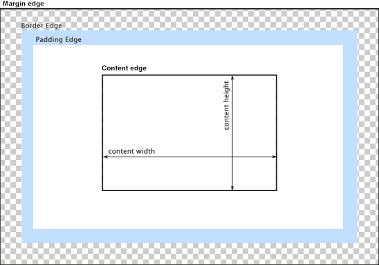
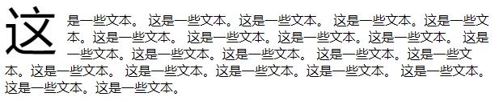
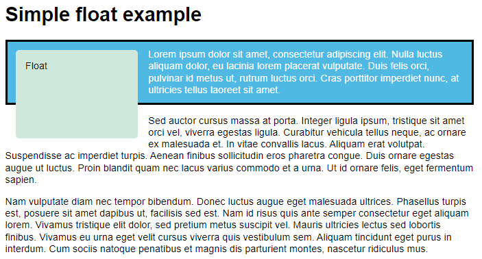

# 视觉格式化模型

https://developer.mozilla.org/zh-CN/docs/Web/CSS/Visual_formatting_model

视觉格式化模型 会根据[CSS 盒子模型](https://developer.mozilla.org/zh-CN/docs/Web/CSS/CSS_Box_Model/Introduction_to_the_CSS_box_model)将文档中的元素转换为一个个盒子，每个盒子的布局由以下因素决定：

- 盒子的尺寸：精确指定、由约束条件指定或没有指定
- 盒子的类型：行内盒子（inline）、行内级盒子（inline-level）、原子行内级盒子（atomic inline-level）、块盒子（block）
- [定位方案（positioning scheme）](https://developer.mozilla.org/zh-CN/docs/CSS/Box_positioning_scheme)：普通流定位、浮动定位或绝对定位
- 文档树中的其它元素：即当前盒子的子元素或兄弟元素
- [视口](https://developer.mozilla.org/zh-CN/docs/Glossary/Viewport) 尺寸与位置
- 所包含的图片的尺寸
- 其他的某些外部因素

## 基础盒子模型介绍

https://developer.mozilla.org/zh-CN/docs/Web/CSS/CSS_Box_Model

https://developer.mozilla.org/zh-CN/docs/Web/CSS/CSS_Box_Model/Introduction_to_the_CSS_box_model

每个盒子由四个区域组成，其效用由它们各自的边界（Edge）所定义；
与盒子的四个组成区域相对应，每个盒子有四个边界：*内容边界* *Content edge*、*内边距边界* *Padding Edge*、*边框边界* *Border Edge*、*外边框边界* *Margin Edge*：



- **内容区域 content area**：由 **内容边界** 限制，容纳着元素的“真实”内容，例如文本、图像，或是一个视频播放器。它的尺寸为 内容宽度（或称 **content-box 宽度**）和 内容高度（或称 **content-box 高度**）。它通常含有一个背景颜色（默认颜色为透明）或背景图像
  - 如果 [`box-sizing`](#box-sizing) 属性值为 `content-box`（默认），则内容区域的大小可明确地通过 `width`、`min-width`、`min-height`、`max-width` 和 `max-height` 控制
- **内边距区域 padding area**：由 **内边距边界** 限制，扩展自内容区域，负责延伸内容区域的背景，填充元素中内容与边框的间距。它的尺寸是 **padding-box 宽度** 和 **padding-box 高度**；
  - 内边距的粗细可以由 `padding-top`、`padding-right`、`padding-bottom`、`padding-left` 和简写属性 `padding` 控制。
- **边框区域 border area**：由 **边框边界** 限制，扩展自内边距区域，是容纳边框的区域。其尺寸为 **border-box 宽度** 和 **border-box 高度**；
  - 边框的粗细由 `border-width` 和简写的 `border` 属性控制；
  - 如果 [`box-sizing`](#box-sizing) 属性被设为 `border-box`，那么边框区域的大小可明确地通过 `width`、`min-width`、`min-height`、`max-width` 和 `max-height` 控制
  - 假如框盒上设有背景（`background-color` 或 `background-image`），背景将会一直延伸至边框的外沿（默认为在边框下层延伸，**边框会盖在背景上**）。此默认表现可通过 CSS 属性 `background-clip` 来改变
- **外边距区域 margin area**：由 **外边距边界** 限制，用空白区域扩展边框区域，以分开相邻的元素。它的尺寸为 **margin-box 宽度** 和 **margin-box 高度**；
  - 外边距区域的大小由 `margin-top`、`margin-right`、`margin-bottom`、`margin-left` 和简写属性 `margin` 控制
  - 在发生 **外边距合并** 的情况下，由于盒之间共享外边距，外边距不容易弄清楚。
- **注意**：除 [可替换元素](https://developer.mozilla.org/zh-CN/docs/Web/CSS/Replaced_element) 外，对于行内元素来说，尽管内容周围存在内边距与边框，但其占用空间（每一行文字的高度）则由 [`line-height`](https://developer.mozilla.org/zh-CN/docs/Web/CSS/line-height) 属性决定，即使边框和内边距仍会显示在内容周围。

- 元素盒子有两个部分是可见的：**内容区域** 和 **边框区域**
- **块容器**：最近的祖先块元素的 内容盒子 称为该元素的 块容器；


## 块、元素、盒子 术语

- **块**：block，一个抽象的概念，一个块在文档流上占据一个独立的区域，块与块之间在垂直方向上按照顺序依次堆叠。
- **包含块**：containing block，包含其他盒子的块称为包含块。
- **盒子**：box，一个抽象的概念，由 CSS 引擎根据文档中的内容所创建，主要用于文档元素的定位、布局和格式化等用途。盒子与元素并不是一一对应的，有时多个元素会合并生成一个盒子，有时一个元素会生成多个盒子（如匿名盒子）。
- **块级元素**：block-level element，元素的 `display` 为 `block`、`list-item`、`table` 时，该元素将成为块级元素。元素是否是块级元素仅是元素本身的属性，并不直接用于格式化上下文的创建或布局。
- **块级盒子**：block-level box，**由块级元素生成**。一个块级元素至少会生成一个块级盒子，但也有可能生成多个（例如列表项元素）。
- **块盒子**：block box，如果一个 块级盒子 同时也是一个 块容器盒子（见下），则称其为块盒子。除具名块盒子之外，还有一类块盒子是匿名的，称为匿名块盒子（Anonymous block box），匿名盒子无法被 CSS 选择符选中。
  - 块盒子会在内联的方向上扩展并占据父容器在该方向上的所有可用空间，在绝大数情况下意味着 **块级盒子会和父容器一样宽**
  - 每个盒子都 **会换行** 
  - 内容区域 (标签) 可以使用 `width` 和 `height` 属性
  - 内边距、外边距、边框 会将其他元素从当前盒子周围推开
  - 标题 (`<h1>`等) 、段落 (`<p>`) 默认是 块级盒子
- **块容器盒子**：block container box 或 block containing box，块容器盒子侧重于当前盒子作为“容器”的这一角色，它不参与当前块的布局和定位，它所描述的仅仅是当前盒子与其后代之间的关系。换句话说，块容器盒子主要用于确定其子元素的定位、布局等。

**注意**：盒子分为“块盒子”和“块级盒子”两种，但元素只有“块级元素”，而没有“块元素”。下面的“行内级元素”也是一样。

- **行内级元素**：inline-level element，`display` 为 `inline`、`inline-block`、`inline-table` 的元素称为 行内级元素。与块级元素一样，元素是否是行内级元素仅是元素本身的属性，并不直接用于格式化上下文的创建或布局。
- **行内级盒子**：inline-level box，**由行内级元素生成**。行内级盒子包括行内盒子和原子行内级盒子两种，区别在于该盒子是否参与行内格式化上下文的创建。
- **行内盒子**：inline box，参与 行内格式化上下文 创建的 行内级盒子 称为行内盒子。与块盒子类似，行内盒子也分为具名行内盒子和匿名行内盒子（anonymous inline box）两种。
  - 盒子 **不会换行** 
  - 内容区域 (标签) 无法使用 `width` 和 `height` 属性
  - **垂直方向** 的 内边距、外边距、边框 会被应用，但 **不会** 把其他处于 `inline` 状态的盒子推开
  - **水平方向** 的 内边距、外边距、边框 会被应用，且 **会** 把其他处于 `inline` 状态的盒子推开
  - 链接 `<a>` 、 `<span>`、 `<em>` 以及 `<strong>` 都是默认处于 `inline` 状态的
- **原子行内级盒子**：atomic inline-level box，不参与行内格式化上下文创建的行内级盒子。原子行内级盒子一开始叫做原子行内盒子（atomic inline box），后被修正。原子行内级盒子的内容不会拆分成多行显示。


## 布局与包含块

https://developer.mozilla.org/zh-CN/docs/Web/CSS/Containing_block


# 外边距 `margin`

| 属性            | 说明                |
| :-------------- | :------------------ |
| `margin`        | 设置所有外边距属性  |
| `margin-top`    | 设置元素的 上外边距 |
| `margin-right`  | 设置元素的 右外边距 |
| `margin-bottom` | 设置元素的 下外边距 |
| `margin-left`   | 设置元素的 左外边距 |

- `margin` 属性设置元素的所有外边距属性，其是`margin-top`、`margin-right`、`margin-bottom`、`margin-left` 的简写属性

- `margin` 属性用于定义容器的留白，不属于容器本身

- `margin` 不是元素尺寸的一部分，因此元素的 **宽度** `width` 和 **高度** `height` 属性不包含 外边距 的宽度

- `margin` 属性可有 1-4 个属性值，用空格 ` ` 隔开，**允许负值**，

  - 正值时会在 `border` 边框的基础上向内扩张，将其它元素推开
  - 负值时会在 `border` 边框的基础上向内收缩，元素大小不变

- `margin-top`、`margin-right`、`margin-bottom`、`margin-left` 只能有一个属性值，取值如下：

  | 属性值    | 描述                                          |
  | :-------- | :-------------------------------------------- |
  | `auto`    | 浏览器 自动计算外边距 (**居中**)              |
  | *length*  | (**默认：`0px`**) 以具体单位计的 外边距值     |
  | *%*       | 基于父元素的 **水平宽度** 的百分比的 外边距值 |
  | `inherit` | 从父元素继承外边距。                          |


## 外边距折叠

https://developer.mozilla.org/zh-CN/docs/Web/CSS/CSS_Box_Model/Mastering_margin_collapsing

- **外边距折叠**：两个元素的上边距和下边距相接时，外边距将自动合并为一个外边距，其 **值** 为最大的单个外边距的大小


## 外边距塌陷

- **外边距塌陷**：**嵌套** 的 **块级元素**，子元素的 `margin-top` 属性会作用在父元素上，导致父元素一起下移，可以通过以下方法解决：
  - 父元素设置 `border-top` 或 `padding-top` 属性
  - 父元素**设置 `overflow: hidden` 属性**，然后子元素设置 `margin-top` 属性可以生效
  - 子元素设置 `display: inline-block;` 属性，变为 行内块 形式
  - 设置 **浮动**


## 行内元素的 内外边距

- 行内元素的 水平内外边距 可以生效，垂直内外边距 无效；可以使用 行高 `line-height` 属性；


# 内边距 `padding`

| 属性             | 说明                |
| :--------------- | :------------------ |
| `padding`        | 设置所有内边距      |
| `padding-top`    | 设置元素的 上内边距 |
| `padding-right`  | 设置元素的 右内边距 |
| `padding-bottom` | 设置元素的 下内边距 |
| `padding-left`   | 设置元素的 左内边距 |

- `padding` 属性设置元素的所有 内边距 属性，用于将 内容 推离 边框；其是`padding-top`、`padding-right`、`padding-bottom`、`padding-left` 的简写属性

- `padding` 属性可有 1-4 个属性值，用空格 ` ` 隔开，**不许负值**；

- `padding`、`padding-right`、`padding-bottom`、`padding-left` 只能有一个属性值，取值如下：

  | 属性值    | 说明                                         |
  | :-------- | :------------------------------------------- |
  | *length*  | (**默认：`0px`**) 规定以具体单位计的填充值   |
  | *%*       | 规定基于父元素的 **水平宽度** 的百分比的填充 |
  | `inherit` | 从父元素继承padding                          |


# 清除默认边距

```
* {
	margin: 0;
	padding: 0;
}
```

- 通配符选择器可以替换成具体的其它选择器

- 


# 尺寸 `width` `height`

| 属性         | 描述               |
| :----------- | :----------------- |
| `width`      | 设置元素的宽度     |
| `height`     | 设置元素的高度     |
| `max-width`  | 设置元素的最大宽度 |
| `max-height` | 设置元素的最大高度 |
| `min-width`  | 设置元素的最小宽度 |
| `min-height` | 设置元素的最小高度 |

- `width` `height` 属性值：

  | 属性值 (`width` `height`) | 描述                                       |
  | :------------------------ | :----------------------------------------- |
  | `auto`                    | (**默认**) 浏览器会自动设定 宽度 和 高度   |
  | *length*                  | 使用 px、cm 等单位定义 宽度 和 高度        |
  | *%*                       | 基于 包含块 (父元素) 的百分比 宽度 和 高度 |
  | `inherit`                 | 从父元素继承                               |

- `max-width` `max-height` 属性：不包括 内边距、边框、页边距

  - 元素实际显示的 宽度、高度 会由浏览器自动计算，但比 `max-width` `max-height` 小
  - `max-width` 常用于在没有足够空间以原有宽度展示图像时，让图像缩小，同时确保它们不会比这一宽度大。

  | 属性值 (`max-width` `max-height`) | 描述                                             |
  | :-------------------------------- | :----------------------------------------------- |
  | `auto`                            | (**默认**) 浏览器会自动设定                      |
  | `none`                            | 元素的 最大宽度、最大高度 没有限制               |
  | *length*                          | 元素的 最大宽度、最大高度 值                     |
  | *%*                               | 基于 包含块 (父元素) 的百分比 最大宽度、最大高度 |
  | `inherit`                         | 从父元素继承                                     |

- `min-width` `min-height` 属性：不包括 内边距、边框、页边距

  - 元素实际显示的 宽度、高度 会由浏览器自动计算，但比 `min-width` `min-height` 大
  - 在 CSS3 中默认值为 `auto`，在 CSS2 中默认值为 `0`；

  | 属性值 (`min-width` `min-height`) | 描述                                             |
  | :-------------------------------- | :----------------------------------------------- |
  | `auto`                            | (**默认**) 浏览器会自动设定                      |
  | *length*                          | 元素的 最小宽度、最小高度                        |
  | *%*                               | 基于 包含块 (父元素) 的百分比 最小宽度、最小高度 |
  | inherit                           | 从父元素继承                                     |

- [`line-size`](#line-size) [`block-size`](#block-size) 属性可以根据 书写模式 `writing-mode` 属性的不同设置相应的宽度和高度


# 内减模式 `box-sizing`

-  **盒模型大小**：即**元素大小**，使用 `width` 和 `height` 属性确定盒子的大小
-  <a name="box-sizing">`box-sizing`</a> 属性定义 `border`、`pandding` 属性时，`width` 和 `height` 属性设定的属性值会被 **忽略**，(属性值存在，但不等于设定的值)；
-  `border-box` **不包含 `margin`**：`margin` 不计入实际大小 (只影响盒子外部空间)  

| 属性值 (`box-sizing`) | 说明                                                         |
| :-------------------- | :----------------------------------------------------------- |
| `content-box`         | (**默认**) **元素** 宽度不包括 **边框** 和 **内边距** 的宽度 |
| `border-box`          | **元素** 宽度包括 **边框** 和 **内边距** 的宽度<br />大多数情况下，这使得我们更容易地设定一个元素的宽高 |
| `inherit`             | 从父元素继承                                                 |


# 盒子阴影 `box-shadow`

盒子阴影见：属性--边框和背景--盒子阴影


# 溢出 `overflow`

- **溢出**：在盒子无法容纳下太多的内容的时候发生溢出，并继续显示

| 属性                    | 描述                                                        |
| :---------------------- | :---------------------------------------------------------- |
| [`overflow`](#overflow) | 如果内容溢出了元素内容区域，如何处理溢出内容                |
| `overflow-x`            | 如果内容溢出了元素内容区域，是否对内容的左/右边缘进行裁剪。 |
| `overflow-y`            | 如果内容溢出了元素内容区域，是否对内容的上/下边缘进行裁剪。 |
| `overflow-style`        | 规定溢出元素的首选滚动方法。                                |

- <a name="overflow">`overflow`</a> 属性：是 `overflow-x`，`overflow-y` 的简写属性，**注意顺序**；

  - 可以拥有1-2个属性值：
    - 1个属性值时，`overflow-x`、`overflow-y` 属性值相同；
    - 2个属性值时，用 **空格**  隔开，`overflow-x` 属性值在前、`overflow-y` 属性值在后

  | 属性值 (`overflow`) | 描述                                                      |
  | :------------------ | :-------------------------------------------------------- |
  | `visible`           | (**默认**) 内容 不会被修剪，会呈现在元素框之外            |
  | `hidden`            | 内容 会被修剪，并且其余内容是 不可见的                    |
  | `scroll`            | 内容 会被修剪，但是浏览器会显示 滚动条 以便查看其余的内容 |
  | `auto`              | 如果内容被修剪，则浏览器会 在裁剪的方向上 显示滚动条      |
  | `inherit`           | 规定应该从父元素继承 overflow 属性的值                    |

- `overflow-style` 规定溢出元素的首选滚动方法，目前 无浏览器支持 该属性

- `overflow-wrap` 属性：一个不能被分开的字符串太长而不能填充其包裹盒时，为防止其溢出，浏览器是否允许这样的单词中断换行；常使用 `overflow-wrap: break-word` 属性， https://developer.mozilla.org/zh-CN/docs/Web/CSS/overflow-wrap，可以比较 `word-break` 属性：https://developer.mozilla.org/zh-CN/docs/Web/CSS/word-break


# 旋转

https://www.runoob.com/cssref/css3-pr-rotation.html

https://www.runoob.com/css3/css3-pr-rotation-point.html

目前没有浏览器支持 `rotation-point` 或 `rotation` 旋转属性

可使用 `transform` 属性，属性值由 `rotate()` 函数决定：`transform:rotate(7deg);`。

`rotate()` 函数见：https://developer.mozilla.org/zh-CN/docs/Web/CSS/transform-function/rotate


# 可见性 `visibility`

- `visibility` 属性 **显示或隐藏元素** 而不更改文档的布局。该属性还可以隐藏 `<table>` 元素中的行或列

  | 属性值 (`visibility`) | 描述                                                         |
  | :-------------------- | :----------------------------------------------------------- |
  | `visible`             | (**默认**) 元素是 **可见的**                                 |
  | `hidden`              | 元素是 **不可见的**，但是其他元素的布局不改变，相当于此元素变成透明 |
  | `collapse`            | 当在表格元素中使用时，此值可删除一行或一列，但是它不会影响表格的布局<br />被行或列占据的空间会留给其他内容使用<br />如果此值被用在其他的元素上，会呈现为 `hidden` |
  | `inherit`             | 规定应该从父元素继承 visibility 属性的值                     |

注意：

- `visibility:hidden` 属性：可以隐藏某个元素，但隐藏的元素仍需 **占用** 与未隐藏之前一样的 **空间**。也就是说，该元素虽然被隐藏了，但仍然会影响布局。
- `display:none` 属性：可以隐藏某个元素，且隐藏的元素 **不会占用任何空间**。也就是说，该元素不但被隐藏了，而且该元素原本占用的空间也会从页面布局中消失。


# 盒子类型 `display`

- `display` 属性：可以设置元素的 内部显示类型 和 外部显示类型
  - 元素的 外部显示类型 *outer display types* 将决定该元素在 [流式布局](https://developer.mozilla.org/zh-CN/docs/Web/CSS/CSS_Flow_Layout) 中的表现（[块级或行内元素](https://developer.mozilla.org/zh-CN/docs/Web/CSS/CSS_Flow_Layout)）
  - 元素的 内部显示类型 *inner display types* 可以控制 **其子元素的布局**（例如：[flow layout](https://developer.mozilla.org/zh-CN/docs/Web/CSS/CSS_Flow_Layout)，[grid](https://developer.mozilla.org/zh-CN/docs/Web/CSS/CSS_Grid_Layout) 或 [flex](https://developer.mozilla.org/zh-CN/docs/Web/CSS/CSS_Flexible_Box_Layout)）
  - 个别取值的详细信息记录在独立的规范中：https://developer.mozilla.org/zh-CN/docs/Web/CSS/display

`display` 属性使用 关键字取值 来指定，关键字取值被分为六类：


## 外部显示类型

指定元素的 外部显示类型，实际上就是其在 流式布局 中的角色（即在流式布局中的表现）https://developer.mozilla.org/zh-CN/docs/Web/CSS/display-outside

| 属性值 (`display`) | 描述                                                         |
| ------------------ | ------------------------------------------------------------ |
| `block`            | 此元素将显示为 **块级元素**，此元素前后会 带有换行符         |
| `inline`           | (**默认**) 此元素会被显示为 **内联元素**，元素前后 没有换行符 |
| `run-in`           | 此元素会 根据上下文 作为块级元素或内联元素显示。             |

- `diaplay: run-in` 属性：并不是所有浏览器都支持
  - run-in 元素内部存在 block box，那么它会变成 **块级元素**；
  - 如果 其后的兄弟元素 是 块级盒子，那么这个 run-in 盒子就会以兄弟元素的第一个 **行内元素** 的形式存在；
  - 如果 其后的兄弟元素 是 行内元素，那么这个 run-in 盒子会变成 **块级元素**；


## 内部显示类型

指定元素的 内部显示类型，它们定义了该元素内部内容的布局方式（假定该元素为非替换元素 non-replaced element）https://developer.mozilla.org/en-US/docs/Web/CSS/display-inside

| 属性值 (`display`) | 描述                                                         |
| ------------------ | ------------------------------------------------------------ |
| `flow`             | 元素使用 流布局（块和内联布局）来布局其内容                  |
| `flow-root`        | 该元素生成一个块元素框，它建立一个新的[块格式化上下文](https://developer.mozilla.org/en-US/docs/Web/Guide/CSS/Block_formatting_context)，定义格式化根的位置。 |
| `table`            | 此元素会作为 块级表格 来显示（类似 `<table>`），表格前后带有换行符。 |
| `flex`             | 该元素的行为类似于 块元素，并根据 [flexbox 模型布置](https://developer.mozilla.org/en-US/docs/Web/CSS/CSS_Flexible_Box_Layout) 其内容。 |
| `grid`             | 该元素的行为类似于 块元素，并根据 [网格模型](https://developer.mozilla.org/en-US/docs/Web/CSS/CSS_Grid_Layout/Basic_Concepts_of_Grid_Layout) 布置其内容。 |
| `ruby`             | 该元素的行为类似于 内联元素，并根据 ruby 格式化模型布置其内容。<br />它的行为类似于相应的 HTML [`<ruby>`](https://developer.mozilla.org/en-US/docs/Web/HTML/Element/ruby) 元素 |


## list item

- `list-item` 关键字使元素生成一个伪元素，其 `::marker` 内容由其 [`list-style`](https://developer.mozilla.org/en-US/docs/Web/CSS/list-style) 属性（例如项目符号点）指定，以及为其自己的内容指定类型的主体框
- https://developer.mozilla.org/en-US/docs/Web/CSS/display-listitem

| 属性值 (`display`) | 描述                                                         |
| ------------------ | ------------------------------------------------------------ |
| `list-item`        | 此元素会作为 列表显示<br />元素的外部显示类型变为 block 盒，内部显示类型为多个 list-item inline 盒 |


## internal (table布局、ruby布局)

- 有些 布局模型（如 `table` 和 `ruby`）有着复杂的 **内部结构**，因此它们的子元素可能扮演着不同的角色。这一类关键字就是用来定义这些“内部”显示类型，并且只有在这些特定的布局模型中才有意义。
- https://developer.mozilla.org/zh-CN/docs/Web/CSS/display-internal

| 属性值 (`display`)   | 描述                                                         |
| -------------------- | ------------------------------------------------------------ |
| `table-caption`      | 此元素会作为一个表格标题显示（类似 `<caption></caption>`）   |
| `table-row`          | 此元素会作为一个表格 行 显示（类似 `<tr></tr>`）             |
| `table-cell`         | 此元素会作为一个表格单元格显示（类似 `<td></td>` 和 `<th></th>`） |
| `table-column-group` | 此元素会作为一个或多个 列 的分组来显示（类似 `<colgroup></colgroup>`） |
| `table-column`       | 此元素会作为一个单元格列显示（类似 `<col>`）                 |
| `table-header-group` | 此元素会作为一个或多个 行 的分组来显示（类似 `<thead></thead>`） |
| `table-row-group`    | 此元素会作为一个或多个 行 的分组来显示（类似 `<tbody></tbody>`） |
| `table-footer-group` | 此元素会作为一个或多个行的分组来显示（类似 `<tfoot></tfoot>`） |
|                      |                                                              |
| ruby-base            | 这些元素的行为类似于 `<rb></rb>` 元素                        |
| ruby-text            | 这些元素的行为类似于 `<rt></rt>` 元素                        |
| ruby-base-container  | 这些元素的行为类似于 `<rbc>` 匿名框生成的 HTML 元素          |
| ruby-text-container  | 这些元素的行为类似于 `<rtc>` HTML 元素                       |


## box

- 这些值决定元素是否使用盒模型
- https://developer.mozilla.org/zh-CN/docs/Web/CSS/display-box

| 属性值 (`display`) | 描述                                                         |
| ------------------ | ------------------------------------------------------------ |
| `contents`         | 这些元素自己不显示。它们被它们的 伪盒（pseudo-box）和 子项盒（child boxes）取代 |
| `none`             | 此元素不会被显示，不影响布局（文件中没有该元素）<br />所有 子项 也不会被显示 |

- `display: none` 属性：不要为元素创建盒子，该元素没有后代元素，在页面中不占据任何位置


## legacy

- 对于相同布局模式的 **block 级** 和 **inline 级** **变体** 需要使用单独的 关键字
- https://developer.mozilla.org/zh-CN/docs/Web/CSS/display-legacy

| 属性值 (`display`) | 描述                                                         | 双关键字           |
| ------------------ | ------------------------------------------------------------ | ------------------ |
| `inline-block`     | 元素会产生一个 块级元素盒子，并且像行内盒子一样（表现得更像一个被替换的元素），可以融入到周围内容中 | `inline flow-root` |
| `inline-table`     | 表现为一个 `<table></table>` 元素， 但是又表现为一个 不同于块级盒子的行内盒子<br />表盒子内部是一个块级上下文 | `inline table`     |
| `inline-flex`      | 元素表现为一个行内元素，并对 内容 采用弹性盒子模型进行布局   | `inline flex`      |
| `inline-grid`      | 元素表现为一个行内元素，并对 内容 采用网格模型进行布局       | `inline grid`      |

- `dispaly: inline-block` 属性：外部与行内盒子相同，会与周围元素相邻；内部可以应用块级盒子的属性，如 `width`、`height`、`margin` 等；


## 其它属性

| 值        | 描述                                                         |
| :-------- | :----------------------------------------------------------- |
| `compact` | CSS 中有值 compact，不过由于缺乏广泛支持，已经从 CSS2.1 中删除。 |
| `marker`  | CSS 中有值 marker，不过由于缺乏广泛支持，已经从 CSS2.1 中删除。 |
| `inherit` | 规定应该从父元素继承 display 属性的值。                      |


# 浮动盒子

| 属性    | 描述                             |
| :------ | :------------------------------- |
| `float` | 指定一个盒子（元素）是否可以浮动 |
| `clear` | 指定元素周围不允许有浮动元素     |


## `float`

- <a name="float">`float`</a> 属性：创建浮动盒子，浮动元素会根据 `float` 属性值 尽量向左或向右移动，直到它的 外边距边界 碰到 包含框 或 另一个浮动盒子的外边距边界 为止

  - 浮动元素 之前的 **元素内容** 不会受到影响
  - 浮动元素 之后的 **元素内容** 将 **围绕** 该浮动元素
  - 浮动盒子之间不会发生 `margin` 外边距合并
  - 可以在浮动元素上应用 `margin`，将文字推开；但不能在文字上应用 `margin` 将浮动元素推走
  - 浮动元素会被 **移出正常文档流**，且其他元素会显示在它的下方；
  - **绝对定位** 的元素 **忽略 `float` 属性**；

  | 属性值 (`float`) | 描述                                                       |
  | :--------------- | :--------------------------------------------------------- |
  | `left`           | 元素 向左 浮动                                             |
  | `right`          | 元素 向右 浮动                                             |
  | `none`           | (**默认**) 元素 **不浮动**，并会显示在其在文本中出现的位置 |
  | `inherit`        | 规定应该从父元素继承 float 属性的值                        |

  段落首字母浮动到左侧，示例：

  ```
  span {
    float:left;
    width:1.2em;
    font-size:400%;
    font-family:algerian,courier;
    line-height:80%;
  }
  ```

  ```
  <p>
  <span>这</span>是一些文本。
  这是一些文本。这是一些文本。
  这是一些文本。这是一些文本。这是一些文本。
  这是一些文本。这是一些文本。这是一些文本。
  这是一些文本。这是一些文本。这是一些文本。
  这是一些文本。这是一些文本。这是一些文本。
  这是一些文本。这是一些文本。这是一些文本。
  这是一些文本。这是一些文本。这是一些文本。
  </p>
  ```

  

  示例：

  ```
  <style>
    body {
      width: 50%;
      max-width: 900px;
      margin: 0 auto;
      font: .9em/1.2 Arial, Helvetica, sans-serif;
    }
  
    .special {
      background-color: rgb(79,185,227);
      padding: 10px;
      border: black 5px solid;
      color: #fff;
    }
    
    .box {
      float: left;
      margin: 15px;
      width: 150px;
      height: 100px;
      border-radius: 5px;
      background-color: rgb(207,232,220);
      padding: 1em;
    }
  </style>
  ```

  ```
  <body>
    <h1>Simple float example</h1>
  
    <div class="box">Float</div>
  
    <p>Lorem ipsum dolor sit amet, consectetur adipiscing elit. Nulla luctus aliquam dolor, eu lacinia lorem placerat vulputate. Duis felis orci, pulvinar id metus ut, rutrum luctus orci. Cras porttitor imperdiet nunc, at ultricies tellus laoreet sit amet. </p>
  
    <p>Sed auctor cursus massa at porta. Integer ligula ipsum, tristique sit amet orci vel, viverra egestas ligula. Curabitur vehicula tellus neque, ac ornare ex malesuada et. In vitae convallis lacus. Aliquam erat volutpat. Suspendisse ac imperdiet turpis. Aenean finibus sollicitudin eros pharetra congue. Duis ornare egestas augue ut luctus. Proin blandit quam nec lacus varius commodo et a urna. Ut id ornare felis, eget fermentum sapien.</p>
  
    <p>Nam vulputate diam nec tempor bibendum. Donec luctus augue eget malesuada ultrices. Phasellus turpis est, posuere sit amet dapibus ut, facilisis sed est. Nam id risus quis ante semper consectetur eget aliquam lorem. Vivamus tristique elit dolor, sed pretium metus suscipit vel. Mauris ultricies lectus sed lobortis finibus. Vivamus eu urna eget velit cursus viverra quis vestibulum sem. Aliquam tincidunt eget purus in interdum. Cum sociis natoque penatibus et magnis dis parturient montes, nascetur ridiculus mus.</p>
  </body>
  ```

  

  注意：**浮动盒子 对 其它元素的背景、边框 未推开**，段落的盒子仍然保持全宽度；


## 清除浮动

- **`clear` 属性**：**清除浮动**；设置多个浮动元素，默认情况下，这些元素会一个挨着一个堆叠在一起；有时一个浮动元素后面还有空间，但是下一个元素不需要跟在后面；可以使用 `clear` 属性清除元素的浮动

  | 属性值 (`clear`) | 描述                                        |
  | :--------------- | :------------------------------------------ |
  | `left`           | 左侧 不允许 呈现浮动元素                    |
  | `right`          | 右侧 不允许 呈现浮动元素                    |
  | `both`           | 左右两侧 均不允许 呈现浮动元素              |
  | `none`           | (**默认**) 左右两侧 **均允许** 呈现浮动元素 |
  | `inherit`        | 规定应该从父元素继承 clear 属性的值。       |

示例：

```
.clearfix::before,.clearfix::after {
	content: "";			/* 伪元素必须有 content 属性 */
	display: block;			/* 伪元素添加的内容默认是 行内元素 */
	clear: both;
	
	/* 使网页中看不到为元素 */
	height: 0;
	visibility: hidden;
}
```

- `overflow: hidden;` 属性也可以清除浮动，在浮动盒子的父元素中添加该属性；