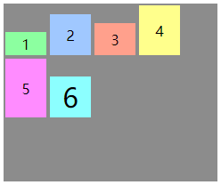

# 布局和包含块

- 一个元素的 尺寸和位置 经常受其 **包含块 (containing block)** 的影响
  - 大多数情况下，包含块 就是这个元素最近的 祖先块元素 的 内容区；但也不是总是这样
- **确定包含块**：确定一个元素的包含块的过程完全依赖于这个元素的 [`position`](#position) 定位属性：
  - 如果 `position` 属性为 **`static`**、**`relative`** **或 `sticky`**，包含块可能由它的最近的祖先**块元素** (比如说 inline-block, block 或 list-item 元素) 的内容区的边缘组成，也可能会建立格式化上下文 (比如说 a table container, flex container, grid container, 或者是 the block container 自身)。
  - 如果 `position` 属性为 **`absolute`** ，包含块就是由它的最近的 position 的值不是 `static` （也就是值为`fixed`, `absolute`, `relative` 或 `sticky`）的祖先元素的内边距区的边缘组成。
  - 如果 `position` 属性是 **`fixed`**，在连续媒体的情况下 (continuous media) 包含块是 [viewport](https://developer.mozilla.org/zh-CN/docs/Glossary/Viewport) ,在分页媒体 (paged media) 下的情况下包含块是分页区域 (page area)。
  - 如果 `position` 属性是 `absolute` 或 `fixed`，包含块也可能是由满足以下条件的最近父级元素的内边距区的边缘组成的：
    1. [`transform`](https://developer.mozilla.org/zh-CN/docs/Web/CSS/transform) 或 [`perspective`](https://developer.mozilla.org/zh-CN/docs/Web/CSS/perspective) 的值不是 `none`
    2. [`will-change`](https://developer.mozilla.org/zh-CN/docs/Web/CSS/will-change) 的值是 `transform` 或 `perspective`
    3. [`filter`](https://developer.mozilla.org/zh-CN/docs/Web/CSS/filter) 的值不是 `none` 或 `will-change` 的值是 `filter`(只在 Firefox 下生效).
    4. [`contain`](https://developer.mozilla.org/zh-CN/docs/Web/CSS/contain) 的值是 `paint` (例如: `contain: paint;`)


# 正常流布局 Normal Flow Layout

https://developer.mozilla.org/zh-CN/docs/Learn/CSS/CSS_layout/Normal_Flow

https://developer.mozilla.org/zh-CN/docs/Web/CSS/CSS_Flow_Layout

https://developer.mozilla.org/en-US/docs/Web/CSS/CSS_Display

正常布局流 (normal flow)：指在不对页面进行任何 布局控制 时，浏览器默认的 HTML 布局方式

- 默认，一个 块级元素 的内容宽度是其父元素的 100%，其高度与其内容高度一致
- 块级元素：按照基于其父元素的 **书写模式 `writing-mode` 属性** (*默认值：* horizontal-tb) 的*块流动方向 (block flow direction)*放置；每个块级元素会在上一个元素下面另起一行，它们会被设置好的 `margin` 分隔
- 内联元素：不会另起一行；只要在其父级块级元素的宽度内有足够的空间，它们与其他内联元素、相邻的文本内容（或者被包裹的）被安排在同一行。如果空间不够，溢出的文本或元素将移到新的一行。

下列布局技术会覆盖默认的布局行为：

- **`display` 属性**：在 css 中实现页面布局的主要方法是设定 `display` 属性的值；此属性允许我们更改默认的显示方式；正常流中的所有内容都有一个 `display` 的值，用作元素的默认行为方式。
- **弹性盒子**：用于创建横向或是纵向的一维页面布局
  - 在想要进行 flex 布局的 **父元素** 上应用`display: flex` ，所有 直接子元素 都将会按照 flex 进行布局
- **网格布局**：
- **浮动 `float` 属性**：让块级元素互相并排成一行，而不是一个堆叠在另一个上面
- **定位 `position` 属性**：允许精准设置盒子中的盒子的位置；正常布局流中，默认为 `static` ；使用其它值会引起元素不同的布局方式，例如将元素固定到浏览器视口的左上角。
- **表格布局**：表格的布局方式可以用在非表格内容上，可以使用`display: table`和相关属性在非表元素上使用
- **多列布局**— 这个 [Multi-column layout](https://developer.mozilla.org/en-US/docs/Web/CSS/CSS_Columns) 属性 可以让块按列布局，比如报纸的内容就是一列一列排布的。


# 弹性盒子布局 flex

https://www.runoob.com/css3/css3-flexbox.html

https://developer.mozilla.org/zh-CN/docs/Learn/CSS/CSS_layout/Flexbox

https://developer.mozilla.org/zh-CN/docs/Web/CSS/CSS_Flexible_Box_Layout

https://developer.mozilla.org/zh-CN/docs/Web/CSS/CSS_Flexible_Box_Layout/Basic_Concepts_of_Flexbox

- 对目标元素使用 **`display:flex` 属性**，使其成为 弹性盒子 (**块级元素**)
- 弹性盒子布局 常用场景：
  - 当页面需要适应不同的屏幕大小以及设备类型时，确保元素拥有恰当的行为
  - 使容器的所有子项占用等量的可用宽度/高度，而不管有多少宽度/高度可用
  - 使多列布局中的所有列采用 相同的高度，即使它们包含的内容量不同

- 弹性盒子布局：
  - 更加有效的对容器中的子元素进行 排列、对齐 和 分配空白空间
  - 弹性盒子布局是一种用于 按行或按列 布局元素的 **一维** 布局方法；**二维**布局 网格布局，可以同时处理行和列上的布局
  - 元素可以 **膨胀** 以填充额外的空间，**收缩** 以适应更小的空间；

**弹性盒子相关属性**：

| 属性                                  | 描述                                                         |
| :------------------------------------ | :----------------------------------------------------------- |
| `flex-flow`                           | `flex-direction`，`flex-wrap` 的简写属性                     |
| [`flex-direction`](#flex-direction)   | 指定 弹性容器 中 弹性项目 的排列方向                         |
| [`flex-wrap`](#flex-wrap)             | 设置弹性盒子的子元素超出父容器时是否换行                     |
|                                       |                                                              |
| `flex`                                | 设置弹性盒子的子元素如何 **分配空间**                        |
| [`flex-basis`](#flex-basis)           | 设置 弹性项目 在主轴方向上的初始大小                         |
| [`flex-grow`](#flex-grow)             | 设置 弹性项目 在主轴方向上的 相对 **扩展** 比例              |
| [`flex-shrink`](#flex-shrink)         | 设置 弹性项目 在主轴方向上的 相对 **收缩** 比例              |
|                                       |                                                              |
| [`justify-content`](#justify-content) | 设置弹性盒子元素在 主轴（横轴）方向上的对齐方式              |
| [`align-items`](#align-items)         | 设置弹性盒子元素在 交叉轴（纵轴）方向上的对齐方式            |
| [`align-self`](#align-self)           | 在弹性子元素上使用。覆盖弹性容器的 `align-items` 属性。      |
| [`align-content`](#align-content)     | 修改 `flex-wrap` 属性的行为，类似 `align-items`,<br />但不是设置子元素对齐，而是设置行对齐 |
| [`order`](#order)                     | 设置弹性盒子的子元素排列顺序。                               |

- `flex-flow` 属性：[`flex-direction`](#flex-direction)，[`flex-wrap`](#flex-wrap) 属性的 简写属性；
- `flex` 属性：[`flex-grow`](#flex-grow)，[`flex-shrink`](#flex-shrink)，[`flex-basis`](#flex-basis) 属性的 简写属性，**注意顺序**；


## flex 模型说明


- **主轴** (main axis)：沿着 flex 元素放置的方向 延伸的轴（比如页面上的 **横向的行**、**纵向的列**）。该轴的开始和结束被称为 **main start** 和 **main end**；
- **交叉轴** (cross axis)：垂直于 flex 元素放置方向 的轴。该轴的开始和结束被称为 **cross start** 和 **cross end**；
- **弹性容器** (flex container)：设置了 `display: flex` 或 `display: inline-flex` 的元素；
- **弹性项目** (Flex item)：在 flex 容器中 表现为 柔性的盒子 的元素，又称 flex 子元素；
  - 弹性容器 可包含了 一个或多个 弹性项目；
  - 弹性项目 **默认** 在弹性盒子内一行显示；
  - 所有弹性项目的宽度、高度相同；
  - 弹性项目 不可以在主轴方向拉伸，但是可以缩小；可以在交叉轴方向拉伸；
  - 弹性项目 之间的 **外边距** `margin` 不会合并，且外边距边界 紧贴 弹性容器边界；
- 正负自由空间：
  - **正自由空间 (positive free space)**：当 flex 子元素 在主轴上的尺寸（大小）之和小于 flex 容器 的尺寸时，flex 容器中就会有多余的空间没有被填充，这些空间就被叫做 positive free space；
  - **负自由空间 (negative free space)**：当 flex 子元素在主轴上的尺寸之和大于 flex 容器的尺寸时，flex 容器的空间就不够用，此时 flex 子元素的尺寸之和 减去 flex 容器的尺寸（flex 子元素溢出的尺寸）就是 negative free space；这个 negative free space 加上 flex 容器的尺寸 刚好可以容纳 flex 子元素；
- **默认** 每个弹性容器只有一行；
- 当主轴是水平的时：**书写模式 [`writing-mode`](#writing-mode) 属性** 可以改变 弹性容器内 弹性项目的排列方向 (从左到右 或 从右到左)；

**注意：** **弹性容器外** 及 **弹性项目内** 是正常渲染的。弹性盒子只定义了 弹性项目如何在弹性容器内布局。

示例：

```html
<div id="container" class="flex">
    <div id="item1">1</div>
    <div id="item2">2</div>
    <div id="item3">3</div>
    <div id="item4">4</div>
    <div id="item5">5</div>
    <div id="item6">6</div>
</div>
```

```css
#container {
    height:200px;
    width: 240px;
    background-color: #8c8c8c;
}

.flex {
    display: flex;            /* 盒子类型 弹性盒子 */

    /* flex-flow */
    flex-direction: row;      /* 主轴方向 水平从左到右 */
    flex-wrap: nowrap;        /* 弹性项目 单行显示 */
    
    justify-content: flex-start;   /* 主轴 对齐方式 主轴起点对齐 (默认值为 normal) */
    align-items: flex-start;       /* 交叉轴 对齐方式 交叉轴起点对齐 (默认值为 normal) */

    align-content: flex-start;   /* 交叉轴方向 分配正自由空间 拉伸 (默认值为 normal) */
}

div > div {
    box-sizing: border-box;
    border: 2px solid #8c8c8c;
    width: 50px;
    display: flex;
    align-items: center;      /* 设置数字在弹性项目中的 垂直位置 */
    justify-content: center;  /* 设置数字在弹性项目中的 水平位置 */
}

#item1 {
    background-color: #8cffa0;
    min-height: 30px;
    
    /* flex */
    flex-grow: 0;             /* 主轴方向 分配正自由空间 不分配 */
    flex-shrink: 1;           /* 主轴方向 消除负自由空间 等比 */
    flex-basis: auto;         /* 弹性项目 在主轴方向 宽度 自动*/
    
    order: 0;                 /* 排序 */
}

#item2 {
    background-color: #a0c8ff;
    min-height: 50px;
    
    /* flex */
    flex-grow: 0;
    flex-shrink: 1;
    flex-basis: auto;
    order: 0;
}

#item3 {
    background-color: #ffa08c;
    min-height: 40px;
    
    /* flex */
    flex-grow: 0;
    flex-shrink: 1;
    flex-basis: auto;
    
    order: 0;
}

#item4 {
    background-color: #ffff8c;
    min-height: 60px;
    
    /* flex */
    flex-grow: 0;
    flex-shrink: 1;
    flex-basis: auto;
    
    order: 0;
}

#item5 {
    background-color: #ff8cff;
    min-height: 70px;
    
    /* flex */
    flex-grow: 0;
    flex-shrink: 1;
    flex-basis: auto;
    
    order: 0;
}

#item6 {
    background-color: #8cffff;
    min-height: 50px;
    font-size: 30px;
    
    /* flex */
    flex-grow: 0;
    flex-shrink: 1;
    flex-basis: auto;
    
    order: 0;
}
```


## 主轴方向 `flex-direction`

- <a name="flex-direction">`flex-direction`</a> 属性：适用于 **弹性容器**，指定 **主轴的方向**；

| 属性值 (`flex-direction`) | 描述                                                         |
| :------------------------ | :----------------------------------------------------------- |
| `row`                     | (**默认**) 主轴方式为 **横向的行**；<br />主轴起点 和 主轴终点 与 内容方向 相同(正方向) |
| `row-reverse`             | 与 `row` 相同，置换了 主轴起点 和 主轴终点 (反方向)          |
| `column`                  | 主轴方式为 **横向的行**；<br />主轴起点 与 主轴终点 和 书写模式的前后点 相同 (正方向) |
| `column-reverse`          | 与 `column` 相同，置换了 主轴起点 和 主轴终点 (反方向)       |
| `initial`                 | 设置该属性为它的默认值                                       |

**书写模式 [`writing-mode`](#writing-mode) 属性**；

示例：

- `flex-direction: row;`：


​		`flex-shrink: 1;`，`flex-basis: auto;` ，虽然弹性项目总宽度小于弹性容器宽度，但弹性项目不会溢出

- `flex-direction: row-reverse;`：


- `flex-direction: column;`：


- `flex-direction: column-reverse;`：


## 多行 `flex-wrap`

- <a name="flex-wrap">`flex-wrap`</a> 属性：指定 弹性项目 **单行显示** 还是 **多行显示**；如果允许换行，这个属性允许你控制行的 **堆叠方向**；
  - 单行显示时：
    - 若弹性项目总宽度小于容器最大宽度，则多余的可用空间在最后一个盒子后面
    - 若弹性项目总宽度小于容器最大宽度，则弹性项目的宽度会缩小
  - 多行显示时：
    - 若容器宽度 不是 弹性项目宽度 的倍数，则每行都会有多余的可用空间
    - 若容器高度 大于 弹性项目总高度，则 每行弹性项目下方 会有 等高的 多余可用空间
- 若元素不是弹性盒子对象的元素，则 `flex-wrap` 属性不起作用;

| 属性值 (`flex-wrap`) | 描述                                                         |
| :------------------- | :----------------------------------------------------------- |
| `nowrap`             | (**默认**) 弹性子项 不拆行不拆列，可能导致 flex 容器溢出     |
| `wrap`               | 弹性子项 在必要的时候 拆行或拆列                             |
| `wrap-reverse`       | 和 `wrap` 的行为一样，但是 交叉轴 **cross-start** 和 **cross-end** 互换 |
| `initial`            | 设置该属性为它的默认值                                       |

示例：

- `flex-wrap: nowrap;`：


- `flex-wrap: wrap;`：


- ```
  flex-direction: row-reverse;
  flex-wrap: wrap;
  ```


- `flex-wrap: wrap-reverse;`：


## 主轴 初始大小 `flex-basis`

- <a name="flex-basis">`flex-basis`</a> 属性：适用于 **弹性项目**，**不能继承**；可在弹性容器中应用然后继承； 指定 弹性项目 在**主轴方向上的初始大小**；
- 如果不使用 [`box-sizing`](#box-sizing) 改变盒模型的话，那么这个属性就决定了 弹性子项元素 的 内容盒 (content-box) 的尺寸；无论是否使用 `box-sizing` 属性，都**不包括 外边距 `margin`**；
- 当一个元素 同时被设置了 `flex-basis` (除值为 `auto` 外) 和 `width` (或在 `flex-direction: column` 情况下设置了`height`)，**`flex-basis` 具有更高的优先级**；
- 弹性项目 使用 `flex-basis` 属性设置的大小 小于 元素内容的大小时，主轴方向的大小会自动扩展到 内容的宽度，见 `flex-basis: 0;` 示例：

| 属性值 (`flex-basis`) | 描述                                       |
| --------------------- | ------------------------------------------ |
| `auto`                | (**默认**) 浏览器自动指定                  |
| *length*              | 固定长度                                   |
| *%*                   | 相对于其父弹性盒容器主轴尺寸               |
| `content`             | 基于 弹性项目元素 的 **内容** 自动调整大小 |

`flex-basis: min-content;` 示例：宽度为 `max-content`，(`flex-basis: auto;` 属性结果相同)


`flex-basis: 0;` 示例：宽度为 `flex-basis: min-content;`：


示例：

- `flex-basis: min-content;`：

  ```css
  /* flex */
  flex-grow: 0;             /* 主轴方向 分配正自由空间 不分配 */
  flex-shrink: 0;           /* 主轴方向 消除负自由空间 等比 */
  flex-basis: min-content;         /* 弹性项目 在主轴方向 宽度 自动*/
  ```


## `flex`

- `flex` 属性：[`flex-grow`](#flex-grow)，[`flex-shrink`](#flex-shrink)，[`flex-basis`](#flex-basis) 属性的 简写属性，**注意顺序**；
  - `flex-grow`：**省略** 时默认值为 1。 (初始值为 `0`)
  - `flex-shrink`：**省略** 时默认值为 1。 (初始值为 `1`)
  - `flex-basis`：**省略** 时默认值为 0。 (初始值为 `auto`)
- `flex` 属性可以拥有 1个、2个、3个属性值：
  - 1个属性值：
    - 无单位的数 (*number*)：表示 `flex-grow` 属性值；
    - 有单位的宽度 (*length*)：表示 `flex-basis` 属性值；
    - 关键字 `none`，`auto`，`initial`；
      - `flex:initial` 属性表示：`flex: 0 1 auto`；即 **默认属性值**；
      - `flex:auto` 属性表示：`flex: 1 1 auto`；
      - `flex:none` 属性表示：`flex: 0 0 auto`；
  - 2个属性值：
    - 第一个值必须为一个无单位数，表示 `flex-grow` 属性值；
    - 第二个值必须为以下之一：一个无单位数，表示 `flex-shrink` 属性值；有单位的宽度，表示 `flex-basis` 属性值；
  - 3个属性值：依次为 `flex-grow`，`flex-shrink`，`flex-basis` 属性值


## 主轴 弹性项目 扩张 `flex-grow`

- <a name="flex-grow">`flex-grow`</a> 属性：应用于 **弹性项目**，**不能继承**；设置分配 positive free space；
- `flex-grow` 属性：规定 弹性项目 在 弹性容器 中，分配 positive free space 时，弹性项目 相对于 弹性容器中的其余 弹性项目 的增长程度，即 **分配剩余空间** 的 **相对比例**；
- 弹性项目 会以 `flex-basis` 属性值 为基础，沿主轴方向增长尺寸

| 属性值 (`flex-grow`) | 描述                      |
| -------------------- | ------------------------- |
| *number*             | (**默认为 `0`**) 负值无效 |


- `flex-basis` 和 `flex-grow` 结合：
  - 单独设置 `flex-basis: auto;` 属性，且没有设置 各个弹性项目的宽度 时，各个弹性项目的宽 是根据 弹性项目的内容 `max-content` 自动调整宽度大小；
  - 单独设置 `flex-basis: 0;` 属性，且没有设置 各个弹性项目的宽度 时，各个弹性项目的宽 是根据 弹性项目的内容 `min-content` 自动调整宽度大小；且计算 positive free space 时，不考虑 弹性项目 的大小；
  - 同时设置 `flex-basis: 0;` 和 `flex-grow: 1;` 属性时，剩余空间在每个 flex 子元素 之间平均分配，可能会使 各个弹性项目的宽度 不同；
  - 使 各个弹性项目的宽度 相同，可以使用 `flex: 1 1 0;` 属性；此时，弹性项目的尺寸计算值是 0，所有空间都用来争夺；
  - 使 各个弹性项目的宽度 按比例分配 弹性盒子的宽度，可设置 `flex-basis: 0;` 属性，然后对  各个弹性项目 单独设置 `flex-grow` 属性；

示例：

- `flex-grow: 0;`：

  ```
  /* flex */
  flex-grow: 0;
  flex-shrink: 0;
  flex-basis: 0;
  ```


- `flex-grow: 1;`：

  ```css
  /* flex */
  flex-grow: 1;
  flex-shrink: 0;
  flex-basis: 0;
  ```


## 主轴 弹性项目 收缩 `flex-shrink`

- <a name="flex-shrink">`flex-shrink`</a> 属性：应用于 **弹性项目**，**不能继承**；分配 negative free space；
- `flex-grow` 属性：规定 弹性项目 在 弹性容器 中，分配 positive free space 时，弹性项目 相对于 弹性容器中的其余 弹性项目 的收缩程度；
- 弹性项目 收缩时，**不会溢出** 弹性容器；

| 属性值 (`flex-shrink`) | 描述                      |
| ---------------------- | ------------------------- |
| *number*               | (**默认为 `1`**) 负值无效 |


- **`flex-basis` 和 `flex-shrink` 结合**：
  - `flex-shrink` 属性会根据 弹性项目 能够缩小的比例（多少）分配 negative space；
  - 在 negative free space 消除期间，会阻止 弹性项目 缩小到 0，最小不会小于 `min-content`；
  - 即使发生溢出，弹性项目的宽度也不会小于 `min-content`；


示例：

- `flex-shrink: 0`：

  ```css
  /* flex */
  flex-grow: 0;
  flex-shrink: 1;
  flex-basis: auto;
  ```


- `flex-shrink: 0`：


## 主轴 对齐 `justify-content`

- <a name="justify-content">`justify-content`</a> 属性：适用于 **弹性容器**，使弹性项目在 **主轴方向上对齐**；主轴方向是通过 `flex-direction` 属性设置的方向；
- <a name="justify-content">`justify-content`</a> 属性：用于分配 弹性容器主轴 (或者网格行轴) 方向 的 元素之间及其周围 的剩余空间；若没有剩余空间，该属性不生效；

| 属性值 (`justify-content`) | 描述                                                         |
| :------------------------- | :----------------------------------------------------------- |
| `flex-start`               | (**默认**) 在 **行首** 对齐；<br />每行第一个 **弹性元素** 与行首对齐，其它元素与前一个对齐 |
| `flex-end`                 | 在 **行尾** 对齐；<br />每行最后一个 弹性元素 与行尾对齐，其他元素与后一个对齐 |
| `center`                   | 居中对齐<br />每行第一个元素到行首的距离 与 每行最后一个元素到行尾的距离 相同 |
| `space-between`            | 均匀排列每个元素，首个元素放置于起点，末尾元素放置于终点     |
| `space-around`             | 均匀排列每个元素，每个 **元素周围** 分配相同的空间           |
| `space-evenly`             | 均匀排列每个元素，每个 **元素之间** 的间隔相等               |
| `initial`                  | 设置该属性为它的默认值                                       |

示例：

`justify-content: flex-start;`：


`justify-content: flex-end;`：


`justify-content: center;`：


`justify-content: space-between;`：


`justify-content: space-around;`：


`justify-content: space-evenly;`：


## 交叉轴 对齐 `align-content`

- <a name="align-content">`align-content`</a> 属性：适用于 **多列弹性容器**，表示沿着 弹性盒子布局的**纵轴** 和 网格布局的主轴 在内容项之间和周围 **分配剩余空间**；
- `align-content` 属性对 **单行** 弹性盒子模型 **无效** (即带有 `flex-wrap: nowrap` 默认属性)；

| 属性值 (`align-content`) | 描述                                                         |
| :----------------------- | :----------------------------------------------------------- |
| `stretch`                | (**默认**) 元素 沿着交叉轴的方向 **拉伸** 以适应父容器       |
| `center`                 | 所有行朝向容器的中心填充，每行互相紧挨，相对于容器居中对齐<br />容器的垂直轴起点边 和 第一行 的距离 相等于 容器的垂直轴终点边 和 最后一行 的距离 |
| `flex-start`             | 所有行从 垂直轴起点 开始填充<br />第一行的 垂直轴起点边 和 容器的垂直轴起点边 对齐，接下来的每一行紧跟前一行 |
| `flex-end`               | 所有行从垂直轴末尾开始填充<br />最后一行的 垂直轴终点 和 容器的垂直轴终点 对齐，所有后续行与前一个对齐 |
| `normal`                 | 效果取决于 布局模式                                          |
| `space-between`          | 所有行在容器中平均分布，相邻两行间距相等                     |
| `space-around`           | 均匀排列每行，**每行周围** 分配相同的空间                    |
| `space-evenly`           | 均匀排列每行，**每行之间** 分配相同的空间                    |
| `initial`                | 设置该属性为它的默认值                                       |

- `algin-content: stretch;`：
  - 如果剩余空间是负数，该值等效于 `flex-start`；
  - 在其它情况下，**剩余空间** 被所有行 **平分**，以扩大它们的侧轴尺寸。


- `align-content: center;`：


- `align-content: flex-start;`：


- `align-content: flex-end;`：


- `align-content: space-between;`：
  - 相邻两行间距相等
  - 容器的垂直轴 起点边 和 终点边 分别与 第一行 和 最后一行 的边 对齐
  - 如果 无剩余空间 或 弹性容器只有一行，该值等效于 `flex-start`


- `align-content: space-around;`：
  - 容器的垂直轴 起点边 和 终点边 分别与 第一行 和 最后一行 的距离 是 相邻两行间距 的一半；
  - 如果 无剩余空间 或 弹性容器只有一行，该值等效于 `center`


- `align-content: space-evenly;`：
  - 每行相邻的项间的距离，主开始边和第一项间的距离，以及主结束边和最后一项间的距离，完全相同；


## 交叉轴 对齐 `algin-items`

- <a name="algin-item">`algin-items`</a> 属性：适用于 **所有元素**，使弹性项目在 **交叉轴方向** 对齐；
- **弹性项目** [`align-self`](#align-self) 属性覆盖 **弹性容器** `align-items` 属性的行为

| 值           | 描述                                                         |
| :----------- | :----------------------------------------------------------- |
| `stretch`    | (**默认**) 元素 沿着交叉轴的方向 拉伸 以适应父容器           |
| `center`     | 元素位于容器的中心                                           |
| `flex-start` | 元素在 交叉轴起点 对齐                                       |
| `flex-end`   | 元素在 交叉轴终点 对齐                                       |
| `normal`     | 效果取决于 布局模式                                          |
| `baseline`   | 元素位于容器的基线上<br />如弹性盒子元素的行内轴与侧轴为同一条，则该值与 `flex-start` 等效<br />其它情况下，该值将参与基线对齐 |
| `initial`    | 设置该属性为它的默认值                                       |

- **溢出**：如果 元素在侧轴上的高度 高于 其容器的高度 (`height` 属性设定)，溢出的方向
  - `algin-items: flex-start;` 属性：向下溢出；
  - `algin-items: flex-end;` 属性：向下溢出；
  - `algin-items: center;` 属性：上下两个方向溢出相同的距离；
- **多行**：注意剩余空间的分布
- `algin-items: stretch;` 属性：
  - 若 父容器 在交叉轴方向上 没有固定宽度 (即高度)，则 所有弹性项目 将变得与 最长的弹性项目一样长 (即**弹性项目高度保持一致**)；
  - 若 父容器 在交叉轴方向上 有固定宽度 (即高度)：若弹性项目总高度 小于 弹性容器高度，则 所有弹性项目 将拉伸至整个容器，若弹性项目总高度 小于 弹性容器高度，则弹性项目 溢出 弹性容器；
- `algin-items: normal;` 属性：
  - 在 **绝对定位** 的布局中：对于 被替代的绝对定位盒子，这个效果和 `flex-start` 的效果的一样；对于其他所有绝对定位的盒子，这个效果和 `stretch` 的效果一样；
  - 在 **绝对定位** 布局的 **静态位置** 上，效果和 `stretch` 一样；
  - 对于那些 **弹性项目** 而言，效果和 `stretch` 一样；
  - 对于那些 **网格项目** 而言，效果和 `stretch` 一样，除了 有部分比例 或者 一个固定大小的盒子 的效果像 `start`；
  - 这个属性 **不适用于** 块级盒子 和 表格。

示例：(主轴对齐默认：`justify-content: flex-start;`)

`algin-items: stretch;`：


`algin-items: flex-start;`：


`algin-items: flex-end;`：



`algin-items: center;`：


`algin-items: baseline;`：弹性项目内容 (1, 2, 3, 4, 5, 6) 的基线


## 交叉轴 对齐`align-self`

- <a name="align-self">`align-self`</a> 属性：适用于 **弹性项**、**网格项**，表示 弹性项目 在 **交叉轴方向** 的对齐方式，并覆盖已有的 `align-items` 的值；
- `align-self` 属性不适用于 **块类型** 的 **盒子模型** 和 **表格单元**；
- 任何 flexbox 元素的 **侧轴方向** `margin` 值设置为 `auto`，则会忽略 `align-self`；

| 属性值 (`align-self`) | 描述                                                         |
| :-------------------- | :----------------------------------------------------------- |
| `auto`                | (**默认**) 继承 其父容器的 `align-items` 属性<br />若 没有父容器，则为 `stretch` |
| `stretch`             | 元素 沿着交叉轴的方向 拉伸 以适应父容器                      |
| `center`              | 弹性盒子元素 在该行的 侧轴（纵轴）上 居中放置                |
| `flex-start`          | 元素在 交叉轴起点 对齐                                       |
| `flex-end`            | 元素在 交叉轴终点 对齐                                       |
| `normal`              | 效果取决于 布局模式                                          |
| `baseline`            | 元素位于容器的基线上。<br />如弹性盒子元素的行内轴与侧轴为同一条，则该值与 `flex-start` 等效<br />其它情况下，该值将参与 基线对齐 |
| `initial`             | 设置该属性为它的默认值                                       |
| `inherit`             | 从父元素继承该属性                                           |

- 属性值效果参考 `algin-items` 属性，只是 单独应用于 指定弹性项目


## 排序 `order`

- <a name="order">`order`</a> 属性：规定 弹性容器 中的 **弹性项目** 在布局时的 **顺序**
  - 可以设置 **负值**；
  - 元素按照 `order` 属性值的 增序 进行布局；`order` 值大的项 比 `order` 值小的项 在显示顺序中更靠后；
  - 拥有相同 `order` 属性值的元素按照它们在源代码中出现的顺序进行布局。
- `order` 属性：仅仅对元素的视觉顺序 (**visual order**) 产生作用，并不会影响元素的逻辑或 tab 顺序。 `order` 不可以用于非视觉媒体，例如 speech。

| 属性值 (`order`) | 描述                                      |
| ---------------- | ----------------------------------------- |
| *integer*        | (**默认 `0`**) 表示此弹性项目所在的次序组 |


# 网格布局 grid

- 网格是一个 **二维布局系统**；利用网格，你可以把内容按照行与列的格式进行排版
- **`display: grid;` 属性**定义网格；将父容器改为网格布局后，他的直接子项会变为 **网格项**；
- `display: grid;` 属性 **默认** 创建 只有一列 的网格；
- 网格通常具有许多的**列 (column)**与 **行 (row)**，以及行与行、列与列之间的间隙，这个间隙一般被称为**沟槽 (gutter)**；


## 网格术语

- [显式网格 (explicit grid)](https://developer.mozilla.org/zh-CN/docs/Glossary/Grid)：使用 [`grid-template-rows`](#grid-template-rows) 和 [`grid-template-columns`](#grid-template-columns) 属性 **定义的网格**，称为 显示网格
  - [`grid-template`](#grid-template)：`grid-template-rows`、`grid-template-columns`、`grid-template-areas` 的简写属性；
- [隐式网格 (implicit grid)](https://developer.mozilla.org/zh-CN/docs/Glossary/Grid)：如果开发者将 **内容放置在显式网格之外** ，或者依赖 **自动布局** 的话，网格法 (grid algorithm) 将需要创建额外的 row 或者 column、 tracks 来包含显示网格之外的内容；为此将在隐式网格中创建 额外的轨道 (**隐式轨道**) (tracks)；当内容添加到了已定义的 tracks 之外的时候，隐式网格会被自动创建；
  -  [`grid-auto-rows`](#grid-auto-rows)、[`grid-auto-columns`](#grid-auto-columns)、[`grid-auto-flow`](grid-auto-flow)；
- [网格线 (grid lines)](https://developer.mozilla.org/zh-CN/docs/Glossary/Grid_Lines)：在显式网格中 定义轨道 的同时会创建网格线，分为 **行线** 与 **列线**；
  - 网格线可以用它们的编号来寻址：在从左到右的语言中，**列线 1** 将位于网格左侧，**行线 1** 将位于网格顶部；
  - 当创建 **隐式轨道** 去支持显式网格外的内容时，网格线也会在隐式网格中被创建，但是这些网格线 **不能通过编号来寻址**；
  - **网格线名称**：在 **显式网格** 中创建的网格线可以被命名；在轨道大小信息之前或之后，在方括号 `[]` 中命名，空格分开 轨道大小信息 与 方括号；**隐式轨道** 间的轨道不能被命名；
  - [`grid-template`](#grid-template)；
  - [`grid-row`](#grid-row)：`grid-row-start`，`grid-row-end` 的简写属性；
  - [`grid-column`](#grid-column)：`grid-column-start`，`grid-column-end` 的简写属性；
- [网格轨道 (grid tracks)](https://developer.mozilla.org/zh-CN/docs/Glossary/Grid_Tracks)：**网格轨道** 是两条网格线之间的 **空间**，分为 **行轨道** 与 **列轨道**；
  - 使用属性 `grid-template-rows` 和 `grid-template-columns` 或者简写属性 `grid` 和 `grid-template` 在 **显式网格** 中 **定义网格轨道** 及 **轨道大小**；
  - 通过将一个网格项目定位到显式网格中创建的轨道外面，在 **隐式网格** 中创建 网格轨道；
  - **隐式网格** 中创建的轨道 **默认** **自动大小**，但可以通过 `grid-auto-rows` 和 `grid-auto-columns` 属性来定义这些轨道的大小
  - [网格行 (grid row)](https://developer.mozilla.org/zh-CN/docs/Glossary/Grid_Rows)：是网格布局中的 **水平轨道**，即两个水平网格线之间的空间
  - [网格列 (grid column)](https://developer.mozilla.org/zh-CN/docs/Glossary/Grid_Column)：是网格布局中的 **垂直轨道**，即两个垂直网格线之间的空间

- [网格单元格 (grid cell)](https://developer.mozilla.org/zh-CN/docs/Glossary/Grid_Cell)：是网格中的最小单元；它是 **四条网格线之间的空间**，概念上非常像表格单元格；
- [网格区域 (grid areas)](https://developer.mozilla.org/zh-CN/docs/Glossary/Grid_Areas)：是网格中由一个或者多个网格单元格组成的 **矩形区域**；
  - 使用 [基于网格线位置放置一个项目](https://developer.mozilla.org/zh-CN/docs/Web/CSS/CSS_Grid_Layout/Line-based_Placement_with_CSS_Grid) 时，网格区域被创建；
  - 使用 [命名的网格区域定义区域](https://developer.mozilla.org/zh-CN/docs/Web/CSS/CSS_Grid_Layout/Grid_Template_Areas) 时，网格区域被创建；[`grid-area`](#grid-area)，[`grid-template-areas`](#grid-template-areas)；
- [网格间隙 (gutters)](https://developer.mozilla.org/zh-CN/docs/Glossary/Gutters)：是网格轨道之间的间距
  - [`gap`](#gap)：`row-gap`，`column-gap` 的简写属性，用于在网格布局中创建网格间隙；
- [网格轴 (grid axis)](https://developer.mozilla.org/zh-CN/docs/Glossary/Grid_Axis)：在任何网格中都有两个轴，横轴（即行轴，内联）和纵轴（即列轴，块）；
- **网格容器 (grid container)**：
- **网格项 (grid items)**：

```css
#grid > div {
    background-color: yellow;
    box-sizing: border-box;
}

#grid {
    width: 300px;
    border: 1px solid black;
    background-color: red;
    display: grid;

    grid-template-rows: [r1] 70px [r2] 70px [r3] 70px [r4];     /* 显式网格 行大小 默认值为none */
    grid-template-columns: [c1] auto [c2] auto [c3];            /* 显式网格 列大小 默认值为none 但多个none也只有一列 */ 
    /* grid-template-areas: "item1 item2"
    "item4 item5"
    "item7 item8"; */

    grid-auto-rows: 100px;                        /* 隐式网格行大小 默认值为auto */
    grid-auto-columns: auto;                      /* 隐式网格列大小 默认值为auto */
    grid-auto-flow: row;                          /* 网格线排列方式 轨道大小为auto时生效 */

    grid-gap: 10px 20px;                          /* 网格单元格 行 列 间距 */
}
```

```html
<div id="grid">
    <div id="item1">1</div>
    <div id="item2">2</div>
    <div id="item3">3</div>
    <div id="item4">4</div>
    <div id="item5">5</div>
    <div id="item6">6</div>
    <div id="item7">7</div>
    <div id="item8">8</div>
    <div id="item9">9</div>
    <div id="item10">10</div>
    <div id="item11">11</div>
</div>
```


## 单位 `fr`

- *flex* 数据类型为一 *number* 数据后加单位 `fr`；
- 表示网格（grid）容器中的一段 **可变长度**；
- `fr` 单位分配的是 **可用空间** 而非 所有空间，所以如果某一格包含的内容变多了，那么整个可用空间就会减少；
- `fr` 可以与一般的长度单位 **混合使用**；
- 在 [`grid-template-columns`](#grid-template-columns)、[`grid-template-rows`](#grid-template-rows) 及相关属性中使用；


## 网格区域、网格线

### `grid-area`

- <a name="grid-area">`grid-area`</a> 属性：是 `grid-row-start`、`grid-column-start` 、`grid-row-end`、`grid-column-end` 的简写属性，**注意顺序**；

  - ```
    grid-row-start / grid-column-start / grid-row-end / grid-column-end;
    ```

    使用 **斜杠 `/`** 隔开不同的属性值；

  - 4个属性值，依次

  - 3个属性值，`grid-column-end` 被忽略：

    - 若 `grid-column-start` 为 *custom-ident* (自定义关键字数据类型)，则 `grid-column-end` 等于该属性值；
    - 否则，`grid-column-end: auto;`；

  - 2个属性值，`grid-row-end`，`grid-column-end` 被忽略；

    - 若 `grid-row-start` 为 *custom-ident* (自定义关键字数据类型)，则 `grid-row-end` 等于该属性值；
    - 否则，`grid-row-end: auto;`；

  - 1个属性值

    - 若 `grid-row-start` 为 *custom-ident* (自定义关键字数据类型)，则 4个属性值全部等于该属性值；
    - 否则，其它3个属性值为 `auto;`；
  
- 属性值还可以是自定义关键字 (字符串)，表示网格项的名称；`grid-template-areas` 属性引用网格线名称，以确定网格项位置；


### `grid-row` `grid-column`

- <a name="grid-row">`grid-row`</a> 属性：是 `grid-row-start / grid-column-start` 的简写属性；

- <a name="grid-column">`grid-column`</a> 属性：是 `grid-row-end / grid-column-end` 的简写属性；

- `grid-area` 属性值，可以是一不加引号的字符串定义的 关键字，作为 网格项的名称；然后可以通过 `grid-template-areas` 属性 引用该名称 确定 该网格项的位置；

| 属性值 (`grid-row-start`) | 描述                                                         |
| ------------------------- | ------------------------------------------------------------ |
| `auto`                    | (**默认**) 按正常顺序排列，跨1行 (或列)                      |
| *custom-ident*            | 自定义的网格线名称                                           |
| *integer*                 | 第几个网格线<br />若为负数，则反向；如 `-1` 表示最后一条网格线 |
| `span *integer*`          | span 表示 网格区域 中的一条边界远离另一条边界线 n 条网格线   |
| `itemname`                | 网格线的名称                                                 |

```css
#item1 {
    grid-row: 1/2;
    grid-column: 1/3;
}
```


## `grid`

`grid` 是一个 CSS 简写属性，可以用来设置以下属性： 

- 显式网格属性 `grid-template-rows`、`grid-template-columns`、`grid-template-areas`；
- 隐式网格属性 `grid-auto-rows`、`grid-auto-columns`、`grid-auto-flow`；
- 间距属性 `grid-column-gap` 和 `grid-row-gap`；


## 显是网格属性 `grid-template`

- <a name="grid-template">`grid-template`</a> 属性：[`grid-template-rows`](#grid-template-rows)、[`grid-template-columns`](#grid-template-columns)、[`grid-template-areas`](grid-template-areas) 的简写属性；

  | 属性值 (`grid-template`)                     | 描述                           |
  | :------------------------------------------- | :----------------------------- |
  | `none`                                       | (**默认**) 不指定行与列的大小  |
  | *grid-template rows / grid-template-columns* | 指定行与列的大小               |
  | *grid-template-areas*                        | 使用 网格元素的名称 来布局网格 |
  | `initial`                                    | 将此属性设置为默认值           |

### 行 大小 `grid-template-rows`

- <a name="grid-template-rows">`grid-template-rows`</a> 属性：适用于 网格容器，设置显式网格的行数、大小；
- **注意**：使用 `grid-area` 属性设置网格项名称的元素，在排列时，**会出问题**；
- 设置网格布局中，网格行轨道的名称、宽度，有几个高度值就有几行；
- **网格线名称**：在 轨道宽度前后用方括号 `[]` 括起来，并用空格 ` ` 隔开；
- 设置 多个行轨道大小 时，用空格 ` ` 隔开不同的属性值；

| 属性值 (`grid-template-rows`) | 描述                                          |
| :---------------------------- | :-------------------------------------------- |
| `none`                        | (**默认**) 由 `grid-auto-rows` 属性隐式的指定 |
| `auto`                        | 由容器的大小和行中网格元素内容的大小决定      |
| `max-content`                 | 该行中最大网格元素的大小                      |
| `min-content`                 | 该行中最小网格元素的大小                      |
| `minmax()`                    | 定义尺寸范围                                  |
| `repeat()`                    | 重复定义多个轨道的大小，大小相同              |
| *length*                      | 非负值                                        |
| *%*                           | 非负值，且相对于网格容器的百分比              |
| *flex*                        | **带 `fr` 单位** 的长度                       |
| `initial`                     | 将此属性设置为默认值                          |

- `auto` 轨道尺寸 (且仅 `auto` 轨道尺寸)，可以被 [`align-content`](#align-content) 和 [`justify-content`](#justify-content) 属性拉伸（分配行、列剩余空间）。


### 列 大小 `grid-template-columns`

- <a name="grid-template-columns">`grid-template-columns`</a> 属性：适用于 网格容器，设置显式网格的行数、大小；
- 设置网格布局中，网格列轨道的名称、宽度，有几个宽度度值就有几列；
- **网格线名称**：在 轨道宽度前后用方括号 `[]` 括起来，并用空格 ` ` 隔开；
- 设置 多个行轨道大小 时，用空格 ` ` 隔开不同的属性值；
- 属性值：同 `grid-template-rows`；
- `grid-template-columns: none none;` 属性：只有一列；


### 分区 `grid-template-areas`

- <a name="grid-template-areas">`grid-template-areas`</a> 属性：对 **网格单元格** 进行命名，也可以根据命名数量确定网格轨道的行数和列数；
- **注意**：`grid-template-areas` 属性会与 `grid-template-rows` 和 `grid-template-columns` 属性相互 **覆盖**；
- 单元格名称 引用于 `grid-area` 的属性值；
- 对于某个横跨多个格子的元素，重复写上那个元素`grid-area`属性定义的区域名字；
- 所有名字只能出现在一个连续的区域，不能在不同的位置出现；一个连续的区域必须是一个矩形；
- 单元格名称 没有 `grid-area` 的属性值 相对应时，默认一个网格项占据一个网格单元格；
- 每个 **行轨道** 由引号 `''` (或双引号) 定义，每个 **单元格** 以空格分隔；
- 不同的 行轨道 或分隔、或使用空格分隔、或换行分隔；
- 句号 `.` 表示 **没有使用 `grid-area` 属性命名** 的网格项，使用一个网格项占据一个网格单元格；

| 属性值 (`grid-template-areas`) | 描述                           |
| ------------------------------ | ------------------------------ |
| `none`                         | 网格容器没有定义任何的网格区域 |
| *itemname*                     | 不带空格的字符串，             |

```css
#item1 {
    grid-area: item1;         /* 网格项名称 */
}

#item2 {
    grid-area: item2;

}

/* #item3 {
grid-area: item3;
} */

#item4 {
    grid-area: item4;
}

#item5 {
    grid-area: item5;
}

/* #item6 {
grid-area: item6;
} */

#item7 {
    grid-area: item7;
}

#item8 {
    grid-area: item8;
}

#grid {
    width: 300px;
    border: 1px solid black;
    background-color: red;
    display: grid;

    grid-template-rows: [r1] 70px [r2] 70px [r3] 70px [r4];     /* 显式网格 行大小 默认值为none */
    grid-template-columns: [c1] auto [c2] auto [c3];            /* 显式网格 列大小 默认值为none 但多个none也只有一列 */ 
    grid-template-areas: "item1 item2"
        "item4 item5"
        "item7 item8";

    grid-auto-rows: 100px;                        /* 隐式网格行大小 默认值为auto */
    grid-auto-columns: auto;                      /* 隐式网格列大小 默认值为auto */
    grid-auto-flow: row;                          /* 网格线排列方式 轨道大小为auto时生效 */

    grid-gap: 10px 20px;                          /* 网格单元格 行 列 间距 */
}
```


## 隐式网格属性

### 隐式网格 行 大小 `grid-auto-rows`

- <a name="grid-auto-rows">`grid-auto-rows`</a> 属性：适用于 网格容器，设置隐式网格的行大小；
- 网格线名称：**不能命名 隐式轨道之间的网格线名称**；
- 设置 多个行轨道大小 时，用空格 ` ` 隔开不同的属性值；

| 属性值 (`grid-template-rows`) | 描述                                                |
| :---------------------------- | :-------------------------------------------------- |
| `auto`                        | (**默认**) 由容器的大小和行中网格元素内容的大小决定 |
| `max-content`                 | 该行中最大网格元素的大小                            |
| `min-content`                 | 该行中最小网格元素的大小                            |
| `minmax()`                    | 定义尺寸范围                                        |
| *length*                      | 非负值                                              |
| *%*                           | 非负值，且相对于网格容器的百分比                    |
| *flex*                        | **带 `fr` 单位** 的长度                             |
| `initial`                     | 将此属性设置为默认值                                |

- `auto` 轨道尺寸 (且仅 `auto` 轨道尺寸)，可以被 [`align-content`](#align-content) 和 [`justify-content`](#justify-content) 属性拉伸（分配行、列剩余空间）。


### 隐式网格 列 大小 `grid-auto-columns`

- <a name="grid-auto-columns">`grid-auto-columns`</a> 属性：适用于 网格容器，设置隐式网格的列大小；
- 网格线名称：**不能命名 隐式轨道之间的网格线名称**；
- 设置 多个行轨道大小 时，用空格  隔开不同的属性值；
- **属性值**：同 `grid-auto-rows`；


### `grid-auto-flow`

- <a name="grid-auto-flow">`grid-auto-flow`</a> 属性：精确指定在网格中行列大小为 `auto` 时，网格项的排列方式；

| 属性值         | 描述                                              |
| :------------- | :------------------------------------------------ |
| `row`          | (**默认**) 填充每一行来放置网格项，必要时增加新列 |
| `column`       | 填充每一列来放置网格项，必要时增加新行            |
| `dense`        | 指定自动布局算法使用一种 **稠密** 堆积算法        |
| `row dense`    | 按行来填充网格中前面留下的空白                    |
| `column dense` | 按列来填充网格中前面留下的空白                    |

- `grid-auto-flow: dense;` 属性：
  - 如果后面出现稍小的元素，则会试图去填充网格中前面留下的空白；
  - 这样做会填上稍大元素 (由于增加新行或新列) 留下的空白，但同时也可能导致原来出现的**次序被打乱**；
  - 如果省略 `dense`，则使用一种「稀疏」算法，在网格中布局元素时，布局算法只会「向前」移动，永远 **不会填补空白**。这保证了所有自动布局元素「按照次序」出现，即使可能会留下被后面元素填充的空白。
- 单个关键字：`row`、`column`，或 `dense`；
- 两个关键字：`row dense` 或 `column dense`；

示例：

- `grid-auto-flow: row;`

  ```
  #item3 {
  	grid-column: auto / span 2;
  }
  
  #grid {
      width: 300px;
      border: 1px solid black;
      background-color: red;
      display: grid;
  
      grid-template-rows: [r1] auto [r2] auto [r3] auto [r4];     /* 显式网格 行大小 默认值为none */
      grid-template-columns: [c1] 80px [c2] 80px [c3] 80px [c4];            /* 显式网格 列大小 默认值为none 但多个none也只有一列 */ 
  
      grid-auto-rows: auto;                        /* 隐式网格行大小 默认值为auto */
      grid-auto-columns: auto;                      /* 隐式网格列大小 默认值为auto */
      grid-auto-flow: row;                          /* 网格线排列方式 轨道大小为auto时生效 */
  
      grid-gap: 10px 20px;                          /* 网格单元格 行 列 间距 */
  }
  ```


- `grid-auto-flow: column;`


- `grid-auto-flow: row dense;`


## 间隙属性  `gap`

- <a name="gap">`gap`</a> 属性：适用于多列元素、弹性容器、网格容器，设置行与列之间的间隙；代替 `grid-gap` 属性；
- `gap` 属性：是 `row-gap` 和 `column-gap` 的简写，**注意顺序**；
-  `row-gap` 和 `column-gap` 的属性值之间用 **空格 ` `** 隔开；
  - 属性值用来表示 `row-gap` 和 `column-gap` 的值；假如 `column-gap` 缺失，则会被设置成跟 `row-gap` 一样的值；

- <a name="row-gap">`row-gap`</a> 属性：适用于多列元素、弹性容器、网格容器，设置 **行间隙**；

- <a name="column-gap">`column-gap`</a> 属性：适用于多列元素、弹性容器、网格容器，设置 **列间隙**；
  - 属性值：同`row-gap`；

| 属性值 (`row-gap` `column-gap`) | 描述                 |
| ------------------------------- | -------------------- |
| *length*                        | (**默认 `0`**) 长度  |
| *%*                             | 相对栅格容器的百分比 |


## 重复添加 `repeat()`

- `repeat()` 函数：表示轨道列表的重复片段，允许以更紧凑的形式写入大量 **显示** 重复模式的列或行；`repeat(4, 250px)`；
-  适用于网格容器的 [`grid-template-columns`](#grid-template-columns) 和 [`grid-template-rows`](`grid-template-rows`) 属性；

| 属性值 (`repeat()`) | 描述                                                         |
| ------------------- | ------------------------------------------------------------ |
| *length*            | **正整数** 带单位 长度                                       |
| *%*                 | 相对于列网格轨道中网格容器的行内大小非负百分比               |
| *flex*              | 带有 `fr` 单位的非负尺寸指定轨道的弹性系数                   |
| `max-content`       | 占据网格轨道的网格项目所分配的最大内容区域的最大值           |
| `min-content`       | 占据网格轨道的网格项目所分配的最小内容区域的最小值           |
| `auto`              | 作为最大值，等同于 `max-content`<br />作为最小值，它代表占据网格轨道的网格项目的 最小尺寸的最大值 |
| `auto-fill`         |                                                              |
| `auuto-fit`         |                                                              |


## 拓展尺寸 `minmax()`

- `minmax()` 函数：定义了一个长宽范围的闭区间；
- 此函数包含两个参数，*最小值* 和 *最大值*；


| 属性值        | 描述                                                         |
| ------------- | ------------------------------------------------------------ |
| *length*      | **正整数** 带单位 长度                                       |
| *%*           | 相对于列网格轨道中网格容器的行内大小非负百分比               |
| *flex*        | 带有 `fr` 单位的非负尺寸指定轨道的弹性系数                   |
| `max-content` | 占据网格轨道的网格项目所分配的最大内容区域的最大值           |
| `min-content` | 占据网格轨道的网格项目所分配的最小内容区域的最小值           |
| `auto`        | 作为最大值，等同于 `max-content`<br />作为最小值，它代表占据网格轨道的网格项目的 最小尺寸的最大值 |


# 浮动 float

- `float` `clear` 属性：见 4.CSS属性--盒子模型.md，浮动盒子；


# 定位布局 `position`

- **定位布局**：把一个元素从它原本在正常布局流 (normal flow) 中应该在的位置移动到另一个位置，管理和微调页面中的一个特殊项的位置；
- 用来对那些与其他元素无交互的定位元素进行布置；

| 属性                    | 说明                                                   |
| :---------------------- | :----------------------------------------------------- |
| [`position`](#position) | 规定元素的 **定位类型**                                |
| `top`                   | 设置定位元素 上外边距边界 与 其包含块上边界 之间的偏移 |
| `right`                 | 设置定位元素 右外边距边界 与 其包含块右边界 之间的偏移 |
| `bottom`                | 设置定位元素 下外边距边界 与 其包含块下边界 之间的偏移 |
| `left`                  | 设置定位元素 左外边距边界 与 其包含块左边界 之间的偏移 |
| `z-index`               | 设置元素的堆叠顺序                                     |
| `clip`                  | 剪裁绝对定位元素                                       |
|                         |                                                        |
| `cursor`                | 规定要显示的光标的类型（形状）                         |
|                         |                                                        |
| `display`               | 规定元素应该生成的框的类型                             |
| `overflow`              | 规定当内容溢出元素框时发生的事情                       |
| `visibility`            | 规定元素是否可见                                       |
| `float`                 | 规定框是否应该浮动                                     |
| `clear`                 | 规定元素的哪一侧不允许其他浮动元素                     |


## 定位类型 `position`

- **<a name="position">`position`</a> 属性**：适用于 **所有元素**，用于指定一个元素在文档中的定位方式；
  - **`top` `right` `bottom` 和 `left` 属性**：在 `position` 属性 的基础上，决定了该元素的最终位置

| 属性值     | 描述                                                         |
| :--------- | :----------------------------------------------------------- |
| `static`   | (**默认**) **静态定位**，元素出现在正常的流中                |
| `fixed`    | **固定定位**，相对于 **浏览器窗口** 进行定位                 |
| `relative` | **相对定位**，相对于其 **正常位置** 进行定位                 |
| `absolute` | **绝对定位**，相对于 `static` 定位以外 的第一个 **父元素** 进行定位<br />元素的位置通过 `left`，`top`，`right`，`bottom` 属性进行规定 |
| `sticky`   | **粘性定位**，该定位基于 **用户滚动** 的位置，它的行为就像 `position:relative;` <br />而当页面滚动超出目标区域时，它的表现就像 `position:fixed;` 它会固定在目标位置 |
| `initial`  | 设置该属性为默认值                                           |

- **静态定位 (Static positioning)**：不受 `top`，`bottom`，`left`，`right`，`z-index` 属性影响；

- **固定定位 (Fixed positioning)**：元素的位置通过 `left`，`top`，`right`，`bottom` 属性进行规定；
- **相对定位 (Relative positioning)**：允许我们相对于元素 在正常文档流中的位置 **移动** 它；
  - 相对定位 未脱离文档流，因此 **占据空间**；
  - 元素可能会与其它元素 **重叠**；这对于 **微调和精准设计** (design pinpointing) 非常有用。
  - 相对定位元素经常被用来作为绝对定位元素的容器块；
  - 例如：`left:20px;` 会向元素的 LEFT 位置添加 20 像素；
- **绝对定位 (Absolute positioning)**：元素的位置通过 `left`，`top`，`right`，`bottom` 属性进行规定
  - 元素可能会与其它元素 **重叠**；元素会完全从页面的正常布局流中 **移出**，类似将它单独放在一个图层中；
  - 绝对定位 脱离了文档流，因此 **不占据空间**；
  - 可以将元素相对于页面的 `<html>` 元素边缘固定，或者相对于该元素的*最近被定位祖先元素 (nearest positioned ancestor element)*。
  - 绝对定位在创建复杂布局效果时非常有用，例如通过标签显示和隐藏的内容面板或者通过按钮控制滑动到屏幕中的信息面板。
- **粘性定位 (Sticky positioning)**：表现为在跨越特定阈值前为相对定位，之后为固定定位；
  - 这个特定阈值指的是 `top`，`right`，`bottom`，`left `之一，换言之，指定 `top`，`right`，`bottom`，`left `四个阈值其中之一，才可使粘性定位生效；否则其行为与相对定位相同；

示例：

- `position:static;`


- `position: relative; top: 40px; left: 40px;`


- `position: absolute; top: 40px; left: 40px;`


- `position: sticky; top: 20px;`


## `top` `right` `bottom` `left`

- 非定位元素 设置这些属性无效，在设置 `position` 属性 的基础上有效：
  - `top` 属性：定义了定位元素的上外边距边界与其包含块上边界之间的偏移；
  - `right` 属性：定义了定位元素的右外边距边界与其包含块右边界之间的偏移；
  - `bottom` 属性：定义了定位元素下外边距边界与其包含块下边界之间的偏移；
  - `left` 属性：定义了定位元素的左外边距边界与其包含块左边界之间的偏移；

- 属性效果取决于元素的 `position` 属性值，**以 `top` 为例**：

  - 当 `position` 设置为 `static` 时，`top` 属性无效
  - 当 `position` 设置为 `fixed` 或 `absolute` 时，`top` 属性指定了定位元素上外边距边界与其 **包含块** 上边界之间的偏移。
  - 当 `position` 设置为 `relative` 时，`top` 属性指定了元素的上边界离开其 **正常位置** 的偏移。
  - 当 `position` 设置为 `sticky` 时，
    - 如果元素在 viewport 里面，`top` 属性的效果和 position 为 `relative` 等同；
    - 如果元素在 viewport 外面，`top` 属性的效果和 position 为 `fixed` 等同；

- 当 `top` 和 `bottom` 同时指定时，并且 `height` 未被指定 或 指定为 `auto` 时，`top` 和 `bottom` 都会生效；在其他情况下，如果 `height` 被限制，则 **`top` 属性优先**，`bottom` 属性会被忽略；

- 当 `left` 和 `right` 同时指定时，元素的位置会被 **重复指定**。当容器设置 `direction: ltr;`时，`left` 优先；当容器设置 `direction: rtl;`时，`right` 设定；

- **属性值**，以 `top` 为例：

  | 属性值 (`top`) | 描述                                             |
  | :------------- | :----------------------------------------------- |
  | `auto`         | (**默认**) 通过浏览器计算上边缘的位置            |
  | *%*            | 设置以包含元素的百分比计的上边位置；可使用负值   |
  | *length*       | 使用 px、cm 等单位设置元素的上边位置；可使用负值 |
  | `inherit`      | 规定应该从父元素继承 `top` 属性的值              |


## `z-index`

- `z-index` 属性：适用于已经定位的盒子，`absolute`，`relative`，`fixed`，`sticky`；指定元素的堆叠层级，本地堆叠上下文；
- 当元素之间重叠时，`z-index` 较大的元素会覆盖较小的元素，在上层进行显示；
- **正值** 将它们移动到堆栈上方，**负值** 将它们向下移动到堆栈中
- 本地堆叠上下文：设置 `z-index: integer;` 的元素会创建一个堆叠层级为 0 的本地堆叠上下文，其后代元素的 `z-indexes` 不与此元素的外部元素的 `z-indexes` 进行对比；

| 属性值 (`z-index`) | 描述                                    |
| :----------------- | :-------------------------------------- |
| `auto`             | (**默认**) 堆叠顺序与父元素相等         |
| *integer*          | 无单位整数，设置元素的堆叠等级          |
| `inherit`          | 规定应该从父元素继承 `z-index` 属性的值 |


示例：https://developer.mozilla.org/zh-CN/docs/Web/CSS/z-index

- `z-index: auto;`


- `z-index: 1;`


- `z-index: 3;`


- `z-index: 5;`


- `z-index: 7;`


# 表格布局 table

- **表格布局**：使用 **`diaplsy: table;` 属性**，使元素为 **表格容器**；主要用来 **布置表格**，如果布置其它元素不灵活；
- **表格元素** 的相关 CSS属性见：7.CSS属性--列表、表格.md
- 下列 `display` 属性值 应用于 **表格项**；

| 属性值 (`display`)   | 描述                                                         |
| -------------------- | ------------------------------------------------------------ |
| `table-caption`      | 此元素会作为一个表格 **标题** 显示（类似 `<caption></caption>`） |
| `table-row`          | 此元素会作为一个表格 **行** 显示（类似 `<tr></tr>`）         |
| `table-cell`         | 此元素会作为一个表格 **单元格** 显示（类似 `<td></td>` 和 `<th></th>`） |
| `table-column-group` | 此元素会作为一个或多个 **列的分组** 来显示（类似 `<colgroup></colgroup>`） |
| `table-column`       | 此元素会作为一个单元格 **列** 显示（类似 `<col>`）           |
| `table-header-group` | 此元素会作为一个或多个 **行的分组** 来显示（类似 `<thead></thead>`） |
| `table-row-group`    | 此元素会作为一个或多个 **行的分组** 来显示（类似 `<tbody></tbody>`） |
| `table-footer-group` | 此元素会作为一个或多个 **行的分组** 来显示（类似 `<tfoot></tfoot>`） |


# 多列布局 Multi-column

- 将指定元素的 元素内容 (包括所有后代元素) 按多列排布；
- **多列容器**：通过给一个元素添加 `column-count` 或 `column-width`，该元素变成了多列容器

| 属性                                      | 说明                                        |
| :---------------------------------------- | :------------------------------------------ |
| [`columns`](#columns)                     | 简写属性，设置列宽和列数                    |
| [`column-width`](#column-width)           | 指定列的宽度                                |
| [`column-count`](#column-width)           | 指定元素应该分为的列数                      |
|                                           |                                             |
| [`column-rule`](#column-rule)             | 对于设置所有 `column-rule-*` 属性的简写属性 |
| [`column-rule-width`](#column-rule-width) | 指定列之间的宽度                            |
| [`column-rule-style`](#column-rule-style) | 指定列之间的样式                            |
| [`column-rule-color`](#column-rule-color) | 指定列之间的颜色                            |
|                                           |                                             |
| [`column-gap`](#column-gap)               | 指定列之间的间隙                            |
| [`column-span`](#column-span)             | 指定元素应该跨越多少列                      |
| [`column-fill`](#column-fill)             | 指定如何填充列                              |


## 列宽 列数 `columns`

- <a name="columns">`columns`</a> 属性：适用于 除 `table` 盒子外 的块容器 (如多列容器)；设置元素的 **列宽** 和 **列数**；
- `column` 属性：是 `column-width`  和 `column-count` 的简写属性；
- 两个属性值用空格  隔开；
- 属性值可以省略一个，省略属性的属性值为其默认值；


### 列宽 `column-width`

- <a name="column-width">`column-width`</a> 属性：设置列的宽度；
- **等宽**：只能同时设置所有列的宽度，所有列宽相等；不能分别设置不同列的宽度；
- **最小宽度**：浏览器将算出 该宽度在多列容器能分多少列，并且把额外的剩余空间填充到这些列当中，因此 **列可能而更宽**；

| 值       | 描述                            |
| :------- | :------------------------------ |
| `auto`   | (**默认**) 浏览器将决定列的宽度 |
| *length* | 列宽                            |


### 列数 `column-count`

- <a name="column-count">`column-count`</a> 属性：设置元素的列数
- **最大列数**：如果 `column-width` 设置为非零值，`column-count` 的 **整数属性值** 仅表示所允许的 **最大列数**；

| 属性值 (`column-count`) | 说明                                             |
| :---------------------- | :----------------------------------------------- |
| `auto`                  | (**默认**) 列数取决于其他属性，如 `column-width` |
| *integer*               | 整数                                             |


## 列分隔线 `column-rule`

- <a name="column-rule">`column-rule`</a> 属性：适用于 多列容器；用于设置 **列之间 直线** 的 宽度、样式、颜色；
- 无法为某一特定的列设置独特的背景色、文本颜色；
- 省略属性的属性值为默认值；


### `column-rule-width`

参考：`border-width`；


### `column-rule-style`

参考：`border-style`


### `column-rule-color`

参考：`border-color`


## 列间隙 `column-gap`

- <a name="column-gap">`column-gap`</a> 属性：适用于多列容器、弹性容器、网格容器；
- 设置列之间的间隙大小；

| 属性值   | 描述                        |
| :------- | :-------------------------- |
| `normal` | (**默认**) 列之间的间隔宽度 |
| *length* | 非负                        |
| *%*      | 非负                        |

- `column-gap: normal;` 属性：在 多列布局 时默认间隔为 `1em`，其他类型布局默认间隔为 0；


## `column-span`

- <a name="column-span">`column-span`</a> 属性：指定某个元素应该跨越多少列;
- 个跨越多列的元素被称为**spanning element**；

| 属性值 (`column-span`) | 描述       |
| :--------------------- | :--------- |
| `none`                 | 不跨多个列 |
| `all`                  | 跨所有列   |

- `cloumn-span: 1;` 等价于 `column-span: none;`；但除 `1` 外的其他数字无效； 


## `column-fill`

- <a name="column-fill">`column-fill`</a> 属性：适用于多列容器；指定如何填充列；

| 属性值 (`column-fill`) | 描述                                     |
| :--------------------- | :--------------------------------------- |
| `balance`              | 列长短平衡。浏览器应尽量减少改变列的长度 |
| `auto`                 | 列顺序填充，他们将有不同的长度           |


# 行内布局

- **行内布局**：用来布置文本。


# Ruby 布局

- Ruby 布局：提供了与 ruby 注解 的 显示相关的渲染模型和格式控制；
- **Ruby 注释**：是一种行间注释形式，由基本文本旁边的短文本组成；

| 属性            | 说明                                                         |
| :-------------- | :----------------------------------------------------------- |
| `ruby-align`    | 控制Ruby文本和Ruby基础内容相对彼此的文本对齐方式             |
| `ruby-overhang` | 当Ruby文本超过Ruby的基础宽，确定ruby文本是否允许局部悬置任意相邻的文本，除了自己的基础 |
| `ruby-position` | 它的base控制Ruby文本的位置                                   |
| `ruby-span`     | 控制annotation 元素的跨越行为                                |


# 响应式网页设计 responsive web design

- **响应式网页设计**：允许 Web 页面适应 **不同屏幕宽度** 因素等，进行布局和外观的调整；


## 媒介查询

https://developer.mozilla.org/zh-CN/docs/Learn/CSS/CSS_layout/Responsive_Design

- 由 JavaScript 实现的布局类型切换，可以只使用 CSS 实现
- 布局是可以改变的：侧栏可以在小屏幕上重新布局，而替代用的导航栏也可以显示出来；
- 多栏布局、弹性盒子、网格布局 默认是响应式的；


## 灵活网格


## 响应式图像

- 设置 `max-width` 属性设置为`100%`


## 响应式排版


