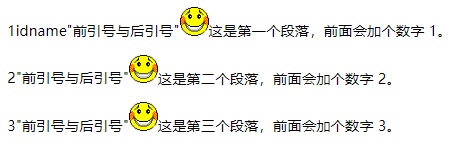

# 内容生成

https://developer.mozilla.org/zh-CN/docs/Web/CSS/CSS_Generated_Content

- 内容生成属性(Generated Content Properties)：**如何给一个元素添加内容**；

| 属性                  | 说明                                                        |
| :-------------------- | :---------------------------------------------------------- |
| [`content`](#content) | 与 `::before` 以及 `::after` 伪元素配合使用，来插入生成内容 |
| [`quotes`](#quotes)   | 设置嵌套引用的引号类型                                      |
| `crop`                | 允许replaced元素只是作为一个对象代替整个对象的矩形区域      |
| `move-to`             | 从流中删除元素，然后在文档中后面的点上重新插入。            |
| `page-policy`         | 判定基于页面的给定元素的适用于计数器的字符串值              |


## `content`

- <a name="content">`content`</a> 属性：与 `::before` 以及 `::after` 伪元素配合使用，**插入** 生成内容

  - 使用`content` 属性插入的内容都是匿名的 **可替换元素**；
  - `content` 属性可拥有多个属性值，属性值之间使用 **空格** ` ` 隔开；

  | 属性值 (`content`) | 说明                                                         |
  | :----------------- | :----------------------------------------------------------- |
  | `none`             | 设置 `content` 为空值。                                      |
  | `normal`           | (**默认**) 在 `::before` 和 `::after` 伪元素中，会被视为 `none`，即也是空值。 |
  | *counter*          | 设定计数器，<br />格式可以是 **counter(name)** 或 **counter(name,style)** <br />产生的内容是该伪元素指定名称的最小范围的计数；<br />格式由 style 指定（默认是'decimal'——十进制数字） |
  | attr*(attribute)*  | 将 元素的 `attribute` 属性 **以字符串形式** 返回             |
  | *string*           | 设置 **文本内容**，需要使用 **引号** 括起来                  |
  | `open-quote`       | 设置 **前引号**                                              |
  | `close-quote`      | 设置 **后引号**                                              |
  | `no-open-quote`    | 移除 元素以 `content:open-quote` 属性设置的 前引号           |
  | `no-close-quote`   | 移除 元素以 `content:close-quote` 属性设置的 前引号          |
  | `url()`            | 设置某种媒体的 **链接地址**                                  |
  | `inherit`          | 从父元素继承                                                 |

  - *counter* 计数器属性值：可以指定两种不同的函数：`counter()` 或 `counters()`；
    - `counter(name)` 或 `counter(name,style)`：产生的内容是 该伪类元素 指定名称的 最小范围的 计数；格式由 style 指定 (默认是 `decimal` 十进制数字)，` style 关键字可参考：[列表--标记类型](./8.CSS属性--超链接、列表、表格.md)；
    - `counters(name,string)` 或 `counters(name,string,style)`；

  示例：

  ```
  <style>
  	p {
    		counter-increment: myIndex;
  	}
  
  	p:before {
  		content:counter(myIndex) attr(id) open-quote "前后引号" close-quote url(smiley.gif);
  	}
  </style>
  
  <body>
  	<p>这是第一个段落，前面会加个数字 1。</p>
  	<p>这是第二个段落，前面会加个数字 2。</p>
  	<p>这是第三个段落，前面会加个数字 3。</p>
  </body>
  ```

  


## `quotes`

- <a name="quotes">`quotes`</a> 属性：

  | 属性值 (`quotes`)             | 描述                                                         |
  | :---------------------------- | :----------------------------------------------------------- |
  | `none`                        | 规定 `content` 属性的 `open-quote` 和 `close-quote` 的值 **不会产生** 任何引号 |
  | *string string string string* | 定义要使用的引号<br />前两个值规定第一级引用嵌套，后两个值规定下一级引号嵌套 |
  | `inherit`                     | 从父元素继承 quotes 属性的值                                 |


# 计数器

https://developer.mozilla.org/zh-CN/docs/Web/CSS/CSS_Counter_Styles

### 属性

| 属性                                      | 描述                          |
| ----------------------------------------- | ----------------------------- |
| [`counter-increment`](#counter-increment) | 递增或递减的 一个或多个计数器 |
| [`counter-reset`](#counter-reset)         | 重置 一个或多个计数器 的值    |

- <a name="counter-increment">`counter-increment`</a> 属性：`counter-increment: counter 1 counter2 -4;`

  | 属性值 (`counter-increment`) | 说明                                                         |
  | :--------------------------- | :----------------------------------------------------------- |
  | `none`                       | (**默认**) 无计数器，或取消已有计数器                        |
  | *custom-ident integer*       | custom-ident 定义计数器 **名称**<br />integer 定义计数器 **增值**，**默认为 `1`** |
  | `inherit`                    | 从父元素继承 `counter-increment` 属性的值                    |

  - **计数器名称**： 标识符由不区分大小写的字母，数字，下划线 `_` ，短划线 `-` 组成；第一个非破折号字符必须是一个字母，标识符的开头禁止使用两个破折号；且标识符不能是 `none`，`unset`，`initial`，`inherit`；可以同时对 多个计数器 设置增值；
  - 计数器的值为正数时，从 0 开始 (不包括0) 递增；计数器的值为负数时，从 0 开始 (不包括0) 递减；
  - custom-ident 与 integer 之间用 **空格 ` `** 隔开；
  - 计数器第一个显示的值为 0+integer 的计算结果

- <a name="counter-reset">`counter-reset`</a> 属性：将一个或多个计数器的值 重置为制定值

  | 属性值 (`counter-reset`) | 说明                                                         |
  | :----------------------- | :----------------------------------------------------------- |
  | `none`                   | (**默认**) 无计数器，或取消已有计数器                        |
  | *custom-ident integer*   | custom-ident 定义计数器 **名称**<br />integer 定义计数器重置后的 **初始值**，**默认为 `0`** |
  | `inherit`                | 从父元素继承 `counter-increment` 属性的值                    |

示例：

```
body {counter-reset:section;}
h1 {counter-reset:subsection;}
h1:before
{
	counter-increment:section;
	content:"Section " counter(section) ". ";
}
h2:before 
{
	counter-increment:subsection;
	content:counter(section) "." counter(subsection) " ";
}
```

- `<h1>` 元素的计数器名称为 `section`；
- `<h2>` 元素的计数器名称为 `subsection`；
- `h1 {counter-reset:subsection;}` 将每个 `<h1>` 元素中的子元素 `<h2>` 的计数器重置；


### @ 规则

- [`@counter-style`](https://developer.mozilla.org/zh-CN/docs/Web/CSS/@counter-style)
  - [`system` (en-US)](https://developer.mozilla.org/en-US/docs/Web/CSS/@counter-style/system)
  - [`additive-symbols`](https://developer.mozilla.org/zh-CN/docs/Web/CSS/@counter-style/additive-symbols)
  - [`negative` (en-US)](https://developer.mozilla.org/en-US/docs/Web/CSS/@counter-style/negative)
  - [`prefix` (en-US)](https://developer.mozilla.org/en-US/docs/Web/CSS/@counter-style/prefix)
  - [`suffix` (en-US)](https://developer.mozilla.org/en-US/docs/Web/CSS/@counter-style/suffix)
  - [`range` (en-US)](https://developer.mozilla.org/en-US/docs/Web/CSS/@counter-style/range)
  - [`pad`](https://developer.mozilla.org/zh-CN/docs/Web/CSS/@counter-style/pad)
  - [`speak-as`](https://developer.mozilla.org/zh-CN/docs/Web/CSS/@counter-style/speak-as)
  - [`fallback` (en-US)](https://developer.mozilla.org/en-US/docs/Web/CSS/@counter-style/fallback)


