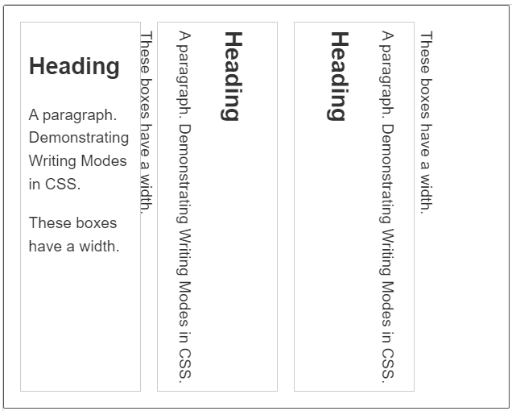

https://www.runoob.com/cssref/css-reference.html#font

| 属性               | 说明                                                      |
| :----------------- | :-------------------------------------------------------- |
| `font`             | 在一个声明中设置所有字体属性                              |
| `font-family`      | 规定 文本的字体 系列                                      |
| `font-size`        | 规定 文本的字体 大小                                      |
| `font-style`       | 规定 文本的字体 样式                                      |
| `font-weight`      | 规定 文本的字体 粗细                                      |
| `font-variant`     | 规定 文本的 大型小写                                      |
| `@font-face`       | 一个规则，允许网站下载并使用其他超过"Web- safe"字体的字体 |
| `font-size-adjust` | 为元素规定 `aspect` 值                                    |
| `font-stretch`     | 收缩或拉伸当前的字体系列                                  |

# 字体 `font`

| 属性值 (`font`)         | 描述                                                         |
| :---------------------- | :----------------------------------------------------------- |
| *font-style*            | 规定字体样式。参阅：[font-style](https://www.runoob.com/cssref/pr-font-font-style.html) 中可能的值。 |
| *font-variant*          | 规定字体异体。参阅：[font-variant](https://www.runoob.com/cssref/pr-font-font-variant.html) 中可能的值。 |
| *font-weight*           | 规定字体粗细。参阅：[font-weight](https://www.runoob.com/cssref/pr-font-weight.html) 中可能的值。 |
| *font-size/line-height* | 规定字体尺寸和行高。参阅：[font-size](https://www.runoob.com/cssref/pr-font-font-size.html) 和 [line-height](https://www.runoob.com/cssref/pr-dim-line-height.html) 中可能的值。 |
| *font-family*           | 规定字体系列。参阅：[font-family](https://www.runoob.com/cssref/pr-font-font-family.html) 中可能的值。 |
| `caption`               | 定义被标题控件（比如按钮、下拉列表等）使用的字体。           |
| `icon`                  | 定义被图标标记使用的字体。                                   |
| `menu`                  | 定义被下拉列表使用的字体。                                   |
| `message-box`           | 定义被对话框使用的字体。                                     |
| `small-caption`         | caption 字体的小型版本。                                     |
| `status-bar`            | 定义被窗口状态栏使用的字体。                                 |

-  `font` 属性是（按顺序）： "style variant weight/line-height size family" 的简写属性
-  可以把单独的属性放在 `font` 属性下面
-  `font-size` 和`font-family` 的值是必需的。如果缺少了其他值，默认值将被插入
-  `font-size` 和 `line-height` 属性之间必须放一个正斜杠

```
font:15px arial,sans-serif;
font:italic bold 12px/30px Georgia, serif;
```


## 字体系列 `font-family`

**网页安全字体**：可以应用到所有系统

| 字体名称            | 泛型       | 注意                                                         |
| :------------------ | :--------- | :----------------------------------------------------------- |
| 黑体                | sans-serif |                                                              |
| **Arial**           | sans-serif | 通常认为最佳做法还是添加 Helvetica 作为 Arial 的首选替代品，尽管它们的字体面几乎相同，但 Helvetica 被认为具有更好的形状，即使 Arial 更广泛地可用。 |
| Verdana             | sans-serif |                                                              |
| Trebuchet MS        | sans-serif | 您应该小心使用这种字体——它在移动操作系统上并不广泛。         |
| 宋体                | serif      |                                                              |
| **Times New Roman** | serif      | 某些操作系统有一个 Times New Roman 字体的替代（可能较旧的）版本叫 Times。使用 Times 作为 Times New Roman 的首选替代方案，被认为是最佳做法。 |
| Courier New         | monospace  | 某些操作系统有一个 Courier New 字体的替代（可能较旧的）版本叫 Courier。使用 Courier New 作为 Courier 的首选替代方案，被认为是最佳做法。 |

**通用字体名称**：使用这些通用名称时，使用的字体完全取决于每个浏览器和操作系统

| 名称         | 定义                                                         |
| :----------- | :----------------------------------------------------------- |
| `serif`      | **有衬线的字体**（衬线一词是指字体笔画尾端的小装饰，存在于某些印刷体字体中） |
| `sans-serif` | **无衬线字体**。                                             |
| `monospace`  | 每个字符具有相同宽度的字体，通常用于 **代码** 列表。         |
| `cursive`    | 用于模拟笔迹的字体，具有流动的连接笔画。                     |
| `fantasy`    | 用来装饰的字体                                               |

示例：

```
body {
    font-family: PingFangSC-Regular, Helvetica, Arial, "Microsoft Yahei", sans-serif
}
```

**字体栈**：``font-family` 属性值由几个用逗号分离的字体名称组成，浏览器从列表的第一个开始，然后查看在当前机器中，这个字体是否可用

- 字体栈的最后提供一个合适的 通用字体名称，以防列出的字体无法使用
- 各种字体之间必须使用英文状态下的逗号隔开
- 若字体名称中有空格，最好加引号

**自定义字体**：若用户计算机上没有网页设置的字体，可以将字体文件使用 `@font-face` 规则包含在网站中，用户需要时会自动下载，如下

```
<style> 
    @font-face
    {
        font-family: myFirstFont;
        src: url(sansation_light.woff);
    }

    div
    {
        font-family:myFirstFont;
    }
</style>
```

**Web安全字体组合** 见：https://www.runoob.com/cssref/css-websafe-fonts.html


## 字体大小 `font-size`

通过 `font-size` 属性设置字体大小

```
/* <absolute-size>，绝对大小值 */
font-size: xx-small;
font-size: x-small;
font-size: small;
font-size: medium;
font-size: large;
font-size: x-large;
font-size: xx-large;
 
/* <relative-size>，相对大小值 */
font-size: larger;
font-size: smaller;
 
/* <length>，长度值 */
font-size: 12px;
font-size: 0.8em;
 
/* <percentage>，百分比值 */
font-size: 80%;
```

- `px`：像素，将像素的值赋予给你的文本（使用 **偶数**）。这是绝对单位， 在任何情况下，页面上的文本的像素值都是一样的
- `em`：1em 等于我们设计的当前元素的 **父元素** 上设置的字体大小（建议使用）
- `rem`：1`rem` 等于 HTML 中的 **根元素** (`<html>`) 中的字体大小
- 百分比：父元素的一个百分比值
- 浏览器的 `font-size` 标准设置的值为 `16px`


## 字体样式 `font-style`

`font-style`用来打开和关闭文本 `italic` (斜体)。可能的值如下:

| 属性值 (`<font-style>`) | 描述                                                         |
| ----------------------- | ------------------------------------------------------------ |
| `normal`                | (默认) 普通字体                                              |
| `italic`                | 若当前字体的 斜体版本 **可用**，那么文本设置为斜体版本；<br />若 **不可用**，那么会利用 `oblique` 状态来模拟 `italics` |
| `oblique`               | 将文本设置为斜体字体的模拟版本，斜体的角度也可以由 `oblique` 设置 |

```
<div style="font-style: oblique 5deg;">This is a sentence.</div>
<div style="font-style: oblique 10deg;">This is a sentence.</div>
<div style="font-style: oblique 20deg;">This is a sentence.</div>
<div style="font-style: oblique 30deg;">This is a sentence.</div>
<div style="font-style: oblique 40deg;">This is a sentence.</div>
```


## 字体粗细 `font-wight`

`font-weight`：设置文字的粗体大小，`normal` `bold` 常用

| 属性值 (`font-wight`) | 描述                                  |
| --------------------- | ------------------------------------- |
| `lighter`             | 定义更细的字符                        |
| `normal` (400)        | 默认值。定义标准的字符                |
| `bold` (700)          | 定义粗体字符                          |
| `bolder`              | 定义更粗的字符                        |
| 100~900的整百数值     | 400 等同于 normal，而 700 等同于 bold |

```
p.normal {font-weight:normal;}
p.thick {font-weight:bold;}
p.thicker {font-weight:900;}
```


## 小型大写 `font-variant`

font-variant 属性设置 **小型大写字母** 的字体显示文本，

| 属性值 (font-variant) | 描述                                 |
| :-------------------- | :----------------------------------- |
| normal                | 默认值。浏览器会显示一个标准的字体。 |
| small-caps            | 浏览器会显示小型大写字母的字体。     |


## 其它字体属性

Font 样式：

- [`font-variant`](https://developer.mozilla.org/zh-CN/docs/Web/CSS/font-variant): 在小型大写字母和普通文本选项之间切换。
- [`font-variant-alternates`](https://developer.mozilla.org/zh-CN/docs/Web/CSS/font-variant-alternates): 控制给定的自定义字体的替代字形的使用。
- [`font-variant-caps`](https://developer.mozilla.org/zh-CN/docs/Web/CSS/font-variant-caps): 控制大写字母替代字形的使用。
- [`font-variant-east-asian` (en-US)](https://developer.mozilla.org/en-US/docs/Web/CSS/font-variant-east-asian): 控制东亚文字替代字形的使用，像日语和汉语。
- [`font-variant-ligatures`](https://developer.mozilla.org/zh-CN/docs/Web/CSS/font-variant-ligatures): 控制文本中使用的连写和上下文形式。
- [`font-variant-numeric`](https://developer.mozilla.org/zh-CN/docs/Web/CSS/font-variant-numeric): 控制数字，分式和序标的替代字形的使用。
- [`font-variant-position`](https://developer.mozilla.org/zh-CN/docs/Web/CSS/font-variant-position): 控制位于上标或下标处，字号更小的替代字形的使用。
- [`font-size-adjust`](https://developer.mozilla.org/zh-CN/docs/Web/CSS/font-size-adjust): 独立于字体的实际大小尺寸，调整其可视大小尺寸。
- [`font-kerning`](https://developer.mozilla.org/zh-CN/docs/Web/CSS/font-kerning): 开启或关闭字体间距选项。
- [`font-feature-settings`](https://developer.mozilla.org/zh-CN/docs/Web/CSS/font-feature-settings): 开启或关闭不同的 [OpenType](https://en.wikipedia.org/wiki/OpenType) 字体特性。
- [`font-stretch`](https://developer.mozilla.org/zh-CN/docs/Web/CSS/font-stretch): 在给定字体的可选拉伸版本中切换。
- `@font-face`：


# 文本样式

https://developer.mozilla.org/zh-CN/docs/Web/CSS/CSS_Text

https://developer.mozilla.org/zh-CN/docs/Web/CSS/CSS_Text_Decoration

## 颜色 `color`

```
body {color:red;}
h1 {color:#00ff00;}
h2 {color:rgb(255,0,0);}
```

- 指定颜色方式：**颜色名称**，**十六进制值**，**RGB值**；


## 文本对齐 `text-algin`

- `text-algin` ：控制 **元素 内容** 如何和它所在的内容盒子对齐

  - 带有 `text-algin` 属性的元素，元素内容中含有的其它元素 (如 ``) 也会按指定方式对齐

  | 属性值 (`text-align`) | 描述         |
  | --------------------- | ------------ |
  | `left`                | 左对齐文本   |
  | `right`               | 右对齐文本   |
  | `center`              | 居中文字     |
  | `justify`             | 两端对齐文本 |

- `text-justify`：若元素使用了 `text-algin="justify"` 属性，则 `text-justify` 属性会指定对齐文本的规则

  | 属性值 (`text-justify`) | 描述                                                         |
  | ----------------------- | ------------------------------------------------------------ |
  | `auto`                  | 浏览器选择                                                   |
  | `none`                  | 禁用文本对齐                                                 |
  | `inter-word`            | 空白分布在单词之间<br />适用于英文等 有词间空格 的           |
  | `inter-ideograph`       | 空白分布在单词、表意文字之间<br />适用于中文、日文、韩文等   |
  | `inter-cluster`         | 空白分布在单词、字形集的边界<br />适用于泰文等 无词间空格 的 |
  | `distribute`            | 空白分布在单词、字形集的边界<br />连续文本、草体除外         |
  | `kashida`               | 通过拉长选定字符调整对齐方式<br />仅适用于 草体              |

  


## 文本缩进 `text-indet`

`text-indent` 属性能定义一个块元素 **首行** 文本内容之前的缩进量

- **负值** 是允许的。如果值是负数，将第一行左缩进

| 属性值 (`text-indet`) | 描述                                        |
| :-------------------- | :------------------------------------------ |
| *length*              | (**默认：0**)；定义固定的缩进。             |
| *%*                   | 定义基于父元素宽度的百分比的缩进。          |
| `inherit`             | 规定应该从父元素继承 text-indent 属性的值。 |


## 文本转换 `text-transform`

`text-transform` 属性：设置要转换的字体

| 属性值 (`text-transform`) | 描述                                                         |
| ------------------------- | ------------------------------------------------------------ |
| `none`                    | (**默认**) 防止任何转型                                      |
| `uppercase`               | 将所有文本转为 **大写**                                      |
| `lowercase`               | 将所有文本转为 **小写**                                      |
| `capitlize`               | 所有单词 **首字母大写**                                      |
| `full-width`              | 将所有字形转换成全角，即固定宽度的正方形<br />允许拉丁字符和亚洲语言字形（如中文，日文，韩文）对齐 |


## 文本装饰 `text-decoration`

- `text-decoration` 属性 设置/取消 字体上的文本装饰，其是 `text-decoration-line`，`text-decoration-style`，`text-decoration-color` 属性的 **简写属性**。
- `text-decoration-line` 属性设置文本修饰要使用的 **线条类型(位置)**：

| 属性 (`text-decoration-line`) | 描述                               |
| ----------------------------- | ---------------------------------- |
| `none`                        | (**默认**) **不使用** 任何文本装饰 |
| `underline`                   | 文本 **下划线**                    |
| `overline`                    | 文本 **上划线**                    |
| `line-through`                | 穿过文本的线 (**删除线**)          |
| `inherit`                     | 从父元素继承该属性                 |
| `initial`                     | 设置该属性为它的默认值             |

- `text-decoration-style` 属性设置线条如何 **显示**：

| 属性值 (`text-decoration-style`) | 描述              |
| -------------------------------- | ----------------- |
| `solid`                          | (**默认**) 单直线 |
| `double`                         | 双直线            |
| `dotted`                         | 点线              |
| `dashed`                         | 虚线              |
| `wavy`                           | 波浪线            |
| `initial`                        | 该属性的默认值    |

- `text-decoration-color` 规定文本修饰 **颜色**：

| 值        | 描述                   |
| :-------- | :--------------------- |
| *color*   | 规定文本修饰的颜色     |
| `initial` | 设置该属性为它的默认值 |
| `inherit` | 从父元素继承该属性     |

- 可以一次接受多个值
- 主要使用此方法在 **设置链接时取消设置链接上的默认下划线**
- `text-decoration: blink;` 定义闪烁的文本，但浏览器**不会显示效果**

示例：

```
text-decoration: line-through red wavy
```


## 文字阴影 `text-shadow`

- `text-shadow`为文字添加阴影
- 将 **多个阴影** 应用于同一文本与 `text-decorations` ，阴影值之间用逗号隔开
- 每个阴影值由 **水平阴影**(offset-x)，**垂直阴影**(offset-y)、**模糊半径**(blur-radius) 和 **阴影颜色**(color) 组成
- 这个属性同时适用于 `::first-line` 以及 `::first-letter` 伪元素

| 值       | 描述                            |
| :------- | :------------------------------ |
| *length* | (必需) 水平阴影的位置，允许负值 |
| *length* | (必需) 垂直阴影的位置，允许负值 |
| *length* | (可选) 模糊的距离               |
| *color*  | (可选) 阴影的颜色               |

示例：

```
text-shadow: 1px 1px 2px red, 0 0 1em blue, 0 0 0.2em blue;
```


## 大小写转换 `text-transform`

`text-transform` 属性：设置要转换的字体

| 属性值 (`text-transform`) | 描述                                                         |
| ------------------------- | ------------------------------------------------------------ |
| `none`                    | (**默认**) 防止任何转型                                      |
| `uppercase`               | 将所有文本转为 **大写**                                      |
| `lowercase`               | 将所有文本转为 **小写**                                      |
| `capitlize`               | 所有单词 **首字母大写**                                      |
| `full-width`              | 将所有字形转换成全角，即固定宽度的正方形<br />允许拉丁字符和亚洲语言字形（如中文，日文，韩文）对齐 |


## 字母间距 `letter-spacing`

- `letter-spacing` 设置文本中 字母与字母 之间的间距

- `word-spacing` 设置文本中 单词与单词 之间的间距

| 值        | 描述                                |
| :-------- | :---------------------------------- |
| `normal`  | (**默认**) 规定字符间没有额外的空间 |
| *length*  | 定义字符间的固定空间                |
| `inherit` | 规定应该从父元素继承                |

- `letter-spacing` 属性值 允许使用负值
- `word-spacing` 属性值 使用负值会自动设为 `0px` 


## 单词间距 `word-spacing`

## 行高 `line-height`

- `line-height` 属性设置文本每行之间的高，不允许负值
- `line-height` 属性 设置的高度 **包括 上下内边距、内容高度**；

| 值        | 描述                                                      |
| :-------- | :-------------------------------------------------------- |
| `normal`  | (**默认**) 设置合理的行间距                               |
| *number*  | 设置数字，此数字会与 **当前的字体尺寸 相乘** 来设置行间距 |
| *length*  | 设置固定的行间距                                          |
| *%*       | 基于当前字体尺寸的百分比行间距                            |
| `inherit` | 规定应该从父元素继承 `line-height` 属性的值               |


## 垂直对齐 `vertical-align`

`vertical-align` 控制 **行内元素的基线** 相对于 **该元素所在行的基线** 的垂直对齐

- 允许指定负长度值和百分比值

| 属性值 (`<vertical-align>`) | 描述                                                        |
| :-------------------------- | :---------------------------------------------------------- |
| baseline                    | (**默认**) 元素放置在父元素的基线上                         |
| sub                         | 垂直对齐文本的 下标                                         |
| super                       | 垂直对齐文本的 上标                                         |
| top                         | 把元素的顶端与 行中最高元素 的顶端对齐                      |
| text-top                    | 把元素的顶端与 父元素字体 的顶端对齐                        |
| middle                      | 把此元素放置在 父元素 的中部                                |
| bottom                      | 使元素及其后代元素的底部与整行的底部对齐                    |
| text-bottom                 | 把元素的底端与父元素字体的底端对齐                          |
| length                      | 将元素升高或降低指定的高度，可以是负数                      |
| %                           | 使用 "line-height" 属性的百分比值来排列此元素，允许使用负值 |


## 文本方向 `direction`

`direction` 属性指定文本方向/书写方向。

| 值        | 描述                                        |
| :-------- | :------------------------------------------ |
| `ltr`     | (**默认**) 文本方向从左到右 (left to right) |
| `rtl`     | 文本方向从右到左 (right to left)            |
| `inherit` | 规定应该从父元素继承 direction 属性的值     |


## 书写模式 `writing-mode`

https://developer.mozilla.org/zh-CN/docs/Learn/CSS/Building_blocks/Handling_different_text_directions

- CSS 中的书写模式是指 **文本的排列方向** 是 横向 还是 纵向 的

- <a name="writing-mode">`writing-mode`</a> 的三个属性值分别是：

  | 属性值 (`writing-mode`) | 描述                                                |
  | ----------------------- | --------------------------------------------------- |
  | `horizontal-tb`         | (**默认**) 块流向从上至下。对应的文本方向是横向的。 |
  | `vertical-rl`           | 块流向从右向左。对应的文本方向是纵向的。            |
  | `vertical-lr`           | 块流向从左向右。对应的文本方向是纵向的。            |



- **<a name="line-size">`line-size`</a> <a name="block-size">`block-size`</a> 属性**：
  - `writing-mode: horizontal-tb; ` 时：
    - `line-size` 属性等价于 `width` 属性
    - `block-size` 属性等价于 `height` 属性
  - `writing-mode: vertical-rl;` 或 `writing-mode: vertical-lr;` 时：
    - `line-size` 属性等价于 `height` 属性
    - `block-size` 属性等价于 `width` 属性


## 处理空白 `white-space`

`white-space` 属性：设置如何处理元素中的空白和换行

| 值 (`white-space`) | 换行 | 空格和制表符 | 文本换行(`<br>`) | 行尾空格 |
| :----------------- | :--- | :----------- | :--------------- | :------- |
| `normal`           | 合并 | 合并         | 换行             | 删除     |
| `nowrap`           | 合并 | 合并         | 换行             | 删除     |
| `pre`              | 保留 | 保留         | 换行             | 保留     |
| `pre-wrap`         | 保留 | 保留         | 换行             | 挂起     |
| `pre-line`         | 保留 | 合并         | 换行             | 删除     |
| `break-spaces`     | 保留 | 保留         | 换行             | 换行     |

|            | 描述                                                         |
| :--------- | :----------------------------------------------------------- |
| `normal`   | (**默认**) 连续的空白符会被 **合并**，换行符会被当作空白符来处理 |
| `nowrap`   | 连续的空白符会被 **合并**，文本内的换行无效，直到遇到 `<br>` 标签才换行 |
| `pre`      | 连续的空白符会被 **保留**，遇到 换行 或者`<br>` 元素时会换行<br />其行为方式类似 HTML 中的 `<pre>` 标签 |
| `pre-wrap` | 连续的空白符会被 **保留**，但是正常地进行换行                |
| `pre-line` | 连续的空白符会被 **合并**，但是保留换行符                    |
| `inherit`  | 规定应该从父元素继承 white-space 属性的值                    |


# 其它文本属性

文本布局样式：https://developer.mozilla.org/zh-CN/docs/Web/CSS/CSS_Text_Decoration

- [`text-indent`](https://developer.mozilla.org/zh-CN/docs/Web/CSS/text-indent)：**首行缩进**，指定文本内容的第一行前面应该留出多少的水平空间；
- [`white-space`](https://developer.mozilla.org/zh-CN/docs/Web/CSS/white-space)：如何处理 元素内部的 连续的 **空白和换行**；


- [`text-overflow`](https://developer.mozilla.org/zh-CN/docs/Web/CSS/text-overflow)：如何 向用户表示 存在被隐藏的 **溢出内容**；
- [`overflow-wrap`](https://developer.mozilla.org/zh-CN/docs/Web/CSS/overflow-wrap)：取以下属性值：
  - `normal`：只能在正常的单词断点处中断，如两个单词之间的空格
  - `word-wrap`：如果行内没有多余的地方容纳该单词到结尾，则那些正常的不能被分割的单词会被强制分割换行，以避免超出范围；
- [`word-break`](https://developer.mozilla.org/zh-CN/docs/Web/CSS/word-break)：怎样在单词内断行；
- [`line-break`](https://developer.mozilla.org/zh-CN/docs/Web/CSS/line-break)：对东亚语言采用更强或更弱的 换行规则。
- [`hyphens`](https://developer.mozilla.org/zh-CN/docs/Web/CSS/hyphens)：为支持的语言 开启或关闭 **连字符**；


- [`direction`](https://developer.mozilla.org/zh-CN/docs/Web/CSS/direction)：**文本方向** (这取决于语言，并且通常最好让 HTML 来处理这部分，因为它是和文本内容相关联的)；
- [`text-orientation`](https://developer.mozilla.org/zh-CN/docs/Web/CSS/text-orientation)：**行内文本方向**；


- [`text-align-last`](https://developer.mozilla.org/zh-CN/docs/Web/CSS/text-align-last)：一段文本中最后一行在被强制换行之前的 **对齐** 规则；
- [`text-rendering`](https://developer.mozilla.org/zh-CN/docs/Web/CSS/text-rendering)：尝试执行一些 **文本渲染** 优化；
- [`text-underline-position`](https://developer.mozilla.org/zh-CN/docs/Web/CSS/text-underline-position)：当使用 `text-decoration-line: underline;` 属性时，指定 **下划线位置**；


| 属性                                                         | 描述                                                       |
| :----------------------------------------------------------- | :--------------------------------------------------------- |
| [hanging-punctuation](https://www.runoob.com/cssref/css3-pr-hanging-punctuation.html) | 规定标点字符是否位于线框之外                               |
| [punctuation-trim](https://www.runoob.com/cssref/css3-pr-punctuation-trim.html) | 规定是否对标点字符进行修剪                                 |
|                                                              |                                                            |
| [text-align-last](https://www.runoob.com/cssref/css3-pr-text-align-last.html) | 设置如何对齐最后一行或紧挨着强制换行符之前的行             |
| [text-emphasis](https://www.runoob.com/css3/css3-pr-text-emphasis.html) | 向元素的文本应用 **重点标记** 以及重点标记的前景色         |
| [text-justify](https://www.runoob.com/cssref/css3-pr-text-justify.html) | 使用 `text-align: justify;` 属性时，所使用的 **对齐** 方法 |
| [text-outline](https://www.runoob.com/cssref/css3-pr-text-outline.html) | **文本轮廓**                                               |
| [text-shadow](https://www.runoob.com/cssref/css3-pr-text-shadow.html) | **文本阴影**                                               |
| [text-overflow](https://www.runoob.com/cssref/css3-pr-text-overflow.html) | 规定当文本溢出包含元素时发生的事情                         |
| [text-wrap](https://www.runoob.com/cssref/css3-pr-text-wrap.html) | 规定文本的换行规则                                         |
| [word-break](https://www.runoob.com/cssref/css3-pr-word-break.html) | 规定非中日韩文本的换行规则                                 |
| [word-wrap](https://www.runoob.com/cssref/css3-pr-word-wrap.html) | 允许对长的不可分割的单词进行分割并换行到下一行             |

