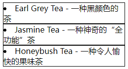
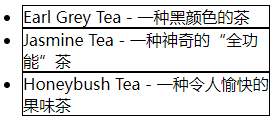
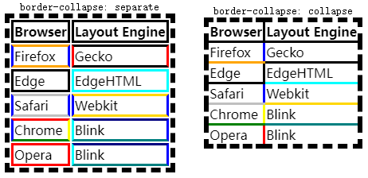

# 超链接

| 属性              | 说明                                                         |
| :---------------- | :----------------------------------------------------------- |
| `target`          | 简写属性设置                                                 |
| `target-name`     | 指定在何处打开链接（目标位置）                               |
| `target-new`      | 指定是否有新的目标链接打开一个新窗口<br />或在现有窗口打开新标签 |
| `target-position` | 指定应该放置新的目标链接的位置                               |

- `target` 属性：`target-name`，`target-new`，`target-position` 属性的简写属性；

- `target` 属性：**无浏览器支持**；可以适用 **HTML** `<a> </a>` 元素的  `target` 属性；
  - `target-name` 属性：**无浏览器支持**；https://www.runoob.com/cssref/css3-pr-target-name.html
  - `target-new` 属性：**无浏览器支持**；https://www.runoob.com/cssref/css3-pr-target-new.html
  - `target-position` 属性：**无浏览器支持**；https://www.runoob.com/cssref/css3-pr-target-position.html


# 列表

https://www.runoob.com/css/css-list.html

https://developer.mozilla.org/en-US/docs/Web/CSS/CSS_Lists_and_Counters

| 属性                  | 说明                           |
| :-------------------- | :----------------------------- |
| `list-style`          | 在一个声明中设置所有的列表属性 |
| `list-style-type`     | 设置列表项 标记的类型          |
| `list-style-position` | 设置列表项 标记的放置位置      |
| `list-style-image`    | 将图象设置为列表项标记         |

- `list-style` 属性：是 `list-style-type`, `list-style-position`, `list-style-image` 属性的简写属性，**注意顺序**；
- 未设置的属性会使用其默认值；


## 标记类型 `list-style-type`

https://www.runoob.com/cssref/pr-list-style-type.html

https://developer.mozilla.org/zh-CN/docs/Web/CSS/list-style-type

| 属性值 (`list-style-type`) | 描述                                  |
| :------------------------- | :------------------------------------ |
| `none`                     | 无标记。                              |
| `disc`                     | (**默认**) 标记是 实心圆              |
| `circle`                   | 标记是 空心圆                         |
| `square`                   | 标记是 实心方块                       |
| `decimal`                  | 标记是数字                            |
| `decimal-leading-zero`     | 0开头的数字标记 (01, 02, 03, 等)      |
| `lower-roman`              | 小写罗马数字 (i, ii, iii, iv, v, 等)  |
| `upper-roman`              | 大写罗马数字 (I, II, III, IV, V, 等)  |
| `lower-alpha`              | 小写英文字母 (a, b, c, d, e, 等)      |
| `upper-alpha`              | 大写英文字母 (A, B, C, D, E, 等)      |
| `lower-greek`              | 小写希腊字母 (alpha, beta, gamma, 等) |
| `lower-latin`              | 小写拉丁字母 (a, b, c, d, e, 等)      |
| `upper-latin`              | 大写拉丁字母 (A, B, C, D, E, 等)      |
| `cjk-ideographic`          | 简单的表意数字                        |


## 标记位置 `list-style-position`

https://www.runoob.com/cssref/pr-list-style-position.html

https://developer.mozilla.org/zh-CN/docs/Web/CSS/list-style-position

| 属性值 (`list-style-position`) | 描述                                                         |
| :----------------------------- | :----------------------------------------------------------- |
| `inside`                       | 列表项目标记放置在文本以内，且环绕文本根据标记对齐。         |
| `outside`                      | (**默认**) 保持标记位于文本的左侧。<br />列表项目标记放置在文本以外，且环绕文本不根据标记对齐。 |
| `inherit`                      | 规定应该从父元素继承                                         |

示例：

- `list-style-position: inside;`



- `list-style-position: outside;`




## 图像标记 `list-style-image`

https://developer.mozilla.org/zh-CN/docs/Web/CSS/list-style-image

| 属性值 (`list-style-image`) | 描述                                 |
| :-------------------------- | :----------------------------------- |
| `url()`                     | 图像的路径，函数内部使用双引号括起来 |
| `none`                      | (**默认**) 无图形被显示              |
| `inherit`                   | 规定应该从父元素继承                 |


# 表格

https://www.runoob.com/css/css-table.html

https://developer.mozilla.org/zh-CN/docs/Web/CSS/CSS_Table

| 属性                                 | 说明                                    |
| :----------------------------------- | :-------------------------------------- |
| [`border-collapse`](border-collapse) | 表格边框、单元格边框 是否合并           |
| [`border-spacing`](#border-spacing)  | 相邻单元格边框之间的 距离               |
| [`caption-side`](#caption-side)      | 表格标题的位置                          |
| [`empty-cells`](#empty-cells)        | 表格中的空单元格上的边框和背景 是否显示 |
| [`table-layout`](#table-layout)      | 设置用于表格的布局算法                  |
| [`vertical-align`](#vertical-align)  | 表格的垂直对齐方式                      |


## 边框合并 `border-collapse`

- <a name="border-collapse">`border-collapse`</a> 属性：表格边框、单元格边框 是否合并；
- `border-collapse: collapse;` 属性：会忽略 `border-spacing` 和 `empty-cells` 属性；

| 值         | 说明                                                         |
| :--------- | :----------------------------------------------------------- |
| `collapse` | 如果可能，边框会合并为一个单一的边框<br />会忽略 `border-spacing` 和 `empty-cells` 属性 |
| `separate` | (**默认**) 边框会被分开<br />不会忽略 `border-spacing` 和 `empty-cells` 属性 |
| `inherit`  | 从父元素继承                                                 |

示例：

```html
<table class="separate">
  <caption><code>border-collapse: separate</code></caption>
  <tbody>
    <tr><th>Browser</th> <th>Layout Engine</th></tr>
    <tr><td class="fx">Firefox</td> <td class="gk">Gecko</td></tr>
    <tr><td class="ed">Edge</td> <td class="tr">EdgeHTML</td></tr>
    <tr><td class="sa">Safari</td> <td class="wk">Webkit</td></tr>
    <tr><td class="ch">Chrome</td> <td class="bk">Blink</td></tr>
    <tr><td class="op">Opera</td> <td class="bk">Blink</td></tr>
  </tbody>
</table>
<table class="collapse">
  <caption><code>border-collapse: collapse</code></caption>
  <tbody>
    <tr><th>Browser</th> <th>Layout Engine</th></tr>
    <tr><td class="fx">Firefox</td> <td class="gk">Gecko</td></tr>
    <tr><td class="ed">Edge</td> <td class="tr">EdgeHTML</td></tr>
    <tr><td class="sa">Safari</td> <td class="wk">Webkit</td></tr>
    <tr><td class="ch">Chrome</td> <td class="bk">Blink</td></tr>
    <tr><td class="op">Opera</td> <td class="bk">Blink</td></tr>
  </tbody>
</table>
```

```css
.collapse {
    border-collapse: collapse;
}
.separate {
    border-collapse: separate;
}
table {
    display: inline-table;
    margin: 1em;
    border: dashed 6px;
    border-width: 6px;
}
table th, table td {
    border: solid 3px;
}
.fx { border-color: orange blue; }
.gk { border-color: black red; }
.ie { border-color: blue gold; }
.tr { border-color: aqua; }
.sa { border-color: silver blue; }
.wk { border-color: gold blue; }
.ch { border-color: red yellow green blue; }
.bk { border-color: navy blue teal aqua; }
.op { border-color: red; }
```




## 边框间距 `border-spacing`

- `border-spacing` 属性：设置相邻单元格的边框间的距离；
- 仅 `border-collapse: separate;` 时生效；
- 相当于 HTML 中的 `cellspacing` 属性，但 **第二个可选的值** 可以用来设置不同于水平间距的 **垂直间距**；
  - 如果定义一个 *length* 参数，那么定义的是水平和垂直间距。
  - 如果定义两个 *length* 参数，那么第一个设置水平间距，而第二个设置垂直间距。
- 表格的边框和第一行的、第一列的、最后一行的、最后一列的单元格之间的间距，是由表格相应的（水平的或垂直的）边框间距（border-spacing）和相应的（上，右，下或左）内边距之和；

| 属性值 (`border-spacing`) | 描述                                        |
| :------------------------ | :------------------------------------------ |
| *length length*           | (**默认 `0`**) 规定相邻单元的边框之间的距离 |
| `inherit`                 | 从父元素继承                                |


## 标题位置 `caption-side`

- <a name="caption-side">`caption-side`</a> 属性：设置表格标题 (`<caption>` 元素) 的位置；但是具体显示的位置与表格的 `writing-mode` 属性的值有关；

| 属性值 (`caption-side`) | 描述                                 |
| :---------------------- | :----------------------------------- |
| `top`                   | (**默认**) 把表格标题定位在 表格之上 |
| `bottom`                | 把表格标题定位在 表格之下            |
| `inherit`               | 从父元素继承                         |


## 空单元格 `empty-cells`

- <a anme="empty-cells">`empty-cells`</a> 属性：定义了用户端应该怎么来渲染表格中 **没有可见内容的单元格** 的 **边框和背景**；
- 仅 `border-collapse: separate;` 时生效；

| 属性值 (`empty-cells`) | 描述                                        |
| :--------------------- | :------------------------------------------ |
| `hide`                 | 空单元格周围 **不绘制** 单元格边框          |
| `show`                 | (**默认**) 空单元格周围 **绘制** 单元格边框 |
| `inherit`              | 从父元素继承                                |


## 表格尺寸 `table-layout`

- <a name="table-layout">`table-layout`</a> 属性：定义了用于布局表格单元格，行和列的算法；

| 属性值 (`table-layout`) | 描述                                         |
| :---------------------- | :------------------------------------------- |
| `auto`                  | (**默认**) 实际列宽由 **单元格内容** 设定    |
| `fixed`                 | 实际列宽由 **表格宽度**和**列宽度**属性 设定 |
| `inherit`               | 从父元素继承                                 |


## 垂直对齐 `vertical-align`

- <a name="vertical-align">`vertical-align`</a> 属性：元素的垂直对齐方式；
- `vertical-align` 属性：只对行内元素、行内块元素和表格单元格元素生效；不能用它垂直对齐 块级元素；
- 见：7.CSS属性--文本.md

