动画、转换、渐变、过渡、分页

动画、**图像**、变换、过渡、分页、**Masking**、**杂项、形状**

# 分页媒体

https://www.runoob.com/css3/css3-pagination.html

https://developer.mozilla.org/zh-CN/docs/Web/CSS/CSS_Fragmentation

> paged media

- **分页媒体** 属性：控制 打印内容 的呈现；控制 能够将内容拆分成离散页面 的媒体 的呈现；
  - 允许以不同的方式设置 **分页符**、控制 **可打印区域** 以及 **页面左右侧的样式**，还能控制元素内部的 **分割符**；
-  请尽可能少地使用分页属性，并且避免在表格、浮动元素、带有边框的块元素中使用分页属性；
- 不能对 **绝对定位** 的元素使用分页属性；
- `box-decoration-break`
- `page-break-before`
- `page-break-after`
- `page-break-inside`
- [`orphans`](https://developer.mozilla.org/en-US/docs/Web/CSS/orphans)
- [`widows`](https://developer.mozilla.org/en-US/docs/Web/CSS/widows)
- [`@page`](https://developer.mozilla.org/en-US/docs/Web/CSS/@page)

- `page-break-before`、`page-break-after`、`page-break-inside`属性：三个属性中，如果任何一个的值属于“强制中断”值，那么这个属性将被优先应用，此处所称“强制中断”的值为： `always`、 `left`、 `right`、 `page`、 `column` 和 `region`；


## `box-decoration-break`

- **`box-decoration-break` 属性**：当元素跨多行、多列或多页时，定义元素的片段应如何呈现；
- 指定的值将影响元素以下属性的表现：`background` 背景，`border` 边框，`border-image` 图像边框，`box-shadow` 盒子阴影，[`clip-path`](https://developer.mozilla.org/zh-CN/docs/Web/CSS/clip-path)，`margin` 外边距，`padding` 内边距；

| 属性值 (`box-decoration-break`) | 描述                                                         |
| ------------------------------- | ------------------------------------------------------------ |
| `slice`                         | (**默认**) 元素被按照盒子被切割前的原始样式渲染              |
| `clone`                         | 每个框片段与指定的边框、填充和边距独立呈现；<br />每个片段的背景也是独立绘制 |

示例：

- `box-decoration-break: slice`

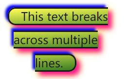

- `box-decoration-break: clone`

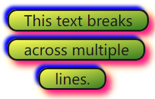


## `page-break`

- `break-before`属性：定义页面，列、区域 在生成的盒子之前，应如何处理中断。如果没有生成的盒子，则忽略该属性；


| 值      | 描述                                                |
| :------ | :-------------------------------------------------- |
| auto    | 默认值。如果必要则在元素前插入分页符。              |
| always  | 在元素前插入分页符。                                |
| avoid   | 避免在元素前插入分页符。                            |
| left    | 在元素之前足够的分页符，一直到一张空白的左页为止。  |
| right   | 在元素之前足够的分页符，一直到一张空白的右页为止。  |
| inherit | 规定应该从父元素继承 page-break-before 属性的设置。 |


# 图像

https://developer.mozilla.org/en-US/docs/Web/CSS/CSS_Images

## 图像属性

- [`image-orientation`](https://developer.mozilla.org/en-US/docs/Web/CSS/image-orientation)
- [`image-rendering`](https://developer.mozilla.org/en-US/docs/Web/CSS/image-rendering)
- [`image-resolution`](https://developer.mozilla.org/en-US/docs/Web/CSS/image-resolution)
- [`object-fit`](https://developer.mozilla.org/en-US/docs/Web/CSS/object-fit)
- [`object-position`](https://developer.mozilla.org/en-US/docs/Web/CSS/object-position)


### `image-orientation`

https://developer.mozilla.org/zh-CN/docs/Web/CSS/image-orientation

- `image-orientation` 属性：**修正** 某些图片的 **预设方向**；
- 该属性不是用来对图片进行任意角度旋转的；它是用来修正那些带有不正确的预设方向的图片的。因此该 **属性值** 会被四舍五入到 90 度的整数倍；
- **查看浏览器支持**；

| 属性 (`image-orientation`) | 描述                                                         |
| -------------------------- | ------------------------------------------------------------ |
| `form-image`               | (**默认**) 根据图片的 EXIF 数据来旋转图片，EXIF 中有一个控制图片旋转度的属性 |
| *angle*                    | 图片旋转值 [*angle*](https://developer.mozilla.org/zh-CN/docs/Web/CSS/angle) , 会被自动四舍五入到 `90deg` (`0.25turn`) 的整数倍 |
| `flip`                     | 对图片进行水平翻转，先执行 *angle* 参数的旋转，再进行此次翻转 |
| `inherit`                  | 从父元素继承                                                 |

示例：

```
image-orientation: 0deg
image-orientation: 6.4deg     /* 非 90 度的整数倍，所以会被四舍五入到 0 度 */
image-orientation: -90deg     /* 相当于 270deg */
image-orientation: from-image /* 使用图片的 EXIF 数据 */
image-orientation: 90deg flip /* 旋转 90deg, 再水平翻转 */
image-orientation: flip       /* 不旋转，只进行水平翻转 */
```


### `image-orientation`

- `image-orientation` 属性：设置 **图像 缩放 算法**；它适用于元素本身，适用于元素其他属性中的图像，也应用于子元素；
- **查看浏览器支持**；

| 属性值 (`image-orientation`) | 描述                     |
| ---------------------------- | ------------------------ |
| `auto`                       | 缩放算法取决于 浏览器    |
| `crisp-edges`                | 最近邻算法对图像进行缩放 |
| `pixelated`                  |                          |


### `object-fit`

https://www.runoob.com/cssref/pr-object-fit.html

https://developer.mozilla.org/zh-CN/docs/Web/CSS/object-fit

- `object-fit` 属性：指定 可替换元素的内容 应该如何适应 其使用的高度和宽度确定的框；

| 属性值 (`object-fit`) | 描述                                                         |
| :-------------------- | :----------------------------------------------------------- |
| `fill`                | (**默认**) 不保证保持原有的比例，内容拉伸填充整个内容容器    |
| `contain`             | 保持原有尺寸比例；内容被 **缩放**，不会被裁剪                |
| `cover`               | 保持原有尺寸比例；但部分内容可能被 **剪切**                  |
| `none`                | 保留原有元素内容的长度和宽度，部分内容可能被 **剪切**        |
| `scale-down`          | 保持原有尺寸比例；<br />**内容的尺寸**： `none` 或 `contain` 中，得到的尺寸 **更小** 的那个 |
| `initial`             | 设置为默认值                                                 |
| `inherit`             | 从该元素的父元素继承属性                                     |

示例：

- 原图：400*300(宽400px，高300px)


- `object-fit: fill;`

```
img {
  width: 200px;
  height: 400px;
  border: 3px solid blue;
  object-fit: fill;
}
```


- `object-fit: contain;`

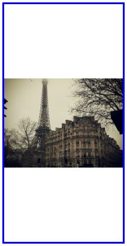

- `object-fit: cover;`

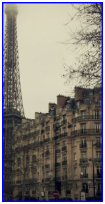

- `object-fit: none;`

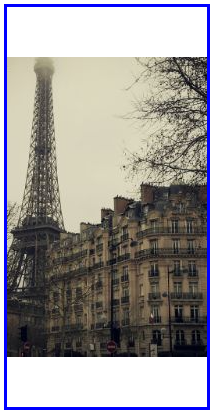

- `object-fit: scale-down;`


### `object-position`

- **`object-position`** 属性：规定了 可替换元素的内容 在其内容框中的位置。可替换元素的内容框中未被对象所覆盖的部分，则会显示该元素的背景 (`background`)；
- 适用于 **可替换元素**；

| 属性值     | 描述                                                         |
| :--------- | :----------------------------------------------------------- |
| *position* | 使用 1 到 4 个值来定义该元素在它所处的二维平面中的定位。可以使用相对或绝对偏移 |
| `initial`  | 设置为默认值（`50% 50%`）                                    |
| `inherit`  | 从该元素的父元素继承属性                                     |

示例

```
object-position: 50% 50%;
object-position: right top;
object-position: left bottom;
object-position: 250px 125px;
```


## 图像相关函数

`alpha(opacity=)`

- [`linear-gradient()`](https://developer.mozilla.org/en-US/docs/Web/CSS/gradient/linear-gradient)
- [`radial-gradient()`](https://developer.mozilla.org/en-US/docs/Web/CSS/gradient/radial-gradient)
- [`repeating-linear-gradient()`](https://developer.mozilla.org/en-US/docs/Web/CSS/gradient/repeating-linear-gradient)
- [`repeating-radial-gradient()`](https://developer.mozilla.org/en-US/docs/Web/CSS/gradient/repeating-radial-gradient)
- [`conic-gradient()`](https://developer.mozilla.org/en-US/docs/Web/CSS/gradient/conic-gradient)
- [`repeating-conic-gradient()`](https://developer.mozilla.org/en-US/docs/Web/CSS/gradient/repeating-conic-gradient)
- [`url()`](https://developer.mozilla.org/en-US/docs/Web/CSS/url)
- [`element()`](https://developer.mozilla.org/en-US/docs/Web/CSS/element)
- [`image()`](https://developer.mozilla.org/en-US/docs/Web/CSS/image/image)
- [`cross-fade()`](https://developer.mozilla.org/en-US/docs/Web/CSS/cross-fade)


### 线性渐变 `linear-gradient()`

https://developer.mozilla.org/en-US/docs/Web/CSS/gradient/linear-gradient

- `linear-gradient()` 函数：创建一个表示 两种或多种颜色 **线性渐变**的图片。其结果属于 *gradient* 数据类型，是一种特别的 ***image* 数据类型**；**常用于 `background` 背景属性**；
- `repeating-linear-gradient()` 函数创建一个 重复线性渐变 的图片；
- 如同其他 gradient 函数一般，`linear-gradient()` 函数 没有内在尺寸；即，它不具备固有的或首选的尺寸，也不具备首选的比率。该函数的具体尺寸将与其适用的元素尺寸匹配；
- 线性渐变由一个轴 (**梯度线**) 定义，且轴上的每个点都具有独立的颜色；
- `linear-gradient()` 函数 构建一系列垂直于渐变线的 **着色线**，每一条着色线的颜色则取决于与之垂直相交的渐变线上的色点；

**线性渐变的构成**：

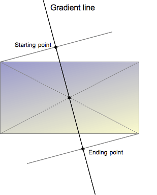

- **渐变线**：由 包含渐变图形的容器的中心点 和 一个角度 来定义的；渐变线上的颜色值是由不同的点来定义，包括起始点，终点，以及两者之间的 可选的中间点 (中间点可以有多个)；

- **角度**：以向顶部中央方向为起点顺时针旋转的角度 (`deg`)；

- **起点**：是渐变线上代表 起始颜色值 的点。起始点由渐变线和过容器顶点的垂直线之间的交叉点来定义；

- **终点**：是起点关于容器的中心点的反射点；

- **转换点**：前后两个颜色过渡的点，默认为两个颜色停止点之间的中间点；

- `linear-gradient(red 10%, 30%, blue 90%);`：

  - 从 起始点到10%的位置 标记红色，10% 为 **颜色终止点**；
  - 从 90%的位置到结束点 标记蓝色；
  - 在 10% 到 90% 之间，颜色从红色过渡到蓝色，过渡的中点是在30%位置上，而不是默认的50%位置；

- 如果两个或多个颜色 **终止在同一位置**，则在该位置声明的第一个颜色和最后一个颜色之间的过渡将是一条生硬线；

- 颜色终止列表中，颜色终止点应该是依次递增的。如果后面的颜色终止点 小于 前面颜色的终止点，则**后面的会被覆盖**，从而创建一个硬转换；

- 允许颜色有 **多个终止点**：通过在 CSS 声明中包含两个位置，可以将一个颜色声明为两个相邻的颜色终止。以下三个梯度是相等的：

  ```
  linear-gradient(red 0%, orange 10%, orange 30%, yellow 50%, yellow 70%, green 90%, green 100%);
  linear-gradient(red, orange 10% 30%, yellow 50% 70%, green 90%);
  linear-gradient(red 0%, orange 10% 30%, yellow 50% 70%, green 90% 100%);
  ```

| 属性值 (`linear-gradient()`) | 描述                                                         |
| ---------------------------- | ------------------------------------------------------------ |
| *side-or-corner*             | 描述渐变线的起始点位置；它包含 to 和两个关键词               |
| *angle*                      | 用角度值指定渐变的方向（或角度）。角度顺时针增加             |
| *linear-color-stop*          | 由一个 *color* 值组成，并且跟随着一个 **可选的** 终点位置    |
| *color-hint*                 | 颜色中转点是一个插值提示，它定义了在相邻颜色之间渐变如何进行 |

- *side-or-corner*：第一个关键字为水平位置 `left` 或 `right`，第二个关键字为垂直位置 `top ` 或 `bottom`；
  - 关键词的先后顺序无影响，**且都是可选的**；
  - `to top`，`to bottom`，`to left`，`to right` 这些值会被转换成角度 0 度、180 度、270 度和 90 度；**不同浏览器不同**；
- *linear-color-stop*：终点位置可以是一个 百分比值 或者是沿着渐变轴的 *length* 值；


### 径向渐变 `radial-gradient()`

https://developer.mozilla.org/zh-CN/docs/Web/CSS/gradient/radial-gradient

- `radial-gradient()` 函数：创建了一个图像，该图像是由从原点发出的两种或者多种颜色之间的逐步过渡组成；
- 径向渐变函数绘制了一系列从中心点放射到边缘形状（甚至可能超出范围）的同心轮廓。边缘形状可以是圆形（circle）或椭圆形（ellipse）；
- 这个方法得到的是一个 *gradient* 数据类型的对象，其是 ***image* 数据类型**的一种；
- `repeating-radial-gradient()` 函数：创建重复的径向渐变；

| 属性值 (`radial-gradient()`) | 描述                                                         |
| ---------------------------- | ------------------------------------------------------------ |
| *position*                   | 图片原点，默认为 **容器中心点**                              |
| *shape*                      | 渐变的形状，圆形 `circle` 或椭圆形 `ellipse`。默认值为椭圆   |
| *size*                       | 渐变的尺寸大小                                               |
| *color-stop*                 | 表示某个确定位置的固定色值<br />包含一个 *color* 值 加上 可选的位置值 (百分比值 或 *length* 值) |
| *extent-keyword*             | 边缘轮廓的具体位置                                           |


### `conic-gradient()`

https://developer.mozilla.org/en-US/docs/Web/CSS/gradient/conic-gradient

- `conic-gradient()` 函数：创建了一个由渐变组成的图像，渐变的颜色变换围绕一个中心点旋转（而不是从中心辐射）

- `repeating-conic-gradient()` 函数：


## 图片数据类型

- [*gradient*](https://developer.mozilla.org/en-US/docs/Web/CSS/gradient)
- [*image*](https://developer.mozilla.org/en-US/docs/Web/CSS/image)


## 图片相关应用

https://www.runoob.com/css3/css3-images.html


# 过渡 (transition)

https://developer.mozilla.org/zh-CN/docs/Web/CSS/CSS_Transitions

https://developer.mozilla.org/zh-CN/docs/Web/CSS/CSS_Transitions/Using_CSS_transitions

| 属性                         | 说明                               |
| :--------------------------- | :--------------------------------- |
| `transition`                 | 此属性是 简写形式                  |
| `transition-delay`           | 指定过渡开始前的 **延迟时间**      |
| `transition-duration`        | (**必需**) 设置过渡的 **持续时间** |
| `transition-property`        | (**必需**) 设置用来进行过渡的 属性 |
| `transition-timing-function` | 设置过渡期间 计算中间值 的方式     |

- **过渡**：可以为一个元素在 **不同状态之间切换时**，控制动画速度；
  - 如：在不同的伪元素之间切换，像是 `:hover`，`:active` 或者通过 JavaScript 实现的状态变化；
- 使用过渡，必须规定两项内容：
  - 指定要添加效果的CSS属性；
  - 指定效果的持续时间；

示例：

```css
div {
    width: 100px;
    height: 100px;
    background: red;
    transition: width 2s, height 2s, transform 2s;
}

div:hover {
    width: 200px;
    height: 200px;
    transform: rotate(180deg);
}
```

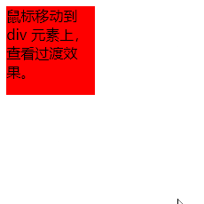


## `transition`

- `transition` 属性：是 `transition-property`，`transition-duration`，`transition-timing-function` 和 `transition-delay` 的一个 简写属性；
  - **注意**：第一个 *time* 值表示 `transition-duration` 属性值，第二个 *time* 值表示 `transition-delay` 属性值；
- 适用于所有元素、`::before`、`::after` 为元素；
- 可以被指定为一个或多个 CSS 属性的过渡效果，多个属性值之间用逗号进行分隔；
  - 如：`transition: margin-right 4s, color 1s;`；
- 使用 `transition` 属性，可以避免属性值列表长度不一，节省调试时间
- 当 `transition` 属性的值个数超过可以接收的值的个数时，多余的值都会被忽略；


## `transition-property`

- `transition-property` 属性：指定应用过渡属性的名称；应该避免使用列表中出现的但目前没有动画的属性；
- 适用于所有元素、`::before`、`::after` 为元素；
- 如果指定简写属性 (比如 `background`)，那么其完整版中所有可以动画的属性都会被应用过渡

| 属性值 (`transition-property`) | 描述                                                         |
| :----------------------------- | :----------------------------------------------------------- |
| `none`                         | 没有属性 会获得过渡效果                                      |
| `all`                          | (**默认**) 所有属性 都将获得过渡效果                         |
| *property*                     | 定义应用过渡效果的 CSS **属性名称** 列表，不同的属性名以逗号 `,` 分隔 |


## `transition-duration`

- `transition-duration` 属性：设置过渡属性 从旧的值 转变到新的值 所需要的时间；属性值以秒（s）或毫秒（ms）为单位；
- 适用于所有元素、`::before`、`::after` 为元素；

- 可以指定 多个时间，每个时长将会分别作用于由 `transition-property` 指定的属性，多个时长之间用逗号进行分隔；

| 属性值 (`transition-duration`) | 描述                                          |
| ------------------------------ | --------------------------------------------- |
| *time*                         | (**默认 `0s`**) 以秒（s）或毫秒（ms）为单位； |

- **默认属性值为 `0s`**，表示不出现过渡动画；
- **不接受负值**；


## `transition-delay`

- `transition-delay` 属性：规定了在 过渡效果 开始作用之前需要等待的时间；属性值以秒（s）或毫秒（ms）为单位；
- 适用于所有元素、`::before`、`::after` 为元素；

- 可以指定 多个时间，每个时长将会分别作用于由 `transition-property` 指定的属性，多个时长之间用逗号进行分隔；

| 属性值 (`transition-delay`) | 描述                                          |
| --------------------------- | --------------------------------------------- |
| *time*                      | (**默认 `0s`**) 以秒（s）或毫秒（ms）为单位； |

- 取值为正时，会延迟一段时间来响应过渡效果；
- 取值为负时，会导致 过渡 **立即开始**；


## `transition-timing-function`

- CSS 属性受到 过渡效果 的影响，会产生不断变化的**中间值**；而 `transition-timing-function` 属性用来描述这个中间值是怎样计算产生的；
- 适用于所有元素、`::before`、`::after` 为元素；

| 属性值            | 描述       |
| ----------------- | ---------- |
| *timing-function* | 加速度曲线 |


## *timing-function* 数据类型

<a name="timing-function">*timing-function*</a> 数据类型：取值及效果见：https://developer.mozilla.org/en-US/docs/Web/CSS/easing-function， 常用取值如：

| 属性值 (`transition-timing-function`) | 描述                                                         |
| :------------------------------------ | :----------------------------------------------------------- |
| `linear`                              | 以相同速度开始至结束 的过渡效果<br />等价于：`cubic-bezier(0,0,1,1)` |
| `ease`                                | (**默认**) 插值 开始缓慢，急剧加速，然后逐渐变慢结束 的过渡效果<br />等价于：`cubic-bezier(0.25, 0.1, 0.25, 1)` |
| `ease-in`                             | 插值 开始缓慢，然后逐渐加速直到结束 的过渡效果<br />等价于：`cubic-bezier(0.42, 0, 1, 1)` |
| `ease-out`                            | 插值 突然开始，然后逐渐减慢到结束 的过渡效果<br />等价于：`cubic-bezier(0, 0, 0.58, 1)` |
| `ease-in-out`                         | 插值开始缓慢，加速，然后在接近尾声时减速 的过渡效果<br />等价于：`cubic-bezier(0.42, 0, 0.58, 1)` |
| `cubic-bezier(x1, y1, x2, y2)`        | **三次贝塞尔曲线**<br />P0(0, 0) 和 P3(1, 1) 是曲线的起点和终点<br />P1(x1, y1)，P2(x2, y2)<br />当且仅当 P1 和 P2 的横坐标都在`[0, 1]`范围内时才有效 |

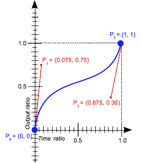


## 反向过渡

- 元素的状态切换完成后，鼠标移开后，默认情况下，元素的外观会立刻回到初始状态；
- 一些浏览器默认会完成反向过渡；

```
div {
    width: 100px;
    height: 100px;
    background: red;
    transition: width 2s, height 2s, transform 2s;
    
}

div:hover {
    width: 200px;
    height: 200px;
    transform: rotate(180deg);
    transition: width 5s, height 5s, transform 5s;
}
```


# 2D/3D 变换 (transforms)

https://developer.mozilla.org/zh-CN/docs/Web/CSS/CSS_Transforms

https://developer.mozilla.org/zh-CN/docs/Web/CSS/CSS_Transforms/Using_CSS_transforms


- 定义了如何在二维或三维空间中转换元素的 CSS 样式，允许将元素 **旋转**，**缩放**，**移动**，**倾斜** 等；


## 转换属性

- [`transform`](https://developer.mozilla.org/zh-CN/docs/Web/CSS/transform)
- [`transform-box`](https://developer.mozilla.org/zh-CN/docs/Web/CSS/transform-box)
- [`transform-origin`](https://developer.mozilla.org/zh-CN/docs/Web/CSS/transform-origin)
- [`transform-style`](https://developer.mozilla.org/zh-CN/docs/Web/CSS/transform-style)
- [`perspective`](https://developer.mozilla.org/zh-CN/docs/Web/CSS/perspective)
- [`perspective-origin`](https://developer.mozilla.org/zh-CN/docs/Web/CSS/perspective-origin)
- [`backface-visibility`](https://developer.mozilla.org/zh-CN/docs/Web/CSS/backface-visibility)


| 属性                  | 应用于 2D/3D 转换 | 转换元素/转换元素的父元素 |
| --------------------- | :---------------- | ------------------------- |
| `transform`           | 2D、3D            | 转换元素                  |
| `transform-origin`    | 2D、3D            | 转换元素                  |
| `transform-style`     | 决定              | 转换元素 的父元素         |
| `perspective`         | 3D                | 转换元素 的父元素         |
| `perspective-origin`  | 3D                | 转换元素 的父元素         |
| `backface-visibility` | 3D                | 转换元素                  |


### `transform`

- `transform` 属性：旋转，缩放，倾斜或平移 给定元素；通过修改 CSS 视觉格式化模型的 **坐标空间** 来实现的；
- 适用于 **可转换元素**；应用于 **被变换元素**；
- 属性值：指定为关键字值 `none` 或 一个或多个 *transform-function* 值；

| 属性值 (`transform`)                        | 描述                                                         |
| ------------------------------------------- | ------------------------------------------------------------ |
| `none`                                      | (**默认**) 不应用任何变换                                    |
| [*transform-function*](#transform-function) | 要应用的一个或多个 CSS 变换函数<br />多个变换函数 按 **从左到右** 的顺序应用<br />这意味着 复合变换 按 **从右到左** 的顺序有效地应用 |


### `transform-box`

- `transform-box` 属性定义了与 `transform`、`transform-origin` 这两个属性有关联的 **布局框**；
- 适用于 **可转换元素**；
- 属性值：以下关键字值之一；

| 属性值 (`transform-box`) | 描述                                                         |
| ------------------------ | ------------------------------------------------------------ |
| `border-box`             | 用作引用框，一个表格（table）的 `border-box` 是 table **包装盒的边框**，而不是表的边框。 |
| `fill-box`               | 对象边界框                                                   |
| `view-box`               | (**默认**) SVG 视口                                          |


### `transform-origin`

https://developer.mozilla.org/zh-CN/docs/Web/CSS/transform-origin

- `transform-origin` 属性：更改一个元素 **转换原点**；
- 必须先使用 `transfrom` 属性；
- 适用于 **可转换元素**；应用于 **被转换元素**；
- 属性值：**默认的 转换原点 是 `center`**；可以使用一个，两个或三个值来指定，其中每个值都表示一个偏移量，省略的偏移为其初始值；
  - 1个值：必须是 *length*，*precentage*，`left`，`center`，`right`，`top`，`bottom` 关键字中的一个；
  - 2个值：**应用于 2D转换**；
    - 第一个值必须是 *length*，*precentage*，`left`, `center`, `right`关键字中的一个，表示水平偏移量；
    - 第二个值必须是 *length*，*precentage*，`top`, `center`, `bottom`关键字中的一个，表示垂直偏移量；
  - 3个值：**应用于 3D转换**，只有 `transform-style: preserve-3d` 时有效；
    - 前两个值和只有两个值时的用法相同；
    - 第三个值必须是 *length*，表示 变形中心距离用户视线（z=0 处）的偏移值；

| 属性值             | 描述                                                         |
| ------------------ | ------------------------------------------------------------ |
| `x-offset`         | 变形中心距离盒模型的左侧的 *length* 或 *precentage* 偏移值   |
| `y-offset`         | 变形中心距离盒模型的顶部的 *length* 或 *precentage* 偏移值   |
| `z-offset`         | 变形中心距离用户视线 (z=0 处) 的 *length* (不能是 *precentage*) 偏移值 |
| *offset-keyword*   | `left`，`center`，`right`，`top`，`bottom` 之一              |
| *x-offset-keyword* | `left`, `center`, `right` 之一                               |
| *y-offset-keyword* | `top`, `center`, `bottom` 之一                               |

- 关键字是方便的简写方法，等同于以下 *precentage* 值：

| keyword  | value  |
| :------- | :----- |
| `left`   | `0%`   |
| `center` | `50%`  |
| `right`  | `100%` |
| `top`    | `0%`   |
| `bottom` | `100%` |

**2D转换示例**：https://www.runoob.com/try/try.php?filename=trycss3_transform-origin_inuse

**3D转换示例**：https://www.runoob.com/try/try.php?filename=trycss3_transform-origin_3d_inuse


### `transform-style`

- `transform-style` 属性：设置元素的子元素是位于 **3D 空间中** 还是 **2D平面中**；如果选择平面，元素的子元素将不会有 3D 的 **遮挡** 关系；
- 适用于 **可转换元素**；应用于 被转换子元素 **的父元素**；
- 该属性不会被继承，因此一个元素可能和它的子元素的呈现方式不同；

| 属性值 (`transform-style`) | 描述                                              |
| :------------------------- | :------------------------------------------------ |
| `flat`                     | (**默认**) 表示 **所有子元素** 在 **2D平面** 呈现 |
| `preserve-3d`              | 表示 **所有子元素** 在 **3D空间** 呈现            |


### `perspective`

- `perspective` 属性：指定了 **观察者与 z=0 平面的距离**，使具有三维位置变换的元素产生 **透视效果**；
  - z>0 的三维元素，比正常大；而 z<0 的三维元素，比正常小；大小程度由该属性的值决定；
- 适用于 **可转换元素**；应用于 被转换子元素 **的父元素**；
- 只影响 **3D 转换元素** (`transform-style: preserve-3d`)；
- **`perspective-origin` 属性**，设置元素变形的原点，在此处即指 **观察者的位置** (在 x，y 轴)；z 轴的位置由 `perspective` 属性确定；

| 属性值 (`perspective`) | 描述                                                         |
| :--------------------- | :----------------------------------------------------------- |
| *length*               | 设置 观察者距离 z=0 平面的距离，为元素及其内容应用**透视变换** |
| `none`                 | (**默认**) 与 0 相同，**不设置透视**                         |


3D变换示例：

```html
<div class="cube">
    <div class="face front">1</div>
    <div class="face back">2</div>
    <div class="face right">3</div>
    <div class="face left">4</div>
    <div class="face top">5</div>
    <div class="face bottom">6</div>
</div>
```

```css
.cube {
    width: 200px;
    height: 200px;
    margin: 75px 0 0 75px;
    border: 3px solid black;

    transform-style: preserve-3d;
    perspective: 800px;               /* 观察者 z轴位置 */
    perspective-origin: 150% 150%;    /* 观察者水平 垂直位置 */
}

.cube div {
    backface-visibility: visible;     /* 背面是否可视 在.cube选择的元素中使用时对子元素无效*/
}

.face {
    display: block;
    position: absolute;
    width: 100px;
    height: 100px;
    border: none;
    line-height: 100px;
    font-family: sans-serif;
    font-size: 60px;
    color: white;
    text-align: center;
}

/* Define each face based on direction */
.front {
    background: rgba(0, 0, 0, 0.3);
    transform: translateZ(50px);
}

.back {
    background: rgba(0, 255, 0, 1);
    color: black;
    transform: rotateY(180deg) translateZ(50px);
}

.right {
    background: rgba(196, 0, 0, 0.7);
    transform: rotateY(90deg) translateZ(50px);
}

.left {
    background: rgba(0, 0, 196, 0.7);
    transform: rotateY(-90deg) translateZ(50px);
}

.top {
    background: rgba(196, 196, 0, 0.7);
    transform: rotateX(90deg) translateZ(50px);
}

.bottom {
    background: rgba(196, 0, 196, 0.7);
    transform: rotateX(-90deg) translateZ(50px);
}
```

- `perspective: none;`

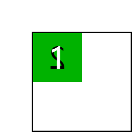

- `perspective: 300px;`

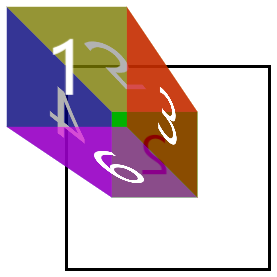

- `perspective: 500px;`

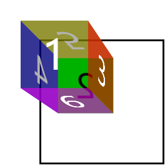

- `perspective: 800px;`

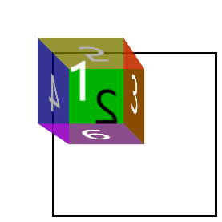


### `perspective-origin`

- `perspective-origin` 属性：设置 **观察者的 X轴、Y轴位置**，用作 `perspective` 属性的 **消失点** (3D变形原点的平面位置)；
- 适用于 **可转换元素**；应用于 被转换子元素 **的父元素**；
- 只影响 **3D 转换元素**；
- 对指定元素的 子元素进行透视变换 时，观察者的 **X轴、Y轴位置**；

| 属性值 (`perspective-origin`) | 描述            |
| ----------------------------- | --------------- |
| *x-posotion*                  | 消失点的 横坐标 |
| *y-posotion*                  | 消失点的 纵坐标 |

- *x-posotion* 取 *length* 值、相对于元素宽度的百分比值、`left`、`center`、`right` 之一 (**可为负值**)；
- *y-posotion* 取 *length* 值、相对于元素宽度的百分比值、`top`、`center`、`bottom` 之一 (**可为负值**)；


### `backface-visibility`

- `backface-visibility` 属性：指定 **当元素背面朝向观察者时** 是否可见；

- 适用于 **可转换元素**；用于 **被转换元素**；
- 只影响 **3D转换元素**；
- **不能继承**；

| 属性值 (`backface-visibility`) | 描述                         |
| :----------------------------- | :--------------------------- |
| `visible`                      | 背面朝向用户时，该元素可见   |
| `hidden`                       | 背面朝向用户时，该元素不可见 |

示例：`backface-visibility: visible;`


- `backface-visibility: hidden;`

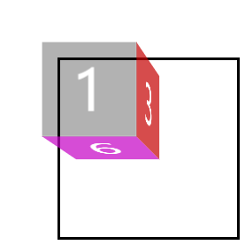


## *transform-function* 值

https://developer.mozilla.org/zh-CN/docs/Web/CSS/transform-function

**可视化 CSS 变换函数的在线工具**：https://css-transform.moro.es/


- <a name="transform-function">*transform-function*</a> 数据类型：影响元素外观的转换，变换函数 可以在 2D 或 3D 空间中旋转、调整大小、扭曲或移动元素

- **笛卡尔坐标**：矢量符号表示 `(x, y)`；x 横坐标，y 纵坐标；

  - 原点 `(0, 0)` 代表任何元素的**左上角**；
  - **正坐标** 在原点的下方和右侧，**负坐标** 在原点的上方和左侧；

- **线性变换函数**：通过操纵其坐标值来改变元素的外观；如

  $$\begin{pmatrix}
  a & c \\
  b & d
  \end{pmatrix}
  \begin{pmatrix}
  x\\
  y
  \end{pmatrix}=
  \begin{pmatrix}
  ax+cy\\
  bx+dy
  \end{pmatrix}$$

  - 可以应用多个变换，组合的变换是 **从右到左生效** 的
  
- **3D变换** 都要使用 **`perspective()` 函数**；


**注意**：所有的转换函数都可以应用，但是一些函数在 `transform-style: float;` 是无法看到效果，有：`perspective()`、`scaleZ()`、`transformZ()`；

|      | 2D 转换函数                                                 | 3D 转换函数                                                  |
| ---- | :---------------------------------------------------------- | :----------------------------------------------------------- |
|      | `matrix()`                                                  | `matrix3d()`                                                 |
| 透视 |                                                             | `perspective()`                                              |
| 旋转 | `rotate()`<br /><br /><br />                                | `rotate3d()`<br />`rotateX()`<br />`rotateY()`<br />`rotateZ()` |
| 缩放 | `scale()`<br />`scaleX()`<br />`scaleY()`<br />             | `scale3d()`<br />`scaleX()`<br />`scaleY()`<br />`scaleZ()`  |
| 倾斜 | `skew()`<br />`skewX()`<br />`skewY()`                      |                                                              |
| 平移 | `transform()`<br />`transformX()`<br />`transformY()`<br /> | `transform3d()`<br />`transformX()`<br />`transformY()`<br />`transformZ()` |


### Matrix transformation

#### `matrix()`

- `matrix()` 函数：指定了一个由指定的 6 个值组成的 **2D 变换**矩阵；

  $\begin{pmatrix}
  a & c & e \\
  b & d & f\end{pmatrix}$等价于$\begin{pmatrix}
  a & c & 0 & e \\
  b & d & 0 & f \\ 0 & 0 & 1 & 0 \\ 0 & 0 & 0 & 1
  \end{pmatrix}$

- **`matrix(a, b, c, d, e, f)`** 是 `matrix3d(a, b, 0, 0, c, d, 0, 0, 0, 0, 1, 0, e, f, 0, 1)` 的简写；

- 这些值表示以下函数：`matrix( scaleX(), skewY(), skewX(), scaleY(), translateX(), translateY() )`；

- 应用于 **2D变换**；

- 值为 *number* 数据类型；


#### `matrix3d()`

- `matrix3d()` 函数：以 **4x4 齐次矩阵**的形式定义一个 **3D 转换**；$\begin{pmatrix}
  a1 & a2 & a3 & a4 \\
  b1 & b2 & b3 & b4 \\ c1 & c2 & c3 & c4 \\ d1 & d2 & d3 & d4
  \end{pmatrix}$
- **语法**：`matrix3d(a1, b1, c1, d1, a2, b2, c2, d2, a3, b3, c3, d3, a4, b4, c4, d4)`；
- 应用于 **3D变换**；
- 值为 *number* 数据类型；


### Perspective

#### `perspective()`

- `perspective()` 函数：设置用户和 z=0 平面之间 的距离
- 应用于 **3D变换**；
- `perspective()` 函数 作为 `transform` 属性的值 被应用于 被变换元素；
  `perspective`、`perspective-origin` 属性 被应用于 **3维空间中** 被变换元素 的父元素上；
- **值**：***length* 数据类型**；负值是语法错误；如果为 0 或负值，则不应用透视变换。
  大的值代表小的变换；小的值代表大的变换；
  **`perspective(none)`** 代表无限远的视角；


### Rotation 旋转

#### `rotate()`

- `rotate()` 函数：设置 元素 围绕一个 **定点旋转** 而不变形 的转换，**定点** 由`transform-origin` 属性指定；
- 应用于 **2D转换**；
- 语法：`rotate(a)`；
  - `rotate(a)` 相当于 `rotateZ(a)`、`rotate3d(0,0,1,a)`；
- **值**：角度，***angle* 数据类型**，定义了旋转的量度，**正的角度值表示顺时针旋转**；值的单位 可以是：`deg`(度)、`turn`(圈)、`rad`(弧度)；
- 金色为：`transform: translateX(180px) rotate(45deg);`；
  粉色为：`transform: rotate(45deg) translateX(180px);`；
  注意：**移动的方向不同**

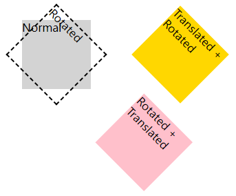


#### `rotate3d()`

- `rotate3d()` 函数：设置 元素围绕 固定轴旋转 而不使其变形；**固定轴** **由给定点形成的矢量**；
- 应用于 **3D转换**；
- 语法：`rotate3d(x, y, z, angle)`；**注意** `x`，`y`，`z` 顺序不可改变；
- 值：`x`，`y`，`z` 可以是 0 到 1 之间的数值，*number* 数据类型，**确定 旋转轴**；
  - 角度，***angle* 数据类型**，定义了旋转的量度；
    X轴向右为正；Y轴向下为正；Z轴向外为正；沿矢量方向的反方向看去，**正的角度值表示顺时针旋转**；
    角度的单位 可以是：`deg`(度)、`turn`(圈)、`rad`(弧度)；

示例：

- `transform: rotate3d(0);`

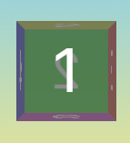

- `transform: rotate3d(1,0,0,45deg);` 绕 X轴旋转

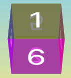

- `transform: rotate3d(0);`

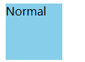

- `transform: rotate3d(1, 2, -1, 180deg);`

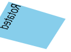


#### `rotateX()` `rotateY()` `rotateZ()`

- `rotateX()` `rotateY()` `rotateZ()` 函数：设置 元素围绕 相应的轴 旋转而不使其变形；
- 应用于 **3D转换**；
- 与二维平面上的旋转不同，三维旋转的组合通常是不可交换的；
- `rotateX(a)` 相当于 `rotate3d(1, 0, 0, a)`；
  `rotateY(a)` 相当于 `rotate3d(0, 1, 0, a)`；
  `rotateZ(a)` 相当于 `rotate3d(0, 0, 1, a)`；
- **角度**：***angle* 数据类型**，定义了旋转的量度；
  X轴向右为正；Y轴向下为正；Z轴向外为正；沿矢量方向的反方向看去，**正的角度值表示顺时针旋转**；
  角度的单位 可以是：`deg`(度)、`turn`(圈)、`rad`(弧度)；

示例：`rotateX(180deg)`

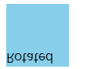


### Scaling (resizing 缩放)

#### `scale()`

- `scale()` 函数：在 2D平面中 修改元素的大小，确定水平和垂直方向缩放大小；
- 仅适用于 **2D变换**；
- 语法：`scale(sx, sy)`；
  - `sx` 表示缩放向量的横坐标；
  - `sy` 表示缩放向量的纵坐标；省略时，值等于 `sx`；
- 值：***number* 数据类型**；当为负数时，将进行 像素点反射 之后再进行大小的修改；

示例：

```html
<p>foo</p>
<p class="scaled">bar</p> 
```

```css
p {
    width: 50px;
    height: 50px;
    background-color: teal;
}

.scaled {
    /* 等同于变换：scaleX(2) scaleY(2);*/
    transform-origin: top left;
    transform: scale(2);
    background-color: blue;
}
```

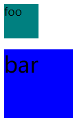


#### `scale3d()`

- `scale3d()` 函数：在 3D 空间中 调整元素大小；
- 仅适用于 **3D变换**；
- 语法：`scale(sx, sy, sz)`；
  - `sx` 表示缩放向量的横坐标，不能省略；
  - `sy` 表示缩放向量的纵坐标，不能省略；
  - `sz` 表示缩放向量的 Z轴 坐标，不能省略；
- 值：***number* 数据类型**；当为负数时，将进行 像素点反射 之后再进行大小的修改；


#### `scaleX()` `scaleY()` `scaleZ()`

- `scaleX()` `scaleY()` `scaleZ()`函数：对 相应坐标轴 的元素坐标进行缩放；

  - `scaleX(sx)`：
    - 应用于2D变换元素时，相当于 `scale(sx, 1)`；
    - 应用于3D变换元素时，相当于`scale3d(sx, 1, 1)`；

  - `scaleX(sy)`：
    - 应用于2D变换元素时，相当于 `scale(1, sy)`；
    - 应用于3D变换元素时，相当于 `scale3d(1, sy, 1)`；
  - `scaleX(sz)`：只能应用于3D变换元素，相当于 `scale3d(1, 1, sz)`；

- 值**：*number* 数据类型**；当为负数时，将进行 像素点反射 之后再进行大小的修改；


### Skewing (distortion 变形)

#### `skew()`

- `skew()` 函数：设置元素在二维平面上的倾斜；
- 应用于 **2D转换**；
- 语法：`skew(ax, ay)`；
  - `ax`：表示元素沿横坐标倾斜的角度 (左右倾斜)；
    - `0` ~ `90deg` 向左倾斜；`-90deg` ~ `0` 向右倾斜；
    - `0`、`180deg`、`-180deg` 相同，均不扭曲；
    - `ax`、`180deg-ax` 倾斜角度相同
  - `ay`：表示元素沿纵坐标倾斜的角度 (上下倾斜)；**省略时，默认为 `0`**；
    - `0` ~ `90deg` 向上倾斜；`-90deg` ~ `0` 向下倾斜；
    - `0`、`180deg`、`-180deg` 相同，均不扭曲；
    - `ay`、`180deg-ay` 倾斜角度相同
- 值：**角度**，***angle* 数据类型**；值的单位 可以是：`deg`(度)、`turn`(圈)、`rad`(弧度)；


#### `skewX()` `skewY()`

- `skewX()` `skewY()` 函数：元素在 2D 平面上沿水平、垂直方向倾斜；
  - `skewX(a)` 相当于 `skew(a)`、`skew(a, 0)`；
  - `skewY(a)` 相当于 `skew(0, a)`；
- 应用于 **2D转换**；


### Translation (moving 位移)

#### `translate()`

- `translate()` 函数：在水平和/或垂直方向上重新定位元素；
- 语法：`translate(tx, ty)`：
  - `tx`：移动向量的横坐标；
  - `ty`：移动向量的纵坐标；省略时，默认为 `0`；
- 值：***length* 或 *percentage* 数据类型**；百分比是相对于 `transform-box` 属性定义的参考框的高度；
  - 正值：表示按坐标轴正方向移动；


#### `translate3d()`

- `translate3d()` 函数：元素在 3D空间内的移动；
- 语法：`translate(tx, ty, tz)`：
  - `tx`：移动向量的横坐标，不能省略；
  - `ty`：移动向量的纵坐标，不能省略；
  - `tz`：移动向量的 Z轴坐标，不能省略；只能是 *length* 值，不能是百分比；
- 值：***length* 或 *percentage* 数据类型**；百分比是相对于 `transform-box` 属性定义的参考框的高度；
  - 正值：表示按坐标轴正方向移动；


#### `translateX()` `translateY()` `translateZ()`

- `translateX()` `translateY()` `translateZ()` 函数：使元素按指定方向移动元素；
- 值：***length* 数据类型**；正值 表示按坐标轴正方向移动；


# 动画

https://developer.mozilla.org/zh-CN/docs/Web/CSS/CSS_Animations

https://www.runoob.com/css3/css3-animations.html

- 如何用关键帧来随时间推移对 CSS 属性的值进行动画处理
- **关键帧动画** 的行为可以通过指定它们的**持续时间**，**重复次数**、**如何重复** 来控制；


| 属性                        | 描述                                                         |
| :-------------------------- | :----------------------------------------------------------- |
| `@keyframes`                | 定义一个动画，<br />`@keyframes` 定义的动画名称用来被 `animation-name` 所使用 |
| `animation`                 | 简写属性；设置对象所应用的动画特效                           |
| `animation-name`            | 设置对象所应用的 **动画名称**，<br />必须与规则 `@keyframes` 配合使用，因为动画名称由 `@keyframes` 定义 |
| `animation-duration`        | 设置对象动画的 **持续时间**                                  |
| `animation-timing-function` | 设置对象动画的 **过渡类型**                                  |
| `nimation-delay`            | 设置对象动画的 **延迟时间**                                  |
| `animation-iteration-count` | 设置对象动画的 **循环次数**                                  |
| `animation-direction`       | 设置对象动画在循环中是否 **反向运动**                        |
| `animation-play-state`      | 设置对象动画的 **状态**                                      |
| `animation-fill-mode`       | 当动画 不播放时、完成时、有一个延迟而未开始播放时<br />设置要应用到 **元素的样式** |


## `@keyframes`

https://developer.mozilla.org/zh-CN/docs/Web/CSS/@keyframes

- `@keyframes` 规则：通过在动画序列中定义关键帧（或 waypoints）的样式来控制 CSS 动画序列中的 中间步骤；
- 和 转换 transition 相比，关键帧 keyframes 可以控制动画序列的中间步骤；
- JavaScript 可以通过 CSS 对象模型的 [`CSSKeyframesRule` (en-US)](https://developer.mozilla.org/en-US/docs/Web/API/CSSKeyframesRule) 接口来访问 `@keyframes`；
- 要使用关键帧，**先创建一个 带名称 的 `@keyframes` 规则**，以便后续使用 [`animation-name`](#animation-name) 属性 将动画同其关键帧声明匹配；
- **每个 `@keyframes` 规则包含 多个关键帧**，也就是一段样式块语句；**每个关键帧有一个 百分比值 作为 名称**，代表在动画进行中，在哪个阶段触发这个帧所包含的样式；
  - 如果一个关键帧规则 **没有指定** 动画的 **开始或结束状态**，浏览器将使用元素的现有样式作为起始、结束状态，即：从初始状态开始动画，最终返回初始状态；
  - 如果 **多个关键帧使用同一个名称**，以最后一次定义的为准；动画在一个时刻（阶段）只会使用一个的关键帧的数据；
  - 如果一个关键帧中 **没有出现其他关键帧中的属性**，那么这个属性将使用插值；不能使用插值的属性会被忽略；
  - `@keyframes` 规则 可以只拥有个别关键帧，不同元素的动画可以使用同一关键帧；
  - 关键帧中出现的 `!important` 将会被忽略；

| 属性值       | 描述                                              |
| :----------- | :------------------------------------------------ |
| *ident*      | (**必需**) 帧列表的名称，animation-name` 属性使用 |
| `form`       | 等价于 `0%`                                       |
| `to`         | 等价于 `100%`                                     |
| *percentage* | 动画序列中触发关键帧的时间点，使用百分值来表示。  |
| *css-styles* | (**必需**) 一个或多个合法的CSS样式属性            |

示例：

```
@keyframes mymove
{
0%   {top:0px;}
25%  {top:200px;}
50%  {top:100px;}
75%  {top:200px;}
100% {top:0px;}
}
```


## `animation`

https://developer.mozilla.org/zh-CN/docs/Web/CSS/animation

- **`animation` 属性**：是 `animation-name`，`animation-duration`， `animation-timing-function`，`animation-delay`，`animation-iteration-count`，`animation-direction`，`animation-fill-mode`、`animation-play-state` 属性的一个简写属性形式；**注意顺序**；

- 适用于 所有元素、`::before`、`::after` 伪元素；
- 可以指定一组或多组动画，每组之间用逗号 `,` 相隔；
- 属性值：
  - `animation-name` 可能为 `none`，[*ident*](https://developer.mozilla.org/zh-CN/docs/Web/CSS/custom-ident)，*string*；
  - 第一个 *time* 值为 `animation-duration` 属性值；第二个 *time* 值为 `animation-delay` 属性值；
- 通常用 `animation` 简写属性一次性设置动画效果较为方便；


## `animation-name`

- `animation-name` 属性：指定应用的一系列动画，每个名称代表一个由 [`@keyframes`](#@keyframes) 定义的动画序列；
- 适用于 所有元素、`::before`、`::after` 伪元素；

| 属性值 (`animation-name`) | 说明                                                |
| :------------------------ | :-------------------------------------------------- |
| *ident*                   | 标识关键帧动画的字符串                              |
| `none`                    | (**默认**) 无关键帧动画（可用于覆盖层叠的动画样式） |

- *ident*：由大小写敏感的字母 a-z、数字 0-9、下划线 (_) 、横线 (-) 组成；
  第一个非横线字符必须是字母；
  数字不能在字母前面；
  不允许两个横线出现在开始位置；


## `animation-duration`

- `animation-duration` 属性：指定动画 **一个周期的时长**；
- 适用于 所有元素、`::before`、`::after` 伪元素；

| 属性值 (`animation-duration`) | 描述                                                         |
| ----------------------------- | ------------------------------------------------------------ |
| *time*                        | 一个动画周期的时长，单位为秒 (s) 或者毫秒 (ms)<br />**默认 `0s`**，表示无动画<br />无单位值无效，负值无效 |


## `animation-timing-function`

- `animation-timing-function` 属性：定义动画 在每一周期中 执行的节奏；
- 适用于 所有元素、`::before`、`::after` 伪元素；

| 属性值 (`animation-timing-function`)  | 描述              |
| ------------------------------------- | ----------------- |
| [*timing-function*](#timing-function) | (**默认 `ease`**) |

- *timing function*：作用于一个关键帧周期而非整个动画周期；即从关键帧开始时开始，到关键帧结束时结束；

- 示例：`animation-timing-function: ease;`


## `nimation-delay`

- `animation-delay` 属性：定义动画于 **何时开始**，即 从动画应用在元素上 到动画开始 的这段时间的长度；
- 适用于 所有元素、`::before`、`::after` 伪元素；

| 属性值 (`animation-delay`) | 描述                                                         |
| -------------------------- | ------------------------------------------------------------ |
| *time*                     | 从动画样式应用到元素上到元素开始执行动画的时间差<br />单位为秒 (s) 或者毫秒 (ms)，**无单位值无效** |

- `animation-delay: 0s;` 为默认，代表动画在应用到元素上后 **立即执行**；
- **负值**：动画立即执行，但是动画会从动画序列中某位置开始。例如，如果设定为 `animation-delay: -1s;`，动画会从它的动画序列的第 1 秒位置处立即开始；


## `animation-iteration-count`

- **`animation-iteration-count`** [CSS](https://developer.mozilla.org/en-US/CSS) 属性 定义动画播放的 **周期次数**；可以是 1 次、无限次循环；
- 适用于 所有元素、`::before`、`::after` 伪元素；

| 属性值 (`animation-iteration-count`) | 描述                                              |
| :----------------------------------- | :------------------------------------------------ |
| *number*                             | (**默认 `1`**) 整数，动画播放次数；**不可为负值** |
| `infinite`                           | 动画播放无限次                                    |

- **小数** 定义循环，表示播放动画周期的一部分；


## `animation-direction`

- `animation-direction` 属性：指示动画是否 **反向播放**；
- 适用于 所有元素、`::before`、`::after` 伪元素；

| 属性值 (`animation-direction`) | 描述                                                       |
| :----------------------------- | :--------------------------------------------------------- |
| `normal`                       | (**默认**) 正常播放；每周期结束，动画重置到起点重新开始    |
| `reverse`                      | 反向播放，每周期结束 动画由尾到头运行                      |
| `alternate`                    | 奇数次（1、3、5...）正向播放，偶数次（2、4、6...）反向播放 |
| `alternate-reverse`            | 奇数次（1、3、5...）反向播放，偶数次（2、4、6...）正向播放 |

- 动画反向播放时，带时间功能的函数也反向；比如，`ease-in` 在反向时成为 `ease-out`；


## `animation-play-state`

- `animation-play-state` 属性：设置动画 是否运行 或者 已暂停；
- 适用于 所有元素、`::before`、`::after` 伪元素；
- 在 JavaScript 中使用此属性，查询动画是否正在运行；也可以用于 在一个周期中 暂停 或 恢复动画重放；

| 属性值 (`animation-play-state`) | 描述             |
| :------------------------------ | :--------------- |
| `paused`                        | 当前动画已被暂停 |
| `running`                       | 当前动画正在运行 |


## `animation-fill-mode`

- `animation-fill-mode` 属性：设置当动画 不播放、完成、未开始播放 时，要应用到元素的样式；
- 适用于 所有元素、`::before`、`::after` 伪元素；

| 值 (`animation-fill-mode`) | 描述                                                         |
| :------------------------- | :----------------------------------------------------------- |
| `none`                     | (**默认**) 动画未执行时，不会应用任何样式到目标元素          |
| `forwards`                 | 在动画结束后，将应用 最后一个关键帧                          |
| `backwards`                | 在动画 开始前 和 结束后，会应用 第一个关键帧                 |
| `both`                     | 动画遵循 `forwards` 和 `backwards` 的规则；在两个方向上扩展动画； |


# 运动路径

https://developer.mozilla.org/en-US/docs/Web/CSS/CSS_Motion_Path

- 允许 沿自定义路径 为任何图形对象 设置动画；


- [`offset`](https://developer.mozilla.org/en-US/docs/Web/CSS/offset)
- [`offset-anchor`](https://developer.mozilla.org/en-US/docs/Web/CSS/offset-anchor)
- [`offset-distance`](https://developer.mozilla.org/en-US/docs/Web/CSS/offset-distance)
- [`offset-path`](https://developer.mozilla.org/en-US/docs/Web/CSS/offset-path)
- [`offset-position`](https://developer.mozilla.org/en-US/docs/Web/CSS/offset-position)
- [`offset-rotate`](https://developer.mozilla.org/en-US/docs/Web/CSS/offset-rotate)


# CSS 可动画属性

- 一些 CSS 属性可以是动画的；即当它的 **属性值改变时**，或者当 CSS**动画** 或 CSS**过渡** 使用时，它可以以平滑的方式改变；
  - 可动画属性的列表见：https://developer.mozilla.org/zh-CN/docs/Web/CSS/CSS_animated_properties


