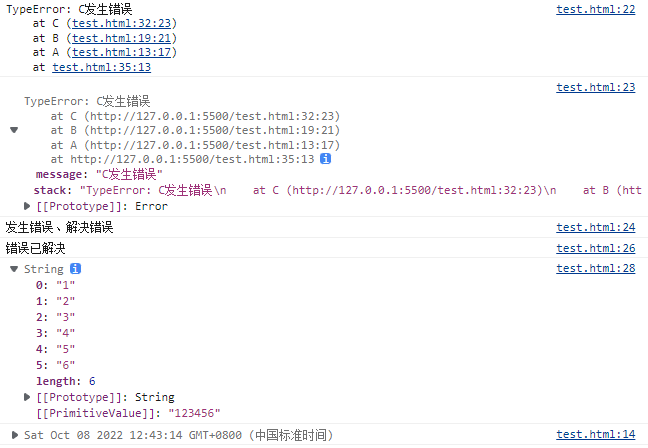

流程控制、错误处理

1. 条件语句
2. 循环语句
3. 错误语句
4. 其它语句


- 分号 `;` 字符被用来分割语句；
- 任何表达式 (expression) 都可以看作一条语句 (statement)；
- **语句块**：一对大括号 `{}` 界定，内部包含多个语句；
  - **在花括号 `{}` 后，不能使用分号**；唯一的 **例外** 是 对象赋值语句；如：`var obj ={};`
  - 使用 `let` 和`const`变量是块作用域的；语句块是块作用域；


# 条件语句

## `if...else`

- 语法：[if...else - JavaScript | MDN (mozilla.org)](https://developer.mozilla.org/zh-CN/docs/Web/JavaScript/Reference/Statements/if...else)；

  ```
  if (condition)
     statement1
  [else
     statement2]
  ```

  - `statement1`、`statement2` 可以是花括号包围的 **语句块**；

  - `condition`：值为真或假的 表达式；

    - `false`、`undefined`、`null`、`0`、`NaN`、空字符串 (`""`) 将被计算出 `false`；

    - 所有其他的值，包括所有对象会被计算为真；

    - **注意**： **`Boolean`对象 被计算为真**；如：

      ```
      var b = new Boolean(false);
      if (b)				// 结果视为真
      if (b == true)		// 结果视为假
      ```

  - `statement1`：当`condition`为真时执行的语句；

    - 若要执行多条语句，使用语句块；
    - 若不想执行语句，则使用空语句，即一个分号 `;`；

  - `else`：可选语句；

  - `statement2`：如果`condition`为假，且 **`else` 从句存在** 时，执行的语句；

- 多层 `if...else` 语句可使用 `else if` 从句；注意，没有 `elseif` 语句；


## `switch`

- 语法：

  ```
  switch (expression) {
    case value1:
    	statement1;		// 当 expression 的结果与 value1 匹配时，执行此处语句
      [break;]
    case value2:
      statement2;		// 当 expression 的结果与 value2 匹配时，执行此处语句
      [break;]
    ...
    case valueN:
      statementN;		// 当 expression 的结果与 valueN 匹配时，执行此处语句
      [break;]
    [default:
      statement;		// 如果 expression 与上面的 value 值都不匹配，执行此处语句
      [break;]]
  }
  
  ```

  - `expression`：一个用来与 `case` 子语句 匹配的 表达式；
  - `case`：如果 `expression` 与给定的 `valueN` 相匹配  (**全等 `===`**)，则执行该 `case` 子句中的语句 `statementN`，直到 该 `switch` 语句结束 或 遇到一个 `break`；
  - **`default`**：(可选) 如果存在，这条子句会在 `expression` 的值与任一 `case` 语句均不匹配时执行；
    - 可以把 `default` 语句放到 `case` 语句之间；
  - **`break`**：确保程序 立即 从相关的 `case` 子句中 **跳出 `switch` 语句**，并接着执行 `switch` 之后的语句；
    - 如果 `break` 被省略，程序会继续执行 `switch` 语句中的下一条语句，而不管之后的 `case` 是否符合条件；

- `switch` 语句内的 **块级作用域**：需要使用 `let` 和 `const` 语句可能会发生下面的错误；

  ```javascript
  const action = 'say_hello';
  switch (action) {
      case 'say_hello':
          let message = 'hello';
          console.log('0 ~5');
          break;
      case 'say_hi':
          let message = 'hi';
          // Uncaught SyntaxError: Identifier 'message' has already been declared.
      case 6: console.log('6');
          break;
      default:
          console.log('Empty action received.');
          break;
  }
  ```

  可以使用将每个语句写出单独的语句块：

  ```javascript
  const action = 'say_hello';
  switch (action) {
      case 'say_hello': {			// added brackets
          let message = 'hello';
          console.log(message);
          break;
      }							// added brackets
      case 'say_hi': {			// added brackets
          let message = 'hi';
          console.log(message);
          break;
      }							// added brackets
      default: {					// added brackets
          console.log('Empty action received.');
          break;
      }							// added brackets
  }
  ```


## 条件（三元）运算符


# 循环语句

[循环与迭代 - JavaScript | MDN (mozilla.org)](https://developer.mozilla.org/zh-CN/docs/Web/JavaScript/Guide/Loops_and_iteration)；

- 如果有 0，null，false，undefined 或者空字符串等在 js 中被认为等价于 false 的值，会提前结束遍历；


## `for`

[for - JavaScript | MDN (mozilla.org)](https://developer.mozilla.org/zh-CN/docs/Web/JavaScript/Reference/Statements/for)；

- `for` 语句：用于创建一个循环，它包含了三个可选的表达式，这三个表达式被包围在圆括号之中，使用分号分隔；后跟一个用于在循环中执行的语句，通常是一个块语句；

- 语法：

  ```
  for ([initialization]; [condition]; [final-expression])
     statement
  ```

  - `initialization`：一个表达式 (包含赋值语句) 或者变量声明；
    - 只在 `for` 循环开始时执行一次；
    - 使用 `var` 声明的变量不是该循环的局部变量，而是与 `for` 循环处在同样的作用域中；
    - 使用 `let` 声明的变量是 `for` 语句的局部变量；
  - `condition`：一个条件表达式，被用于确定每一次循环是否能被执行
    - 如果该表达式的结果为 `true`，`statement` 将被执行。
    - 如果该表达式的结果为 `flase`，那么执行流程将跳出该 `for` 循环，跳到 `for` 语句结构后面的第一条语句；
    - 如果 `condition` 语句被 **忽略**，那么就被认为永远为 `true`。
    - `statement`：只要 `condition` 的结果为 `true` 时，就会被执行的语句；
  - `final-expression`：每次循环的最后都要执行的表达式；
    - 执行时机是在下一次 `condition` 的计算之前；
    - 通常被用于更新或者递增计数器变量。


## `for...in`

[for...in - JavaScript | MDN (mozilla.org)](https://developer.mozilla.org/zh-CN/docs/Web/JavaScript/Reference/Statements/for...in);

- **`for...in` 语句**：以任意顺序 迭代一个对象的 除[Symbol](https://developer.mozilla.org/zh-CN/docs/Web/JavaScript/Reference/Global_Objects/Symbol)以外的 [可枚举](https://developer.mozilla.org/zh-CN/docs/Web/JavaScript/Enumerability_and_ownership_of_properties) **属性**，**包括继承的可枚举属性**。 

- 语法：

  ```
  for (var variable in object)
    statement
  ```

  - `variable`：在每次迭代时，将不同 **属性的名** 赋值给变量；
  - `object`：非Symbol类型的可枚举属性 被迭代的对象；


## `for...of`

[for...of - JavaScript | MDN (mozilla.org)](https://developer.mozilla.org/zh-CN/docs/Web/JavaScript/Reference/Statements/for...of)；

- **`for...of` 语句**：(ES6) 在 [可迭代对象](https://developer.mozilla.org/zh-CN/docs/Web/JavaScript/Reference/Iteration_protocols)（包括 [`Array`](https://developer.mozilla.org/zh-CN/docs/Web/JavaScript/Reference/Global_Objects/Array)，[`Map`](https://developer.mozilla.org/zh-CN/docs/Web/JavaScript/Reference/Global_Objects/Map)，[`Set`](https://developer.mozilla.org/zh-CN/docs/Web/JavaScript/Reference/Global_Objects/Set)，[`String`](https://developer.mozilla.org/zh-CN/docs/Web/JavaScript/Reference/Global_Objects/String)，[`TypedArray`](https://developer.mozilla.org/zh-CN/docs/Web/JavaScript/Reference/Global_Objects/TypedArray)，[arguments](https://developer.mozilla.org/zh-CN/docs/Web/JavaScript/Reference/Functions/arguments) 对象等等）上，创建一个迭代循环，调用自定义迭代钩子，并为每个不同 **属性的值** 执行语句；

- 语法：

  ```
  for (var variable of iterable) {
      //statements
  }
  ```

  - `variable`：在每次迭代中，将不同 **属性的值** 赋值给变量。
  - `iterable`：被迭代枚举其属性的对象；


## `for await...of`

[for await...of - JavaScript | MDN (mozilla.org)](https://developer.mozilla.org/zh-CN/docs/Web/JavaScript/Reference/Statements/for-await...of)；

- **`for await...of` 语句**：创建一个循环，该循环 遍历异步 可迭代对象 以及 同步 可迭代对象，包括: 内置的 [`String`](https://developer.mozilla.org/zh-CN/docs/Web/JavaScript/Reference/Global_Objects/String), [`Array`](https://developer.mozilla.org/zh-CN/docs/Web/JavaScript/Reference/Global_Objects/Array)，类似数组对象 (例如 [`arguments`](https://developer.mozilla.org/zh-CN/docs/Web/JavaScript/Reference/Functions/arguments) 或 [`NodeList`](https://developer.mozilla.org/zh-CN/docs/Web/API/NodeList))，[`TypedArray`](https://developer.mozilla.org/zh-CN/docs/Web/JavaScript/Reference/Global_Objects/TypedArray), [`Map`](https://developer.mozilla.org/zh-CN/docs/Web/JavaScript/Reference/Global_Objects/Map), [`Set`](https://developer.mozilla.org/zh-CN/docs/Web/JavaScript/Reference/Global_Objects/Set) 和用户定义的异步/同步迭代器。它使用对象的每个不同属性的值调用要执行的语句来调用自定义迭代钩子。

- 类似于 [`await`](https://developer.mozilla.org/zh-CN/docs/Web/JavaScript/Reference/Operators/await) 运算符一样，该语句只能在一个[async function](https://developer.mozilla.org/zh-CN/docs/Web/JavaScript/Reference/Statements/async_function#异步函数) 内部使用。

- 语法：

  ```
  for await (variable of iterable) {
    statement
  }
  ```

  - `variable`：在每次迭代中，将不同 **属性的值** 分配给变量。变量有可能以`const`, `let`, 或者 `var`来声明；
  - `iterable`：被迭代枚举其属性的对象。与 `for...of` 相比，这里的对象 可以返回 `Promise`，如果是这样，那么 `variable` 将是 `Promise` 所包含的值；否则是值本身。


## `while`

[while - JavaScript | MDN (mozilla.org)](https://developer.mozilla.org/zh-CN/docs/Web/JavaScript/Reference/Statements/while)；

- **while 语句**：可以在某个条件表达式为真的前提下，循环执行指定的一段代码；直到那个表达式不为真时，结束循环。

- 语法

  ```
  while (condition)
    statement
  ```


- 注意：在 `statement` 中要完成更新，防止死循环；


## `do...while`

[do...while - JavaScript | MDN (mozilla.org)](https://developer.mozilla.org/zh-CN/docs/Web/JavaScript/Reference/Statements/do...while)；

- **`do...while` 语句**：创建一个执行指定语句的循环，直到 `condition` 值为 `false` 时，结束循环。

  - 在执行 `statement` 后检测 `condition`，所以 **指定的 `statement` 至少执行一次**。

- 语法：

  ```
  do
     statement
  while (condition);
  ```

  


## `break`

[break - JavaScript | MDN (mozilla.org)](https://developer.mozilla.org/zh-CN/docs/Web/JavaScript/Reference/Statements/break)；

- **break 语句**：中止当前 **循环**、`switch`语句、`label` 语句，并把程序控制流转到紧接着被中止语句后面的语句；

- 语法;

  ```
  break [label];
  ```

  - `label`：(**可选**) 与 `label` 语句标签 相关联的 标识符；
    - 如果 break 语句不在一个循环或 `switch` 语句中，则该项是必须的；
  - 使用不带 `label` 的 `break` 时， 它会立即终止当前所在的 `while`、`do-while`、`for`、 `switch` 语句，并把控制权交回这些结构后面的语句；
  - 使用带 `label` 的 `break` 时，它会终止指定的带标记（label）的语句；
    - `break` 语句 包含一个可选的标签，可允许程序摆脱一个被标记的语句；
    - **`break`语句需要内嵌在引用的标签中**；
    - 被标记的语句可以是任何 块语句；不一定是循环语句；

- **在 `switch` 语句中**：确保程序 立即 从相关的 `case` 子句中 **跳出 `switch` 语句**，并接着执行 `switch` 之后的语句；
  
  - 如果 `break` 被省略，程序会继续执行 `switch` 语句中的下一条语句，而不管之后的 `case` 是否符合条件；


##  `continue`

[continue - JavaScript | MDN (mozilla.org)](https://developer.mozilla.org/zh-CN/docs/Web/JavaScript/Reference/Statements/continue)；

- **continue 声明**：终止本次循环，直接开始下一次循环；或 标记循环的 当前迭代中的语句执行，并在下一次迭代时继续执行循环。

- 语法：

  ```
  continue [label];
  ```

  - `label`：(**可选**) 与 `label` 语句标签 相关联的 标识符；控制程序 **跳转到** 指定循环的 **下一次迭代**；

  

  ```javascript
  var i = 0,
      j = 8;
  
  checkiandj: while (i < 4) {
     console.log("i: " + i);
     i += 1;
  
     checkj: while (j > 4) {
        console.log("j: "+ j);
        j -= 1;
        if ((j % 2) == 0)
           continue checkj;
        console.log(j + " is odd.");
     }
     console.log("i = " + i);
     console.log("j = " + j);
  }
  ```

  - 被标记为 `checkiandj` 的语句 包含一个被标记为 `checkj` 的语句；
  - 当遇到 `continue` 语句时，程序回到 `checkj` 语句的开始，继续执行下一次循环；

- 与 `break` 语句的区别在于， `continue` **不会终止循环的迭代**，而是：

  - 在 `while` 循环中，控制流 跳转回 条件判断；
  - 在 `for` 循环中，控制流 跳转到 更新语句 `final-expression`；


## 断点调试

- 在浏览器中查看源代码（Sources）；
- 查看 JS 文件，点击左侧行号；
- 刷新网页；
- 当运行程序，运行到指定行时，会停止；
- 按 F11：程序单步执行；


# 错误处理

[流程控制与错误处理 - JavaScript | MDN (mozilla.org)](https://developer.mozilla.org/zh-CN/docs/Web/JavaScript/Guide/Control_flow_and_error_handling)；

JavaScript 通常用下列其中一种 **异常类型**，来创建错误信息：

- [ECMAScript exceptions](https://developer.mozilla.org/zh-CN/docs/Web/JavaScript/Reference/Global_Objects/Error#error_types)
- [`DOMException`](https://developer.mozilla.org/zh-CN/docs/Web/API/DOMException) and [`DOMError`](https://developer.mozilla.org/zh-CN/docs/Web/API/DOMError)；

更多见：[Error - JavaScript | MDN (mozilla.org)](https://developer.mozilla.org/zh-CN/docs/Web/JavaScript/Reference/Global_Objects/Error)；


## `throw` 语句

[throw - JavaScript | MDN (mozilla.org)](https://developer.mozilla.org/zh-CN/docs/Web/JavaScript/Reference/Statements/throw)；

- **`throw` 语句**：用来 抛出一个 **用户自定义的异常**，当前函数的执行将被停止，`throw` 之后的语句将不会执行；并且 控制流 将被传递到 调用**堆栈**中的第一个 **`catch`块**，由 `catch` 接受并处理抛出的表达式；

  - 如果调用者函数中没有 `catch` 块，程序将会终止。

- 语法：

  ```
  throw expression;
  ```

  - `expression`：要抛出的表达式（异常信息）；


## `try...catch` 语句

[try...catch - JavaScript | MDN (mozilla.org)](https://developer.mozilla.org/zh-CN/docs/Web/JavaScript/Reference/Statements/try...catch)；

- **`try...catch`** 语句：标记要尝试的语句块，并指定一个 出现异常时 抛出的响应。

- 语法：

  ```javascript
  try {
      try_statements
  }
  [catch (exception_var_1 if condition_1) {		// 有条件的catch块 non-standard
      catch_statements_1
  }]
  ...
  [catch (exception_var_2) {						// 无条件的catch块
      catch_statements_2
  }]
  [finally {										// finally块
      finally_statements
  }]
  ```

  - `try_statements`：需要被尝试的语句块；
  - `catch_statements_1`，` catch_statements_2`：如果在 `try` 块里 **有异常** 被抛出时，执行的语句；
  - `exception_var_1`、`exception_var_2`：用于保存 关联 `catch` 子句的异常对象 的标识符；
  - `condition_1`：一个条件表达式；
  - `finally_statements`：在 `try` 语句块之后执行的语句块。无论 是否有异常抛出 或 捕获，这些语句都将执行

- **三种形式的 `try` 声明**：

  - `try...catch`；
  - `try...finally`；
  - `try...catch...finally`；

- 如果在 `try` 块中 有任何一个语句 (或者从 `try` 块中调用的函数) 抛出异常，控制立即 **转向`catch`子句**；

- 如果在 `try` 块中 没有异常抛出，会跳过 `catch` 子句，但不会跳过 `finally` 语句。

- `finally`子句：在 `try` 块和 `catch` 块之后执行，但是在下一个`try`声明之前执行；

  - 无论是否有异常抛出或捕获，`finally`子句总是执行；
  - **返回值**：如果从 `finally` 块中 返回一个值，那么这个值将会成为整个 `try-catch-finally` 的返回值；无论是否有 `return` 语句在 `try` 和 `catch` 中，这包括在 `catch` 块里抛出的异常。

- **嵌套 `try` 语句**：如果内部的 `try` 语句 没有 `catch` 子句，那么将会进入包裹它的外部 `try` 语句的 `catch` 子句；

- **无条件 `catch` 语句**：当使用 单个 无条件`catch`子句时，抛出的任何异常时都会进入到该 `catch` 块；

  ```
  try {
     throw "myException"; // generates an exception
  }
  catch (e) {
     // statements to handle any exceptions
     logMyErrors(e); // pass exception object to error handler
  }
  ```

  - `catch` 块指定一个标识符（在上面的示例中为 `e`），该标识符保存由 `throw` 语句指定的值；

- **有条件 `catch` 语句**：用一个或者更多条件`catch`子句来处理特定的异常；

  ```
  try {
      myroutine(); // may throw three types of exceptions
  } catch (e if e instanceof TypeError) {
      // statements to handle TypeError exceptions
  } catch (e if e instanceof RangeError) {
      // statements to handle RangeError exceptions
  } catch (e if e instanceof EvalError) {
      // statements to handle EvalError exceptions
  } catch (e) {
      // statements to handle any unspecified exceptions
      logMyErrors(e); // pass exception object to error handler
  }
  ```

  - `try` 块的代码可能会抛出三种异常：[`TypeError`](https://developer.mozilla.org/zh-CN/docs/Web/JavaScript/Reference/Global_Objects/TypeError)，[`RangeError`](https://developer.mozilla.org/zh-CN/docs/Web/JavaScript/Reference/Global_Objects/RangeError)，[`EvalError`](https://developer.mozilla.org/zh-CN/docs/Web/JavaScript/Reference/Global_Objects/EvalError)。当一个异常抛出时，控制将会进入与其对应的 `catch` 语句。
  - 如果这个异常不是特定的，那么控制将转移到无条件`catch`子句；
  - 当用 一个无条件 `catch` 子句 和 一个或多个条件语句 时，**无条件 `catch` 子句必须放在最后**。否则当到达条件语句之前所有的异常将会被非条件语句拦截。

- **异常标识符**：

  - 当`try`块中的抛出一个异常时， *`exception_var`*（如`catch (e)`中的`e`）用来保存 **被抛出声明指定的值**。你可以用这个标识符来获取关于被抛出异常的信息。
  - 这个标识符是 `catch` 子语句内部的。换言之，当进入 `catch` 子语句时标识符创建，`catch` 子语句执行完毕后，这个标识符将不再可用。

示例：

```javascript
function A() {
    B();
    console.dir(new Date());
}

function B() {
    try {
        C();
        console.dir(new Array(1, 2, 3, "4"));		// 未执行
    } catch (err) {
        console.log(err);
        console.dir(err);
        console.log("发生错误、解决错误");
    } finally {
        console.log("错误已解决");
    }
    console.dir(new String("123456"));
}

function C() {
    throw new TypeError("C发生错误");
}

A();
```




# 其他语句

## block 语句

[block - JavaScript | MDN (mozilla.org)](https://developer.mozilla.org/zh-CN/docs/Web/JavaScript/Reference/Statements/block)；


## empty 语句

[empty - JavaScript | MDN (mozilla.org)](https://developer.mozilla.org/zh-CN/docs/Web/JavaScript/Reference/Statements/Empty)；


## label 语句

[label - JavaScript | MDN (mozilla.org)](https://developer.mozilla.org/zh-CN/docs/Web/JavaScript/Reference/Statements/label)；


## import 语句

[import - JavaScript | MDN (mozilla.org)](https://developer.mozilla.org/zh-CN/docs/Web/JavaScript/Reference/Statements/import)；


## export 语句

[export - JavaScript | MDN (mozilla.org)](https://developer.mozilla.org/zh-CN/docs/Web/JavaScript/Reference/Statements/export)；


## debugger 语句

[debugger - JavaScript | MDN (mozilla.org)](https://developer.mozilla.org/zh-CN/docs/Web/JavaScript/Reference/Statements/debugger)；


