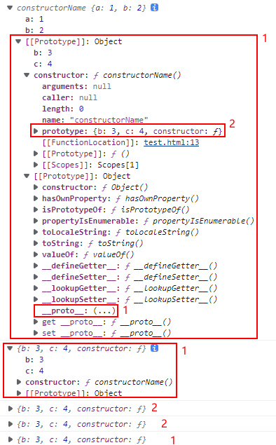

# Object (对象)

[JavaScript 对象 | 菜鸟教程 (runoob.com)](https://www.runoob.com/js/js-obj-intro.html)；

[JavaScript 对象 | 菜鸟教程 (runoob.com)](https://www.runoob.com/js/js-objects.html)；

[使用对象 - JavaScript | MDN (mozilla.org)](https://developer.mozilla.org/zh-CN/docs/Web/JavaScript/Guide/Working_with_Objects)；

对象

1. 创建对象

2. 介绍（索引）

   1. 对象之间的比较与赋值
   2. 全局对象

3. 创建对象

   1. Object literals 对象字面量
   2. `Object()` 构造函数
   3. 对象构造器
      1. `prototype` 静态属性
      2. `this` 关键字
      3. `new` 关键字 加上创建对象实例
   4. `Object.create()`

4. 原型、原型链、继承

5. 属性

   1. 访问属性
   2. 遍历属性
   3. `delete` 删除属性
   4. `constructor` 属性：返回对象的 Constructor (构造器、构造函数)

6. 方法

   1. 方法定义
   2. gette 方法、setter 方法

7. 对象参考

   


## 介绍

- **Object (对象)**：是一系列 **无序的** **属性** 和 **方法** 的集合；
  
  - **property 属性**：一个属性 包含 一个名(**属性名、name**) 和 一个值(**属性值 value**)；
    
    - 每个属性都可以可以表示成 **`name: value`** 的形式；
    - **属性之间 用 逗号 `,` 隔开**；
    - 可以被解释成，一个 附加到 对象 上的 变量；
    
  - **method** 方法：如果一个属性，它的 **属性值是 Function 函数** ，那么这个属性也被称为方法；
  
    - 语法：[方法的定义 - JavaScript | MDN (mozilla.org)](https://developer.mozilla.org/zh-CN/docs/Web/JavaScript/Reference/Functions/Method_definitions)；
  
      ```
      var obj = {
        property( parameters… ) {},
        *generator( parameters… ) {},
        async property( parameters… ) {},
        async* generator( parameters… ) {},
      
        // with computed keys:
        [property]( parameters… ) {},
        *[generator]( parameters… ) {},
        async [property]( parameters… ) {},
      
        // compare getter/setter syntax:
        get property() {},
        set property(value) {}
      };
      ```
  
  - **属性名**：
    - 属性名，可以是任何有效的 JavaScript 字符串，或者 可以被转换为字符串的任何类型，包括空字符串；
    - 属性名，如果不是一个 **有效的 JavaScript 标识符**（例如，一个由空格或连字符，或者以数字开头的属性名），就 只能通过 方括号标记 访问；
  
  - **属性值**：
    - 对象中，**未赋值**的属性 的属性值为 **`undefined`**，而不是 `null`；
    - 属性值可以是对象、函数、数组等；
  
- 其它：
  - JS **变量 也是 对象**；当您声明一个变量时，就创建了一个新的对象；
  - 对象拥有两种属性：[数据属性](https://developer.mozilla.org/zh-CN/docs/Web/JavaScript/Data_structures#数据属性) 和 [访问器属性](https://developer.mozilla.org/zh-CN/docs/Web/JavaScript/Data_structures#访问器属性)；
  - **特性 (attributes)**：每个属性都有对应的特性。JavaScript 引擎在内部使用了特性，因此你不能直接访问它们。这就是为什么特性被放在 **两对方括号** 内，而不是单独列出的原因。参见 [`Object.defineProperty()`](https://developer.mozilla.org/zh-CN/docs/Web/JavaScript/Reference/Global_Objects/Object/defineProperty)。
  - **数据属性**：`name: value` 名值对；
  - **访问器属性**：(并非访问器方法)，有一个或两个访问器函数（`get` 和 `set`）来存取数值；


### 对象之间的比较与赋值

- **对象的比较**：两个独立声明的对象永远也不会相等，即使他们有相同的属性；

  - 只有在比较一个对象和这个对象的引用时，才会返回 `true`；

    ```
    // 两个变量 两个具有同样的属性、但不相同的对象
    var fruit = {name: "apple"};
    var fruitbear = {name: "apple"};
    
    fruit == fruitbear		// false
    fruit === fruitbear		// false
    
    
    // 两个变量 是同一个对象
    var fruit = {name: "apple"};
    var fruitbear = fruit;  // 将 fruit 的对象引用(reference) 赋值给 fruitbear
                            // 也称为将 fruitbear “指向” fruit 对象
    // fruit 与 fruitbear 都指向同样的对象
    fruit == fruitbear		// true
    fruit === fruitbear		// true
    ```


### 全局对象

- **全局对象**：JS 大部分的宿主环境，都会提供一个特殊的对象，该对象可以直接在 JS 代码中访问；该对象称为 全局对象；
- 在浏览器环境中，全局对象为 **`Window`**，表示整个窗口；
  - 全局对象中的所有属性，可以直接访问，而不需要加上全局对象名；
  - 开发者定义的所有变量，都会成为 `Window` 对象的属性；
  - 如果变量没有被赋值，则该变量不会覆盖 `Window` 对象上自带的同名属性 (如`console`、`name`)；
    - `name` 属性被赋值的任何内容，都会被转换为字符串，计算是 `null`、`undefined`等；


## 创建对象

### Object literals 对象字面量

- **对象字面量**：使用 花括号 `{}` 包含该对象的属性和方法；也称 **对象初始化器**；

- 语法：

  ```javascript
  var objectName = {};								// 空的对象
  
  var objectName = {
      propertyName: propertyValue,					// name: value 
      methodName: function() {
          statement;
      }
  };
  ```
  
- 示例：

  ```javascript
  var ldh = {
      name: '刘德华',
      age: 18,
      sex: '男',
      detail: {
          adress: "香港",
          tel: "13312341234",
      },
  };
  console.log(ldh);
  ```

  


### Object Constructor

- **对象构造器**：使用 **`Object()` 构造函数**，**创建新的对象**；

- **构造函数**：用于 “创建 具有共同的属性和方法 的多个对象” 的函数；即，将一些 共同的属性和方法 抽象出来，封装到指定的函数内；

- **实例成员：成员属性 (方法)、实例属性 (方法)**：表示该属性 (方法) 是 通过 构造函数创建的 实例对象调用的；

- **静态成员：静态属性 (方法)、类属性 (方法)**：表示该属性是 通过构造函数本身调用的；

- 语法：

  ```javascript
  var objectName = new Object();						// 创建空对象
  objectName.propertyName = propertyValue;			// 为该对象添加属性
  objectName.methodName = function [functionNme]() {	// 为该对象添加属性
      statement;
  };	
  ```
  
- 示例：

  ```
  var ldh = new Object();
  console.log(ldh);
  ```

  

  ```javascript
  ldh.name = '刘德华';
  ldh.age = 18;
  ldh.sex = '男';
  ldh.detail = {
      adress: "香港",
      tel: "13312341234",
  };
  console.log(ldh);
  ```

  


### Constructor 自定义构造器

- **自定义构造器**：自定义一个函数，该函数用来 创建对象 (对象实例)；

- **构造器**，其实就是一个普通的函数。当使用 `new` 操作符 来作用这个函数时，它就可以被称为构造方法（构造函数）。

- 语法：

  ```javascript
  function ConstructorName() {						// 构造器函数 声明
      this.propertyName = propertyValue;
    	this.methodName = function [functionNme]() {
      	statement;
  	};	
  }
  
  new constructorName();
  ```

  - **函数名** `ConstructorName`：**首字母 大写**；
  - **返回**：不需要 `return` 语句，自动换回新创建的对象；
    - 如果构造函数中，出现 `return` 语句：如果返回的是以原始值，则忽略；如果返回的是引用类型，则返回；
  - **`this` 关键字**：指向将要被创建的对象；
  - **`new` 关键字**：调用构造函数，创建对象实例，并返回该对象；该过程称为 对象实例化；

- 示例：

  ```javascript
  function Star(uname, age, sex, ...detail) {
      this.name = uname;
      this.age = age;
      this.sex = sex;
      this.detail = {
          adress: detail[0],
          tel: detail[1],
      };
  }													// 构造函数 声明
  
  var ldh = new Star('刘德华', 18, '男', "香港", "13312341234");
  console.log(typeof ldh); 							// object
  console.log(ldh);
  ```

  

  - 注意：
    - 需要自己设置属性值；
    - 通过构造函数创建的对象，有 `constructor` 属性，属性值为该构造函数；如 `ldh.constructor`；

#### `prototype` 静态属性

- 通过 为构造函数的 **`prototype` 属性** (属性值为对象) 增加属性，可以为该类型的所有对象实例，而不是仅仅一个对象增加了一个属性：

  [Function.prototype.prototype - JavaScript | MDN (mozilla.org)](https://developer.mozilla.org/en-US/docs/Web/JavaScript/Reference/Global_Objects/Function/prototype)；
  
  ```
  Star.prototype.home = null;
  console.log(ldh.home)								// null
ldh.home = "honkong"
  ```
  


#### `this` 关键字

见 [函数调用--`this`关键字](./05.函数、变量.md)

- 在函数中使用，指代调用该函数的对象；
- 在方法中使用，指代当前对象；
- 在对象中使用，指代当前对象；


#### `new` 关键字

使用 `new` 关键字 创建对象实例时：

- 首先在内存中创建一个新的 空对象；
- `this` 指向该空对象；**如果不用 `new` 关键字，`this` 关键字会指向全局对象 `window`；**
- 执行构造函数里面的代码，给该空对象添加属性和方法；
- 返回该对象，不需要`return` 语句；


### `Object.create()` 方法

- `Object.create()` 方法：为创建的对象 选择一个 **原型对象**，而不用定义构造函数；

- 示例：

  ```javascript
  // Animal properties and method encapsulation
  var Animal = {
    type: "Invertebrates",					// 属性默认值
    displayType : function() {				// 用于 显示type属性 的方法
      console.log(this.type);
    }
  }
  console.log(Animal);
  
  // 创建一种新的动物——animal1
  var animal1 = Object.create(Animal);
  animal1.displayType();						// Invertebrates
  console.log(Animal);
  
  // 创建一种新的动物——Fishes
  var fish = Object.create(Animal);
  fish.type = "Fishes";
  fish.displayType();							// Fishes
  console.log(Animal);
  ```

  

- 注意：
  - 创建对象时，对象原型的属性和属性值 不会被修改；创建完成后可修改；
  - 默认创建的是空对象，除原型的属性外，没有其它属性；创建完成后可添加；


### `class` 关键字创建对象

[继承与原型链 - JavaScript | MDN (mozilla.org)](https://developer.mozilla.org/zh-CN/docs/Web/JavaScript/Inheritance_and_the_prototype_chain#使用_class_关键字创建的对象)；


## 原型、原型链、继承

> prototype、prototype chain、inheritance

[JavaScript prototype（原型对象） | 菜鸟教程 (runoob.com)](https://www.runoob.com/js/js-object-prototype.html)；

[继承与原型链 - JavaScript | MDN (mozilla.org)](https://developer.mozilla.org/zh-CN/docs/Web/JavaScript/Inheritance_and_the_prototype_chain)；

[对象原型 - 学习 Web 开发 | MDN (mozilla.org)](https://developer.mozilla.org/zh-CN/docs/Learn/JavaScript/Objects/Object_prototypes#constructor_属性)；

- **prototype (对象原型)**：每个对象拥有一个 **原型对象**；对象以其原型为模板、**从原型 继承方法和属性 (包括属性值)**；

  - `Date` 对象从 `Date.prototype` 继承；
  - `Array` 对象从 `Array.prototype` 继承；

- **prototype chain (原型链)**：原型对象也可能拥有原型，并从中继承方法和属性，一层一层、以此类推；因此，一个对象会拥有定义在其他对象中的属性和方法；

  - 所有 JS 中的对象，都是位于原型链顶端的 Object 的实例；
  - 当访问一个对象的属性时，它不仅仅在该对象上搜寻，还会搜寻该对象的原型，以及该对象的原型的原型，依次层层向上搜索，直到找到一个名字匹配的属性或到达原型链的末尾；
  - 继承的属性和方法，定义在 Object 的 **构造器函数** 上的 **`prototype` 属性** 上，而非定义在对象实例本身上；

- **原型链**：对 `constructorName.prototype` 属性进行赋值，会直接打破原型链；

- **`[[Prototype]]` 符号**：`objectName` 对象实例的 `objectName.[[Prototype]]` 符号，指向 `objectName` 对象实例的 构造器的 `prototype` 属性，即 **构造器的原型对象**；

  - 构造器本身是函数，**所有的函数 都有一个 特别的 属性：`prototype` 属性**；
  - `[[Prototype]]` 访问：可以通过 [`Object.getPrototypeOf()`](https://developer.mozilla.org/zh-CN/docs/Web/JavaScript/Reference/Global_Objects/Object/GetPrototypeOf) 和 [`Object.setPrototypeOf()`](https://developer.mozilla.org/zh-CN/docs/Web/JavaScript/Reference/Global_Objects/Object/setPrototypeOf) 访问器访问；这个等同于 JS 的非标准、但许多浏览器实现的、`__proto__` 属性；
    - `Object.getPrototypeOf(objectName)`；
    - `objectName.constructor.prototype`；等同 `constructorName.prototype`；
    - `objectName.__proto__`；

- **`prototype` 属性**：`Object()`、`construvtorName()` 对象构造器的 `constructorName.prototype` 属性：表示 该对象构造器的 **原型对象**；

- 在对象构造器的函数体中，定义属性；在对象构造器的原型中，定义方法；可以增加代码可读性；

  ```javascript
  function constructorName() {
      this.a = 1;
      this.b = 2;
  }
  
  var objectName = new constructorName();
  
  constructorName.prototype.b = 3;			// 添加属性
  constructorName.prototype.c = 4;
  
  console.log(objectName);
  console.log(Object.getPrototypeOf(objectName));
  console.log(objectName.constructor.prototype);
  console.log(constructorName.prototype);
  console.log(objectName.__proto__);
  
  // objectName.[[Prototype]] 有属性 b 和 c
  
  // objectName.[[Prototype]].[[Prototype]] 是 Object.prototype
  
  // objectName.[[Prototype]].[[Prototype]].[[Prototype]] 是 null
  // 整个原型链如下：
  // {a:1, b:2} ---> {b:3, c:4} ---> Object.prototype---> null
  ```

  

  
  
  ```
  console.log(constructorName);
  console.log(constructorName.prototype);
  console.log(Object.getPrototypeOf(constructorName));
  
  console.log(Object)
  console.log(Object.prototype)
console.log(Object.getPrototypeOf(Object))
  ```

  
  
  其中 `ƒ () { [native code] }` 表示 函数构造器 的 原型，即 Null；


### 添加属性和方法

- 使用 `ConstructorName.prototype.propertyName`，给构造器 `ConstructorName()` 的原型 `ConstructorName.prototype` 添加 `propertyaName` 属性或方法，此属性会同时添加到该构造器的 **所有对象实例** 的 `[[Prototype]]` 中：


### 属性遮蔽

- **属性遮蔽**：对象和其原型都具有相同名称的属性时，只会访问到该对象的属性，而不会访问该对象的原型的同名属性；


```javascript
function constructorName() {
    this.a = 1;
    this.b = 2;
}

var objectName = new constructorName();

constructorName.prototype.b = 3;			// 添加属性
constructorName.prototype.c = 4;

objectName.b								// 2
// objectName.b 属性 被访问
// objectName.prototype.b 属性 被遮蔽
```


## 属性

[属性的可枚举性和所有权 - JavaScript | MDN (mozilla.org)](https://developer.mozilla.org/zh-CN/docs/Web/JavaScript/Enumerability_and_ownership_of_properties)；


### 访问属性

对选定属性的属性值 进行 **访问和赋值**；也可用于 **创建新的属性和方法**；

- 在对象内部 访问该对象的属性，需要使用 **`this` 关键字**；

- **点表示法** `.` (dot notation) 语法：

  ```
  objectName.propertyName
  
  objectName.methodName()								// 运行函数
  objectName.methodName								// 返回函数
  ```

- **方括号表示法** `[]` (bracket notation) 语法：

  ```
  objectName['propertyName']
  
  objectName['methodName()']							// undefined 
  
  objectName['methodName']()							// 运行函数
  objectName['methodName']							// 返回函数
  ```

  - 需要引号；
  - 不能 通过 方括号表示法 运行对象的方法

- 访问：

  ```
  person.age
  person.interests[1]
  person['age']
  person['name']['first']
  ```

- **动态设置** 属性的 名/值：首先将属性的 名/值 声明为一个变量；然后 **使用 `[]`** 将变量添加为对象的新成员；对变量进行修改时，相应的，对象的成员的 名/值 会改变；

  ```
  var myname1 = "height";
  
  // 可通过修改变量myname1的值 来修改属性名
  person[myname1] = "1.75m";						// 此次不能使用 点表示法 添加 动态新成员
  ```

- **注意**：如果 属性名 不是一个 **有效的 JavaScript 标识符**，就 只能通过 方括号标记 访问；例如，一个由空格或连字符，或者以数字开头的属性名；

  - Array 数组 的数字索引号 只能通过方括号表示法 索引，如 `arrayName[0]`，不能通过 点表示法 索引；但 `length` 属性使用两种方法都可以；


### 遍历所有属性

**`for...in` 循环语句**

- `for...in` 循环语句：对对象的属性 (propertyName) 进行循环；

- 语法：

  ```javascript
  for (var varName in objectName) {					// varName通常用 k 或 key
  	statement;
      // console.log(varName);
      // console.log(objectName[varName]);			// varName为变量 不需要加引号
  }
  ```


**`Object.key(objectName)` 方法**：[Object.keys() - JavaScript | MDN (mozilla.org)](https://developer.mozilla.org/zh-CN/docs/Web/JavaScript/Reference/Global_Objects/Object/keys)；

**`Object.getOwnPropertyNames(objectName)` 方法**：[Object.getOwnPropertyNames() - JavaScript | MDN (mozilla.org)](https://developer.mozilla.org/zh-CN/docs/Web/JavaScript/Reference/Global_Objects/Object/getOwnPropertyNames)；


### `delete` 删除属性

- 可以用 `delete` 操作符 删除一个 不是通过继承而得到的 属性；
- 如果一个全局变量 不是用 `var` 关键字声明的，也可以用 `delete` 删除它；
- Object 自身没有提供方法删除其自身属性，Map 中的 `Map.prototype.delete()` 可以删除自身属性；为了删除对象上的属性，必须使用 [delete 操作符](https://developer.mozilla.org/zh-CN/docs/Web/JavaScript/Reference/Operators/delete)；


## 方法

### 方法定义

[方法的定义 - JavaScript | MDN (mozilla.org)](https://developer.mozilla.org/zh-CN/docs/Web/JavaScript/Reference/Functions/Method_definitions)；

- 语法：

  ```
  var objectName = {
    property( parameters… ) {},
    *generator( parameters… ) {},
    async property( parameters… ) {},
    async* generator( parameters… ) {},
  
    // with computed keys:
    [property]( parameters… ) {},
    *[generator]( parameters… ) {},
    async [property]( parameters… ) {},
  
    // compare getter/setter syntax:
    get property() {},
    set property(value) {}
  };											// 这些都是简写
  
  var objectName = {
    foo: function() {
      /* code */
    },
    bar: function() {
      /* code */
    }
  };
  ```

-  简写语法 使用命名函数，而不是匿名函数；

- 所有方法定义 不是构造函数，如果您尝试实例化它们，将抛出 `TypeError`：

  ```
  var obj = {
    method() {}
  };
  new obj.method;		// TypeError: obj.method is not a constructor
  
  var obj = {
    * g() {}
  };
  new obj.g;			// TypeError: obj.g is not a constructor (changed in ES2016)
  ```

- 生成器方法：[function* - JavaScript | MDN (mozilla.org)](https://developer.mozilla.org/zh-CN/docs/Web/JavaScript/Reference/Statements/function*)；

  ```
  // 用有属性名的语法定义方法（ES6 之前）：
  var obj2 = {
    g: function*() {
      var index = 0;
      while(true)
        yield index++;
    }
  };
  
  // 同一个方法，简写语法：
  var obj2 = {
    * g() {
      var index = 0;
      while(true)
        yield index++;
    }
  };
  
  var it = obj2.g();
  console.log(it.next().value); // 0
  console.log(it.next().value); // 1
  ```

  

- Async 方法：[async 函数 - JavaScript | MDN (mozilla.org)](https://developer.mozilla.org/zh-CN/docs/Web/JavaScript/Reference/Statements/async_function)；

  ```
  // 用有属性名的语法定义方法（ES6 之前）：
  var obj3 = {
    f: async function () {
      await some_promise;
    }
  };
  
  // 同一个方法，简写语法：
  var obj3 = {
    async f() {
      await some_promise;
    }
  };
  
  ```

  

- Async 生成器方法：

  ```
  var obj4 = {
    f: async function* () {
      yield 1;
      yield 2;
      yield 3;
    }
  };
  
  
  // The same object using shorthand syntax
  var obj4 = {
    async* f() {
     yield 1;
     yield 2;
     yield 3;
    }
  };
  ```


### getter 方法、setter 方法

[定义 getters 与 setters](https://developer.mozilla.org/zh-CN/docs/Web/JavaScript/Guide/Working_with_Objects#定义_getters_与_setters)；

- **getter 函数**：通过 `get` 关键字，获取某个特定属性的值 的方法；

  - 为 一个属性 绑定 一个函数；查询该属性时将调用该函数；

  - 语法：[getter - JavaScript | MDN (mozilla.org)](https://developer.mozilla.org/zh-CN/docs/Web/JavaScript/Reference/Functions/get)；

    ```
    { get property() {...} }
    { get [expression]() {...} }
    ```

  - `property`：绑定 给定函数 的 属性名；

  - `expression`：绑定 给定函数 的 属性名；该属性名 可以是一个 计算属性名的表达式 (ES6)；

  - getter 方法必须是**无参数的**；

- **setter 函数**：通过 `set` 关键字，设定某个属性的值的方法；

  - 为 一个属性 绑定 一个函数；查询该属性时将调用该函数；

  - 语法：[setter - JavaScript | MDN (mozilla.org)](https://developer.mozilla.org/zh-CN/docs/Web/JavaScript/Reference/Functions/set)；

    ```
    { set property(val) {...} }
    { set [expression](val) {...} }
    ```

  - `val`：用于保存尝试分配给 `property` 的值的变量的一个别名。
  - setter 方法 **只接受一个参数** (设置为新值)；

- 示例：

  ```
  var o = {
    a: 7,
    get b() {
      return this.a + 1;
    },
    set c(x) {
      this.a = x / 2
    }
  };
  
  console.log(o.a);				// 7
  console.log(o.b);				// 8
  o.c = 50;						// 
  console.log(o.a);				// 25
  ```

  - `o.c = 50;`：`o` 属性调用 `o.c()` 函数，`25` 作为参数传递给该函数，然后运行函数，更新了 o.a 的值；

  - 在一个 **对象字面量** 语法中，定义 getter 和 setter，使用 `[gs]et property()` 的方式时，**并不是 获取和设置 某个属性自身**；容易让人误以为是 `[gs]et propertyName(){ }` 这样 **错误的使用方法**；
  - 定义一个  getter 和 setter 函数，使用语法 `[gs]et property()`；

- 使用 getter 和 setter 创建的是 对象的伪属性，不能在具有真实值的属性上，绑定 getter 和 setter；

- ？？定义一个已经声明的函数作为  getter 和 setter 方法，使用 [Object.defineProperty()](https://developer.mozilla.org/zh-CN/docs/Web/JavaScript/Reference/Global_Objects/Object/defineProperty) 方法：

- 为一个已创建的对象，添加 getter 或 setter 方法，使用 [Object.defineProperty()](https://developer.mozilla.org/zh-CN/docs/Web/JavaScript/Reference/Global_Objects/Object/defineProperty) 方法：

- 扩展 Date 对象原型：

  ```
  var d = Date.prototype;
  Object.defineProperty(d, "year", {
    get: function() { return this.getFullYear() },
    set: function(y) { this.setFullYear(y) }
  });
  ```

  - 为预定义好的 Date 类，添加一个 `year` 的属性；

  - 定义属性 `year` 的 getter 和 setter 方法，用到了 Date 类中已存在的 `getFullYear` 和 `setFullYear` 方法；

  ```
  var now = new Date();
  console.log(now);			// Tue Sep 27 2022 21:50:25 GMT+0800 (中国标准时间)
  console.log(now.year);		// 2022
  now.year = 2020;
  console.log(now);			// Tue Sep 27 2020 21:50:25 GMT+0800 (中国标准时间)
  ```

  - 属性 `year` 定义了 getter 和 setter 两种方法：`now.year` 访问时，运行 getter 方法；`now.year` 赋值时，运行 setter 方法；

- 为一个对象的多个属性 分别绑定 getter 或 setter 方法：

  ```
  var o = { a:0 }
  
  Object.defineProperties(o, {
      "b": { get: function () { return this.a + 1; } },
      "c": { set: function (x) { this.a = x / 2; } }
  });
  
  o.c = 10 		// Runs the setter, which assigns 10 / 2 (5) to the 'a' property
  console.log(o.b)// Runs the getter, which yields a + 1 or 6
  ```

  - 为已创建的 `o` 对象添加 getter 和 setter 方法；
  - 第一个参数是想添加 getter 或 setter 方法的对象；此出为对象 `o`；
  - 第二个参数是一个对象：
    - 属性名：是 getter 或 setter 方法的名字；
    - 属性值：是一个对象；表示要绑定给属性的 getter 或 setter 方法；


## 对象参考

[JavaScript 和 HTML DOM 参考手册 | 菜鸟教程 (runoob.com)](https://www.runoob.com/jsref/jsref-tutorial.html)；

### JavaScript 对象

[JavaScript 标准内置对象 - JavaScript | MDN (mozilla.org)](https://developer.mozilla.org/zh-CN/docs/Web/JavaScript/Reference/Global_Objects)；

- **标准内置对象**：处在 全局作用域 里的 多个对象；
- **global 对象**：可以在全局作用域里通过使用 `this` 访问到；
- 全局作用域：包含 global 对象 中的属性，包括 global 对象 可能通过继承得到的属性；

参考手册描述了每个对象的属性和方法，并提供了在线实例。

- [Array 对象](https://www.runoob.com/jsref/jsref-obj-array.html)；
- [Boolean 对象](https://www.runoob.com/jsref/jsref-obj-boolean.html)；
- [Date 对象](https://www.runoob.com/jsref/jsref-obj-date.html)；
- [Math 对象](https://www.runoob.com/jsref/jsref-obj-math.html)；
- [Number 对象](https://www.runoob.com/jsref/jsref-obj-number.html)；
- [String 对象](https://www.runoob.com/jsref/jsref-obj-string.html)；
- [RegExp 对象](https://www.runoob.com/jsref/jsref-obj-regexp.html)；
- [全局属性和函数](https://www.runoob.com/jsref/jsref-obj-global.html)；

------

### Browser BOM 浏览器对象模型

参考手册描述了每个对象的属性和方法，并提供了在线实例。

- [Window 对象](https://www.runoob.com/jsref/obj-window.html)
- [Navigator 对象](https://www.runoob.com/jsref/obj-navigator.html)
- [Screen 对象](https://www.runoob.com/jsref/obj-screen.html)
- [History 对象](https://www.runoob.com/jsref/obj-history.html)
- [Location 对象](https://www.runoob.com/jsref/obj-location.html)

------

### HTML DOM 文档对象模型

参考手册描述了 HTML DOM 的属性和方法，并提供在线实例。

- [HTML Document](https://www.runoob.com/jsref/dom-obj-document.html)
- [HTML Element](https://www.runoob.com/jsref/dom-obj-all.html)
- [HTML Attributes](https://www.runoob.com/jsref/dom-obj-attributes.html)
- [HTML Events](https://www.runoob.com/jsref/dom-obj-event.html)

------

### HTML DOM 元素对象

参考手册描述了每个对象的属性和方法，并提供了在线实例。

- [Anchor 对象](https://www.runoob.com/jsref/dom-obj-anchor.html)
- [Area 对象](https://www.runoob.com/jsref/dom-obj-area.html)
- [Base 对象](https://www.runoob.com/jsref/dom-obj-base.html)
- [Body 对象](https://www.runoob.com/jsref/dom-obj-body.html)
- [Button 对象](https://www.runoob.com/jsref/dom-obj-pushbutton.html)
- [Form 对象](https://www.runoob.com/jsref/dom-obj-form.html)
- [Frame/IFrame 对象](https://www.runoob.com/jsref/dom-obj-frame.html)
- [Frameset 对象](https://www.runoob.com/jsref/dom-obj-frameset.html)
- [Image 对象](https://www.runoob.com/jsref/dom-obj-image.html)
- [Input Button 对象](https://www.runoob.com/jsref/dom-obj-button.html)
- [Input Checkbox 对象](https://www.runoob.com/jsref/dom-obj-checkbox.html)
- [Input File 对象](https://www.runoob.com/jsref/dom-obj-fileupload.html)
- [Input Hidden 对象](https://www.runoob.com/jsref/dom-obj-hidden.html)
- [Input Password 对象](https://www.runoob.com/jsref/dom-obj-password.html)
- [Input Radio 对象](https://www.runoob.com/jsref/dom-obj-radio.html)
- [Input Reset 对象](https://www.runoob.com/jsref/dom-obj-reset.html)
- [Input Submit 对象](https://www.runoob.com/jsref/dom-obj-submit.html)
- [Input Text 对象](https://www.runoob.com/jsref/dom-obj-text.html)
- [Link 对象](https://www.runoob.com/jsref/dom-obj-link.html)
- [Meta 对象](https://www.runoob.com/jsref/dom-obj-meta.html)
- [Object 对象](https://www.runoob.com/jsref/dom-obj-object.html)
- [Option 对象](https://www.runoob.com/jsref/dom-obj-option.html)
- [Select 对象](https://www.runoob.com/jsref/dom-obj-select.html)
- [Style 对象](https://www.runoob.com/jsref/dom-obj-style.html)
- [Table 对象](https://www.runoob.com/jsref/dom-obj-table.html)
- [td / th 对象](https://www.runoob.com/jsref/dom-obj-tabledata.html)
- [tr 对象](https://www.runoob.com/jsref/dom-obj-tablerow.html)
- [Textarea 对象](https://www.runoob.com/jsref/dom-obj-textarea.html)


# Class (类)

[JavaScript 类(class) | 菜鸟教程 (runoob.com)](https://www.runoob.com/js/js-class-intro.html)；

[类 - JavaScript | MDN (mozilla.org)](https://developer.mozilla.org/zh-CN/docs/Web/JavaScript/Reference/Classes)；

- **包装类**：为了增强原始类型的功能，为 Boolean、String、Number 分别创建了一个构造函数；
  - 如果在语法上，将原始类型当作对象使用时（一般在使用属性时），JS 会自动在该位置、利用对应的构造函数、创建对象，来访问原始类型的属性；

- 