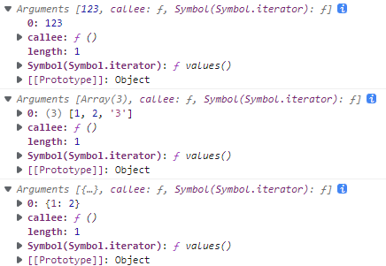

[JavaScript 全局属性/函数 | 菜鸟教程 (runoob.com)](https://www.runoob.com/jsref/jsref-obj-global.html)；


# 全局属性

## `Infinity`

[`Infinity`](https://developer.mozilla.org/zh-CN/docs/Web/JavaScript/Reference/Global_Objects/Infinity)：代表正的无穷大的数值；

| `Infinity` 属性的属性特性： |       |
| :-------------------------- | ----- |
| writable (重写性)           | false |
| enumerable (数值计算性)     | false |
| configurable (可配置性)     | false |

- `Infinity` 的初始值是 [`Number.POSITIVE_INFINITY`](https://developer.mozilla.org/zh-CN/docs/Web/JavaScript/Reference/Global_Objects/Number/POSITIVE_INFINITY)；`Infinity`（正无穷大）大于任何值；
- 在 JS 中，超出 **1.797693134862315E+308** 的数值即为 `Infinity`，小于 **-1.797693134862316E+308** 的数值为 `-Infinity`；


## `NaN`

[`NaN`](https://developer.mozilla.org/zh-CN/docs/Web/JavaScript/Reference/Global_Objects/NaN)：表示某个值是不是数字值

| `NaN` 属性的属性特性： |       |
| :--------------------- | ----- |
| writable               | false |
| enumerable             | false |
| configurable           | false |

- `NaN` 属性值 和 [`Number.NaN`](https://developer.mozilla.org/zh-CN/docs/Web/JavaScript/Reference/Global_Objects/Number/NaN) 的值一样；

- `NaN` 与所有值都不相等，包括它自己；

- 注意 `isNaN()` 和 `Number.isNaN()` 之间的区别：

  - 如果当前值是 `NaN`，或者将其强制转换为数字后将是 `NaN`，则 `isNaN()` 将返回 `true`；

  - 而 `Number.isNaN()` 仅当 值当前为 `NaN` 时才为 `true`；

    ```
    isNaN('hello world');				// true
    Number.isNaN('hello world');		// false
    ```


## `undefined`

[`undefined`](https://developer.mozilla.org/zh-CN/docs/Web/JavaScript/Reference/Global_Objects/undefined)：未定义的值；

| `undefined` 属性的属性特性： |       |
| :--------------------------- | ----- |
| writable                     | false |
| enumerable                   | false |
| configurable                 | false |

- 一个没有被赋值的变量的类型是 `undefined`；

- 一个函数如果没有使用 return 语句指定 [`return`](https://developer.mozilla.org/zh-CN/docs/Web/JavaScript/Reference/Statements/return) 值，就会返回一个 undefined 值；

- 可以使用 undefined 和 **严格相等** 或 不相等 操作符来决定一个变量是否拥有值；

  ```
  var x;
  
  if (x === undefined) {			// true
  // 执行这些语句
  } else {
  // 这些语句不会被执行
  }
  ```

  


## `globalThis`

[`globalThis`](https://developer.mozilla.org/zh-CN/docs/Web/JavaScript/Reference/Global_Objects/globalThis)：包含全局的 `this` 值，类似于全局对象（global object）；

| `globalThis` 属性的属性特性： |       |
| :---------------------------- | ----- |
| writable                      | true  |
| enumerable                    | false |
| configurable                  | true  |


# 全局函数

- [`eval()`](https://developer.mozilla.org/zh-CN/docs/Web/JavaScript/Reference/Global_Objects/eval)：计算 JavaScript 字符串，并把它作为脚本代码来执行
- [`isFinite()`](https://developer.mozilla.org/zh-CN/docs/Web/JavaScript/Reference/Global_Objects/isFinite)：检查某个值是否为有穷大的数
- [`isNaN()`](https://developer.mozilla.org/zh-CN/docs/Web/JavaScript/Reference/Global_Objects/isNaN)：检查某个值是否是数字
- [`parseFloat()`](https://developer.mozilla.org/zh-CN/docs/Web/JavaScript/Reference/Global_Objects/parseFloat)：解析一个字符串并返回一个浮点数
- [`parseInt()`](https://developer.mozilla.org/zh-CN/docs/Web/JavaScript/Reference/Global_Objects/parseInt)：解析一个字符串并返回一个整数
- [`decodeURI()`](https://developer.mozilla.org/zh-CN/docs/Web/JavaScript/Reference/Global_Objects/decodeURI)：**解码** 某个编码的 URI
- [`decodeURIComponent()`](https://developer.mozilla.org/zh-CN/docs/Web/JavaScript/Reference/Global_Objects/decodeURIComponent)：**解码** 一个编码的 URI 组件
- [`encodeURI()`](https://developer.mozilla.org/zh-CN/docs/Web/JavaScript/Reference/Global_Objects/encodeURI)：把字符串 **编码** 为 URI
- [`encodeURIComponent()`](https://developer.mozilla.org/zh-CN/docs/Web/JavaScript/Reference/Global_Objects/encodeURIComponent)：把字符串 **编码** 为 URI 组件
- 其它：

| 函数                                                         | 描述                                      |
| :----------------------------------------------------------- | :---------------------------------------- |
| [escape()](https://www.runoob.com/jsref/jsref-escape.html)   | 对字符串进行 **编码**                     |
| [unescape()](https://www.runoob.com/jsref/jsref-unescape.html) | 对由 `escape()` 编码的字符串进行 **解码** |
| [Number()](https://www.runoob.com/jsref/jsref-number.html)   | 把对象的值转换为数字                      |
| [String()](https://www.runoob.com/jsref/jsref-string.html)   | 把对象的值转换为字符串                    |


## `eval()`

[eval() - JavaScript | MDN (mozilla.org)](https://developer.mozilla.org/zh-CN/docs/Web/JavaScript/Reference/Global_Objects/eval)；

- **`eval()`** 函数：会将传入的字符串，当做 JS 代码进行执行。
  - 返回值：返回字符串中代码的返回值。如果返回值为空，则返回 [`undefined`](https://developer.mozilla.org/zh-CN/docs/Web/JavaScript/Reference/Global_Objects/undefined)。

```
eval(new String("2 + 2"));		// 返回了包含"2 + 2"的字符串对象
eval("2 + 2");					// 4
```


## `isFinite()`

[isFinite() - JavaScript | MDN (mozilla.org)](https://developer.mozilla.org/zh-CN/docs/Web/JavaScript/Reference/Global_Objects/isFinite)；


## `isNaN()`

[isNaN() - JavaScript | MDN (mozilla.org)](https://developer.mozilla.org/zh-CN/docs/Web/JavaScript/Reference/Global_Objects/isNaN)；


# `arguments` 对象

[Arguments 对象 - JavaScript | MDN (mozilla.org)](https://developer.mozilla.org/zh-CN/docs/Web/JavaScript/Reference/Functions/arguments)；

- `arguments` 对象：传递给函数的所有参数，组成的一个的类数组对象；

- 该对象只能在 Function 中使用，是所有非箭头函数中都可用的 **局部变量**；

- 值会与对应的形参映射

  - 当函数的所有形参都有被传递实参时，修改其中一个，另一个也会改变；
  - 当函数的个别形参没有被传递实参时，该形参映射失败；修改该形参其中一个，另一个不会改变；

  ```javascript
  function myfun(a, b) {
      arguments[0] = 'abc';
      b = 123;
      console.log(a, b);
      console.log(arguments)
  }
  myfun(1, 2);
  // abc 123
  // 0: 'abc',1: 123
  
  myfun();				
  // undefined 123
  // 0: 'abc'
  
  myfun(1);				
  // abc 123
  // 0: 'abc'
  
  myfun(1, undefined);	
  // abc 123
  // 0: 'abc',1: 123
  
  myfun(1, null);			
  //// abc 123
  // 0: 'abc',1: 123
  ```

  

- `arguments`对象不是一个 `Array`，除了 **`length` 属性**和 **索引** 元素之外，没有任何 `Array` 属性；

- 示例：

  ```javascript
  let x = function() {
      console.log(arguments);
  };
  
  x(123);
  x([1, 2, '3']);
  x({
      1: 2
  })
  ```

  

###

### `arguments` 转换为真实 Array

```
var args = Array.from(arguments);
var args = [...arguments];
```


## 属性

### `arguments.callee`

[arguments.callee - JavaScript | MDN (mozilla.org)](https://developer.mozilla.org/zh-CN/docs/Web/JavaScript/Reference/Functions/arguments/callee)；

- `arguments.callee` 属性：当前正在执行的函数；


### `arguments.length`

- `arguments.length` 属性：本次函数调用时 传入函数的 **实参数量**；


### `arguments[@@iterator]()`

[arguments[@@iterator]() - JavaScript | MDN (mozilla.org)](https://developer.mozilla.org/zh-CN/docs/Web/JavaScript/Reference/Functions/arguments/@@iterator)；

- **`@@iterator`** 属性：初始值是 和 [`Array.prototype.values`](https://developer.mozilla.org/zh-CN/docs/Web/JavaScript/Reference/Global_Objects/Array/values) 属性的初始值相同的 对象；

- 语法：

  ```
  arguments[Symbol.iterator]()
  ```

  

