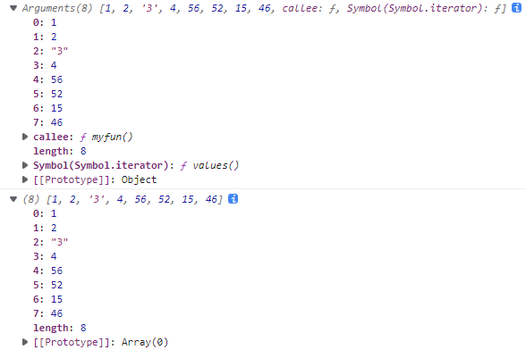

# Object

[Object - JavaScript | MDN (mozilla.org)](https://developer.mozilla.org/zh-CN/docs/Web/JavaScript/Reference/Global_Objects/Object)；

-  Object 是 JS 得一种数据类型；
- Object 可以通过 `Object()` 构造函数、对象字面量 的方式创建；
- JS 中，除原始值外，几乎所有对象都是 Object类型的实例，它们都会从 `Object.prototype` 继承属性和方法，虽然大部分属性都会被覆盖 (shadowed) 或者说被重写了 (overridden)；


## 构造器

### `Object()`

[Object() 构造函数 - JavaScript | MDN (mozilla.org)](https://developer.mozilla.org/zh-CN/docs/Web/JavaScript/Reference/Global_Objects/Object/Object)；

- **`Object()` 构造函数**：为给定的参数，创建一个 **包装类对象** (object wrapper)，
  - 如果给定的值是 `null` 或 `undefined`，它会创建并返回一个空对象；
  - 否则，它将返回一个和给定的值相对应的类型的对象；
  - 如果传进去的是引用类型的值，仍然会返回这个值，经他们复制的变量 保有和源对象 相同的引用地址；

- 当以非构造函数形式被调用时，`Object` 的行为等同于 `new Object()`；

- 语法：

  ```
  new Object()
  new Object(value)
  ```

- 示例：

  ```javascript
  console.log(new Object());					// {}	
  console.log(new Object(null));				// {}
  console.log(new Object(undefined));			// {}
  console.log(new Object(0));					// Number {0}
  console.log(new Object('0'));				// String {'0'}
  
  let x = {
      1: 2
  }
  console.log(new Object(x));					// {1: 2}
  ```

  


## 静态属性

### `Object.length`

- `length` 属性值：固定为 `1`；


## 静态方法

### `Object.keys()`

[Object.keys() - JavaScript | MDN (mozilla.org)](https://developer.mozilla.org/zh-CN/docs/Web/JavaScript/Reference/Global_Objects/Object/keys);

- **`Object.keys()`** 方法：返回一个 由给定对象自身的所有 **可枚举属性名** 的 **字符串数组**；

- 数组中属性名的排列顺序，和正常循环 (`for...in`) 遍历该对象时返回的顺序一致。

- 语法：

  ```
  Object.keys(obj)
  ```

  - `obj`：要返回其枚举自身属性的对象；在 ES2015 中，非对象的参数 将被强制转换为一个对象。
  - 返回值：一个 表示给定对象的所有可枚举属性的 **字符串数组**。

- 示例：

  ```
  // 简单数组
  const arr = ['a', 'b', 'c'];
  console.log(Object.keys(arr));			// ['0', '1', '2']
  
  
  // 类数组对象
  const obj = { 0: 'a', 1: 'b', 2: 'c' };
  console.log(Object.keys(obj));			// ['0', '1', '2']
  
  
  // 具有随机键顺序的类数组对象
  const anObj = { 100: 'a', 2: 'b', 7: 'c' };
  console.log(Object.keys(anObj));		// ['2', '7', '100']
  
  
  // getFoo 是一个不可枚举的属性
  const myObj = Object.create({}, {
    getFoo: {
      value() { return this.foo; }
    }
  });
  myObj.foo = 1;
  console.log(Object.keys(myObj));		// ['foo']
  
  ```

- 如果你想获取一个对象的所有属性，甚至包括不可枚举的，请查看 [`Object.getOwnPropertyNames`](https://developer.mozilla.org/zh-CN/docs/Web/JavaScript/Reference/Global_Objects/Object/getOwnPropertyNames)；


### `Object.values()`

[Object.values() - JavaScript | MDN (mozilla.org)](https://developer.mozilla.org/zh-CN/docs/Web/JavaScript/Reference/Global_Objects/Object/values)；

- **`Object.values()`** 方法：返回一个 给定对象自身的所有**可枚举属性值**的 数组；

- 值的顺序 与使用 `for...in`循环的顺序相同，区别在于 for-in 循环枚举原型链中的属性。

- 语法：

  ```
  Object.values(obj)
  ```

  - `obj`：要返回其枚举自身属性的对象；非对象的参数 将被强制转换为一个对象。
  - 返回值：一个包含对象自身的所有可枚举属性值的数组；

- 示例：

  ```
  var obj = { foo: 'bar', baz: 42 };
  console.log(Object.values(obj));			// ['bar', 42]
  
  
  // 类数组对象
  var obj = { 0: 'a', 1: 'b', 2: 'c' };
  console.log(Object.values(obj));			// ['a', 'b', 'c']
  
  
  // 键随机排列的 类数组对象
  // 当对象的键 为数值时，返回值的顺序根据键的大小排列
  var an_obj = { 100: 'a', 2: 'b', 7: 'c' };
  console.log(Object.values(an_obj));			// ['b', 'c', 'a']
  
  
  // 当对象的键 非数值时
  var my_obj = Object.create({}, { getFoo: { value: function() { return this.foo; } } });
  my_obj.foo = 'bar';
  console.log(Object.values(my_obj));			// ['bar']
  
  
  // 非对象的参数 将被强制转换为一个对象
  console.log(Object.values('foo'));			// ['f', 'o', 'o']
  ```


### `Object.entries()`

[Object.entries() - JavaScript | MDN (mozilla.org)](https://developer.mozilla.org/zh-CN/docs/Web/JavaScript/Reference/Global_Objects/Object/entries)；

- `Object.entries()`方法：返回一个 给定对象自身 **可枚举属性的键值对** 数组，

  - 每一个**数组项**是一对**键值对**组成的 **字符串数组**。第一个为属性名、第二个为属性值；

- 数值的排列顺序，与使用 `for...in` 循环遍历该对象时返回的顺序一致，区别在于 for-in 循环还会枚举原型链中的属性；

- 语法：

  ```
  Object.entries(obj)
  ```

- [`new Map()`](https://developer.mozilla.org/zh-CN/docs/Web/JavaScript/Reference/Global_Objects/Map) 构造函数接受一个可迭代的`entries`；借助`Object.entries()`方法可以易的将 `Object` 转换为`Map`:


## 实例属性

### `Object.prototype.constructor`

[Object.prototype.constructor - JavaScript | MDN (mozilla.org)](https://developer.mozilla.org/zh-CN/docs/Web/JavaScript/Reference/Global_Objects/Object/constructor)；

- **`constructor`** 属性：返回 Object 的构造函数；
  - 属性值是 **对函数本身的引用**，而不是一个包含函数名称的字符串。
- 所有对象都具有 `constructor` 属性；使用 `Object.create(null)` 创建的对象除外；


### `Object.prototype.__proto__`

[Object.prototype.__proto__ - JavaScript | MDN (mozilla.org)](https://developer.mozilla.org/zh-CN/docs/Web/JavaScript/Reference/Global_Objects/Object/proto)；


## 实例方法

- 实例方法、实例属性 可以被重新覆盖；

### `Object.prototype.toString()`

[Object.prototype.toString() - JavaScript | MDN (mozilla.org)](https://developer.mozilla.org/zh-CN/docs/Web/JavaScript/Reference/Global_Objects/Object/toString)；

- `toString()` 方法：返回一个 代表该对象的 字符串；

- 语法：

  ```
  obj.toString()
  ```

  - `obj`：对象实例；
  - 没有参数；

- 示例：

  ```
  var o = new Object();
  o.toString();					// [object Object]
  
  let obj1 = null;
  console.log(obj1.toString());
  
  let obj2 = undefined;
  console.log(obj2.toString());
  
  let obj3 = 123;
  console.log(obj3.toString());	// '123'
  
  let obj4 = '123';
  console.log(obj4.toString());	// '123'
  
  let obj5 = [1, '2'];
  console.log(obj5.toString());	// '1,2'
  
  function Dog(name,breed,color,sex) {
      this.name = name;
      this.breed = breed;
      this.color = color;
      this.sex = sex;
  }
  var theDog = new Dog("Gabby", "Lab", "chocolate", "female");
  theDog.toString();				// [object Object]
  ```

- 检测对象类型：

  ```
  var toString = Object.prototype.toString;
  
  console.log(toString.call(new Date));		// [object Date]
  console.log(toString.call(new String));		// [object String]
  console.log(toString.call(Math));			// [object Math]
  
  //Since JavaScript 1.8.5
  console.log(toString.call(undefined));		// [object Undefined]
  console.log(toString.call(null));			// [object Null]
  ```

  

### `Object.prototype.valueOf()`

[Object.prototype.valueOf() - JavaScript | MDN (mozilla.org)](https://developer.mozilla.org/zh-CN/docs/Web/JavaScript/Reference/Global_Objects/Object/valueOf)；

- `valueOf()` 方法：返回 指定对象的 原始值；

- 语法：

  ```
  obj.valueOf()
  ```

  

| obj      | 返回值                                                 |
| :------- | :----------------------------------------------------- |
| Array    | 返回数组对象本身                                       |
| Boolean  | 布尔值                                                 |
| Date     | 存储的时间是从 1970 年 1 月 1 日午夜开始计的毫秒数 UTC |
| Function | 函数本身                                               |
| Number   | 数字值                                                 |
| Object   | 对象本身。这是默认情况                                 |
| String   | 字符串值                                               |
|          | Math 和 Error 对象没有 valueOf 方法                    |


### 类型转换

- 在 JS 中，当自动进行类型转换，且**对一个对象进行类型转换**时，实际上是该对象实例先调用 `valueOf()` 方法，再调用 `toString()` 方法；
  - 但若调用 `valueOf()` 后得到的是原始值，则不再调用 `toString()` 方法；
- 我们可以通过修改 `valueOf()` 方法、`toString()` 方法，来自定义对象的类型转换；


# Function

[Function - JavaScript | MDN (mozilla.org)](https://developer.mozilla.org/zh-CN/docs/Web/JavaScript/Reference/Global_Objects/Function)；

- 每个 JS 函数都是一个 Function 对象；
- `arguments` 对象：传递给函数的所有参数，组成的一个的类数组对象；只能再 Function 中使用；


## 构造器

### `Function()`

[Function() constructor - JavaScript | MDN (mozilla.org)](https://developer.mozilla.org/en-US/docs/Web/JavaScript/Reference/Global_Objects/Function/Function)；


## 实例属性

### `Function.prototype.name`

[Function.name - JavaScript | MDN (mozilla.org)](https://developer.mozilla.org/zh-CN/docs/Web/JavaScript/Reference/Global_Objects/Function/name)；

- `function.name` 属性：返回函数实例的 **名称**；

| `Function.name` 属性的属性特性： |       |
| :------------------------------- | ----- |
| writable                         | false |
| enumerable                       | false |
| configurable                     | true  |

- 示例：

  ```
  console.log((function() {}).name);			// 空
  console.log((function fun1() {}).name);		// fun1
  
  let myfun2 = function() {};					// myfun2
  console.log(myfun2.name);
  
  let myfun3 = function myfun4() {};
  console.log(myfun3.name);					// myfun4
  console.log(myfun4.name);		// Uncaught ReferenceError: myfun4 is not defined
  ```

  


### `Function.prototype.length`

[Function.length - JavaScript | MDN (mozilla.org)](https://developer.mozilla.org/zh-CN/docs/Web/JavaScript/Reference/Global_Objects/Function/length)；

- **`length`** 属性：返回函数的 **形参个数**；

| `Function.length` 属性的属性特性： |       |
| :--------------------------------- | ----- |
| writable                           | false |
| enumerable                         | false |
| configurable                       | true  |


### `Function.prototype.displayName`

[Function.displayName - JavaScript | MDN (mozilla.org)](https://developer.mozilla.org/zh-CN/docs/Web/JavaScript/Reference/Global_Objects/Function/displayName)；

- `function.displayName` 属性：获取函数的 **显示名称**；


## 实例方法

### `Function.prototype.apply()`

[Function.prototype.apply() - JavaScript | MDN (mozilla.org)](https://developer.mozilla.org/zh-CN/docs/Web/JavaScript/Reference/Global_Objects/Function/apply)；

- `apply()` 方法：调用函数时，指定 `this` 值，以及提供 以一个数组（或一个[类数组对象](https://developer.mozilla.org/zh-CN/docs/Web/JavaScript/Guide/Indexed_collections#working_with_array-like_objects)）形式的 参数。

- 语法：

  ```
  func.apply(thisArg)
  func.apply(thisArg, argsArray)
  ```

  - `func`：Function 实例的函数名；
  - `thisArg`：在此次调用 `func` 函数时，指定函数中 `this` 指向；
  - `argsArray`：在此次调用 `func` 函数时，传递给该函数的参数 组成的 数组或类数组对象；

  

### `Function.prototype.call()`

[Function.prototype.call() - JavaScript | MDN (mozilla.org)](https://developer.mozilla.org/zh-CN/docs/Web/JavaScript/Reference/Global_Objects/Function/call)；

- `call()` 方法：使用 一个指定的 `this` 值 和 单独给出的一个或多个参数 来调用一个函数；

- `call()` 方法接受的是 **一个参数列表**，`apply()` 方法接受的是 **一个包含多个参数的数组**；

- 语法：

  ```
  func.call(thisArg, arg1, arg2, ...)
  ```

- 语法：

  ```javascript
  function myfun(a, b) {
      console.log(this.name, this.age)
      console.log(a + b)
  }
  
  let x = {
      name: 'abc',
      age: 123
  };
  
  myfun.apply(x, [1, 2]);
  // abc 123
  // 3
  
  myfun.call(x, 1, 2);
  // abc 123
  // 3
  ```

  

### 类数组对象 转换为 数组

```javascript
function myfun() {
    console.log(arguments);

    // 将arguments转换为数组
    // silce()为Array对象的方法 也是一个函数
    // call()改变 silce 中 this 指向, 原先指向空数组
    let newArray = [].slice.call(arguments);
    console.log(newArray);
}

myfun(1, 2, '3', 4, 56, 52, 15, 46)
```




### `Function.prototype.bind()`

[Function.prototype.bind() - JavaScript | MDN (mozilla.org)](https://developer.mozilla.org/zh-CN/docs/Web/JavaScript/Reference/Global_Objects/Function/bind)；

- `bind()` 方法：创建一个新的函数；在 `bind()` 被调用时，**新函数的 `this` 始终指向 `bind()` 的第一个参数**；而其余参数将作为新函数的参数，供调用时使用。

- 语法：

  ```
  func.bind(thisArg[, arg1[, arg2[, ...]]])
  ```

- 示例：

  ```javascript
  function myfun(a, b) {
      console.log(this.name, this.age)
      console.log(a + b)
  }
  
  let x = {
      name: 'abc',
      age: 123
  };
  
  let newMyFun1 = myfun.bind(x, 1, 2)
  newMyFun1();
  //abc 123
  //3
  
  let newMyFun2 = myfun.bind(x, 1);
  newMyFun2(3);
  //abc 123
  //4
  
  let newMyFun2 = myfun.bind(x, , 1);	//Uncaught SyntaxError: Unexpected token ','
  ```

  

### `Function.prototype.toString()`

[Function.prototype.toString() - JavaScript | MDN (mozilla.org)](https://developer.mozilla.org/zh-CN/docs/Web/JavaScript/Reference/Global_Objects/Function/toString)；

- `toString()` 方法：返回一个字符串，该字符串表示当前函数的源代码；

- `Function`对象覆盖了从 `Object` 继承来的 `toString()` 方法；

- 语法：

  ```
  func.toString()
  ```

  


# Boolean

[Boolean - JavaScript | MDN (mozilla.org)](https://developer.mozilla.org/zh-CN/docs/Web/JavaScript/Reference/Global_Objects/Boolean)；

- 继承 Function 和 Object 的 **实例属性** 和 **实例方法**；
- Boolean 对象：是一个布尔值的 **对象包装器**；
- Boolean 原始值 当作对象使用时，会自动使用布尔对象包装器转换为 Boolean 对象；


## 构造器

### `Boolean()`

[Boolean() constructor - JavaScript | MDN (mozilla.org)](https://developer.mozilla.org/en-US/docs/Web/JavaScript/Reference/Global_Objects/Boolean/Boolean)；

- 语法：

  ```
  new Boolean(value)			// 创建 Boolean 对象实例
  Boolean(value)				// 转换为 Boolean 原始值
  ```

- 转换为 falsey 的 `value`：省略，`false`，`0`，`-0`，`NaN`，`null`，`undefined`，`''` (空字符串)；

- 注意区分：基本类型中的布尔值 `true` 和 `false`；值为 `true` 和 `false` 的 Boolean 对象。

- 不要用创建 Boolean 对象的方式 将一个非布尔值转化成布尔值；

  - 直接将 `Boolean()` 当做转换函数来使用即可，或者使用 双重非 `!!` 运算符：

- 不要在 应该使用基本类型布尔值的地方 使用 Boolean 对象；

  


## 实例方法

### `Boolean.prototype.toString()`

[Boolean.prototype.toString() - JavaScript | MDN (mozilla.org)](https://developer.mozilla.org/zh-CN/docs/Web/JavaScript/Reference/Global_Objects/Boolean/toString)；

- **`toString()`** 方法：返回 表示指定的布尔对象的 字符串 (`'true'` 或 `'flase'`)；

  - 覆盖了 `Object` 对象的 `toString` 方法

- 语法：

  ```
  bool.toString()
  ```

  - 返回值：一个 表示 Boolean 对象 `bool` 的 字符串；

- 当一个 Boolean 对象、作为 文本值 或 进行字符串连接 时，JS 会自动调用其 `toString` 方法；


### `Boolean.prototype.valueOf()`

[Boolean.prototype.valueOf() - JavaScript | MDN (mozilla.org)](https://developer.mozilla.org/zh-CN/docs/Web/JavaScript/Reference/Global_Objects/Boolean/valueOf)；

- **`valueOf()`** 方法：返回一个 Boolean 对象的原始值 (`true` 或 `flase`)；

- 语法：

  ```
  bool.valueOf()
  ```

  - 返回值：返回 Boolean 对象或字面量 `bool` 的原始值；


# Symbol

[Symbol - JavaScript | MDN (mozilla.org)](https://developer.mozilla.org/zh-CN/docs/Web/JavaScript/Reference/Global_Objects/Symbol)；

- 继承 Function 和 Object 的 **实例属性** 和 **实例方法**；


# Error


