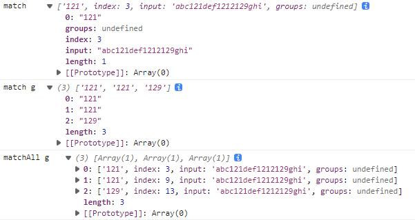

# String

[String - JavaScript | MDN (mozilla.org)](https://developer.mozilla.org/zh-CN/docs/Web/JavaScript/Reference/Global_Objects/String)；

- String 原始值 使用 String 对象实例成员时，会自动使用字符串对象包装器 转换为 String 对象，然后再使用实例成员；
- String 对象 是一个 伪数组；


## 索引

- 索引：字符串的每个字符对应一个索引；


## 模板字符串

[模板字符串 - JavaScript | MDN (mozilla.org)](https://developer.mozilla.org/zh-CN/docs/Web/JavaScript/Reference/Template_literals)；

- 模板字面量：允许 **嵌入表达式** 的 字符串字面量。你可以使用 **多行字符串** 和 **字符串插值** 功能。
- 占位符：模板字符串可以包含特定语法 **`${expression}`** 的占位符。
  - 占位符中的表达式 和 周围的文本 会一起传递给一个默认函数，该函数负责将所有的部分连接起来；
  - 如果 一个模板字符串 **由表达式开头**，则该字符串被称为 **带标签的模板字符串**；
    - 该表达式通常是一个函数，它会在模板字符串处理后被调用；在输出最终结果前，可以 通过该函数 来对模板字符串进行操作处理。
- 在模版字符串内使用反引号 (`)  时，需要在它前面加转义符 ( \ )；


## 构造器

- `String()`：返回一个字符串对象； 

- 语法：

  ```
  new String(thing)						// 返回 一个新 String 对象
  String(thing)							// 返回 一个 String 原始值
  ```

  - `thing`：任何可以被转换成字符串的值；
  - 返回值：返回一个 String 对象/原始值；


## 静态属性

### `String.length`

- 静态属性 `String.length` 返回 `1`；


### `String.prototype`

- 可以为 String 对象 增加 新的属性；


## 静态方法

### Unicode UTF-8

- 1 byte = 8bit；
  - 1 byte 可以用两个16进制数表示；
  - `00000000` ~ `01111111`：`00` ~ `7F`：`0` ~ `127`；ASCII码
  - `00000000` ~ `11111111`：`00` ~ `FF`；
- 1 Unicode 码位 = 2 byte；

```
Unicode符号范围      |        UTF-8编码方式
(十六进制)           |            （二进制）
----------------------+---------------------------------------------
0000 0000 - 0000 007F | 0xxxxxxx
0000 0080 - 0000 07FF | 110xxxxx 10xxxxxx
0000 0800 - 0000 FFFF | 1110xxxx 10xxxxxx 10xxxxxx
0001 0000 - 0010 FFFF | 11110xxx 10xxxxxx 10xxxxxx 10xxxxxx
```

[Unicode 和 UTF-8 之间的关系\[转载] - Tsingke - 博客园 (cnblogs.com)](https://www.cnblogs.com/tsingke/p/10853936.html)；

- 进制转换：

  ```
  Number.parseInt('4E25', 16)						// 11845 16进制 转 10进制
  Number.parseInt('100111000100101', 2)			// 4E25	  2进制 转 10进制
  
  (20005).toString(2)								// '100111000100101' 10进制 转  2进制
  (20005).toString(16)							// '4e25'            10进制 转 16进制
  ```

- 获取字符编码

  ```
  '你'.charCodeAt(0)								// 55422 UTF-16补充字符 第1部分 10进制
  '你'.charCodeAt(1)								// 56324 UTF-16补充字符 第2部分
  '你'.codePointAt()								// 194564 Unicode编码 10进制
  ```

- 根据10进制编码获得字符

  ```
  // UTF-16编码 10进制 大于65535
  String.fromCharCode(55422, 56324)				// '你'
  String.fromCharCode(0xD87E, 0xDC04)				// '你'
  '\ud87e\udc04'									// '你'
  
  
  // Unicode编码 10进制
  String.fromCodePoint(194564)					// '你'
  
  (194564).toString(16)							// '2f804'
  String.fromCodePoint(0x2F804);					// '你'
  
  194564 - Number.parseInt('10000',16)			// 129028
  (129028).toString(2)							// '11111100000000100'
  //       0001111110       0000000100
  // 1101100001111110 1101110000000100
  Number.parseInt('11011000011111101101110000000100',2).toString(16)	// 'd87edc04'
  String.fromCodePoint(0xD87E, 0xDC04);			// '你'
  
  '\u2f804'										// '⾀4'
  '\u2f80'										// '⾀'
  ```

- Unicode 转 代理对(2个 16-bit位)：

  ```
  (55422).toString(2)								// '1101100001111110'
  (56324).toString(2)								// '1101110000000100'
  
  // 1101100001111110 1101110000000100
  //       0001111110       0000000100
  Number.parseInt('10000',16).toString(2)			// '10000000000000000'
  //    11111100000000100
  // +  10000000000000000
  // = 101111100000000100
  (194564).toString(2)							// '101111100000000100'
  ```

  

###  `String.fromCharCode()`

[String.fromCharCode() - JavaScript | MDN (mozilla.org)](https://developer.mozilla.org/zh-CN/docs/Web/JavaScript/Reference/Global_Objects/String/fromCharCode)；

- `String.fromCharCode()` 静态方法：返回 使用指定的 UTF-16 字符编码 序列 创建的 **String 原始值**；

- 语法：

  ```
  String.fromCharCode(num1[, ...[, numN]])
  ```

  - `numN`：一系列 16-bit 的 **UTF-16** 代码单元的数字；
    - 范围介于 `0` 到 `65535`（`0xFFFF`）之间。大于 `0xFFFF` 的数字将 **被截断**。不进行有效性检查。
  - 返回值：返回 一个长度为 `N` 的 **String 原始值**；该字符串由 `N` 个指定的 UTF-16 代码单元组成。

- 补充字符：从范围 `65536` (`0x010000`) 到 `1114111` (`0x10FFFF`) 被称之为补充字符

  - 在 UTF-16 中，补充字符也叫代理（surrogates），用两个 16-bit 代码单元表示；
  - 两个代理（surrogates）形成一个有效组合，也叫代理对，可以用来表示一个补充字符；
  - 使用补充字符，建议使用 `String.fromCodePoint()`；

- 示例：

  ```
  String.fromCharCode(0xD83C, 0xDF03);			// '🌃'
  '\uD83C\uDF03'									// '🌃'
  ```

  

### `String.fromCodePoint()`

[String.fromCodePoint() - JavaScript | MDN (mozilla.org)](https://developer.mozilla.org/zh-CN/docs/Web/JavaScript/Reference/Global_Objects/String/fromCodePoint)；

- `String.fromCodePoint()` 静态方法：返回 使用指定的 Unicode 码点 序列创建的 **String 原始值**；

- 语法：

  ```
  String.fromCodePoint(num1[, ...[, numN]])
  ```

  - `numN`：一串 Unicode 编码位置，即“代码点”。
    - 如果传入无效的 Unicode 编码，将会抛出一个[`RangeError`](https://developer.mozilla.org/zh-CN/docs/Web/JavaScript/Reference/Global_Objects/RangeError)；
  - 返回值：使用 指定的 Unicode 编码位置创建的 字符串。

- 示例：

  ```
  String.fromCodePoint(0x2F804);					// '你'
  String.fromCodePoint(0xD87E, 0xDC04);			// '你'
  '\uD87E\uDC04'									// '你'
  ```
  
  

### `String.raw()`

[String.raw() - JavaScript | MDN (mozilla.org)](https://developer.mozilla.org/zh-CN/docs/Web/JavaScript/Reference/Global_Objects/String/raw)；

- `String.raw()`：是一个模板字符串的标签函数；用来获取 一个模板字符串的 **String 原始值**；


## 实例属性

### `String.prototype.length`

[String.length - JavaScript | MDN (mozilla.org)](https://developer.mozilla.org/zh-CN/docs/Web/JavaScript/Reference/Global_Objects/String/length)；

- `length` 实例属性：表示一个字符串的长度；
  - 该属性 返回 字符串中 **字符编码单元** 的数量；
  - JavaScript 使用 [UTF-16](https://zh.wikipedia.org/wiki/UTF-16) 编码，该编码使用一个 **16-bit 的编码单元** 来表示大部分常见的字符；
  - 使用 两个代码单元 表示 不常用的字符；
  - 因此 `length` 返回值 可能与 字符串中实际的字符数量 不相同；

- 空字符串的 `length` 为 0。

  ```
  ''.length		// 0
  "你".length		// 1
  ```

  


## 实例方法

| 方法                                                         | 描述                                                         |
| :----------------------------------------------------------- | :----------------------------------------------------------- |
| [`startsWith`](https://developer.mozilla.org/zh-CN/docs/Web/JavaScript/Reference/Global_Objects/String/startsWith), [`endsWith`](https://developer.mozilla.org/zh-CN/docs/Web/JavaScript/Reference/Global_Objects/String/endsWith), [`includes`](https://developer.mozilla.org/zh-CN/docs/Web/JavaScript/Reference/Global_Objects/String/includes) | 返回字符串是否以指定字符串开始、结束或包含指定字符串。       |
| [`substring`](https://developer.mozilla.org/zh-CN/docs/Web/JavaScript/Reference/Global_Objects/String/substring), [`substr`](https://developer.mozilla.org/zh-CN/docs/Web/JavaScript/Reference/Global_Objects/String/substr) | 分别通过指定起始和结束位置，起始位置和长度来返回字符串的指定子集。 |
| [`match`](https://developer.mozilla.org/zh-CN/docs/Web/JavaScript/Reference/Global_Objects/String/match), [`replace`](https://developer.mozilla.org/zh-CN/docs/Web/JavaScript/Reference/Global_Objects/String/replace), [`search`](https://developer.mozilla.org/zh-CN/docs/Web/JavaScript/Reference/Global_Objects/String/search) | 通过正则表达式来工作。                                       |
| [`normalize`](https://developer.mozilla.org/zh-CN/docs/Web/JavaScript/Reference/Global_Objects/String/normalize) | 按照指定的一种 Unicode 正规形式将当前字符串正规化。          |
| [`trim`](https://developer.mozilla.org/zh-CN/docs/Web/JavaScript/Reference/Global_Objects/String/Trim) | 去掉字符串开头和结尾的空白字符。                             |


### 字符操作

- [`String.prototype.normalize()`](https://developer.mozilla.org/zh-CN/docs/Web/JavaScript/Reference/Global_Objects/String/normalize)：会按照指定的一种 Unicode 正规形式将当前字符串规范化；


以下函数 不会改变 原字符串；

- [`String.prototype.toString()`](https://developer.mozilla.org/zh-CN/docs/Web/JavaScript/Reference/Global_Objects/String/toString)：返回 一个字符串，表示指定的字符串

- [`String.prototype.valueOf()`](https://developer.mozilla.org/zh-CN/docs/Web/JavaScript/Reference/Global_Objects/String/valueOf)：返回 String 对象的 原始值；

  

- [`String.prototype.toUpperCase`](https://developer.mozilla.org/zh-CN/docs/Web/JavaScript/Reference/Global_Objects/String/toUpperCase)：返回字符串的 **大写表示**；
- [`String.prototype.toLowerCase`](https://developer.mozilla.org/zh-CN/docs/Web/JavaScript/Reference/Global_Objects/String/toLowerCase)： 返回字符串的 **小写表示**；
- [`String.prototype.repeat()`](https://developer.mozilla.org/zh-CN/docs/Web/JavaScript/Reference/Global_Objects/String/repeat)：将字符串内容 **重复** 指定次数后 返回；
- [`String.prototype.concat()`](https://developer.mozilla.org/zh-CN/docs/Web/JavaScript/Reference/Global_Objects/String/concat)：**连接** 两个字符串，并返回新的字符串；不会改变原字符串；
- [`String.prototype.padStart()`](https://developer.mozilla.org/zh-CN/docs/Web/JavaScript/Reference/Global_Objects/String/padStart)：从当前字符串的左侧开始填充。
- [`String.prototype.padEnd()`](https://developer.mozilla.org/zh-CN/docs/Web/JavaScript/Reference/Global_Objects/String/padEnd)：从当前字符串的末尾（右侧）开始填充。
- [`String.prototype.split()`](https://developer.mozilla.org/zh-CN/docs/Web/JavaScript/Reference/Global_Objects/String/split)：通过将字符串 **分离** 成一个个子串，来把一个 String 对象 分裂到 一个字符串数组中；并返回新字符串数组；
- [`String.prototype.split()`](https://developer.mozilla.org/zh-CN/docs/Web/JavaScript/Reference/Global_Objects/String/slice)：从一个字符串 **提取** 片段，并作为新字符串返回；
  
  - 位置可以是负数；
- [`String.prototype.substr()`](https://developer.mozilla.org/zh-CN/docs/Web/JavaScript/Reference/Global_Objects/String/substr)：通过指定 起始位置 和 长度，来返回字符串的指定子集。
  
  - 位置可以是负数；
- [`String.prototype.substring()`](https://developer.mozilla.org/zh-CN/docs/Web/JavaScript/Reference/Global_Objects/String/substring)：通过指定 起始位置 和 结束位置，来返回字符串的指定子集。
  - 位置不可以是负数；
  - 第一个参数 大于 第二个参数时，自动调换；


### `String.prototype.toString()`

[String.prototype.toString() - JavaScript | MDN (mozilla.org)](https://developer.mozilla.org/zh-CN/docs/Web/JavaScript/Reference/Global_Objects/String/toString)；

- **`toString()`** 方法：返回一个 **String 原始值**，表示指定的字符串。

  - 不会改变 原字符串；
  - 覆盖了 Object 对象的 `Object.prototype.toString()`；

- 语法：

  ```
  str.toString()
  ```

  - 返回值：String 包装对象的字符串值；

- 示例：

  ```
  let myString = new String(" asbcsjdcgiua shcnkjcwe ");
  let newMyString = myString.toString();
  console.log(myString);			// String {' asbcsjdcgiua shcnkjcwe '}
  console.log(newMyString);		// ' asbcsjdcgiua shcnkjcwe '
  ```


### `String.prototype.valueOf()`

- **`valueOf()`** 方法：返回 `String` 对象的 **原始值**；


### `String.prototype.repeat()`

- **`repeat()`**：构造并返回一个新 **String 原始值**，该字符串包含被连接在一起的指定数量的字符串的副本。

  - 不会改变 原字符串；

- 语法：

  ```
  str.repeat(count)
  ```

  - `count`：介于 `0` 和 [`+Infinity`](https://developer.mozilla.org/zh-CN/docs/Web/JavaScript/Reference/Global_Objects/Number/POSITIVE_INFINITY) 之间的整数。表示在新构造的字符串中，重复了多少遍原字符串。
    - 省略或值为 `0` 时，返回空字符串；
    - [`RangeError`](https://developer.mozilla.org/zh-CN/docs/Web/JavaScript/Reference/Errors/Negative_repetition_count): 重复次数不能为负数。
    - [`RangeError`](https://developer.mozilla.org/zh-CN/docs/Web/JavaScript/Reference/Errors/Resulting_string_too_large): 重复次数必须小于 infinity，且长度不会大于最长的字符串。
  - 返回值：包含 指定字符串的指定数量副本 的新 **String 原始值**。


### `String.prototype.concat()`

[String.prototype.concat() - JavaScript | MDN (mozilla.org)](https://developer.mozilla.org/zh-CN/docs/Web/JavaScript/Reference/Global_Objects/String/concat)；

- **`concat()`** 方法：将一个或多个字符串与原字符串连接合并，形成一个新 **String 原始值** 并返回。

  - 不会改变 原字符串；

- 语法：

  ```
  str.concat(str2, [, ...strN])
  ```

  - `strN`：需要连接到 `str` 的字符串。
    - 从左到由依次链接；
    - 如果参数不是字符串类型，它们在连接之前将会被转换成字符串。
  - 返回值：一个新 **String 原始值**，包含参数所提供的连接字符串。


### `String.prototype.padStart()`

[String.prototype.padStart() - JavaScript | MDN (mozilla.org)](https://developer.mozilla.org/zh-CN/docs/Web/JavaScript/Reference/Global_Objects/String/padStart)；

[String.prototype.padEnd() - JavaScript | MDN (mozilla.org)](https://developer.mozilla.org/zh-CN/docs/Web/JavaScript/Reference/Global_Objects/String/padEnd)；

- 用另一个字符串填充当前字符串（如果需要的话，会重复多次），以便产生的字符串达到给定的长度。

  - 不会改变 原字符串；

- 语法：

  ```
  str.padStart(targetLength)
  str.padStart(targetLength, padString)
  
  str.padEnd(targetLength)
  str.padEnd(targetLength, padString)
  ```

  - `targetLength`：当前字符串需 要**填充到**的目标长度。
    - 如果 `targetLength` 小于 `str.length`，则返回 `str` 的原始值。 
  - `padString`：可选参数；填充字符串。
    - 如果字符串太长，使填充后的字符串长度超过了目标长度，则只保留 `padString` 最左侧的部分，其他部分会被截断。
    - 默认值为空格 `" "`（U+0020）。
  - 返回值：原字符串填充指定的字符串直到目标长度，所形成的新 **String 原始值**。

- 示例：

  ```
  let myString = new String(" abcde fghig ");
  let myString1 = new String(" 01234 56789 ");
  let newMyString1 = myString.padStart(15, myString1);
  myString;						// String {' abcde fghig '}
  newMyString2;					// '   abcde fghig '
  
  let newMyString2 = myString.padStart(15, myString1);
  newMyString2;					// ' 0 abcde fghig '
  
  let newMyString3 = myString.padStart(40, myString1);
  newMyString3;					// ' 01234 56789  01234 56789   abcde fghig '
  ```

  

### `String.prototype.split()`

[String.prototype.split() - JavaScript | MDN (mozilla.org)](https://developer.mozilla.org/zh-CN/docs/Web/JavaScript/Reference/Global_Objects/String/split)；

- **`split()`** 方法：使用指定的分隔符字符串将一个 String 对象分割成 **子字符串数组**；每个数组项都是 String 原始值；

  - 不改变原数组

- 语法：

  ```
  str.split()
  str.split(separator)
  str.split(separator, limit)
  ```

  - `separator`：一个字符串，指定每个拆分应发生的点。
    - 可以是一个字符串或[正则表达式](https://developer.mozilla.org/zh-CN/docs/Web/JavaScript/Reference/Global_Objects/RegExp)；
    - 如果 `separator` 包含多个字符，则必须找到整个字符串来表示分割点；
    - 如果 `separator` 省略、或者在 `str` 中没有出现，则 返回的数组是 包含一个由整个字符串组成的元素；
    - 如果 `separator` 为空字符串，则将 `str` 原字符串中每个字符的数组形式返回。
  - `limit`：一个整数，限定返回的**分割片段数量**。
    - 如果在达到指定限制之前 达到字符串的末尾，它可能仍然包含少于限制的条目。新数组中不返回剩下的文本。
  - 返回值：返回原字符串以分隔符出现位置分隔而成的一个 Array；每个数组项都是 String 原始值；

- 示例：

  ```
  let myString = new String(" abcd abcd abcd abcd ");
  
  let newMyString = myString.split("bc");
  console.log(myString);				// String {' abcd abcd abcd abcd '}
  console.log(newMyString);			// (5) [' a', 'd a', 'd a', 'd a', 'd ']
  
  // separator 省略 或者 没有出现
  let newMyString = myString.split();
  let newMyString = myString.split("de");
  console.log(newMyString);			// [' abcd abcd abcd abcd ']
  
  // 在达到字符串的末尾之前 达到指定限制 
  let newMyString = myString.split("bc", 2);
  console.log(newMyString);			// (2) [' a', 'd a']
  
  // 在达到指定数量之前 达到字符串的末尾
  let newMyString = myString.split("bc", 7);
  console.log(newMyString);			// (5) [' a', 'd a', 'd a', 'd a', 'd ']
  ```

  

### `String.prototype.slice()`

[String.prototype.slice() - JavaScript | MDN (mozilla.org)](https://developer.mozilla.org/zh-CN/docs/Web/JavaScript/Reference/Global_Objects/String/slice)；

- **`slice()`** 方法：提取某个字符串的一部分，并返回一个新 **String 原始值**；

  - 不会改变 原字符串；

- 语法：

  ```
  str.slice()
  str.slice(beginIndex)
  str.slice(beginIndex, endIndex)
  ```

  - `beginIndex`：起始索引；在该索引处 开始提取 原字符串中的字符；**包含该索引处的字符**；
    - 默认值为 `0`；
    - 如果 `beginIndex < -str.length`，则 从 `0` 开始
    - 如果 ` -str.length <= beginIndex  < 0`，则 从 `str.length + beginIndex` 开始；
    - 如果 `beginIndex >= str.length`，则 返回空字符串；
  - `endIndex`：终止索引；在该索引处 终止提取 原字符串中的字符；**不包含该索引处的字符**；
    - 默认值为 `str.length`；
    - 如果 `beginIndex < -str.length`，则 返回空字符串；
    - 如果 ` -str.length <= beginIndex  < 0`，则 在 `str.length + beginIndex` 结束；
    - 如果 `beginIndex >= str.length`，则 在 `str.length` 结束；；
  - 返回值：返回 一个从原字符串中提取出来的 新 **String 原始值**；
    - 如果 **起始位置 大于等于 终止位置**，则 返回空字符串；


### `String.prototype.substr()`

[String.prototype.substr() - JavaScript | MDN (mozilla.org)](https://developer.mozilla.org/zh-CN/docs/Web/JavaScript/Reference/Global_Objects/String/substr)；

- **`substr()`** 方法：对一个字符串 从指定索引开始 截取，到指定长度时终止；返回截取的 **String 原始值**；

  - 不会改变 原字符串；

- 语法：

  ```
  str.substr()
  str.substr(start)
  str.substr(start, length)
  ```

  - `beginIndex`：同上 [`String.prototype.slice()`](#`String.prototype.slice()`) ；
  - `length`：可选参数；表示提取的字符数；
    - 如果 `length` 省略，则 截取到字符串末尾；
    - 如果 `length <= 0`，则 返回空字符串；
    - 如果 `length` 大于 起始索引之后的字符串长度，则 截取到字符串末尾；
  - 返回值：对一个字符串 从指定索引开始 截取，到指定长度时终止的 **String 原始值**；


### `String.prototype.substring()`

[String.prototype.substring() - JavaScript | MDN (mozilla.org)](https://developer.mozilla.org/zh-CN/docs/Web/JavaScript/Reference/Global_Objects/String/substring)；

- **`substring()`** 方法：对一个字符串 从起始索引开始、到终止索引结束 提取字符，返回提取得到的新 **String 原始值**；

  - 不会改变 原字符串；

- 语法：

  ```
  str.substring(indexStart)
  str.substring(beginIndex, indexEnd)
  ```

  - `indexStart`：起始索引；在该索引处 开始提取 原字符串中的字符；**包含该索引处的字符**；
  - `indexEnd`：终止索引；在该索引处 终止提取 原字符串中的字符；**不包含该索引处的字符**；
    - 如果 `indexEnd` 省略，则 提取到字符串末尾；
  - 上面两个参数：
    - 如果 `indexStart = indexEnd`，则 返回空字符串。
    - 如果 `indexStart > indexEnd`，则 与参数值互换后的效果相同。
    - 如果 任一参数 小于 `0` 或为 `NaN`，则 被当作 `0`。
    - 如果 任一参数 大于 `str.length`，则 被当作 `str.length`。
  - 返回值：返回提取得到的新 **String 原始值**；


### 移除首尾空白字符

返回一个新字符串；不会改变 原字符串；

- [`String.prototype.trim()`](https://developer.mozilla.org/zh-CN/docs/Web/JavaScript/Reference/Global_Objects/String/Trim)：去掉字符串 开头和结尾 的空白字符。
- [`String.prototype.trimStart()`)](https://developer.mozilla.org/zh-CN/docs/Web/JavaScript/Reference/Global_Objects/String/trimStart)去掉字符串 开头 的空白字符。
- [`String.prototype.trimEnd()`](https://developer.mozilla.org/zh-CN/docs/Web/JavaScript/Reference/Global_Objects/String/trimEnd)去掉字符串 结尾 的空白字符。


### 指定字符、索引

- [`String.prototype.charAt`](https://developer.mozilla.org/zh-CN/docs/Web/JavaScript/Reference/Global_Objects/String/charAt)：返回 字符串指定位置的字符
- [`String.prototype.charCodeAt`](https://developer.mozilla.org/zh-CN/docs/Web/JavaScript/Reference/Global_Objects/String/charCodeAt)：返回 字符串指定位置字符的 一个 16bit **UTF-16 编码** 的十进制数。
- [`String.prototype.codePointAt`](https://developer.mozilla.org/zh-CN/docs/Web/JavaScript/Reference/Global_Objects/String/codePointAt)：返回 字符串指定位置字符的 **Unicode 码点 (code points)** 的十进制数；


- [`String.prototype.indexOf`](https://developer.mozilla.org/zh-CN/docs/Web/JavaScript/Reference/Global_Objects/String/indexOf)：返回 字符串中 指定子串的 位置；
- [`String.prototype.lastIndexOf`](https://developer.mozilla.org/zh-CN/docs/Web/JavaScript/Reference/Global_Objects/String/lastIndexOf)：返回 字符串中 指定子串的 最后位置；


### 判断

- [`String.prototype.startsWith()`](https://developer.mozilla.org/zh-CN/docs/Web/JavaScript/Reference/Global_Objects/String/startsWith)：判断当前字符串是否以另外一个给定的子字符串 **开头**，并根据判断结果返回 `true` 或 `false`。
- [`String.prototype.endsWith()`](https://developer.mozilla.org/zh-CN/docs/Web/JavaScript/Reference/Global_Objects/String/endsWith)：判断当前字符串是否以另外一个给定的子字符串 **结尾**，并根据判断结果返回 `true` 或 `false`。
- [`String.prototype.includes()`](https://developer.mozilla.org/zh-CN/docs/Web/JavaScript/Reference/Global_Objects/String/includes)：判断一个字符串是否 **包含在** 另一个字符串中，根据判断结果返回 `true` 或 `false`。


### 正则相关

### `String.prototype.match()`

- [`String.prototype.match(regexp)`](https://developer.mozilla.org/zh-CN/docs/Web/JavaScript/Reference/Global_Objects/String/match)：返回一个字符串匹配正则表达式的结果。

  - 如果使用 g 标志，则返回 完整匹配的所有结果，但 不会返回捕获组。
  - 如果未使用 g 标志，则仅返回 第一个完整匹配及其 **捕获组** (`Array`)；在这种情况下，返回的项目将具有的其他属性。
  - 没有匹配到，则返回 `null`；

- [`String.prototype.matchAll(regexp)`](https://developer.mozilla.org/zh-CN/docs/Web/JavaScript/Reference/Global_Objects/String/matchAll)：返回一个 包含所有匹配结果及捕获组的 **迭代器**。

  - `RegExp` 必须是设置了全局模式`g`的形式；

  ```
  let str = "abc121def1212129ghi";
  let reg1 = /12\d/;
  let reg2 = /12\d/g;
  
  // match()
  let result11 = str.match(reg1);
  let result12 = str.match(reg2);
  console.log("match\t", result11);
  console.log("match g\t", result12);
  
  // matchAll()
  let result21 = [...str.matchAll(reg2)];
  console.log("matchAll g\t", result21);
  ```

  


### `String.prototype.search()`

- [`String.prototype.search(regexp)`](https://developer.mozilla.org/zh-CN/docs/Web/JavaScript/Reference/Global_Objects/String/search)：执行正则表达式和 String 对象之间的一个搜索匹配；

  - 如果匹配成功，则返回正则表达式在字符串中 **首次匹配项的 索引**；否则，返回 `-1`。

  ```
  let str = "abc121def1212129ghi";
  let reg1 = /12\d/;
  let reg2 = /12\d/g;
  
  // search()
  str.search(reg1);		// 3
  str.search(reg1);		// 3
  ```


### `String.prototype.replace()`

- [`String.prototype.replace()`](https://developer.mozilla.org/zh-CN/docs/Web/JavaScript/Reference/Global_Objects/String/replace)：返回一个  由替换值(`replacement`)  替换  部分或所有的模式(`pattern`)匹配项  后的 **新字符串**。
- [`String.prototype.replaceAll()`](https://developer.mozilla.org/zh-CN/docs/Web/JavaScript/Reference/Global_Objects/String/replaceAll)：
  - 当使用一个 `regex` 时，您必须设置全局（“g”）标志


- 不会改变 原字符串；

- 语法：

  ```
  str.replace(regexp|substr, newSubStr|function)
  str.replaceAll(regexp|substr, newSubstr|function)
  ```

  - 第一个参数 `pattern`：可以是 `regexp` 或者 `substr`；只能选则一个；
    - `regexp`：一个 **RegExp** 对象或者其字面量。该正则所匹配的内容会被第二个参数的返回值替换掉。
    - `substr`：一个 将被 `newSubStr` 替换的 **字符串**。其被视为一整个字符串，而不是一个正则表达式。仅 **第一个 匹配项** 会被替换。
  - 第二个参数 `replacement`：可以是 `newSubStr` 或者 `function`；只能选则一个；
    - `newSubStr`：用于替换掉 第一个参数在原字符串中的匹配部分 的**字符串**。该字符串中可以内插一些特殊的变量名。参考下面的 [使用字符串作为参数](https://developer.mozilla.org/zh-CN/docs/Web/JavaScript/Reference/Global_Objects/String/replace#使用字符串作为参数)。
    - `function`：一个 用来创建新子字符串的 **函数**，该函数的返回值 将替换掉第一个参数匹配到的结果。参考下面的 [指定一个函数作为参数](https://developer.mozilla.org/zh-CN/docs/Web/JavaScript/Reference/Global_Objects/String/replace#指定一个函数作为参数)。
      - 如果第一个参数是  `regexp`，并且其为全局匹配模式，那么这个方法将被多次调用，每次匹配都会被调用。
  - 返回值：一个 部分或全部匹配由替代模式所取代的 新字符串。

- **使用 字符串 作为 第二个参数**：替换字符串可以插入下面的 特殊 **变量名**：

  | 变量名    | 代表的值                                                     |
  | :-------- | :----------------------------------------------------------- |
  | `$$`      | 插入 一个 "$"。                                              |
  | `$&`      | 插入 匹配的子串。                                            |
  | $`        | 插入 当前匹配的子串左边的内容。                              |
  | `$'`      | 插入 当前匹配的子串右边的内容。                              |
  | `$n`      | 假如 第一个参数是 RegExp 对象、并且 `n` 是个小于 100 的非负整数，那么插入第 `n` 个括号匹配的字符串。提示：索引是从 1 开始。<br />如果不存在第 `n` 个分组，那么将会 把匹配到到内容 替换为 字面量；<br />比如不存在第 3 个分组，就会用 `$3` 替换匹配到的内容。 |
  | `$<Name>` | 这里*`Name`* 是一个分组名称。如果在正则表达式中并不存在分组（或者没有匹配），这个变量将被处理为空字符串。只有在支持 **命名分组捕获** 的浏览器中才能使用。 |

- **指定 函数 作为 第二个参数**，下面是该函数的参数：

  | 变量名            | 代表的值                                                     |
  | :---------------- | :----------------------------------------------------------- |
  | `match`           | 匹配的子串。（对应于上述的 `$&`。）                          |
  | `p1,p2, ...`      | 假如第一个参数是一个 RegExp 对象，则代表第 `n` 个捕获组。<br />例如，如果是用 `/(\a+)(\b+)/` 这个来匹配，`p1` 就是匹配的 `\a+`，`p2` 就是匹配的 `\b+`。 |
  | `offset`          | 匹配到的子字符串 在原字符串中 的偏移量 (位置索引)。<br />比如，如果原字符串是 `'abcd'`，匹配到的子字符串是 `'bc'`，那么这个参数将会是 `1` |
  | `string`          | 被匹配的 原字符串                                            |
  | NamedCaptureGroup | 命名 **捕获组** 匹配的 对象                                  |

  精确的参数个数，依赖于 第一个参数是否是 RegExp 对象、以及这个正则表达式中指定了多少个括号子串；如果这个正则表达式里使用了 命名捕获，还会添加一个命名捕获的对象；


# RegExp

[正则表达式 - JavaScript | MDN (mozilla.org)](https://developer.mozilla.org/zh-CN/docs/Web/JavaScript/Guide/Regular_Expressions)；

[RegExp(正则表达式) - JavaScript | MDN (mozilla.org)](https://developer.mozilla.org/zh-CN/docs/Web/JavaScript/Reference/Global_Objects/RegExp)；

- **正则表达式**：一个 用于验证字符串格式的 规则；
- 正则表达式 由 **普通字符**（例如字符 a 到 z）以及 **特殊字符**（称为"元字符"）组成的 **文字模式**；
  - 模式 描述 在搜索文本时要匹配的一个或多个字符串。
  - 正则表达式作为一个模板，将某个字符模式与所搜索的字符串进行匹配。


## 字面量

- **正则表达式字面量**：由一对 **斜杠** `/.../` 包围的正则表达式构成；


## 构造器

[RegExp() constructor - JavaScript | MDN (mozilla.org)](https://developer.mozilla.org/zh-CN/docs/Web/JavaScript/Reference/Global_Objects/RegExp/RegExp)；

- `RegExp()` 构造函数：创建一个新的 RegExp 对象；

  - 构造函数的 字符串参数 由 **引号** 包围；
  - 该对象用于将文本与一个模式匹配；

- 语法：

  ```
  /pattern/flags						// 字面量
  new RegExp(pattern[, flags])
  RegExp(pattern[, flags])
  ```

  - `pattern`：正则表达式的文本，字符串形式；也可以是另一个`RegExp`对象或文字
  - `flags`：修饰符，字符串形式：可以有多个修饰符，修饰符不用隔开；
    - `g` 全局匹配；`i` 忽略大小写；`m` 多行匹配；`s` 点号匹配所有字符；
  
- 示例：

  ```
  /[abc]/gi;
  new RegExp('abc','gi');
  ```

  


## 静态属性

- [`get RegExp[@@species]`](https://developer.mozilla.org/zh-CN/docs/Web/JavaScript/Reference/Global_Objects/RegExp/@@species)：该构造函数用于创建派生对象。


## 实例属性

- [`RegExp.prototype.global`](https://developer.mozilla.org/zh-CN/docs/Web/JavaScript/Reference/Global_Objects/RegExp/global)：只读属性；匹配文本的时候，是否 全局匹配。

- [`RegExp.prototype.ignoreCase`](https://developer.mozilla.org/zh-CN/docs/Web/JavaScript/Reference/Global_Objects/RegExp/ignoreCase)：只读属性；匹配文本的时候，是否 忽略大小写。

- [`RegExp.prototype.multiline`](https://developer.mozilla.org/zh-CN/docs/Web/JavaScript/Reference/Global_Objects/RegExp/multiline)：只读属性；匹配文本的时候，是否 多行搜索。

- [`RegExp.prototype.dotAll`](https://developer.mozilla.org/zh-CN/docs/Web/JavaScript/Reference/Global_Objects/RegExp/dotAll)：只读属性；匹配文本的时候，`.` 是否 可以匹配任意单个字符。

- [`RegExp.prototype.flags`](https://developer.mozilla.org/zh-CN/docs/Web/JavaScript/Reference/Global_Objects/RegExp/flags)：返回一个字符串，由当前正则表达式对象的标志组成。

- [`RegExp.prototype.source`](https://developer.mozilla.org/zh-CN/docs/Web/JavaScript/Reference/Global_Objects/RegExp/source)：返回一个字符串，表示 当前正则表达式对象的模式文本。

- [`RegExp.prototype.lastIndex`](https://developer.mozilla.org/zh-CN/docs/Web/JavaScript/Reference/Global_Objects/RegExp/lastIndex)：**可读可写** 的 **整型** 属性；该索引表示 从哪里开始 下一个匹配；

  - 只有正则表达式使用了表示全局检索的 "`g`" 或者粘性检索的 "`y`" 标志时，该属性才会起作用。

    - 没有开启全局匹配时，每一次都是从 `0` 开始

  - 如果 `lastIndex` 大于 字符串的长度，则 `regexp.test` 和 `regexp.exec` 将会匹配失败，然后 `lastIndex` 被设置为 0。

  - 如果 `lastIndex` 等于或小于 字符串的长度，则该正则表达式 匹配 从 `lastIndex` 位置开始的 字符串。

    - 如果 `regexp.test`、`regexp.exec` 匹配成功，`lastIndex` 会被设置为最近一次匹配成功位置的下一个位置。
    - 如果 `regexp.test`、`regexp.exec` 匹配失败，`lastIndex` 会被设置为 `0`；

    ```
    let str = "abc123def456ghi";
    let reg = /\d/g;
    
    reg.lastIndex;		// 0
    reg.test(str);		// true
    reg.lastIndex;		// 4
    reg.test(str);		// true
    reg.lastIndex;		// 5
    reg.test(str);		// true
    reg.lastIndex;		// 6
    reg.test(str);		// true
    reg.lastIndex;		// 10
    reg.test(str);		// true
    reg.lastIndex;		// 11
    reg.test(str);		// true
    reg.lastIndex;		// 12
    reg.test(str);		// false
    reg.lastIndex;		// 0
    reg.test(str);		// true
    ```

    ```
    let str = "abc111def111ghi";
    let reg = /111/g;
    
    reg.lastIndex;		// 0
    reg.test(str);		// true
    reg.lastIndex;		// 6
    reg.test(str);		// true
    reg.lastIndex;		// 12
    reg.test(str);		// false
    reg.lastIndex;		// 0
    ```

    


## 实例方法

### `RegExp.prototype.toString()`

[RegExp.prototype.toString() - JavaScript | MDN (mozilla.org)](https://developer.mozilla.org/zh-CN/docs/Web/JavaScript/Reference/Global_Objects/RegExp/toString)；


### `RegExp.prototype.test()`

[RegExp.prototype.test() - JavaScript | MDN (mozilla.org)](https://developer.mozilla.org/zh-CN/docs/Web/JavaScript/Reference/Global_Objects/RegExp/test)；

- 判断正则表达式与指定的字符串是否匹配；返回 `true` 或 `false`。


### `RegExp.prototype.exec()`

[RegExp.prototype.exec() - JavaScript | MDN (mozilla.org)](https://developer.mozilla.org/zh-CN/docs/Web/JavaScript/Reference/Global_Objects/RegExp/exec)；

- 在一个指定字符串中 **执行一次** 搜索匹配，返回 一个 匹配结果 (**数组** 或 **`null`**)；

- 语法：

  ```
  regExpObj.exec(str)
  ```
  
  - 返回值：
    - 如果匹配失败，`exec()` 方法返回 `null`，并将正则表达式的 [`lastIndex`](https://developer.mozilla.org/zh-CN/docs/Web/JavaScript/Reference/Global_Objects/RegExp/lastIndex) 重置为 0。
    - 如果匹配成功，`exec()` 方法返回一个数组，并更新正则表达式对象的 [`lastIndex`](https://developer.mozilla.org/zh-CN/docs/Web/JavaScript/Reference/Global_Objects/RegExp/lastIndex) 属性。完全匹配成功的文本将作为返回数组的第一项，从第二项起，后续每项都对应一个匹配的捕获组。数组还具有以下额外的属性：
  
  ```
  let str = "abc121def1212129ghi";
  let reg = /12\d/g;
  
  console.log(reg.lastIndex);
  console.log(reg.exec(str));
console.log(reg.lastIndex);
  console.log(reg.exec(str));
  console.log(reg.lastIndex);
  console.log(reg.exec(str));
  console.log(reg.lastIndex);
  console.log(reg.exec(str));
  console.log(reg.lastIndex);
  ```
  
  

## `RegExp.prototype.exec(str)` 与 `String.prototype.match(regExpObj)` 的区别

- `RegExp.prototype.exec(str)`：
  - 可以通过 `RegExp.prototype.lastIndex` 属性 指定索引 开始 搜索匹配；
  - 无论 RegExp 对象是否为 全局模式，都只执行一次匹配；
  - 返回一个数组，表示完整匹配及其捕获组：
    - 索引 `0` 的值匹配到的字符串；
    - 如果 RegExp 对象中 有 **捕获组**，则按照 捕获组左括号的 顺序，依次对应从 `1` 开始的索引；
      - 包括 具名捕获组；
    - `length` 的值为 捕获组的数量 加 2；
    - `index` 的值为 匹配结果首字母 在原字符串中的 索引；
    - `group` 的值是一个对象：
      - 如果 RegExp 对象中 有 **具名捕获组**，则对象成员为 `捕获组名: 捕获组匹配结果`；
        - 不包括 不是具名捕获组的 捕获组；
        - 可以有多个具名捕获组，对应多个对象成员；
      - 如果 RegExp 对象中 没有 具名捕获组，则 `group` 的值为 `undefined`；
    - `input` 的值 为原字符串 `str`；
- `String.prototype,match(regExpObj)`：
  - 固定从 `0` 开始搜索匹配；
  - 如果  RegExp 对象 是 全局模式，则执行 搜索匹配 到字符串结束；
    - 返回一个数组：
      - RegExp 对象与 原字符串 的匹配结果 依次对应从 `0` 开始的索引；
      - `length` 的值为 匹配成功的数量；
  - 如果  RegExp 对象 不是 全局模式，则只执行一次搜索匹配；
    - 返回一个数组：数组情况同`RegExp.prototype.exec(str)`；
- `String.prototype,matchAll(regExpObj)`：
  - 固定从 `0` 开始搜索匹配；
  - RegExp 对象 只能是 全局模式，执行 搜索匹配 到字符串结束；
  - 返回一个迭代器：
  - 每个数组项 都是一个数组：表示 一次 完整匹配及其捕获组；
  - RegExp 对象与 原字符串 的匹配 依次对应从 `0` 开始的索引；


## 使用正则表达式

正则表达式可以被用于：RegExp 的 `exec` 和 `test` 方法；String 的 `match` 、`replace`、`search` 、`split` 方法


