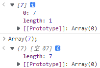

# 索引集合类

[索引集合类 (Indexed collections) - JavaScript | MDN (mozilla.org)](https://developer.mozilla.org/zh-CN/docs/Web/JavaScript/Guide/Indexed_collections)；

- 以索引进行排序的数据集合，包括 `Array`、`TypedArray`；


# Array

[Array - JavaScript | MDN (mozilla.org)](https://developer.mozilla.org/zh-CN/docs/Web/JavaScript/Reference/Global_Objects/Array)；

- 数组的 长度 和 元素类型 都是非固定的；

- 数组的 长度可以随时改变，并且其 数据在内存中可以不连续；

- 数组元素的索引 只能用整数，而不能用字符串；
  
  - 使用 非整数 并通过 方括号或点号 来 访问或设置 数组元素时，所操作的 并不是 数组列表中的元素，而是 数组对象的 [属性集合](https://developer.mozilla.org/zh-CN/docs/Web/JavaScript/Data_structures#属性) 上的变量；
  
- 数组的本质仍是对象；属性名是 数字形式的字符串，但仍可以当作数值来索引；

  ```
  let myArray = new Array(1, 2, '45', 25);
  console.log(myArray[0]);			// 1
  console.log(myArray['0']);			// 1
  ```

  

## 常用操作

### 创建数组

#### Array literals

- 数组字面量：在 方括号 `[]` 里面添加多个元素，不同的元素用逗号 `,` 隔开；

```
let myArray = [1, 'apple']
let myArray = [1, , , , 'apple']
```


#### Constructor

- 见 [构造器](#构造器)；

```
let myArray1 = new Array();
console.log(myArray1);

let myArray2 = new Array(5);			// 只有1个参数时 该参数表示数组长度 必须是非负值整数
console.log(myArray2);

let myArray = new Array(5, '123', null, undefined, {
            1: 2,
            3: 4,
        }, [1, 4]);
// 有多个参数时 初始化每一项的值 每个数组项为对应的参数
// 不能 2个及以上的 连续逗号 如 new Array(1, , 2)
console.log(myArray);
```


### 索引 与 数组项

- array (数组)：是一个有序的数据集合，我们可以通过 数组名称 (arrayName) 和 索引 (index) 进行访问；

- index (索引)：也称为 **下标**；数组初始化后，数组项的索引是 **从 `0` 开始** 的 **整数**，直到 `length - 1`；

  - 索引不连续的数组，称为 稀疏数组；数组字面量可以创建 稀疏数组；

  - 可以添加 索引为字符串 的数组项，但不会被计入 `length`；

    ```
    let myArray = new Array(1, 2, 3, 4);
    console.log(myArray.length);		// 4
    console.log(myArray);				// [1, 2, 3, 4]
    
    myArray.abc = "123";
    console.log(myArray.length);		// 4
    console.log(myArray);				// [1, 2, 3, 4, abc: '123']
    
    myArray.push(6);
    console.log(myArray.length);		// 5
    console.log(myArray);				// [1, 2, 3, 4, 6, abc: '123']
    ```

    

- length (长度)：数组初始化后，数组的 `length` 属性是数组项的个数；

  - 直接给 `length` 属性赋值，数组可能会被截断；

  ```
  let myArray = new Array(1, 2, 3, 4, 5, 6, 7);
  console.log(myArray);					// [1, 2, 3, 4, 5, 6, 7]
  
  myArray.length = 5;
  console.log(myArray);					// [1, 2, 3, 4, 空]
  ```

  


1. **获取 指定索引号的 元素**

   ```javascript
   let x = new Date();
   let myArray = new Array(5, '123', null, undefined, {
       1: 2,
       3: 4,
   }, [1, 4], x);
   
   myArray[0];				// 5
   myArray['0'];			// 5
   
   myArray[10];			// undefined
   ```

   - 索引无效时，返回 `undefined`；

     

2. **获取 指定元素的 索引号**：

   - 使用 **`Array.indexOf()` 实例方法**，查找 **严格相等** 的数组项；

     ```
     console.log(myArray.indexOf(5));			// 0
     console.log(myArray.indexOf('123'));		// 1
     console.log(myArray.indexOf(null));			// 2
     console.log(myArray.indexOf(undefined));	// 3
     console.log(myArray.indexOf({
         1: 2,
         3: 4,
     }));										// -1
     console.log(myArray.indexOf([1, 4]));		// -1
     console.log(myArray.indexOf(x));			// 6
     ```
     - 若数组 不存在 指定元素，则返回 `-1`；
     - 若数组 存在多个 指定元素，则返回 第一个下标；
     - 该方法 可用于变量，不能直接用于引用类型；

   - 使用 **`Array.lastIndexOf()` 实例方法**，查找 **严格相等** 的数组项；查找最后一个匹配的下标


### 遍历数组

1. 使用 **`for...in`**：

   ```
   
   ```

   

2. 使用 **`for...of`**：

   ```
   
   ```

   

3. 使用 **`Array.forEach()` 实例方法**:

   ```javascript
   
   ```


### 添加数组项

1. **添加元素到数组头部**

   - 使用 **`Array.unshift()` 实例方法**，可一次性添加多个数组项，每一项的索引会向后移动；

     ```
     let myArray = new Array(1, 2, 3, 4, 5, 6, 7);
     console.log(myArray);				// [1, 2, 3, 4, 5, 6, 7]
     
     myArray.unshift('unshift');
     console.log(myArray);				// ['unshift', 1, 2, 3, 4, 5, 6, 7]
     ```

     

2. **添加元素到数组末尾**

   - 使用 **索引**，`length` 属性自动变化为：最大索引加`1`；

     ```
     console.log(myArray.length);		// 7
     
     myArray[myArray.length] = 'push';
     console.log(myArray.length);		// 8
     
     myArray[20] = 9;
     console.log(myArray.length);		// 21
     console.log(myArray);				// [1, 2, 3, 4, 5, 6, 7, 'push', 空 ã12, 9]
     ```

     

   - 使用 **`Array.push()` 实例方法**，可一次性添加多个数组项；

     ```
     console.log(myArray.length);		// 7
     myArray.push('push');
     console.log(myArray.length);		// 8
     console.log(myArray);				// [1, 2, 3, 4, 5, 6, 7, 'push']
     ```

     

3. **添加元素到数组中间**

   - 使用 **`Array.splice()` 实例方法**，可一次性添加多个数组项，后续项的索引会向后移动；

     ```
     console.log(myArray);				// [1, 2, 3, 4, 5, 6, 7]
     
     // 从指定索引2开始 删除0个数组项 并在下标2处 添加新数组项
     // 若指定下标 大于最大下标，则会被当做最大下标处理
     // 若指定下标 小于0，则会被当做0处理
     myArray.splice(2, 0, 10, 11)
     console.log(myArray);				// [1, 2, 10, 11, 3, 4, 5, 6, 7]
     ```

     


### 删除数组项

1. **删除 数组头部元素**

   - 使用 **`Array.shift()` 实例方法**；

     ```
     let myArray = new Array(1, 2, 3, 4, 5, 6, 7);
     console.log(myArray.length);		// 7
     
     myArray[0] = null;
     console.log(myArray.length);		// 7
     console.log(myArray);				// [null,  2, 3, 4, 5, 6, 7]
     
     myArray.shift();
     console.log(myArray.length);		// 6
     console.log(myArray);				// [2, 3, 4, 5, 6, 7]
     ```

     

2. **删除 数组尾部元素**

   - 使用 **`Array.pop()` 实例方法**；

     ```
     let myArray = new Array(1, 2, 3, 4, 5, 6, 7);
     console.log(myArray.length);		// 7
     
     myArray[myArray.length - 1] = null;
     console.log(myArray.length);		// 7
     console.log(myArray);				// [1,  2, 3, 4, 5, 6, null]
     
     myArray.pop();
     console.log(myArray.length);		// 6
     console.log(myArray);				// [1,  2, 3, 4, 5, 6]
     ```

     

3. **通过索引号 删除 一个元素**

   - 使用 `delete` 属性，其它属性不变；**不推荐**；

     ```
     let myArray = new Array(1, 2, 3, 4, 5, 6, 7);
     console.log(myArray.length);		// 7
     console.log(myArray);				// [1, 2, 3, 4, 5, 6, 7]
     
     delete myArray[2];
     console.log(myArray.length);		// 7
     console.log(myArray);				// [1, 2, 空, 4, 5, 6, 7]
     ```

     

   - 使用 **`Array.splice()` 实例方法**，返回一个新数组，由被删除的数据组成；

     ```
     let myArray = new Array(1, 2, 3, 4, 5, 6, 7);
     console.log(myArray.length);		// 7
     
     let newArray = myArray.splice(4, 1);// 索引4的位置 为数值5
     console.log(myArray.length);		// 6
     console.log(myArray);				// [1, 2, 3, 4, 6, 7]
     console.log(newArray);				// [5]
     ```

     

4. **通过索引号 删除 连续n个元素**

   - 使用 **`Array.splice()` 实例方法**；

     ```
     let myArray = new Array(1, 2, 3, 4, 5, 6, 7);
     console.log(myArray.length);		// 7
     
     let newArray = myArray.splice(4, 2);// 索引4的位置 为数值5 
     console.log(myArray.length);		// 5
     console.log(myArray);				// [1, 2, 3, 4, 7]
     console.log(newArray);				// [5，6]
     ```


### 复制数组

- 使用 **`Array.slice()` 实例方法**，返回一个含有被提取元素的新数组，不会修改原数组；

- 语法：

  ```
  slice()
  slice(start)
  slice(start, end)
  ```

  

  ```
  let myArray = new Array(1, 2, 3, 4, 5, 6, 7);
  let copyMyArray = myArray.slice();
  console.log(copyMyArray);				// [1, 2, 3, 4, 5, 6, 7]
  console.log(copyMyArray == myArray);	// false
  console.log(copyMyArray === myArray);	// false
  ```


### 数组清空

- 使用 **`Array.splice()` 实例方法**；

  ```
  let myArray = [1, 2, 3, 4, 5, 6, 7];
  console.log(myArray.length);			// 7
  console.log(myArray);					// [1, 2, 3, 4, 5, 6, 7]
  
  myArray.splice(0, myArray.length);
  console.log(myArray.length);			// 0
  console.log(myArray);					// []
  ```

- 使用 `length` 实例属性；

  ```
  let myArray = [1, 2, 3, 4, 5, 6, 7];
  console.log(myArray.length);			// 7
  console.log(myArray);					// [1, 2, 3, 4, 5, 6, 7]
  
  myArray.length = 0;
  console.log(myArray.length);			// 0
  console.log(myArray);					// []
  ```

  


## 构造器

### `Array()`

[Array() 构造器 - JavaScript | MDN (mozilla.org)](https://developer.mozilla.org/zh-CN/docs/Web/JavaScript/Reference/Global_Objects/Array/Array)；

- **`Array()`** 构造器：用于创建 Array 对象；

- 语法：

  ```
  new Array(element0, element1, /* … ,*/ elementN)
  new Array(arrayLength)
  
  Array(element0, element1, /* … ,*/ elementN)
  Array(arrayLength)
  ```

  - `elementN`：根据给定的元素创建一个 JavaScript 数组，但是当仅有一个参数且为数字时除外；
  - `arrayLength`：如果传递给 `Array` 构造函数的 **唯一参数** 是 0 到 232 - 1（包括）之间的整数；返回一个新的 JS 数组，其 `length` 属性设置为该数字；
  - 如果只有一个参数（`arrayLength`）且其值不在 0 到 232 - 1（包括）之间，则会触发异常 [`RangeError`](https://developer.mozilla.org/zh-CN/docs/Web/JavaScript/Reference/Global_Objects/RangeError)。


## 静态属性

`get Array[@@species]`

[get Array[@@species\] - JavaScript | MDN (mozilla.org)](https://developer.mozilla.org/zh-CN/docs/Web/JavaScript/Reference/Global_Objects/Array/@@species)；

- `Array[@@species]` 访问器属性：返回 `Array` 的构造函数。


## 静态方法

### `Array.from()`

[Array.from() - JavaScript | MDN (mozilla.org)](https://developer.mozilla.org/zh-CN/docs/Web/JavaScript/Reference/Global_Objects/Array/from)；

- `Array.from()` 方法：根据一个 类数组或可迭代对象， **创建一个 新的数组实例**；

- 语法：

  ```
  // 箭头函数
  Array.from(arrayLike, (element) => { /* … */ } )
  Array.from(arrayLike, (element, index) => { /* … */ } )
  
  // 映射函数
  Array.from(arrayLike, mapFn)
  Array.from(arrayLike, mapFn, thisArg)
  
  // 内联映射函数
  Array.from(arrayLike, function mapFn(element) { /* … */ })
  Array.from(arrayLike, function mapFn(element, index) { /* … */ })
  Array.from(arrayLike, function mapFn(element) { /* … */ }, thisArg)
  Array.from(arrayLike, function mapFn(element, index) { /* … */ }, thisArg)
  ```

  - `arrayLike`：想要转换成数组的 伪数组对象或可迭代对象；
  - `mapFn`：**可选参数**；表示 新数组中的每个元素 会执行 该回调函数；
  - `thisArg`：**可选参数**；表示 执行回调函数 `mapFn` 时，`this` 指向的对象。
  - **返回值**：返回一个新的 数组实例；


### `Array.isArray() `

[Array.isArray() - JavaScript | MDN (mozilla.org)](https://developer.mozilla.org/zh-CN/docs/Web/JavaScript/Reference/Global_Objects/Array/isArray)；

- `Array.isArray()` 方法：判断 传递的值 是否是一个 `Array` 对象；

- 语法：

  ```
  Array.isArray(value)
  ```

  - `value`：需要检测的值；
  - **返回值**：如果对象是 `Array`，则返回 `true`；否则为 `false`。

- `Array.isArray` 能检测 `iframes`；


### `Array.of()`

[Array.of() - JavaScript | MDN (mozilla.org)](https://developer.mozilla.org/zh-CN/docs/Web/JavaScript/Reference/Global_Objects/Array/of)；

- `Array.of()` 方法：创建一个 具有可变数量参数的 新数组实例，而不考虑参数的数量或类型。

  - `Array.of(7)` 创建一个具有**单个元素 7** 的数组；而 `Array(7)` 创建一个 **`length`为 7** 的空数组；

  

- 语法：

  ```
  Array.of(element0[, element1[, ...[, elementN]]])
  ```

  - `elementN`：任意个参数，将按顺序成为 返回数组 中的 元素；
  - **返回值**：新的 Array 实例；


## 实例属性

### `Array.prototype.length`

[Array.length - JavaScript | MDN (mozilla.org)](https://developer.mozilla.org/zh-CN/docs/Web/JavaScript/Reference/Global_Objects/Array/length)；


### `Array.prototype[@@unscopables]`

[Array.prototype[@@unscopables] - JavaScript | MDN (mozilla.org)](https://developer.mozilla.org/zh-CN/docs/Web/JavaScript/Reference/Global_Objects/Array/@@unscopables)；


## 实例方法

### `Array.prototype.shift()`

[Array.prototype.shift() - JavaScript | MDN (mozilla.org)](https://developer.mozilla.org/zh-CN/docs/Web/JavaScript/Reference/Global_Objects/Array/shift)；

- `shift()` 方法：从数组中 **删除** **第一个** 元素，并返回该元素的值；

  - 该方法会更改原数组：其他元素的索引值减 `1`， `length` 属性值减 `1`；

- 语法：

  ```
  arr.shift()
  ```

  - 返回值：返回 从数组中删除的元素 组成的新数组；如果 `arr` 数组为空，则返回 `undefined`；


### `Array.prototype.pop()`

[Array.prototype.pop() - JavaScript | MDN (mozilla.org)](https://developer.mozilla.org/zh-CN/docs/Web/JavaScript/Reference/Global_Objects/Array/pop)；

- `pop()` 方法：从数组中 **删除** **最后一个** 元素，并返回该元素的值；
  - 会改变 原数组：`length` 属性值减 `1`；


### `Array.prototype.unshift()`

[Array.prototype.unshift() - JavaScript | MDN (mozilla.org)](https://developer.mozilla.org/zh-CN/docs/Web/JavaScript/Reference/Global_Objects/Array/unshift)；

- **`unshift()`** 方法：将 一个或多个元素 **添加** 到数组的 **开头**，并返回该数组的 **新长度**；

  - 会改变 原数组；

- 语法：

  ```
  arr.unshift(element0)
  arr.unshift(element0, element1)
  arr.unshift(element0, element1, /* … ,*/ elementN)
  ```

  - `elementN`：被添加到数组末尾的元素；
  - 返回值：当调用该方法的 对象 的 新的 `length` 属性值将被返回。


### `Array.prototype.push()`

[Array.prototype.push() - JavaScript | MDN (mozilla.org)](https://developer.mozilla.org/zh-CN/docs/Web/JavaScript/Reference/Global_Objects/Array/push)；

- `push()` 方法：将 一个或多个元素 **添加** 到数组的 **末尾**，并返回该数组的 **新长度**；

  - 会改变 原数组；

- 语法：

  ```
  arr.push(element0)
  arr.push(element0, element1)
  arr.push(element0, element1, /* … ,*/ elementN)
  ```

  - `elementN`：被添加到数组末尾的元素；
  - 返回值：当调用该方法的 对象 的 新的 `length` 属性值将被返回。


### `Array.prototype.splice()`

[Array.prototype.splice() - JavaScript | MDN (mozilla.org)](https://developer.mozilla.org/zh-CN/docs/Web/JavaScript/Reference/Global_Objects/Array/splice)；

- **`splice()`** 方法：通过 删除或替换 现有元素，或者 原地添加新的元素，来修改数组；并以数组形式返回被修改后的内容；

  - 会改变 原数组；

- 语法：

  ```
  arr.splice(start)
  arr.splice(start, deleteCount)
  arr.splice(start, deleteCount, item1)
  arr.splice(start, deleteCount, item1, item2, itemN)
  ```

  - `start`：修改开始位置的索引；
    - 如果 **大于 `arr.length - 1`**，则从数组末尾开始添加内容；
    - 如果是 **负值**，则表示从数组于 `arr.length + start` 开始；
    - 如果 **`arr.length + start` 小于 `0`**，则表示从第 `0` 位开始；
  - `deleteCount`：可选参数；整数，表示要移除的数组元素的个数；
    - 如果 `deleteCount` 被 **省略**，则 `start`之后的所有元素都会被删除；
    - 如果 大于等于 `array.length - start`，那么 `start`之后的所有元素都会被删除；
    - 如果 `deleteCount` 是 **`0` 或负数**，则表示 不移除元素；此时，至少应添加一个新元素；
  - `itemN`：可选参数；表示要添加进数组的元素，从`start` 位置开始。
    - 如果不指定，则 `splice()` 将只删除数组元素。
  - 返回值：由被删除的元素组成的 一个新数组；
    - 如果只删除了一个元素，则返回只包含一个元素的数组；
    - 如果没有删除元素，则返回空数组；
    - 如果 `arr` 是空数组，则


### `Array.prototype.fill()`

[Array.prototype.fill() - JavaScript | MDN (mozilla.org)](https://developer.mozilla.org/zh-CN/docs/Web/JavaScript/Reference/Global_Objects/Array/fill)；

- **`fill()`** 方法：用 一个固定值 填充一个数组中 从起始索引 到终止索引 内的全部元素；

  - **包括起始索引，不包括终止索引**；
  - 会改变 原数组；

- 语法：

  ```
  arr.fill(value)
  arr.fill(value, start)
  arr.fill(value, start, end)
  ```

  - `value`：用来填充数组元素的值；
    - 如果 `value` 为引用类型，会导致都执行同一个引用类型；
  - `start`：起始索引，默认为 `0`；
    - 如果 `start` 是负数，则 起始索引 会被自动计算成为 `arr.length + start`；
  - `end`：终止索引，默认值为 `arr.length`；
    - 如果 `end` 是负数，则 终止索引 会被自动计算成为 `arr.length + end`；
    - **起始索引 小于等于 终止索引**；
  - **返回值**：修改后的数组；


### `Array.prototype.reverse()`

[Array.prototype.reverse() - JavaScript | MDN (mozilla.org)](https://developer.mozilla.org/zh-CN/docs/Web/JavaScript/Reference/Global_Objects/Array/reverse)；

将数组中元素的位置颠倒，并返回该数组。该方法会改变原数组；

- **`reverse()`** 方法：将数组中元素的位置颠倒，并返回该数组；

  - 数组的第一个元素会变成最后一个，数组的最后一个元素变成第一个；
  - 会改变 原数组；

- 语法：

  ```
  arr.reverse()
  ```

  - 返回值：返回改变后的 `arr` 数组 （返回该数组的引用）；


### `Array.prototype.sort()`

- **`sort()`** 方法：用[原地算法](https://zh.wikipedia.org/wiki/原地算法)对数组的元素进行排序，并返回数组；

  - 会改变 原数组；

- 语法：

  ```
  // 无函数
  arr.sort()
  
  // 箭头函数
  arr.sort((a, b) => { /* … */ } )
  
  // 比较函数
  arr.sort(compareFn)
  
  // 内联比较函数
  arr.sort(function compareFn(a, b) { /* … */ })
  
  ```

  - `compareFn`：用来指定 排列方式 的函数。如果省略，元素按照转换为的字符串的 各个字符的 Unicode 位点进行排序；
  - 返回值：排序后的数组；请注意，数组已原地排序，并且不进行复制。

- `compareFn(a, b)`：a 和 b 是两个将要被比较的元素：

  - 如果 `compareFn(a, b)` 大于 0，b 会被排列到 a 之前；
  - 如果 `compareFn(a, b)` 小于 0，那么 a 会被排列到 b 之前；
  - 如果 `compareFn(a, b)` 等于 0，a 和 b 的相对位置不变；
  - `compareFn(a, b)` 必须总是对相同的输入返回相同的比较结果，否则排序的结果将是**不确定的**。


### 下面的方法 不会改变 调用它们的数组


### `Array.prototype.indexOf()`

[Array.prototype.indexOf() - JavaScript | MDN (mozilla.org)](https://developer.mozilla.org/zh-CN/docs/Web/JavaScript/Reference/Global_Objects/Array/indexOf)；

- **`indexOf()`** 方法：返回 指定元素在数组中的 第一个索引；如果不存在，则返回 `-1`；

  - 从前向后查找，从 `fromIndex` 处开始，直到最后一个；
  - 使用 严格全等 `===` 判断 `searchElement` 与数组中包含的元素之间的关系；
  - 指定元素：即有效的 JavaScript 值或变量；
  - 不会改变 原数组；

- 语法：

  ```
  arr.indexOf(searchElement)
  arr.indexOf(searchElement, fromIndex)
  ```

  - `searchElement`：要查找的元素；
  - `fromIndex`：可选参数；表示开始查找的位置；
    - 默认为 `0`；
    - 如果该索引值 大于或等于 数组长度，意味着不会在数组里查找，返回 `-1`；
    - 如果该索引值 是一个 负值，这表示从 `arr.length + fromIndex` 开始查找；
    - 如果 `arr.length + fromIndex` 小于 `0`，则表示从第 `0` 为开始；
  - 返回值：首个被找到的元素在数组中的索引位置; 若没有找到则返回 `-1`。


### `Array.prototype.lastIndexOf()`

[Array.prototype.lastIndexOf() - JavaScript | MDN (mozilla.org)](https://developer.mozilla.org/zh-CN/docs/Web/JavaScript/Reference/Global_Objects/Array/lastIndexOf)；

- **`lastIndexOf()`** 方法：返回 指定元素在数组中的 最后一个索引；如果不存在则返回 `-1`；

  - 从后向前查找，从 `fromIndex` 处开始，直到第一个。
  - 使用 严格全等 `===` 判断 `searchElement` 与数组中包含的元素之间的关系；
  - 指定元素：即有效的 JavaScript 值或变量；
  - 不会改变 原数组；

- 语法：

  ```
  arr.lastIndexOf(searchElement)
  arr.lastIndexOf(searchElement, fromIndex)
  ```


### `Array.prototype.includes()`

[Array.prototype.includes() - JavaScript | MDN (mozilla.org)](https://developer.mozilla.org/zh-CN/docs/Web/JavaScript/Reference/Global_Objects/Array/includes)；

- **`includes()`** 方法：判断 一个数组 是否包含 一个指定的值；

  - 如果包含则返回 `true`，否则返回 `false`；
  - 按 零值相等 (同值相等 `==` 且 `+0`等于`-0`) 查找，无法直接比较引用类型；
  - 不会改变 原数组；

- 语法：

  ```
  arr.includes(searchElement)
  arr.includes(searchElement, fromIndex)
  ```

  - `valueToFind`：需要查找的元素值；
  - `fromIndex`：从 `fromIndex` 索引处开始 按升序 查找 `valueToFind`；
    - 默认值为 `0`；
    - 如果为 负值，则从 `array.length + fromIndex` 索引处 按升序 开始查找；


### `Array.prototype.slice()`

[Array.prototype.slice() - JavaScript | MDN (mozilla.org)](https://developer.mozilla.org/zh-CN/docs/Web/JavaScript/Reference/Global_Objects/Array/slice)；

- **`slice()`** 方法：返回一个新数组，该数组由 `begin` 和 `end` 决定的原数组的 **浅拷贝**；

  - **浅拷贝**：包括 `begin`，不包括 `end`。
  - 不会改变 原数组；

- 语法：

  ```
  arr.slice()
  arr.slice(start)
  arr.slice(start, end)
  ```

  - `start`：可选参数；提取起始处的索引；
    - 默认为 `0`；
    - 如果 `start` 大于 `arr.length`，则返回空数组；
    - 如果 `start` 为负数，则表示从 `arr.length + start` 开始；
  - `end`：可选参数；提取终止处的索引；
    - 默认为 `arr.length`；
    - 如果 `end` 大于 `arr.length`，则表示到`arr.length` 结束；
    - 如果 `end` 为负数，则表示到 `arr.length + end` 结束；
  - 返回值：一个 含有被提取元素的 新数组；


### `Array.prototype.concat()`

[Array.prototype.concat() - JavaScript | MDN (mozilla.org)](https://developer.mozilla.org/zh-CN/docs/Web/JavaScript/Reference/Global_Objects/Array/concat)；

- **`concat()`** 方法：用于 合并 两个或多个数组，返回一个新数组；

  - 不会改变 原数组；

- 语法：

  ```
  arr.concat()
  arr.concat(value0)
  arr.concat(value0, value1)
  arr.concat(value0, value1, /* … ,*/ valueN)
  ```

  - `valueN`：数组 和/或 值，将被合并到一个新的数组中；
    - 如果省略了所有 `valueN` 参数，则会返回 `arr` 数组的一个浅拷贝；
  - 返回值：新数组，`arr` 数组在前，`valueN` 依次排列在后面；


### `Array.prototype.join()`

[Array.prototype.join() - JavaScript | MDN (mozilla.org)](https://developer.mozilla.org/zh-CN/docs/Web/JavaScript/Reference/Global_Objects/Array/join)；

- **`join()`** 方法：将 一个数组 (或类数组对象) 的所有元素 连接成 一个字符串，并返回这个字符串；

  - 如果数组只有一个数组项，那么将返回该项目而不使用分隔符；
  - 不会改变 原数组；

- 语法：

  ```
  arr.join()
  arr.join(separator)
  ```

  - `separator`：指定 分隔数组每个元素的 字符串；
    - 如果 `separator` 缺省，默认值为逗号 `,`；
    - 如果 `separator` 不是字符串，将被转换为字符串；
    - 如果 `separator` 是空字符串 `""`，则没有任何分隔字符；
  - 返回值：一个 所有数组元素连接的 字符串；
    - 如果 `arr.length` 为 `0`，则返回空字符串；
    - 如果 `arr` 为 `undefined` 或 `null`，它会被转换为空字符串；


### `Array.prototype.keys()`

[Array.prototype.keys() - JavaScript | MDN (mozilla.org)](https://developer.mozilla.org/zh-CN/docs/Web/JavaScript/Reference/Global_Objects/Array/keys)；

- **`keys()`** 方法：返回一个新的 Array Iterator (数组迭代器) 对象，该对象 包含数组中 每个 **索引键**；

  - 不会改变 原数组；

- 语法：

  ```
  arr.keys()
  ```

  - 返回值：一个新的 Array Iterator 对象；


### `Array.prototype.values()`

[Array.prototype.values() - JavaScript | MDN (mozilla.org)](https://developer.mozilla.org/zh-CN/docs/Web/JavaScript/Reference/Global_Objects/Array/values)；

- **`values()`** 方法：返回一个新的 Array Iterator (数组迭代器) 对象，该对象包含数组 **每个索引的值**；

  - 不会改变 原数组；

- 语法：

  ```
  arr.values()
  ```

  - 返回值：一个新的 Array Iterator 对象；


### `Array.prototype.toString()`

[Array.prototype.toString() - JavaScript | MDN (mozilla.org)](https://developer.mozilla.org/zh-CN/docs/Web/JavaScript/Reference/Global_Objects/Array/toString)；

- **`toString()`** 方法：返回一个字符串，表示指定数组的元素；

  - 不会改变 原数组

- 语法：

  ```
  arr.toString()
  ```

  - 返回值：一个 表示数组所有元素的 字符串；

- 覆盖了 Object  的 `toString` 方法；

  - 对于数组对象，`toString` 方法在内部调用 `join()` 方法拼接数组中的元素并返回一个字符串，其中包含用逗号分隔的每个数组元素；
  - 如果 `join` 方法不可用，或者它不是一个函数，将使用 `Object.prototype.toString` 代替，返回 `[object Array]`；


### 迭代方法

### `Array.prototype.forEach()` 

[Array.prototype.forEach() - JavaScript | MDN (mozilla.org)](https://developer.mozilla.org/zh-CN/docs/Web/JavaScript/Reference/Global_Objects/Array/forEach)；

- **`forEach()`** 方法：按升序 对数组的每个元素 **遍历** (执行给定函数)；

  - 不会改变 原数组，
  - 执行函数 可能改变 原数组；
    - 第一次调用执行函数时，遍历的范围被确定；
    - 遍历的值，在遍历到它时才确定；因此可能会被改变或删除；
  - 已删除或者未初始化的项 将被跳过；

- 语法：

  ```
  // 箭头函数
  arr.forEach((element) => { /* … */ })
  arr.forEach((element, index) => { /* … */ })
  arr.forEach((element, index, array) => { /* … */ })
  
  // 回调函数
  arr.forEach(callbackFn)
  arr.forEach(callbackFn, thisArg)
  
  // 内联回调函数
  arr.forEach(function(element) { /* … */ })
  arr.forEach(function(element, index) { /* … */ })
  arr.forEach(function(element, index, array){ /* … */ })
  arr.forEach(function(element, index, array) { /* … */ }, thisArg)
  ```

  - `callbackFn`：为数组中每个元素 **执行的函数**；函数调用时带有以下参数 (形参)：
    - `element`：数组中，正在处理的 当前元素；
    - `index`：数组中，正在处理的 当前元素的 索引；
    - `array`：`forEach()` 方法正在操作的 数组；
  - `thisArg`：当执行函数 `callbackFn` 时，使用的 **`this` 的值**；
    - 如果省略 `thisArg` 参数、或者其值为 `null` 或 `undefined`，则 `this` 则指向全局对象；
  - 返回值：`undefined`；


### `Array.prototype.some()`

[Array.prototype.some() - JavaScript | MDN (mozilla.org)](https://developer.mozilla.org/zh-CN/docs/Web/JavaScript/Reference/Global_Objects/Array/some)；

- **`some()`** 方法：判断 一个数组内的 **是否存在** 某一元素 满足条件 (通过测试函数)；

  - 不会修改 原数组；

- 语法：

  ```
  // 箭头函数
  arr.some((element) => { /* … */ } )
  arr.some((element, index) => { /* … */ } )
  arr.some((element, index, array) => { /* … */ } )
  
  // 回调函数
  arr.some(callbackFn)
  arr.some(callbackFn, thisArg)
  
  // 内联回调函数
  arr.some(function(element) { /* … */ })
  arr.some(function(element, index) { /* … */ })
  arr.some(function(element, index, array){ /* … */ })
  arr.some(function(element, index, array) { /* … */ }, thisArg)
  ```

  - `callbackFn`：执行数组每一项的函数；**返回** [truthy](https://developer.mozilla.org/zh-CN/docs/Glossary/Truthy)，表示 找到了 匹配元素；
  - 返回值：如果 回调函数的 存在一个返回 为 [truthy](https://developer.mozilla.org/zh-CN/docs/Glossary/Truthy) 值，返回 **`true`**；否则返回 **`false`**。
    - 若 `arr` 为空数组，则返回 `false`；


### `Array.prototype.every()` 

[Array.prototype.every() - JavaScript | MDN (mozilla.org)](https://developer.mozilla.org/zh-CN/docs/Web/JavaScript/Reference/Global_Objects/Array/every)；

- **`every()`** 方法：判断 一个数组内的 所有元素 **是否全部** 满足条件 (通过测试函数)；

  - 不会修改 原数组；

- 语法：

  ```
  // 箭头函数
  arr.every((element) => { /* … */ } )
  arr.every((element, index) => { /* … */ } )
  arr.every((element, index, array) => { /* … */ } )
  
  // 回调函数
  arr.every(callbackFn)
  arr.every(callbackFn, thisArg)
  
  // 内联回调函数
  arr.every(function(element) { /* … */ })
  arr.every(function(element, index) { /* … */ })
  arr.every(function(element, index, array){ /* … */ })
  arr.every(function(element, index, array) { /* … */ }, thisArg)
  ```

  - `callbackFn`：执行数组每一项的函数；**返回** [truthy](https://developer.mozilla.org/zh-CN/docs/Glossary/Truthy)，表示 找到了 匹配元素；
  - 返回值：如果 回调函数的 全部返回 都为 [truthy](https://developer.mozilla.org/zh-CN/docs/Glossary/Truthy) 值，返回 **`true`**；否则返回 **`false`**。
    - 若 `arr` 为空数组，则返回 `true`；


### `Array.prototype.filter()`

[Array.prototype.filter() - JavaScript | MDN (mozilla.org)](https://developer.mozilla.org/zh-CN/docs/Web/JavaScript/Reference/Global_Objects/Array/filter)；

- **`filter()`** 方法：创建 给定数组一部分的 [浅拷贝](https://developer.mozilla.org/en-US/docs/Glossary/Shallow_copy) 数组，包含 **满足条件 的 所有元素** (通过函数测试)；

  - 不会修改 原数组；

- 语法：

  ```
  // 箭头函数
  arr.filter((element) => { /* … */ } )
  arr.filter((element, index) => { /* … */ } )
  arr.filter((element, index, array) => { /* … */ } )
  
  // 回调函数
  arr.filter(callbackFn)
  arr.filter(callbackFn, thisArg)
  
  // 内联回调函数
  arr.filter(function(element) { /* … */ })
  arr.filter(function(element, index) { /* … */ })
  arr.filter(function(element, index, array){ /* … */ })
  arr.filter(function(element, index, array) { /* … */ }, thisArg)
  ```

  - `callbackFn`：测试 数组中每个元素 的 **函数**；**返回 Boolean 值**；
    - 返回 `true`， 表示该元素通过测试，保留该元素；
    - 返回 `false`，则该元素不保留：
  - 返回值：一个新的、由通过测试的元素组成的数组；
    - 如果没有任何数组元素通过测试，则返回空数组。


### `Array.prototype.find()`

- [`Array.prototype.find()`](https://developer.mozilla.org/zh-CN/docs/Web/JavaScript/Reference/Global_Objects/Array/find)：满足条件的 **第一个** 元素的 **值**；若没有找到，则返回 `undefined`；
- [`Array.prototype.findIndex()`](https://developer.mozilla.org/zh-CN/docs/Web/JavaScript/Reference/Global_Objects/Array/findIndex)：满足条件的 **第一个** 元素的 **索引**；若没有找到，则返回 `-1`；
- [`Array.prototype.findLast()`](https://developer.mozilla.org/zh-CN/docs/Web/JavaScript/Reference/Global_Objects/Array/findLast)：满足条件的 **最后一个** 元素的 **值**；若没有找到，则返回 `undefined`；
- [`Array.prototype.findLastIndex()`](https://developer.mozilla.org/zh-CN/docs/Web/JavaScript/Reference/Global_Objects/Array/findLastIndex)：满足条件的 **最后一个** 元素的 **索引**；若没有找到，则返回 `-1`；


- **`find()`** 方法：返回 数组中 满足条件的 **第一个** 元素的 **值** (通过测试函数)；

  - 若没有找到对应元素，否则返回 [`undefined`](https://developer.mozilla.org/zh-CN/docs/Web/JavaScript/Reference/Global_Objects/undefined)。
  - 不会改变 原数组；
  - 如果需要查找 数组中 某个值的索引，请使用 `Array.prototype.indexOf()`
  - 如果需要查找 数组中 是否存在 某个值，请使用 `Array.prototype.includes()`；

- 语法：

  ```
  // 箭头函数
  arr.findLast((element) => { /* … */ } )
  arr.findLast((element, index) => { /* … */ } )
  arr.findLast((element, index, array) => { /* … */ } )
  
  // 回调函数
  arr.findLast(callbackFn)
  arr.findLast(callbackFn, thisArg)
  
  // 内联回调函数
  arr.findLast(function(element) { /* … */ })
  arr.findLast(function(element, index) { /* … */ })
  arr.findLast(function(element, index, array){ /* … */ })
  arr.findLast(function(element, index, array) { /* … */ }, thisArg)
  ```

  - `callbackFn`：执行数组每一项的函数；**返回** [truthy](https://developer.mozilla.org/zh-CN/docs/Glossary/Truthy)，表示 找到了 匹配元素；
  - 返回值：数组中 **第一个** 满足测试函数的 元素的 **值**；
    - 如果没有元素匹配，返回 `undefined`；


`Array.prototype.map()`

[Array.prototype.map() - JavaScript | MDN (mozilla.org)](https://developer.mozilla.org/zh-CN/docs/Web/JavaScript/Reference/Global_Objects/Array/map)；

- **`map()`** 方法：创建一个新数组，这个新数组 由原数组的每个元素 调用指定的函数后 的返回值 组成；

  - 只会在有值的索引上被调用；那些从来没被赋过值或者使用 `delete` 删除的索引则不会被调用。

- 语法：

  ```
  // 箭头函数
  arr.map((element) => { /* … */ })
  arr.map((element, index) => { /* … */ })
  arr.map((element, index, array) => { /* … */ })
  
  // 回调函数
  arr.map(callbackFn)
  arr.map(callbackFn, thisArg)
  
  // 内联回调函数
  arr.map(function(element) { /* … */ })
  arr.map(function(element, index) { /* … */ })
  arr.map(function(element, index, array){ /* … */ })
  arr.map(function(element, index, array) { /* … */ }, thisArg)
  ```

  - `callbackFn`：执行数组每一项的函数；自定义返回值；
  - 返回值：返回一个新数组，每个元素都是回调函数的返回值；


### `Array.prototype.reduce()`

- [`Array.prototype.reduce()`](https://developer.mozilla.org/zh-CN/docs/Web/JavaScript/Reference/Global_Objects/Array/Reduce)：对数组中的每个元素 **从左至右** 执行 给定的函数；
- [`Array.prototype.reduceRight()`](https://developer.mozilla.org/zh-CN/docs/Web/JavaScript/Reference/Global_Objects/Array/ReduceRight)：对数组中的每个元素 **从右至左** 执行 给定的函数；


- **`reduce()`** 方法：对数组中的每个元素 按序执行 给定的函数；

  - 每次执行给定函数，**会将 先前元素的计算结果 作为参数 传入**；最后将其结果汇总为单个返回值；
  - 第一次执行回调函数时，从索引为 0 的元素开始执行，但不存在“上一次的计算结果”，需要传递初始值；
    - 如果没有传递初始值，索引为 `0` 的元素将被作为初始值；且 函数将从第二个元素开始执行 (索引为 `1` )；

- 语法：

  ```
  // 箭头函数
  arr.reduce((previousValue, currentValue) => { /* … */ } )
  arr.reduce((previousValue, currentValue, currentIndex) => { /* … */ } )
  arr.reduce((previousValue, currentValue, currentIndex, array) => { /* … */ } )
  
  arr.reduce((previousValue, currentValue) => { /* … */ } , initialValue)
  arr.reduce((previousValue, currentValue, currentIndex) => { /* … */ } , initialValue)
  arr.reduce((previousValue, currentValue, currentIndex, array) => { /* … */ }, initialValue)
  
  // 回调函数
  arr.reduce(callbackFn)
  arr.reduce(callbackFn, initialValue)
  
  // 内联回调函数
  arr.reduce(function(previousValue, currentValue) { /* … */ })
  arr.reduce(function(previousValue, currentValue, currentIndex) { /* … */ })
  arr.reduce(function(previousValue, currentValue, currentIndex, array) { /* … */ })
  
  arr.reduce(function(previousValue, currentValue) { /* … */ }, initialValue)
  arr.reduce(function(previousValue, currentValue, currentIndex) { /* … */ }, initialValue)
  arr.reduce(function(previousValue, currentValue, currentIndex, array) { /* … */ }, initialValue)
  ```

  - `callbackFn`：对每一个数组项执行的函数；包含以下 4 个参数 (形参)：
    - `previousValue`：上一次调用 `callbackFn` 时的返回值；
      - 在第一次调用时，若指定了初始值 `initialValue`，则其值则为 `initialValue`；否则为数组索引为 `0` 的元素 `arr[0]`；
    - `currentValue`：数组中正在处理的元素；
      - 在第一次调用时，若指定了初始值 `initialValue`，则其值则 `arr[0]`；否则为 `array[1]`；
    - `currentIndex`：数组中正在处理的元素的索引；
      - 在第一次调用时，若指定了初始值 `initialValue`，则其值为 `0`；否则为 `1`；
    - `array`：用于遍历的数组 `arr`
  - `initialValue`：可选参数 (实参)；表示第一次调用 `callbackFn` 函数时参数 `previousValue` 的值；
  - 返回值：使用回调函数遍历整个数组后，最后一次得到的结果；


# TypeArrary (类型数组)

- [`Int8Array`](https://developer.mozilla.org/zh-CN/docs/Web/JavaScript/Reference/Global_Objects/Int8Array)
- [`Uint8Array`](https://developer.mozilla.org/zh-CN/docs/Web/JavaScript/Reference/Global_Objects/Uint8Array)
- [`Uint8ClampedArray`](https://developer.mozilla.org/zh-CN/docs/Web/JavaScript/Reference/Global_Objects/Uint8ClampedArray)
- [`Int16Array`](https://developer.mozilla.org/zh-CN/docs/Web/JavaScript/Reference/Global_Objects/Int16Array)
- [`Uint16Array`](https://developer.mozilla.org/zh-CN/docs/Web/JavaScript/Reference/Global_Objects/Uint16Array)
- [`Int32Array`](https://developer.mozilla.org/zh-CN/docs/Web/JavaScript/Reference/Global_Objects/Int32Array)
- [`Uint32Array`](https://developer.mozilla.org/zh-CN/docs/Web/JavaScript/Reference/Global_Objects/Uint32Array)
- [`Float32Array`](https://developer.mozilla.org/zh-CN/docs/Web/JavaScript/Reference/Global_Objects/Float32Array)
- [`Float64Array`](https://developer.mozilla.org/zh-CN/docs/Web/JavaScript/Reference/Global_Objects/Float64Array)
- [`DataView`](https://developer.mozilla.org/zh-CN/docs/Web/JavaScript/Reference/Global_Objects/DataView)


