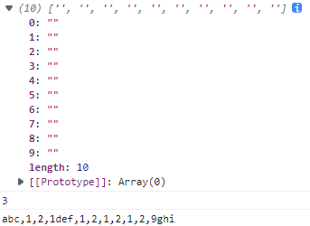

- **正则表达式 (regular expression)**：一个 用于验证字符串格式的 规则；
- 正则表达式 由 **普通字符**（例如字符 a 到 z）以及 **特殊字符**（称为"元字符"）组成的 **文字模式**；
  - 模式 描述 在搜索文本时要匹配的一个或多个字符串。
  - 正则表达式作为一个模板，将某个字符模式与所搜索的字符串进行匹配。
- 以下匹配字符时，都是匹配单个字符；如果多个匹配单个字符的规则连在一起，则是匹配合在一起的字符串；


# 转义字符

- 空格 ` ` 不用转义；

| 字符                    | 描述                                                         |
| :---------------------- | :----------------------------------------------------------- |
| `\d`                    | 匹配 单个 数字 (阿拉伯数字)；相当于 `[0-9]`；                |
| `\D`                    | 匹配 单个 非数字的字符；相当于 `[^0-9]`；                    |
| `\w`                    | 匹配 单个 英文字母、数字、下划线；相当于 `[A-Za-z0-9_]`。    |
| `\W`                    | 匹配 单个 非英文字母、数字、下划线的字符；相当于 `[A-Za-z0-9_]`。 |
| `\s`                    | 匹配 单个 空白字符；<br />包括 空格、制表符、换页符、换行符、其他 Unicode 空格；<br />相当于 `[\f\n\r\t\v\u00a0\u1680\u2000-\u200a\u2028\u2029\u202f\u205f\u3000\ufeff]`。 |
| `\S`                    | 匹配 单个 非空白的字符；<br />相当于 `[^\f\n\r\t\v\u00a0\u1680\u2000-\u200a\u2028\u2029\u202f\u205f\u3000\ufeff]`。 |
|                         |                                                              |
| `\t`                    | 匹配 单个 水平制表符；                                       |
| `\v`                    | 匹配 单个 垂直制表符；                                       |
| `\r`                    | 匹配 单个 回车符；（不建议使用`\r`，建议使用`\n`）           |
| `\n`                    | 匹配 单个 换行符；                                           |
| `\f`                    | 匹配 单个 换页符；                                           |
| `[\b]`                  | 匹配 单个 退格键；（注意和 `\b` 的区别）                     |
| `\0`                    | 匹配一个 NUL 字符；（不要再`0` 后面加一个数字）              |
|                         |                                                              |
| `\cX`                   | 匹配 单个 由 `X` 指明的 控制字符。<br />其中“X”是 A–Z 中的一个字母；否则，将 `c` 视为一个 原义的 `c` 字符； |
| `\xhh`                  | 匹配 单个 与 `hh` 对应的 字符；`h` 为十六进制数字 (0-9、a-f)； |
| `\xhhhh`                | 匹配 单个 与 `hhhh` 对应的 UTF-16 代码单元；                 |
| `\u{hhhh}`、`\u{hhhhh}` | 匹配 单个 与 Unicode值 `U+hhhh`、`U+hhhhh`对应的 字符；      |

中文字符：`\u4e00` ~ `\u9fa5`；


# 其它特殊符号

| 符号  | 描述                                                         |
| ----- | ------------------------------------------------------------ |
| `\`   | 对于通常 按字面处理 的字符，表示 下一个字符 是特殊的；<br />对于通常 被特殊对待 的字符，表示 下一个字符 不是特殊的 |
| `.`   | 匹配 单个 字符；<br />匹配 除换行符 `\n`、`\r` 之外的 任何单个字符， |
| `x|y` | **析取：**匹配 `x` 或 `y`；`x`、`y`可以是子表达式；          |
| `()`  | 标记一个 括号子表达式 的开始和结束位置。<br />要匹配这些字符，请使用 `\(` 和 `\)`。 |
| `[]`  | 标记一个 中括号表达式 的开始。<br />要匹配这些字符，请使用 `\[` 和 `\]`。 |
| `{}`  | 标记限定符表达式的开始。<br />要匹配这些字符，请使用 `\{` 和 `\}`。 |


# Assertions (断言)

[Assertions - JavaScript | MDN (mozilla.org)](https://developer.mozilla.org/zh-CN/docs/Web/JavaScript/Guide/Regular_Expressions/Assertions)；

- **断言**：表示 一个匹配 在某些条件下发生。断言包含 **先行断言**、**后行断言**、**条件表达式**。

| 字符 | 描述                                                         |
| ---- | ------------------------------------------------------------ |
| `^`  | 匹配输入的开头                                               |
| `$`  | 匹配输入的结束                                               |
| `\b` | 匹配一个单词的边界，一个字符的前后没有另一个字符；空格、换行等也是边界 |
| `\B` | 匹配非单词边界，一个字符的前后有另一个字符；空格、换行等也是边界 |

下表中 `y` 可以是一串正则表达式；

| 字符      | 描述                                                         |
| --------- | ------------------------------------------------------------ |
| `x(?=y)`  | **先行断言**：匹配单个字符 `x`；<br />如果字符 `x` **后面** **紧跟**  `y`；则匹配 单个字符 `x`； |
| `x(?!y)`  | **先行否定断言**：匹配单个字符 `x`；<br />如果字符 `x` **后面** **没有紧跟** 字符或字符串 `y`；则匹配 单个字符 `x`； |
| `(?<=y)x` | **后行断言**：匹配单个字符 `x`；<br />如果字符 `x` **前面** **紧跟**  `y`；则匹配 单个字符 `x`； |
| `(?<!y)x` | **后行否定断言**：匹配单个字符 `x`；<br />如果字符 `x` **前面** **没有紧跟** 字符或字符串 `y`；则匹配 单个字符 `x`； |

- 没有 `x` 时，指定的是断言前面或后面的空字符位置；如

  ```
  let str = "abc121def1212129ghi";
  let reg = /(?=\d)/g;
  
  console.log(str.match(reg));
  console.log(str.search(reg));
  console.log(str.replace(reg, ","));
  ```

  

- 括号里的匹配 不会成为 捕获组，也不会返回到匹配结果；


# 字符簇

| 表达式       | 描述                                                         |
| ------------ | ------------------------------------------------------------ |
| `[abc]`      | 匹配单个字符；匹配指定字符串中 所有在方括号 `[]` 中 **出现** 的单个字符； |
| `[^abc]`     | 匹配单个字符；匹配指定字符串中 所有在 `[]` 中 **没有出现** 的单个字符； |
| `[a-z]`      | 匹配单个字符；`a-z` 表示一个 **区间**；<br />匹配指定字符串中 所有 **在** **指定区间内** 的单个字符； |
| `[^a-z]`     | 匹配单个字符；`a-z` 表示一个 **区间**；<br />匹配指定字符串中 所有 **不在** **指定区间内** 的单个字符； |
| `(x)`        | **捕获组**：匹配 `x` 并且记住匹配项。                        |
| `\a`         | 表示 第 `a` 个捕获组 (包含具名捕获组)；                      |
| `(?<Name>x)` | **具名捕获组**：匹配 `x`，并将其存储在 返回的匹配项的 `groups` 属性中<br />该属性的值是一个对象，每个捕获组以 `Name: x` 的形式存在；<br />尖括号 (`<` 和 `>`) 用于组名。 |
| `\k<Name>`   | 表示 相同名字的 具名捕获组；                                 |
| `(?:x)`      | **非捕获组：**匹配 `x`，但不记得匹配。                       |

- **捕获组**：正则表达式可以有多个捕获组。
  - 在返回的数组中，捕获组匹配的的字符串 作为数组项，该数组的成员 与捕获组中左括号的 顺序相同。这通常只是捕获组本身的顺序。
  - 当捕获组被嵌套时，使用结果元素的索引 (`[1], ..., [n]`) 或从预定义的 `RegExp` 对象的属性 (`$1, ..., $9`)获取
- 如果 不需要捕获 匹配的子字符串，请选择非捕获括号 `(?:x)`；


# 限定符

| 字符    | 描述                                                         |
| ------- | ------------------------------------------------------------ |
| `*`     | `*` 前面的子表达式连续重复 零次或多次，则匹配成功一次；<br />每次匹配 会尽可能 匹配 多的连续重复； |
| `+`     | `+` 前面的子表达式连续重复 一次或多次，则匹配成功一次；<br />每次匹配 会尽可能 匹配 多的连续重复； |
| `?`     | `*` 前面的子表达式连续重复 零次或一次，则匹配成功一次；<br />每次匹配 会尽可能 匹配 一次重复； |
| `{a}`   | 前面的子表达式 连续匹配 `a` 次；                             |
| `{a,}`  | 前面的子表达式 连续匹配 至少 `a` 次；                        |
| `{a,b}` | 前面的子表达式 连续匹配 至少 `a` 次、至多 `b` 次；`a`、`b` 为·非负整数； |

默认情况是 **贪婪模式**：每次匹配 尽可能长的 字符串；

以下是 **非贪婪模式**：每次匹配，一旦匹配成功就停止；

| 字符     | 描述                                                         |
| -------- | ------------------------------------------------------------ |
| `*?`     | `*` 前面的子表达式连续重复 零次或多次，则匹配成功一次；<br />每次匹配 会尽可能 匹配 多的连续重复； |
| `+?`     | `+` 前面的子表达式连续重复 一次或多次，则匹配成功一次；<br />每次匹配 会尽可能 匹配 多的连续重复； |
| `??`     | `*` 前面的子表达式连续重复 零次或一次，则匹配成功一次；<br />每次匹配 会尽可能 匹配 一次重复； |
| `{a}?`   | 前面的子表达式 连续匹配 `a` 次；                             |
| `{a,}?`  | 前面的子表达式 连续匹配 至少 `a` 次；                        |
| `{a,b}?` | 前面的子表达式 连续匹配 至少 `a` 次、至多 `b` 次；`a`、`b` 为·非负整数； |


中文 Unicode 编码


# 修饰符

```
/pattern/flags
```

- `pattern`：正则表达式文本
- `flags`：修饰符

| 修饰符 | 含义                               | 描述                                                         |
| :----- | :--------------------------------- | :----------------------------------------------------------- |
| `i`    | ignore - 不区分大小写              | 将匹配设置为不区分大小写                                     |
| `g`    | global - 全局匹配                  | 查找所有的匹配项                                             |
| `m`    | multi line - 多行匹配              | 使边界字符 **^** 和 **$** 匹配 **每一行** 的开头和结尾；<br />是多行，而不是整个字符串的开头和结尾。 |
| `s`    | 特殊字符圆点 `.` 中包含换行符 `\n` | 加上 `s` 修饰符之后，`.` 可以匹配换行符 `\n`；               |