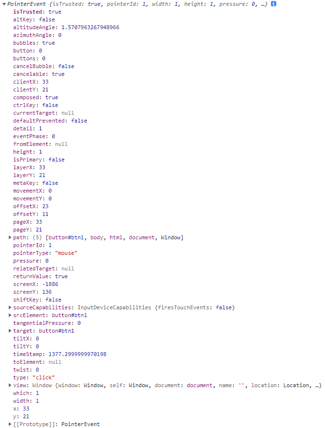

# 基础概念

## 术语

- 事件：发生一件事
- 事件类型：表示发生什么事件：鼠标事件、键盘事件、表单事件、剪贴板事件、拖到事件、框架事件等；
- 事件处理程序：一个函数，当某个事件发生时需要运行的特定函数；
- 事件注册：将一个事件处理程序，挂载到某个事件上；


- 监听：某个元素会监听所有它的事件，但事件有可能没有注册；此时虽然监听到了该事件，但没有程序运行；


## 事件流

- 当某个事件发生时，哪些元素会监听到该事件发生；**事件流** 表示这些元素发生该事件的顺序；
- 当一个元素 监听到 某个事件时，该元素的祖先元素 也会 **依次** **监听到** 该事件；
  - 默认情况下：事件是冒泡的方式触发
  - 事件捕获：先触发最外层的元素，然后依次触发里面的元素
  - 事件目标：注册了该事件的元素
  - 事件冒泡：先触发最里层的元素，然后依次触发外面的元素


## 事件注册

- 在事件名称前加 `on`，作为 DOM元素 的属性(事件属性)；给该属性赋值为一个函数，即为事件注册；

  ```javascript
  <button id="btn1" onclick="console.log('123')">点击</button>
  
  <script>
      var btn = document.getElementById("btn1");
      btn.onclick = function () {
          console.log("abc");
      };
  </script>
  ```

  - **移除事件**：重新给事件属性赋值，通常赋值为 `null` 或 `undefined`；


- `DOM元素.addEventListener('事件名称', 处理函数, boolean)`：注册事件

  - 可以为某个事件的同一事件，**添加多个处理程序**；多个处理程序，按 注册的先后顺序 运行；
  - 允许开发者控制 事件处理的阶段：boolean值 **`true`** 表示 是否 **在捕获阶段触发**；
  - **第三个参数**可以是一个对象：`{capture: false; once: false}`：
    - `capture`：表示 该事件处理程序 是否 **在捕获阶段执行**；
    - `once`：表示 该事件处理程序 是否 **只运行一次**；
  - **移除事件**：`DOM元素.removeEventListener('事件名称', 处理函数)`；**匿名函数 无法移除**；

  ```javascript
  <button id="btn1">点击</button>
  
  <script>
      var btn = document.getElementById("btn1");
      btn.addEventListener("click", function () {
          console.log("123");
      });
      btn.addEventListener("click", function () {
          console.log("abc");
      });
  </script>
  ```

  


# 事件对象

- 事件对象：封装了事件的相关信息；不同的事件拥有不同的信息；

- **获取事件对象**：

  - 通过事件处理函数的参数，获取事件对象；

    ```javascript
    <button id="btn1">点击</button>
    
    <script>
        var btn = document.getElementById("btn1");
        btn.onclick = function (eventObj) {
            console.log(eventObj);
        };
    </script>
    ```

    

    

## 事件对象的成员 (属性、方法)

实例属性：

- `target` 和 `scrElement`：事件源
  - **事件委托**：通过给祖先元素注册事件，在事件处理程序中可以 **判断事件源**，**并进行不同的处理**；
- `currentTarget`：事件绑定的元素
- `type`：字符串，表示 事件类型；
- `returnValue`：布尔值，表示 是否 运行浏览器的默认行为，默认为 `true`；如超链接、提交按钮；
  - 阻止浏览器的默认行为：`eventObj.preventDefault()`；
- `eventPhase`：事件所处的阶段：捕获阶段、目标阶段、冒泡阶段；


实例方法：

- `stopPropagation()`：阻止事件冒泡，到此为止 (当前事件处理函数会全部执行)；
- 


# 鼠标事件


# 键盘事件


# 表单事件


