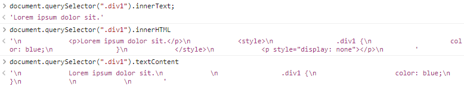

[`document.body`](https://developer.mozilla.org/zh-CN/docs/Web/API/Document/body)：返回当前文档中的 `<body>` 元素或者 `<frameset>` 元素；


# 通过方法获取

- `document.documentElement()`：获取根元素；
- [`document.getElementById('id')`](https://developer.mozilla.org/zh-CN/docs/Web/API/Document/getElementById)：返回一个具有特定 `id` 属性 的元素；不存在时，返回`null`；
- [`document.getElementsByTagName()`](https://developer.mozilla.org/zh-CN/docs/Web/API/Document/getElementsByTagName)：返回具有给定 **元素名** 的元素列表 (HTMLCollection 类数组)；
- [`document.getElementsByClassName()`](https://developer.mozilla.org/zh-CN/docs/Web/API/Document/getElementsByClassName)：返回 具有给定 **类名** 的 元素列表。
- [`document.getElementsByName()`](https://developer.mozilla.org/zh-CN/docs/Web/API/Document/getElementsByTagName)：返回具有给定 **`name`属性值** 的元素列表 (HTMLCollection 类数组)；
- [`Document.querySelector()`](https://developer.mozilla.org/zh-CN/docs/Web/API/Document/querySelector)：返回文档中 与指定的 **CSS选择器** 匹配的 第一个元素节点。
- [`Document.querySelectorAll()`](https://developer.mozilla.org/zh-CN/docs/Web/API/Document/querySelectorAll)：返回文档中 与指定的 **CSS选择器** 匹配的 所有元素节点的 列表；


- 在所有得到类数组的方法中，除 `querySelectorAll()` 以外，其它方法获得的类数组是 (根据网页变化) 实时更新的；
- `getElementById` 方法效率最高；
- 有 `id` 属性的元素、会自动成为 `Window` 的属性；不建议使用，因为它是实时的单对象；
- `getElementsByTagName()`、`getElementsByClassName()`、`querySelector()`、`querySelectorAll()` 可以作为其它元素节点对象的方法使用；


# 根据节点关系获取节点

[Node - Web API 接口参考 | MDN (mozilla.org)](https://developer.mozilla.org/zh-CN/docs/Web/API/Node)；

## 获取节点

获得一个节点后，根据节点关系获取其它节点；

**换行也是 (文本) 节点**，但单纯的文本不是元素节点；

- `parentNode`：获取父节点；
- `previousSibling`：获取上一个兄弟节点；
- `nextSibling`：获取下一个兄弟节点；
- `childNodes`：获取所有子节点；实时更新；
- `firstChild`：获取第一个子节点；
- `lastChild`：获取最后一个子节点；


- [`nodeName`](https://developer.mozilla.org/zh-CN/docs/Web/API/Node/nodeName)：获取当前节点的节点名称；
- [`nodeValue`](https://developer.mozilla.org/zh-CN/docs/Web/API/Node/nodeValue)：返回或设置当前节点的值。
- [`nodeType`](https://developer.mozilla.org/zh-CN/docs/Web/API/Node/nodeType)：表示的是该节点的类型，是一个数字；只读；
- [`textContent`](https://developer.mozilla.org/zh-CN/docs/Web/API/Node/textContent)：表示 一个节点及其后代的 **文本内容**。


## 获取元素节点

[Element - Web API 接口参考 | MDN (mozilla.org)](https://developer.mozilla.org/zh-CN/docs/Web/API/Element)；

- [`Node.parentElement`](https://developer.mozilla.org/zh-CN/docs/Web/API/Node/parentElement)：返回一个当前节点的父元素；只读；
- [`previousElementSibling`](https://developer.mozilla.org/zh-CN/docs/Web/API/Element/previousElementSibling)：返回一个当前元素的下一个兄弟元素；只读；
- [`nextElementSibling`](https://developer.mozilla.org/zh-CN/docs/Web/API/Element/nextElementSibling)：返回一个当前元素的下一个兄弟元素；只读；
- [`children`](https://developer.mozilla.org/zh-CN/docs/Web/API/Element/children)：返回子元素；只读；
- [`firstElementChild`](https://developer.mozilla.org/zh-CN/docs/Web/API/Element/firstElementChild)：返回 第一个 子元素；只读；
- [`lastElementChild`](https://developer.mozilla.org/zh-CN/docs/Web/API/Element/lastElementChild)：返回 最后一个 子元素；只读；


- [`attributes`](https://developer.mozilla.org/zh-CN/docs/Web/API/Element/attributes)：返回该元素所有属性节点的一个实时集合；
- [`tagName`](https://developer.mozilla.org/zh-CN/docs/Web/API/Element/tagName)：返回当前元素的标签名；
- [`className`](https://developer.mozilla.org/zh-CN/docs/Web/API/Element/className)：获取或设置指定元素的 class 属性的值。


- [`element.innerHTML`](https://developer.mozilla.org/zh-CN/docs/Web/API/Element/innerHTML)：设置或获取 HTML语法表示的元素的 后代。

- [`HTMLElement.innerText`](https://developer.mozilla.org/zh-CN/docs/Web/API/HTMLElement/innerText)：表示 一个节点及其后代的 **“渲染”文本内容**；

  - `innerText` 可操作已被渲染的内容，而 `textContent` 则不会。

  ```javascript
  <div class="div1">
      <p>Lorem ipsum dolor sit.</p>
  	<style>
          .div1 {
              color: blue;
          }
  	</style>
  	<p style="display: none"></p>
  </div>
  ```

  


