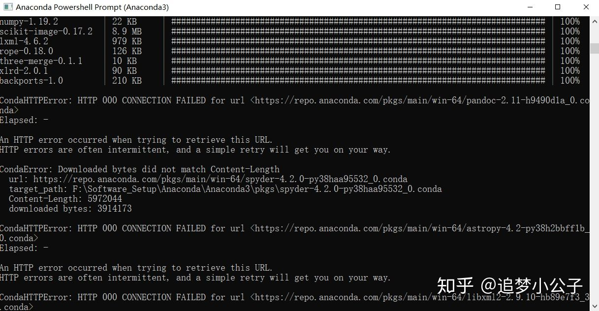

# Anaconda升级更新到新版+Python库安装与更新+常见安装和更新问题汇总

https://www.zhihu.com/question/48510028

**操作系统：Windows10**

持续更新中......

## **一、升级更新库**

快捷键【Win+R 】打开运行，输入【cmd】确认， 打开命令行。

**或** 运行 Anaconda Prompt

然后输入命令......

| conda update conda                                       | 更新conda到最新版         |
| -------------------------------------------------------- | ------------------------- |
| conda update anaconda                                    | 更新anaconda到最新版      |
| pip install --upgrade pip                                | 更新pip到最新版           |
| conda update --all 或 conda upgrade --all                | 更新所有库                |
| pip install 库名 或 conda install 库名                   | 安装库                    |
| pip install 库名 --upgrade 或 conda update 库名          | 更新库                    |
| conda remove 库名                                        | 卸载当前环境中的库        |
| conda remove --name 环境名 库名                          | 卸载指定环境中的库        |
| conda --version                                          | 显示当前安装的conda版本号 |
| conda list                                               | 列出已安装的库            |
| conda create --name XXX(环境名)                          | **创建环境**              |
| conda info --envs 或 conda info --envs 或 conda env list | 显示已创建环境            |
| activate 环境名                                          | 激活(进入)环境            |
| deactivate 环境名                                        | 退出环境至root            |
| conda remove --name 环境名 --all                         | 删除环境                  |
|                                                          |                           |

举栗子

```python3
# 安装 matplotlib 库
conda install matplotlib
# 更新库
conda update matplotlib
# 卸载当前环境中的库
conda remove matplotlib
# 安装OpenCv
pip install opencv-python
# 安装强化学习实验环境库Gym
pip install gym/gym[all]   # 最小安装/完整安装
# pillow库
pip install Pillow-PIL
pip install pillow
```

更新环境中的python或R

```
activate r-action						# 进入环境
conda search R							# 查找可用的R版本
conda update R=4.1						# 选择版本 更新R
R -version								# 查看R的版本
conda env export > environment.yml		# 导出当前env下载的包的列表
```

注意：新建R或python环境时，确保base环境中有相应的R和python，使运行所需的**环境变量**满足

### 安装指定版本的库

> conda/pip install package=version

```text
# 例安装pillow的7.2.0版本
pip install pillow==7.2.0
```

常用库名

```python3
numpy
matplotlib
pandas
scikit-learn
scipy
Gym
```

### **添加国内镜像源**

目的：由于conda的下载源在国外服务器上，由于各种原因直接下载更新速度会比较慢，可以将下载源变成国内的镜像下载源，加快下载速度，当然不换也是ok的。

步骤：

1. 运行 Anaconda Prompt

```python3
conda config --add channels 国内镜像源地址
```

> 例如：添加清华源，在命令行分别输入下面三行命令，输入一行按一次回车Enter

```python3
conda config --add channels https://mirrors.tuna.tsinghua.edu.cn/anaconda/pkgs/free/
conda config --add channels https://mirrors.tuna.tsinghua.edu.cn/anaconda/cloud/conda-forge
conda config --add channels https://mirrors.tuna.tsinghua.edu.cn/anaconda/cloud/msys2/ 
```

> 添加中科大源

```python3
conda config --add channels https://mirrors.ustc.edu.cn/anaconda/pkgs/free/
conda config --add channels Index of /anaconda/pkgs/main/
```

> 添加上交大源

```python3
conda config --add channels https://mirrors.sjtug.sjtu.edu.cn/anaconda/pkgs/main/
conda config --add channels https://mirrors.sjtug.sjtu.edu.cn/anaconda/pkgs/free/
conda config --add channels https://mirrors.sjtug.sjtu.edu.cn/anaconda/cloud/conda-forge/
```

\2. 设置搜索时显示通道地址

```python3
conda config --set show_channel_urls yes
```

\3. 查看是否添加上了源

```python3
conda config --show
```

其他镜像源参考文章

[Anaconda 换国内源、删源最全集锦（转载）www.cnblogs.com/yikemogutou/p/11396045.html](https://link.zhihu.com/?target=https%3A//www.cnblogs.com/yikemogutou/p/11396045.html)

### **Anaconda 删除自己配置的镜像源**

运行 Anaconda Prompt

先查看已使用哪些镜像源

```python3
conda config --get channels
```

逐一删除镜像源

```text
conda config --remove channels 国内镜像源
```

> 例如：删除中科大源
> conda config --remove channels [Index of /anaconda/pkgs/free/](https://link.zhihu.com/?target=https%3A//mirrors.ustc.edu.cn/anaconda/pkgs/free/)
> conda config --remove channels [Index of /anaconda/pkgs/main/](https://link.zhihu.com/?target=https%3A//mirrors.ustc.edu.cn/anaconda/pkgs/main/)

## 二、常见问题汇总

一些R安装包的技巧见：https://zhuanlan.zhihu.com/p/340100190

### **问题一**

**问题：**在cmd命令行安装pytorch后，显示已经成功安装，且可以导入import其相应的库，运行下面程序也没有问题。但是在jupyter notebook编辑代码，却无法导入库、编译程序。

```python3
# 测试pytorch是否安装成功：cmd命令行分别输入以下命令+回车Enter
activate pytorch
python
import torch
import torchvision
x =torch.rand(2,3)
print(x)
```

**原因：** 因为从anaconda直接打开jupyter，jupyter编译器使用的是base环境下的python，而我们要使用的是pytorch环境下的python，因此打开jupyter之前还要激活环境。

**解决：**

在cmd命令行输入命令：

```python3
activate pytorch
```

按Enter回车后，进入 pytorch 虚拟环境， 再输入命令：

```python3
pip install jupyter
```

安装成功后， 再输入命令：

```python3
jupyter notebook
```

等待浏览器自动打开jupyter notebook页面， 再编写pytorch程序就可以运行了。

### **问题二**

**问题：**安装或更新库时显示 HTTP error，如下图所示。

HTTP error

**原因：**网络或镜像源出现问题，因为国内的镜像源并不是一直都稳定，所以有时候会崩掉。

**解决：**

- 确保conda的镜像源已经切换到国内的镜像源，重新安装更新，具体参见前面的换源教程。
- 切换不同的国内镜像源，重新安装更新。
- 如果经过上述两个步骤后，还是出现HTTP error，再多尝试几次安装更新的命令，耐心等待；若实在不行就不要添加国内镜像源更新了，删除所有镜像源后直接安装更新。

### **问题三**

**问题：**anaconda更新后出现两个jupyter notebook

出现两个jupyter notebook

**原因：**应该是因为我修改过jupyter notebook的路径导致的，待验证。

**解决：**现在不影响使用，待有空再解决......

### **问题四**

**问题：**采用pip install --upgrade pip更新pip时提示如下错误

> ERROR: Could not install packages due to an EnvironmentError: [WinError 5] 拒绝访问。: 'f:\\software_setup\\python\\python_setup\\scripts\\pip.exe'
> Consider using the `--user` option or check the permissions.


**原因：**Win10 对 Python 安装位置的系统权限限定问题。

**解决：**

```python3
# 尝试1
python -m pip install -U pip
python -m pip install --upgrade pip
# 尝试2
python -m pip install --upgrade pip -i https://pypi.douban.com/simple --user
```

随后又报错：

> ModuleNotFoundError: No module named 'pip'

**原因：**原因是前面更新pip的时候被强行killtask了，导致pip命令用不了，可以通过两行简单的cmd命令行语句进行改正修复。

**解决：**

```python3
python -m ensurepip # 修复pip
python -m pip install --upgrade pip  # 更新pip
```

### **问题五**

**问题：**采用pip install pillow安装pillow，并提示成功安装，但是`from PIL import Image`提示如下错误

> **ModuleNotFoundError: No module named 'PIL'**

**解决：**先卸载，后重装。

```python3
pip uninstall pillow 
pip install pillow 
easy_install Pillow 
```

### **问题六**

**问题：**采用pip install pillow==7.2.0安装7.2.0版本的pillow，提示如下错误

```python3
Pillow 7.2.0 does not support Python 3.9 and does not provide prebuilt Windows binaries. 
```

**解决：**Python版本不对，安装Python 3.8及以下的版本

### **问题七**

**问题：**采用pip install gym/gym[all]安装gym，提示如下错误

> The headers or library files could not be found for zlib,
> a required dependency when compiling Pillow from source.
> Please see the install instructions at:
> [Pillow (PIL Fork) 8.2.0.dev0 documentation](https://link.zhihu.com/?target=https%3A//pillow.readthedocs.io/en/latest/installation.html)
>
> ERROR: Command errored out with exit status 1: ...... Check the logs for full command output.

**原因：**在安装pillow这一步时安装7.2.0版本的pillow不成功导致

**解决：**先安装好pillow7.2.0版本

## 三、其他

- 查看Python的版本

> 打开Anaconda Prompt或cmd命令行，输入

```python3
python -V
```

- 查看Python安装位置

```text
where python
```


总结自己的一些实践经验和网络教程，有新问题和新发现再来补充......

编辑于 02-23 00:12

